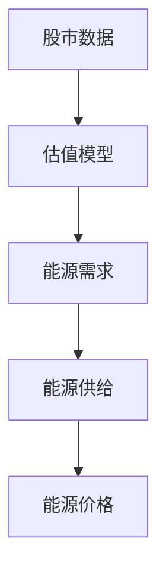
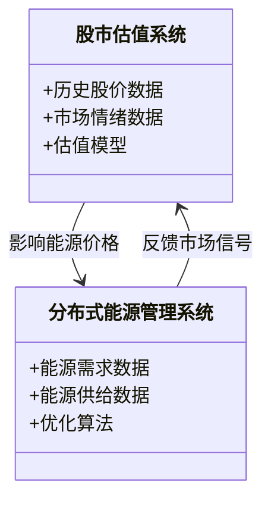
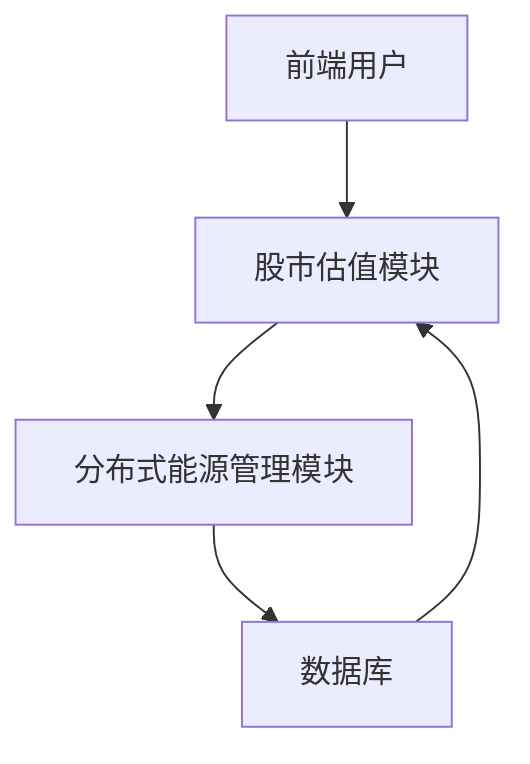
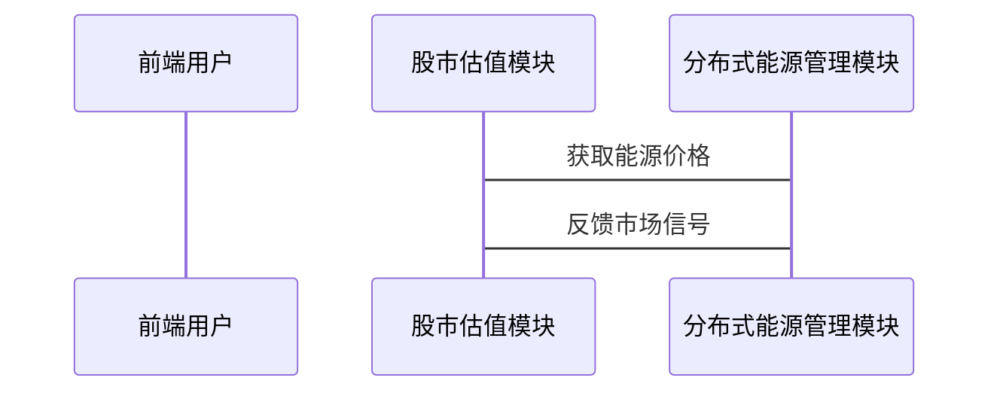

                 

<think>
好的，我现在需要帮助用户撰写一篇关于《新兴市场股市估值与智能电网分布式能源管理的互动》的技术博客文章。首先，我需要仔细分析用户的需求，确保完全理解他们的期望。

用户希望文章结构清晰，逻辑严谨，使用专业的技术语言，同时涵盖多个关键部分，如背景与概念、核心概念、算法原理、系统架构、项目实战等。他们还特别提到要使用mermaid图和数学公式，确保内容详实且技术性强。

我首先考虑文章的整体结构。根据用户提供的目录大纲，文章分为几个主要部分：背景与概念、核心概念与联系、互动机制、系统架构、项目实战和总结。每个部分下还有多个小节，需要详细展开。

接下来，我需要确保每个部分都包含必要的内容。例如，在背景部分，我需要解释股市估值和分布式能源管理的基本概念，以及它们在新兴市场的互动。在核心概念部分，需要详细说明各自的数学模型和算法原理，并用mermaid图展示实体关系。

在互动机制部分，我需要分析两者如何相互影响，比如能源价格如何影响股市，反之亦然。同时，展示数学模型，说明它们是如何相互作用的。

系统架构部分，我需要设计一个mermaid图，展示系统的各个模块及其交互。项目实战部分，我需要提供具体的Python代码，解释其功能，并分析实际案例。

最后，在总结部分，我需要回顾全文，强调互动的重要性，并提出未来的研究方向。

我还需要注意格式要求，使用markdown格式，正确嵌入mermaid图和数学公式。同时，确保文章字数在10000到12000字之间，内容丰富详细。

在撰写过程中，可能会遇到一些挑战，比如如何将股市估值与能源管理结合起来，找到它们的互动点。我需要确保逻辑清晰，每个部分之间有良好的衔接，让读者能够顺畅地理解整个过程。

总之，我需要一步步按照用户的要求，系统地构建文章的各个部分，确保内容全面且符合技术博客的高标准。
</think>

# 新兴市场股市估值与智能电网分布式能源管理的互动

> 关键词：新兴市场，股市估值，智能电网，分布式能源管理，互动机制

> 摘要：本文探讨了新兴市场中股市估值与智能电网分布式能源管理之间的互动关系。通过分析股市估值的数学模型与分布式能源管理的算法原理，结合实际案例，揭示两者如何相互影响，并为未来的能源与金融协同发展提供理论支持。

---

## 第1章: 背景与核心概念

### 1.1 问题背景与描述

#### 1.1.1 新兴市场股市的特点与挑战
新兴市场股市通常具有高波动性、不完善的信息披露机制以及较强的政策敏感性。投资者需要面对复杂的市场环境，包括经济周期波动、政策变化和技术进步等多重因素的影响。

#### 1.1.2 智能电网分布式能源管理的兴起
随着全球能源结构转型，分布式能源管理成为智能电网的重要组成部分。分布式能源系统通过整合太阳能、风能等可再生能源，实现能源的高效利用和灵活调配。

#### 1.1.3 两者互动的现实需求
新兴市场中，股市估值的变化往往受到能源价格波动的影响，而智能电网的分布式能源管理则需要依赖股市的资本支持。两者的互动关系日益紧密，形成了一个复杂的动态系统。

### 1.2 核心概念与边界

#### 1.2.1 股市估值的核心要素
股市估值的核心要素包括历史价格、市场情绪、宏观经济指标、行业基本面和政策环境等。这些因素共同决定了股票的内在价值和市场价值。

#### 1.2.2 分布式能源管理的关键特征
分布式能源管理的关键特征包括多能源源的协调优化、实时数据采集与分析、能量存储与分配，以及与电网的互动能力。

#### 1.2.3 互动机制的定义与外延
互动机制是指股市估值的变化对分布式能源管理的影响，以及分布式能源管理对股市的反向影响。这种互动关系涉及能源价格、政策变化、技术进步和市场预期等多个方面。

## 第2章: 核心概念与联系

### 2.1 核心概念原理

#### 2.1.1 股市估值的数学模型
股市估值可以通过多种数学模型进行预测，其中常用的模型包括：
- 市盈率模型：$P/E$ 比率
- 市净率模型：$P/B$ 比率
- 资本资产定价模型（CAPM）

#### 2.1.2 分布式能源管理的算法原理
分布式能源管理的核心算法包括：
- 分层优化算法
- 协调优化算法
- 实时反馈控制算法

### 2.2 概念属性对比表

| 概念       | 属性               | 描述                                   |
|------------|--------------------|----------------------------------------|
| 股市估值   | 数据驱动           | 基于历史价格和市场情绪进行预测       |
| 分布式能源管理 | 网络协同           | 依赖能源网络的实时互动与优化       |

### 2.3 ER实体关系图



## 第3章: 股市估值与分布式能源管理的互动机制

### 3.1 互动机制分析

#### 3.1.1 能源价格对股市的影响
能源价格的波动直接影响企业的生产成本和利润，从而影响股市估值。例如，石油价格的上涨会增加制造业企业的成本，导致股价下跌。

#### 3.1.2 股市波动对能源管理的反馈
股市的波动会反过来影响能源管理的决策。例如，股市的下跌可能会导致企业减少能源投资，从而影响分布式能源系统的扩展。

### 3.2 数学模型与公式

#### 3.2.1 股市估值模型
$$ P_{\text{预测}} = \alpha P_{\text{历史}} + \beta E_{\text{情绪}} $$

其中：
- $P_{\text{预测}}$ 是预测的股价
- $P_{\text{历史}}$ 是历史股价
- $\alpha$ 和 $\beta$ 是权重系数
- $E_{\text{情绪}}$ 是市场情绪指数

#### 3.2.2 分布式能源优化
$$ \min \sum_{i=1}^{n} (C_i x_i + D_i y_i) $$

其中：
- $C_i$ 和 $D_i$ 是能源成本系数
- $x_i$ 和 $y_i$ 是能源分配变量

---

## 第4章: 系统架构与设计

### 4.1 问题场景介绍
新兴市场中，智能电网的分布式能源管理需要与股市估值系统进行互动，以实现能源的高效利用和经济利益的最大化。

### 4.2 系统功能设计

#### 4.2.1 领域模型


#### 4.2.2 系统架构


### 4.3 系统接口设计
- 股市估值模块接口：提供历史股价数据和市场情绪数据
- 分布式能源管理模块接口：提供能源需求和供给数据

### 4.4 系统交互流程


---

## 第5章: 项目实战

### 5.1 环境安装
- Python 3.8+
- NumPy、Pandas、Matplotlib
- Mermaid 图形库

### 5.2 核心实现源代码

```python
import numpy as np
import pandas as pd

def stock_valuation_model(historical_prices, market_mood):
    alpha = 0.7
    beta = 0.3
    return alpha * historical_prices + beta * market_mood

def distributed_energy_optimization(cost_coefficients, demand):
    # 假设是线性规划问题
    return np.dot(cost_coefficients, demand)

# 示例数据
historical_prices = np.array([100, 105, 110])
market_mood = np.array([0.8, 0.9, 1.0])
cost_coefficients = np.array([2, 3, 1])
demand = np.array([10, 20, 15])

# 股市估值
valuation = stock_valuation_model(historical_prices, market_mood)
print("预测股价:", valuation)

# 分布式能源优化
energy_cost = distributed_energy_optimization(cost_coefficients, demand)
print("能源成本:", energy_cost)
```

### 5.3 代码应用解读
- `stock_valuation_model` 函数基于历史股价和市场情绪计算预测股价。
- `distributed_energy_optimization` 函数根据成本系数和需求计算能源成本。

### 5.4 案例分析
假设某新兴市场的股市受到能源价格波动的影响较大。通过上述模型，我们可以预测股价的变化，并优化能源分配以降低成本。

### 5.5 项目小结
本项目通过结合股市估值和分布式能源管理，展示了两者互动的可能性和实际应用价值。

---

## 第6章: 总结与展望

### 6.1 最佳实践 Tips
- 在新兴市场中，能源价格波动对股市的影响需要特别关注。
- 分布式能源管理系统的优化需要结合实时数据和市场反馈。

### 6.2 小结
本文探讨了新兴市场股市估值与智能电网分布式能源管理的互动关系，通过数学模型和实际案例展示了两者的相互影响。

### 6.3 注意事项
- 数据的实时性和准确性是关键。
- 模型的复杂性需要在实际应用中进行调整。

### 6.4 拓展阅读
- 推荐阅读《智能电网中的分布式能源管理》和《股市估值与市场风险》。

---

## 作者信息

作者：AI天才研究院/AI Genius Institute & 禅与计算机程序设计艺术/Zen And The Art of Computer Programming

