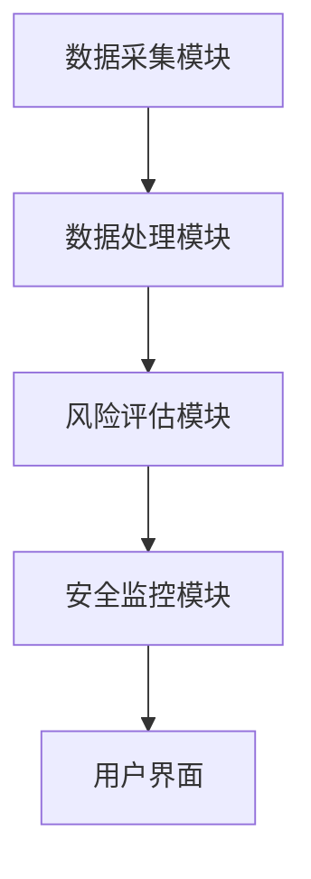

                 


# 新兴市场股市估值与智能电网安全的互动

---

## 关键词：

- 新兴市场
- 股市估值
- 智能电网
- 电网安全
- 互动关系

---

## 摘要：

本文探讨了新兴市场股市估值与智能电网安全之间的互动关系，分析了两者的核心概念、算法原理、系统架构及项目实现，展示了如何通过技术手段提升股市估值的准确性并确保智能电网的安全运行。

---

## 第一章：背景介绍

### 1.1 新兴市场的定义与特点

新兴市场是指经济快速发展、产业结构转型中的国家，如中国、印度等。这些市场具有高增长潜力，但股市波动性大，风险较高。

### 1.2 智能电网的定义与技术特征

智能电网是利用信息技术实现电力系统智能化管理的网络，包括智能电表、分布式能源管理等，提高了电网的可靠性和效率。

### 1.3 互动关系的重要性

股市估值与智能电网安全的互动关系在新兴市场中尤为重要，股市波动可能影响电网投资，而电网安全事件也可能影响股市表现。理解这种互动有助于优化决策。

---

## 第二章：股市估值与智能电网安全的核心概念

### 2.1 股市估值的主要方法

- **市盈率法**：通过公司股价与每股收益的比值评估公司价值。
- **市净率法**：通过股价与每股净资产的比值评估公司价值。
- **现金流折现法**：通过未来现金流的现值评估公司价值。

### 2.2 智能电网安全的核心要素

- **数据安全**：防止数据泄露和篡改。
- **网络安全**：抵御网络攻击，确保通信安全。
- **物理安全**：保护电网设备免受物理破坏。

### 2.3 核心概念对比

| **核心要素** | **股市估值**                  | **智能电网安全**          |
|--------------|-------------------------------|---------------------------|
| 方法         | 市盈率、市净率、现金流折现法 | 数据安全、网络安全、物理安全 |
| 目标         | 评估公司价值                  | 保障电网安全              |
| 工具         | 财务报表、市场数据            | 加密技术、防火墙、监控系统 |

---

## 第三章：时间序列分析在股市估值中的应用

### 3.1 时间序列分析的基本原理

时间序列分析是一种统计方法，通过观察数据随时间的变化来预测未来趋势。

#### 3.1.1 时间序列的定义

时间序列是按时间顺序排列的数据点，常用于预测和建模。

#### 3.1.2 时间序列分析的步骤

1. 数据收集：获取相关数据，如股价、成交量等。
2. 数据预处理：去除异常值，处理缺失值。
3. 模型选择：选择合适的模型，如ARIMA。
4. 模型训练：使用历史数据训练模型。
5. 预测与验证：预测未来值并验证准确性。

### 3.2 ARIMA模型的应用

ARIMA（自回归积分滑动平均模型）常用于时间序列预测。

#### 3.2.1 ARIMA模型的数学公式

$$ ARIMA(p, d, q) $$
- p：自回归阶数
- d：差分阶数
- q：滑动平均阶数

#### 3.2.2 ARIMA模型的实现步骤

1. 数据平稳化：通过差分消除趋势。
2. 模型参数估计：使用极大似然估计法确定p、d、q。
3. 模型验证：检查残差是否符合白噪声假设。
4. 预测：基于模型预测未来值。

---

## 第四章：智能电网安全的数学模型

### 4.1 网络安全风险评估模型

网络安全风险评估模型用于量化潜在威胁的影响。

#### 4.1.1 模型的数学公式

$$ R = \sum_{i=1}^{n} (P_i \times I_i) $$
- R：风险值
- P_i：威胁发生的概率
- I_i：威胁的影响程度

#### 4.1.2 模型的应用实例

假设某智能电网系统面临三种威胁：

- 威胁1：概率0.3，影响2
- 威胁2：概率0.5，影响1
- 威胁3：概率0.2，影响3

计算风险值：

$$ R = (0.3 \times 2) + (0.5 \times 1) + (0.2 \times 3) = 0.6 + 0.5 + 0.6 = 1.7 $$

---

## 第五章：智能电网安全系统的架构设计

### 5.1 系统功能设计

智能电网安全系统包括数据采集、风险评估和安全监控三个模块。

#### 5.1.1 数据采集模块

- **功能**：收集电网运行数据，如电压、电流、设备状态。
- **工具**：传感器、SCADA系统。

#### 5.1.2 风险评估模块

- **功能**：评估潜在安全威胁，生成风险报告。
- **工具**：基于网络安全模型的算法。

#### 5.1.3 安全监控模块

- **功能**：实时监控电网运行，触发预警机制。
- **工具**：监控软件、报警系统。

### 5.2 系统架构图



---

## 第六章：项目实战

### 6.1 系统环境搭建

#### 6.1.1 开发工具安装

- **Python**：安装Anaconda，配置虚拟环境。
- **数据库**：使用MySQL或MongoDB存储数据。
- **可视化工具**：使用Matplotlib或Tableau进行数据可视化。

### 6.2 系统核心实现源代码

#### 6.2.1 时间序列预测代码

```python
from statsmodels.tsa.arima.model import ARIMA
import pandas as pd

# 加载数据
data = pd.read_csv('stock.csv')

# 训练模型
model = ARIMA(data['price'], order=(5, 1, 0))
model_fit = model.fit()

# 预测未来值
forecast = model_fit.forecast(steps=5)
print(forecast)
```

#### 6.2.2 网络安全风险评估代码

```python
def calculate_risk(threats):
    total_risk = 0
    for threat in threats:
        probability, impact = threat
        total_risk += probability * impact
    return total_risk

threats = [
    (0.3, 2),
    (0.5, 1),
    (0.2, 3)
]

risk = calculate_risk(threats)
print(f"风险值为: {risk}")
```

---

## 第七章：总结与未来展望

### 7.1 小结

本文详细探讨了新兴市场股市估值与智能电网安全的互动关系，分析了时间序列分析和网络安全风险评估模型的应用，并通过项目实战展示了系统的实现过程。

### 7.2 未来展望

未来研究可以结合机器学习技术，如LSTM，提高预测精度和安全性。同时，随着物联网技术的发展，智能电网将更加智能化，进一步推动股市估值与电网安全的互动研究。

---

## 附录

### 附录A：数据来源与工具列表

- 数据来源：公开股票数据、电网运行数据。
- 工具：Python、Matplotlib、ARIMA模型。

### 附录B：相关法规与标准

- GB/T 36623-2018 《电力监控系统安全防护规定》
- ISO/IEC 27001 《信息安全管理体系标准》

---

## 作者：AI天才研究院/AI Genius Institute & 禅与计算机程序设计艺术 /Zen And The Art of Computer Programming

