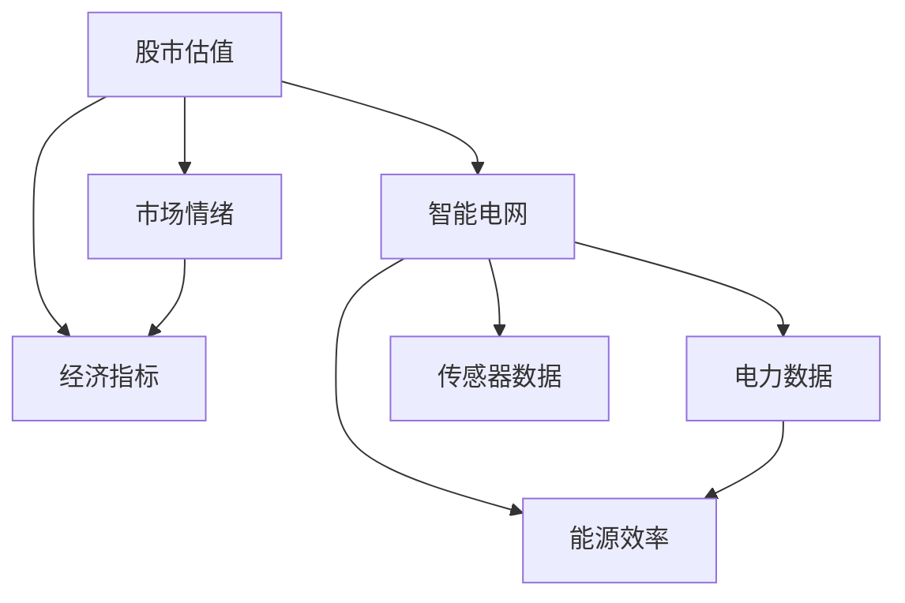
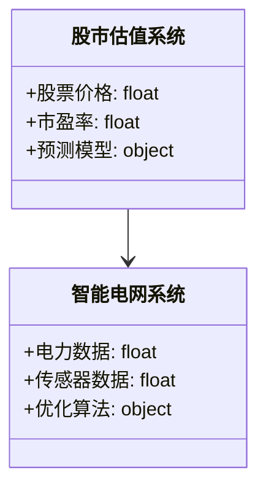
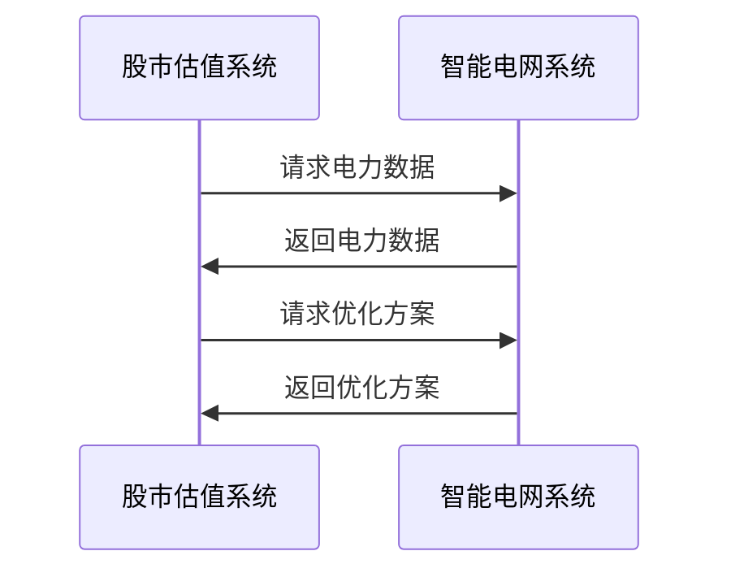

                 


# 《新兴市场股市估值与智能电网建设的互动》

## 关键词：新兴市场，股市估值，智能电网，互动关系，算法，系统架构

## 摘要：
本文探讨了新兴市场股市估值与智能电网建设之间的互动关系，分析了股市估值的核心问题和智能电网建设的技术路径，提出了基于算法和系统架构的解决方案。通过详细的技术分析和实际案例，展示了如何通过智能电网技术优化股市估值模型，从而实现新兴市场经济与能源系统的协同发展。

---

# 第1章: 背景与概念

## 1.1 新兴市场股市估值与智能电网建设的背景

### 1.1.1 新兴市场的定义与特点
- 新兴市场的定义：指经济发展迅速、产业结构转型中的国家或地区。
- 新兴市场的特点：经济波动大、产业结构复杂、政策变化快。
- 新兴市场与股市估值的关系：股市是新兴市场经济发展的重要晴雨表。

### 1.1.2 股市估值的核心问题
- 股市估值的定义：通过分析股票的价格、收益、风险等因素，评估其合理价值。
- 股市估值的核心问题：如何在不确定的市场中准确预测股票价值。
- 股市估值的重要性：为投资者提供决策依据，影响市场资源配置。

### 1.1.3 智能电网建设的必要性
- 智能电网的定义：通过信息化、自动化、互动化技术，实现电力系统高效运行和管理。
- 智能电网的特点：实时监测、智能调节、高效能源利用。
- 智能电网与新兴市场的关联：智能电网是新兴市场能源转型的重要基础设施。

## 1.2 问题描述

### 1.2.1 股市估值的复杂性
- 新兴市场股市的波动性高。
- 影响股市估值的因素众多，包括经济政策、市场情绪、国际环境等。
- 股市估值模型的局限性：传统模型难以捕捉新兴市场的复杂性。

### 1.2.2 智能电网建设的挑战
- 智能电网技术的高投入和高风险。
- 智能电网建设与能源政策的关系。
- 智能电网的经济效益与社会效益的平衡。

### 1.2.3 互动关系的初步探讨
- 股市估值影响能源企业的融资能力。
- 智能电网建设推动能源企业技术创新，进而影响股市估值。
- 两者互动的动态性和复杂性。

## 1.3 问题解决

### 1.3.1 新兴市场股市估值的方法
- 基于大数据的股市预测模型。
- 股市估值的多因素分析模型。
- 股市估值的动态调整方法。

### 1.3.2 智能电网建设的技术路径
- 智能电网的规划与设计。
- 智能电网的关键技术：物联网、大数据、人工智能。
- 智能电网的分阶段实施策略。

### 1.3.3 互动关系的解决方案
- 构建股市估值与智能电网建设的综合模型。
- 通过智能电网数据优化股市估值模型。
- 利用股市估值结果指导智能电网投资决策。

## 1.4 边界与外延

### 1.4.1 新兴市场的边界
- 新兴市场的地理范围：主要集中在亚洲、拉丁美洲和东欧。
- 新兴市场的经济规模：GDP总量和增速。
- 新兴市场的政策环境：政府对股市和能源行业的支持政策。

### 1.4.2 股市估值的外延
- 股市估值的微观层面：企业基本面分析。
- 股市估值的宏观层面：宏观经济指标对股市的影响。
- 股市估值的行业层面：行业周期对股市估值的影响。

### 1.4.3 智能电网建设的边界
- 智能电网的技术边界：核心技术与辅助技术的区分。
- 智能电网的经济边界：投资成本与收益平衡。
- 智能电网的社会边界：用户接受度和政策支持。

## 1.5 概念结构与核心要素

### 1.5.1 核心概念的构成
- 股市估值的核心概念：股票价格、收益、风险。
- 智能电网的核心概念：能源传输、数据采集、智能调节。
- 互动关系的核心概念：数据共享、技术融合、协同发展。

### 1.5.2 核心要素的对比
| 核心要素 | 股市估值 | 智能电网 |
|----------|----------|----------|
| 数据来源 | 财务报表、市场数据 | 电力数据、传感器数据 |
| 目标 | 评估股票价值 | 提高能源效率 |
| 技术支持 | 金融模型、大数据分析 | 物联网、人工智能 |

### 1.5.3 概念结构图


---

# 第2章: 核心概念与联系

## 2.1 核心概念原理

### 2.1.1 股市估值的原理
- 股票价格的决定因素：收益、风险、市场流动性。
- 股市估值的数学模型：市盈率、市净率、股息率。
- 股市估值的动态调整：基于市场变化的实时更新。

### 2.1.2 智能电网建设的原理
- 智能电网的数据采集：传感器、SCADA系统。
- 智能电网的分析与决策：大数据分析、机器学习模型。
- 智能电网的执行与反馈：自动调节、实时优化。

### 2.1.3 互动关系的原理
- 股市估值为智能电网建设提供资金支持。
- 智能电网数据优化股市估值模型。
- 两者共同推动新兴市场经济发展。

## 2.2 概念属性特征对比

### 2.2.1 股市估值的属性特征
- 数据依赖性：依赖财务报表和市场数据。
- 时间敏感性：需要实时更新和调整。
- 不确定性：受市场情绪和外部环境影响。

### 2.2.2 智能电网建设的属性特征
- 技术复杂性：涉及多种先进技术。
- 投资高：需要大量资金投入。
- 社会影响：涉及能源供应和用户行为。

### 2.2.3 对比分析
| 属性 | 股市估值 | 智能电网 |
|------|----------|----------|
| 数据来源 | 财务数据、市场数据 | 电力数据、传感器数据 |
| 核心技术 | 金融模型、大数据 | 物联网、人工智能 |
| 应用目标 | 评估股票价值 | 提高能源效率 |
| 投资周期 | 短期与长期结合 | 长期 |

## 2.3 ER实体关系图

```mermaid
er
    actor:投资者
    entity:上市公司
    relation:拥有
    actor --> 拥有 --> entity
```

---

# 第3章: 算法原理与数学模型

## 3.1 算法原理

### 3.1.1 股市估值算法
- 时间序列分析：ARIMA模型。
- 机器学习算法：随机森林、支持向量机。
- 深度学习模型：LSTM网络。

### 3.1.2 智能电网优化算法
- 基于粒子群优化的电力分配。
- 基于遗传算法的电网调度。
- 基于强化学习的能源管理。

### 3.1.3 互动算法
- 股市估值与智能电网数据的融合算法。
- 互动关系的动态调整算法。
- 联合优化模型。

## 3.2 数学模型

### 3.2.1 股市估值模型
$$ P = \frac{E}{\text{市盈率}} $$
其中，\( P \) 为股票价格，\( E \) 为每股收益。

### 3.2.2 智能电网优化模型
$$ \text{目标函数} = \sum_{i=1}^{n} \text{功率分配}_i $$
$$ \text{约束条件} = \{ \text{电力需求}, \text{电网容量} \} $$

### 3.2.3 联合优化模型
$$ \text{最大化} \sum_{i=1}^{n} \text{收益}_i - \sum_{j=1}^{m} \text{成本}_j $$

---

# 第4章: 系统分析与架构设计

## 4.1 问题场景介绍

### 4.1.1 股市估值场景
- 数据采集：收集财务数据和市场数据。
- 数据分析：使用算法模型进行预测。
- 结果输出：生成股票估值报告。

### 4.1.2 智能电网场景
- 数据采集：传感器实时采集电力数据。
- 数据分析：分析电力消耗和供需关系。
- 结果输出：优化电力分配方案。

## 4.2 项目介绍

### 4.2.1 项目目标
- 构建股市估值与智能电网的互动系统。
- 实现数据共享与技术融合。
- 推动新兴市场经济发展。

## 4.3 系统功能设计

### 4.3.1 领域模型


### 4.3.2 系统架构


## 4.4 系统接口设计

### 4.4.1 股市估值接口
- 输入：股票代码、时间范围。
- 输出：股票估值报告。

### 4.4.2 智能电网接口
- 输入：电力需求、传感器数据。
- 输出：优化电力分配方案。

## 4.5 系统交互设计

### 4.5.1 序列图


---

# 第5章: 项目实战

## 5.1 环境安装

### 5.1.1 股市估值环境
- 数据库：MySQL。
- 开发工具：Python、Jupyter Notebook。
- 库：pandas、numpy、scikit-learn。

### 5.1.2 智能电网环境
- 数据库：PostgreSQL。
- 开发工具：Python、Jupyter Notebook。
- 库：pandas、numpy、scikit-learn。

## 5.2 核心实现

### 5.2.1 股市估值代码
```python
import pandas as pd
import numpy as np

# 数据预处理
data = pd.read_csv('stock_data.csv')
data = data.dropna()

# 股票估值模型
from sklearn.ensemble import RandomForestRegressor
model = RandomForestRegressor(n_estimators=100)
model.fit(data[['收益', '市盈率']], data['价格'])

# 预测结果
predicted_price = model.predict(new_data[['收益', '市盈率']])
```

### 5.2.2 智能电网代码
```python
import pandas as pd
import numpy as np

# 数据预处理
data = pd.read_csv('power_data.csv')
data = data.dropna()

# 智能电网优化模型
from sklearn.linear_model import LinearRegression
model = LinearRegression()
model.fit(data[['电力需求', '传感器数据']], data['电力分配'])

# 预测结果
predicted_power = model.predict(new_data[['电力需求', '传感器数据']])
```

## 5.3 应用解读与分析

### 5.3.1 股市估值应用
- 模型准确性的验证：对比预测值与实际值。
- 模型的优化：调整参数、引入更多特征。

### 5.3.2 智能电网应用
- 模型的优化：提高预测精度。
- 模型的部署：实时监控与调整。

## 5.4 实际案例分析

### 5.4.1 案例背景
- 新兴市场：印度尼西亚。
- 数据来源：当地股市和电力公司数据。

### 5.4.2 案例分析
- 股市估值：分析某能源企业的股票价值。
- 智能电网：优化电力分配方案。

## 5.5 项目小结

### 5.5.1 成功经验
- 数据质量的重要性。
- 模型选择的合理性。
- 互动关系的可行性。

### 5.5.2 问题与挑战
- 数据不足的问题。
- 模型泛化的限制。
- 技术融合的难度。

---

# 第6章: 最佳实践与总结

## 6.1 最佳实践

### 6.1.1 技术建议
- 数据采集的完整性。
- 模型选择的合理性。
- 系统架构的可扩展性。

### 6.1.2 实施建议
- 分阶段实施：先局部优化，再整体优化。
- 数据共享：建立数据共享机制。
- 技术融合：加强跨领域合作。

## 6.2 小结

### 6.2.1 核心发现
- 股市估值与智能电网建设的互动关系。
- 数据共享与技术融合的重要性。

### 6.2.2 展望
- 技术进步：人工智能在股市估值与智能电网中的应用。
- 行业发展：新兴市场的经济与能源转型。

---

# 作者：AI天才研究院/AI Genius Institute & 禅与计算机程序设计艺术/Zen And The Art of Computer Programming

