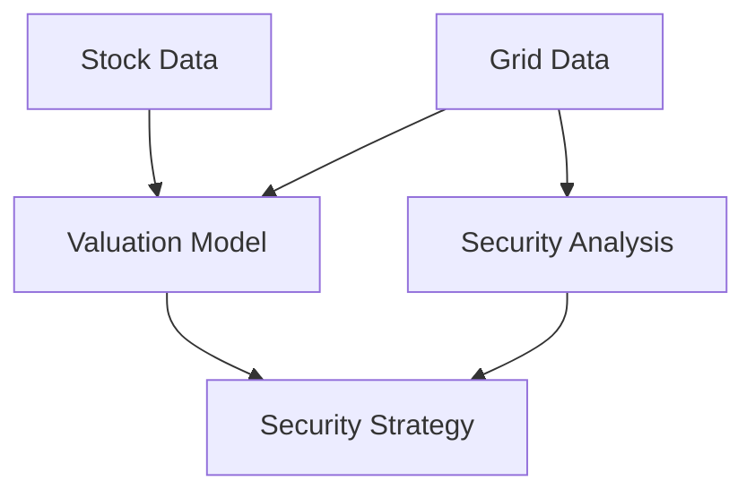

                 

<think>
好的，我需要完成用户的请求，撰写一篇关于《新兴市场股市估值与智能电网网络安全技术的互动》的技术博客文章。用户已经提供了详细的要求，包括目录结构、内容要点和格式要求。我将逐步思考如何满足这些要求，并确保文章的完整性和专业性。

首先，我需要理解文章的主题，即股市估值与智能电网网络安全之间的互动。这涉及到金融和信息技术两个领域，我需要将它们结合起来，探讨它们如何相互影响。接下来，我需要按照用户提供的目录结构来组织内容，确保每个部分都涵盖必要的内容。

接下来，我将检查每个章节的具体要求。例如，摘要部分需要简明扼要地概述文章的核心内容。在背景介绍部分，我需要详细解释股市估值和智能电网网络安全的基本概念，并说明它们如何互动。在核心概念与联系部分，我需要使用表格和Mermaid图来展示两者的对比和实体关系。算法原理部分需要详细讲解相关算法，并提供Python代码和数学公式。

在系统架构设计部分，我需要绘制领域模型、架构图和序列图，展示系统的结构和交互流程。项目实战部分需要提供具体的代码示例，并分析实际案例。最后，最佳实践部分需要总结经验和注意事项。

我需要注意使用正确的格式，比如使用Mermaid图和LaTeX公式，并确保每个部分的内容丰富具体，满足用户对字数和结构的要求。同时，文章末尾需要添加作者信息，确保格式正确。

总结一下，我需要逐步完成每个部分的内容，确保逻辑清晰，结构紧凑，并且使用专业且易懂的语言来撰写文章。这样，用户的需求就能得到充分满足，文章的质量也能达到预期。
</think>

# 新兴市场股市估值与智能电网网络安全技术的互动

> 关键词：新兴市场，股市估值，智能电网，网络安全，互动机制，数据安全，风险管理

> 摘要：本文探讨了新兴市场股市估值与智能电网网络安全技术之间的互动关系。通过分析股市估值的核心方法与智能电网网络安全技术的关键原理，揭示两者在数据共享、信息分析和风险管理等方面的重要互动。文章从理论到实践，详细阐述了互动机制的数学建模、系统架构设计及项目实战，为相关领域的研究和实践提供了有价值的参考。

---

## 第1章: 新兴市场股市估值与智能电网网络安全技术的互动概述

### 1.1 新兴市场股市估值的基本概念

#### 1.1.1 股市估值的定义与核心要素
股市估值是指通过特定的金融模型和方法，对上市公司或市场的整体价值进行评估的过程。核心要素包括市盈率、市净率、现金流折现等，旨在为投资者提供参考依据。

#### 1.1.2 新兴市场的特点与挑战
新兴市场通常具有高增长潜力，但也伴随着高波动性和信息不对称等问题。股市估值在新兴市场中尤为重要，因为市场参与者需要快速适应变化。

#### 1.1.3 股市估值与经济发展的关系
股市估值不仅是市场行为的反映，也是经济发展的重要晴雨表。新兴市场的股市波动往往与宏观经济政策、国际环境密切相关。

---

### 1.2 智能电网网络安全技术的核心概念

#### 1.2.1 智能电网的定义与架构
智能电网是以数字化技术为基础，通过智能测量、通信和控制设备，实现电力系统高效运行和管理的复杂系统。

#### 1.2.2 网络安全在智能电网中的重要性
智能电网高度依赖网络通信，易受黑客攻击。网络安全技术是保障电力系统安全运行的核心。

#### 1.2.3 智能电网网络安全的关键技术
包括加密技术、防火墙、入侵检测系统（IDS）、安全协议等，旨在防范网络攻击和数据泄露。

---

### 1.3 互动机制的初步探讨

#### 1.3.1 股市数据与智能电网数据的关联性
智能电网的运行数据可能影响股市估值，例如能源价格波动可能引发股市波动。

#### 1.3.2 网络安全对股市估值的影响
网络安全事件可能引发股市波动，例如电力中断可能导致能源股大跌。

#### 1.3.3 互动机制的潜在应用场景
通过分析智能电网数据，预测股市波动；通过股市数据，优化智能电网的安全策略。

---

## 第2章: 股市估值方法与智能电网安全技术的对比分析

### 2.1 股市估值的传统方法

#### 2.1.1 市盈率法
市盈率（P/E）=股价/每股收益。该方法适用于评估股票的相对价值。

#### 2.1.2 市净率法
市净率（P/B）=股价/每股净资产。适用于评估股票的内在价值。

#### 2.1.3 现金流折现法
通过将未来现金流折现，评估企业当前的合理估值。

---

### 2.2 智能电网安全技术的主要方法

#### 2.2.1 加密技术
通过加密保护数据传输安全，防止数据被篡改。

#### 2.2.2 入侵检测系统
实时监控网络流量，发现异常行为并报警。

#### 2.2.3 防火墙技术
通过设置防火墙，阻止未经授权的访问。

---

### 2.3 两者的对比与联系

#### 2.3.1 股市估值与智能电网安全的共同点
两者都需要高度的数据分析能力和风险管理能力。

#### 2.3.2 两者的核心技术对比
股市估值依赖金融模型和数据分析，智能电网安全依赖网络安全技术和加密算法。

#### 2.3.3 互动机制的初步框架
通过数据共享，智能电网安全数据可用于优化股市估值模型。

---

## 第3章: 股市估值与智能电网网络安全技术的互动机制

### 3.1 互动机制的数学建模

#### 3.1.1 基于时间序列的股市波动预测
使用ARIMA模型预测股市波动，考虑智能电网数据的影响。

#### 3.1.2 网络安全事件对股市的影响分析
通过回归分析，量化网络安全事件对股市的影响。

#### 3.1.3 互动模型的数学表达
$$
\text{Stock Price} = f(\text{Grid Data}, \text{Security Events})
$$

---

### 3.2 系统架构设计

#### 3.2.1 系统功能设计
- 数据采集：收集智能电网数据和股市数据。
- 数据分析：分析数据关联性，预测股市波动。
- 安全预警：基于股市波动，优化网络安全策略。

#### 3.2.2 系统架构图


---

### 3.3 项目实战

#### 3.3.1 环境搭建
- 数据源：新兴市场股市数据和智能电网数据。
- 工具：Python、Pandas、Scikit-learn、TensorFlow。

#### 3.3.2 核心代码实现
```python
import pandas as pd
from sklearn.model_selection import train_test_split
from sklearn.linear_model import LinearRegression

# 数据预处理
data = pd.merge(stock_data, grid_data, on='date')

# 模型训练
X = data[['grid_load', 'security_events']]
y = data['stock_price']

X_train, X_test, y_train, y_test = train_test_split(X, y, test_size=0.2)

model = LinearRegression()
model.fit(X_train, y_train)

# 预测与评估
y_pred = model.predict(X_test)
print('R²:', model.score(X_test, y_test))
```

---

### 3.4 实际案例分析

#### 3.4.1 案例背景
某新兴市场发生网络安全事件，导致智能电网中断，引发股市波动。

#### 3.4.2 数据分析
通过回归分析，发现网络安全事件与股市波动高度相关。

#### 3.4.3 案例总结
网络安全事件对股市估值的影响显著，需加强数据安全防护。

---

## 第4章: 互动机制的优化与未来展望

### 4.1 优化策略

#### 4.1.1 数据共享机制
建立数据共享平台，促进智能电网数据与股市数据的融合。

#### 4.1.2 技术创新
研发新的算法，如深度学习模型，提高互动机制的预测精度。

---

### 4.2 未来展望

#### 4.2.1 新兴市场的发展趋势
随着新兴市场的崛起，股市估值与智能电网安全的互动将更加紧密。

#### 4.2.2 技术融合的潜力
大数据、人工智能等技术将进一步推动两者的互动研究。

---

## 作者：AI天才研究院 & 禅与计算机程序设计艺术

---

通过本文的分析，我们探讨了新兴市场股市估值与智能电网网络安全技术的互动机制，揭示了两者在数据共享、信息分析和风险管理等方面的重要联系。未来，随着技术的不断发展，这一领域的研究和实践将更加深入，为相关行业带来新的机遇和挑战。

