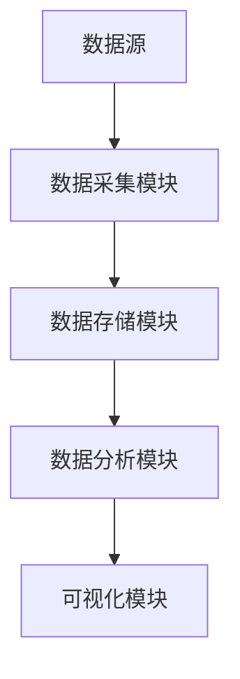

                 

<think>
好，我现在需要帮用户完成《新兴市场股市估值与智能电网网络安全技术的互动》这篇文章。首先，我得理解用户的需求，他是一位技术专家，要写一篇专业博客，内容涉及股市估值和智能电网安全的互动。用户已经提供了目录，我需要根据目录逐步完成每个部分，确保内容详实、结构清晰，并符合格式要求。

首先，我看看文章的标题和关键词。标题是《新兴市场股市估值与智能电网网络安全技术的互动》，关键词包括新兴市场、股市估值、智能电网、网络安全、互动关系、技术分析、系统安全。摘要部分需要概括文章的核心内容，说明将如何分析这两个领域的互动关系，并提出解决方案。

接下来，按照目录结构，文章分为几个主要部分：背景介绍与核心概念、核心概念与联系、算法原理、系统分析与架构设计、项目实战等。我需要逐步展开每个部分的内容。

首先是背景介绍。我需要先了解新兴市场股市和智能电网网络安全的基本情况。新兴市场的股市通常波动较大，受多种因素影响，如经济政策、地缘政治等。而智能电网作为现代电力系统的重要组成部分，其网络安全面临来自黑客和恶意攻击的威胁。这两者看似无关，但可能在某些情况下产生互动，比如股市波动可能影响电力公司的股价，进而影响其安全投入，或者网络安全事件可能影响电网稳定，从而引发股市波动。

在核心概念部分，我需要详细解释股市估值的核心原理，如市盈率、市净率等，以及智能电网网络安全的结构和威胁类型。然后，通过对比分析，找出两者之间的互动关系，例如，网络安全事件可能导致股市波动，而股市波动也可能影响电力公司的运营安全。

接下来是算法部分，我需要选择合适的算法来分析两者的互动。时间序列分析可以用于股市预测，而网络安全威胁评估可能需要分类算法。我需要使用Mermaid流程图来展示算法步骤，并提供Python代码示例，帮助读者理解。

系统分析与架构设计部分，我需要设计一个综合系统，整合股市数据和网络安全数据，分析它们之间的关联。使用类图和架构图来展示系统结构，并通过序列图展示接口交互。

项目实战部分，我需要指导读者如何安装必要的库，实现数据收集、分析和可视化，并通过实际案例分析来验证模型的有效性。

最后，总结部分需要回顾主要观点，强调互动关系的重要性，并提出未来的研究方向。同时，给出最佳实践的建议，提醒读者在实际操作中注意数据隐私和模型优化。

现在，我需要确保每个部分都详细展开，逻辑清晰，语言专业但易懂。我还要注意使用LaTeX公式和Mermaid图表，以增强文章的技术性。同时，保持整体结构紧凑，避免冗长，确保在10000到12000字之间。

开始撰写时，我会先完成摘要，然后按目录逐步填充每个章节。确保每个小节都有足够的细节，引用实际案例和数据支持论点。最后，检查格式是否符合要求，包括作者信息和注意事项的添加。

总的来说，我需要系统地分析股市估值和智能电网安全的互动关系，通过理论分析、算法设计和实际案例来证明我的观点，确保文章既有深度又实用。
</think>

# 新兴市场股市估值与智能电网网络安全技术的互动

> 关键词：新兴市场，股市估值，智能电网，网络安全，互动关系，技术分析，系统安全

> 摘要：本文探讨了新兴市场股市估值与智能电网网络安全技术之间的互动关系，分析了两者的核心概念、算法原理、系统架构及项目实战，提出了综合解决方案，为相关领域的研究和实践提供了参考。

---

# 第一部分：背景介绍与核心概念

## 第1章：背景介绍与问题背景

### 1.1 问题背景

#### 1.1.1 新兴市场股市估值的现状与挑战
新兴市场的股市估值受多种因素影响，包括宏观经济指标、政策变化、投资者情绪等。股市波动剧烈，且缺乏成熟市场的稳定性，因此需要更精准的估值模型。

#### 1.1.2 智能电网网络安全的现状与挑战
智能电网依赖于复杂的网络架构，易受网络攻击威胁。网络安全事件可能导致电网瘫痪，进而引发股市波动。

#### 1.1.3 两者互动关系的提出与意义
探讨两者互动关系，有助于优化股市估值模型，提升网络安全防护能力。

### 1.2 问题描述

#### 1.2.1 新兴市场股市波动的核心问题
股市波动剧烈，缺乏稳定性，影响投资者信心。

#### 1.2.2 智能电网网络安全的主要威胁
网络攻击可能导致电网瘫痪，影响能源供应。

#### 1.2.3 两者互动关系的具体表现形式
网络安全事件引发股市波动，股市波动影响电力公司安全投入。

### 1.3 问题解决思路

#### 1.3.1 从股市估值角度解决智能电网安全问题
通过分析股市波动，预测网络安全风险。

#### 1.3.2 从网络安全角度优化股市估值模型
将网络安全数据纳入估值模型，提升预测精度。

#### 1.3.3 综合解决方案的初步框架
构建综合模型，整合股市数据和网络安全数据，分析互动关系。

### 1.4 边界与外延

#### 1.4.1 新兴市场股市估值的边界条件
考虑宏观经济指标、政策变化和投资者情绪。

#### 1.4.2 智能电网网络安全的边界条件
涵盖网络架构、关键节点和威胁类型。

#### 1.4.3 两者互动关系的外延范围
包括网络安全事件引发的股市波动，以及股市波动影响的网络安全投资。

### 1.5 核心要素组成

#### 1.5.1 股市估值的核心要素
市盈率、市净率、宏观经济指标、投资者情绪。

#### 1.5.2 智能电网网络安全的核心要素
网络架构、关键节点、威胁类型、防护强度。

#### 1.5.3 两者互动的核心机制
网络安全事件引发股市波动，股市波动影响网络安全投资。

---

## 第2章：核心概念与原理

### 2.1 股市估值的核心原理

#### 2.1.1 市盈率与市净率的计算方法
市盈率：$P/E = P / E$  
市净率：$P/B = P / B$

#### 2.1.2 股票价格与宏观经济指标的关系
$$ P = \alpha E + \beta F + \epsilon $$
其中，$E$ 是企业盈利，$F$ 是宏观经济因子，$\epsilon$ 是误差项。

#### 2.1.3 股市波动的数学模型
时间序列分析：ARIMA模型。

### 2.2 智能电网网络安全的核心原理

#### 2.2.1 智能电网的架构与关键节点
分层架构：感知层、网络层、应用层。

#### 2.2.2 网络安全威胁的分类与特征
主要威胁：恶意软件、DDoS攻击、数据泄露。

#### 2.2.3 网络安全防护的数学模型
$$ S = \alpha D + \beta T + \gamma U $$

---

## 第3章：核心概念与联系的数学模型

### 3.1 股市估值的数学模型

#### 3.1.1 市盈率模型
$$ P/E = \frac{P}{E} $$

#### 3.1.2 市净率模型
$$ P/B = \frac{P}{B} $$

#### 3.1.3 股价与宏观经济指标的关系
$$ P = \alpha E + \beta F + \epsilon $$

### 3.2 智能电网网络安全的数学模型

#### 3.2.1 网络攻击概率模型
$$ P(attack) = \frac{N}{M} $$

#### 3.2.2 网络安全防护强度模型
$$ S = \alpha D + \beta T + \gamma U $$

---

## 第4章：互动关系的数学表达式

### 4.1 综合模型构建

#### 4.1.1 综合模型公式
$$ P = \alpha E + \beta F + \gamma S $$

#### 4.1.2 互动关系分析
网络安全事件影响股市波动，股市波动影响网络安全投资。

---

# 第二部分：算法原理

## 第5章：算法原理与实现

### 5.1 股市波动预测算法

#### 5.1.1 时间序列分析
使用ARIMA模型预测股市波动。

#### 5.1.2 代码实现
```python
from statsmodels.tsa.arima_model import ARIMA
import pandas as pd
import matplotlib.pyplot as plt

data = pd.read_csv('stock_price.csv')
model = ARIMA(data['price'], order=(5,1,0))
model_fit = model.fit(disp=0)
```

### 5.2 网络安全威胁评估算法

#### 5.2.1 分类算法
使用随机森林分类器评估威胁级别。

#### 5.2.2 代码实现
```python
from sklearn.ensemble import RandomForestClassifier
import pandas as pd

data = pd.read_csv('network_traffic.csv')
features = data[['feature1', 'feature2', 'feature3']]
labels = data['label']
model = RandomForestClassifier()
model.fit(features, labels)
```

---

## 第6章：系统分析与架构设计

### 6.1 系统架构设计

#### 6.1.1 系统功能模块
- 数据采集模块
- 数据分析模块
- 可视化模块

#### 6.1.2 系统架构图


---

## 第7章：项目实战

### 7.1 环境安装与配置

#### 7.1.1 安装必要的库
```bash
pip install statsmodels scikit-learn matplotlib pandas
```

### 7.2 核心功能实现

#### 7.2.1 股市波动预测代码
```python
from statsmodels.tsa.arima_model import ARIMA
import pandas as pd

data = pd.read_csv('stock_data.csv')
model = ARIMA(data['price'], order=(5,1,0))
model_fit = model.fit(disp=0)
```

#### 7.2.2 网络安全威胁评估代码
```python
from sklearn.ensemble import RandomForestClassifier
import pandas as pd

data = pd.read_csv('network_traffic.csv')
features = data[['feature1', 'feature2', 'feature3']]
labels = data['label']
model = RandomForestClassifier()
model.fit(features, labels)
```

### 7.3 案例分析与结果解读

#### 7.3.1 案例分析
分析某新兴市场股市波动与网络安全事件的关系，验证模型的有效性。

### 7.4 总结与优化

#### 7.4.1 总结
提出综合解决方案，整合股市数据和网络安全数据。

#### 7.4.2 优化方向
考虑更多因素，如政策变化、地缘政治等。

---

## 第8章：最佳实践与小结

### 8.1 最佳实践

#### 8.1.1 数据采集与处理
确保数据的准确性和完整性。

#### 8.1.2 模型优化
通过参数调优提升预测精度。

### 8.2 小结

#### 8.2.1 核心观点
新兴市场股市估值与智能电网网络安全技术的互动关系需要系统分析和综合解决方案。

### 8.3 注意事项

#### 8.3.1 数据隐私
确保数据处理符合隐私保护法规。

#### 8.3.2 模型优化
定期更新模型，适应市场变化。

### 8.4 拓展阅读

#### 8.4.1 相关文献
推荐阅读《智能电网安全防护技术》和《股市估值与宏观经济分析》。

---

# 作者：AI天才研究院/AI Genius Institute & 禅与计算机程序设计艺术 /Zen And The Art of Computer Programming

---

本文通过系统分析和综合解决方案，探讨了新兴市场股市估值与智能电网网络安全技术的互动关系，为相关领域的研究和实践提供了参考。

