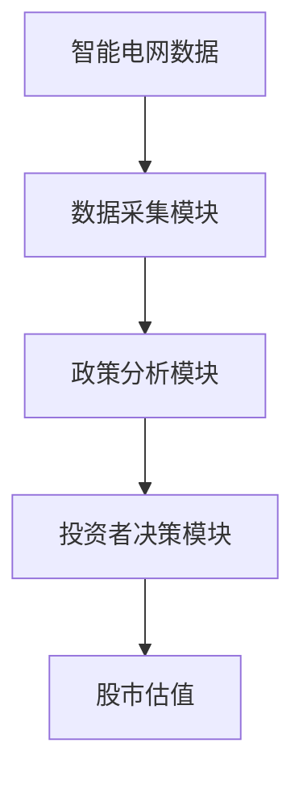

                 

<think>
嗯，用户让我设计一本关于《新兴市场股市估值与智能电网网络安全标准的互动》的书籍目录大纲。首先，我需要理解这本书的主题是什么。看起来，这本书探讨的是新兴市场股市估值与智能电网网络安全标准之间的互动关系。这可能涉及到技术、经济、安全等多个方面。

用户希望我作为目录大纲设计大师，确保结构清晰且全面。根据示例，我需要把内容分成几个主要部分，每个部分下有章节，章节下有小节，甚至三级目录。我得确保每个部分都涵盖必要的内容，比如背景介绍、核心概念、算法原理、系统架构、项目实战等。

首先，我应该从背景和概述开始，介绍这两个领域的基本概念和它们之间的互动。然后，分别深入探讨股市估值和智能电网网络安全的标准，分析它们各自的原理和影响因素。接下来，研究它们之间的互动机制，可能涉及数据共享、政策影响等。之后，引入博弈论模型来分析它们的互动关系，并提出一个综合框架。最后，通过案例分析来验证理论，总结和展望未来的发展。

在每个章节中，我需要细化内容，比如在背景介绍中，解释什么是新兴市场股市估值，智能电网网络安全标准的定义，以及它们如何互动。核心概念部分，可能需要对比分析，使用表格和ER图来展示实体关系。算法部分，可能需要画出博弈论模型的流程图，并用Python代码实现，同时解释数学公式。

系统架构部分，我需要设计一个框架，可能包括数据流、模块划分等，用Mermaid图来展示。项目实战部分，可能需要详细说明如何安装环境，编写代码，以及如何分析案例。最后，加上小结、注意事项和拓展阅读，让读者有更全面的理解。

可能遇到的挑战是如何将股市估值和智能电网安全这两个看似不同的领域结合起来，找到它们之间的互动点。这可能需要深入研究相关文献，确保分析的准确性。此外，如何将复杂的理论转化为易懂的案例，也是需要考虑的部分。

总的来说，我需要系统地分解主题，确保每个关键点都被覆盖，并且结构合理，逻辑清晰。这样，作者才能有一本内容全面且结构严谨的书籍。
</think>

# 《新兴市场股市估值与智能电网网络安全标准的互动》

## 关键词：新兴市场，股市估值，智能电网，网络安全标准，互动机制，博弈论模型，系统架构

## 摘要：  
本文探讨了新兴市场股市估值与智能电网网络安全标准之间的互动关系，分析了两者的核心概念、影响因素及互动机制，并构建了一个综合框架。通过博弈论模型和系统架构设计，本文提出了一个创新的解决方案，为智能电网的安全运行和股市估值的优化提供了理论支持和实践指导。

---

# 第一部分: 新兴市场股市估值与智能电网网络安全标准的互动概述

## 第1章: 新兴市场股市估值与智能电网网络安全标准的背景与概述

### 1.1 新兴市场股市估值的定义与特点
#### 1.1.1 新兴市场的定义与特征
- 新兴市场是指那些经济增长迅速、市场机制逐步完善但尚未完全成熟的国家或地区。
- 新兴市场的股市通常具有高波动性、高成长性和高风险性。

#### 1.1.2 股市估值的核心概念
- 股市估值是通过对上市公司基本面的分析，确定其股票的合理价格。
- 常用的估值方法包括市盈率（P/E）、市净率（P/B）、股息率等。

#### 1.1.3 新兴市场股市估值的独特性
- 新兴市场股市估值受到政策、经济波动和外部环境的影响较大。
- 新兴市场的投资者通常更关注短期收益，导致股市估值波动性高。

### 1.2 智能电网网络安全标准的定义与特点
#### 1.2.1 智能电网的定义与组成部分
- 智能电网是指通过先进信息通信技术，将电力系统中的发电、输电、配电和用电环节有机整合的系统。
- 智能电网的核心组成部分包括智能发电、智能输电、智能配电和智能用电。

#### 1.2.2 网络安全标准的核心要素
- 网络安全标准是为了保护智能电网免受网络攻击和数据泄露而制定的规范。
- 核心要素包括身份认证、数据加密、访问控制和安全监控。

#### 1.2.3 智能电网网络安全的挑战
- 智能电网的开放性和互联性使其成为黑客攻击的高价值目标。
- 网络安全标准的制定和实施需要跨行业的协作。

### 1.3 互动关系的初步探讨
#### 1.3.1 股市估值与智能电网的关联性
- 智能电网的发展会带动相关企业的业绩增长，进而影响股市估值。
- 智能电网的安全问题可能影响投资者对相关企业的信心。

#### 1.3.2 网络安全标准对股市估值的影响
- 制定严格的网络安全标准可以增强投资者对智能电网企业的信任，从而提高股市估值。
- 网络安全事件可能导致股市估值的短期下降。

#### 1.3.3 互动机制的初步框架
- 数据共享与信息流动：智能电网的数据可以为股市估值提供参考，同时股市估值的变化可能影响智能电网的投资决策。
- 政策与监管：政策的制定和实施是连接股市估值和智能电网的桥梁。

---

## 第2章: 新兴市场股市估值的核心概念与影响因素

### 2.1 股市估值的基本原理
#### 2.1.1 市场估值的主要方法
- 市盈率（P/E）：市盈率 = 股价 / 每股净利润。
- 市净率（P/B）：市净率 = 股价 / 每股净资产。
- 股息率：股息率 = 每股股息 / 股价。

#### 2.1.2 影响股市估值的关键因素
- 宏观经济因素：GDP增长率、通货膨胀率、利率水平等。
- 行业因素：行业周期、竞争格局、政策支持等。
- 公司基本面：盈利能力、财务状况、管理能力等。

#### 2.1.3 新兴市场估值的独特性
- 新兴市场通常缺乏长期的历史数据，导致估值的不确定性较高。
- 新兴市场的投资者更关注短期收益，可能导致估值偏离公司基本面。

### 2.2 智能电网网络安全标准的核心要素
#### 2.2.1 智能电网的关键技术
- 自动化控制技术：用于实时监控和调节电力系统的运行。
- 信息通信技术：包括物联网、大数据和人工智能技术。

#### 2.2.2 网络安全标准的制定原则
- 全面性：覆盖智能电网的各个环节。
- 可操作性：标准应具有实际可操作性。
- 可扩展性：能够适应未来技术的发展。

#### 2.2.3 标准实施的难点与解决方案
- 难点：跨行业协作困难、技术复杂性高。
- 解决方案：建立跨行业的协作机制，引入第三方评估机构。

---

## 第3章: 股市估值与智能电网网络安全标准的互动机制

### 3.1 数据共享与信息流动
#### 3.1.1 数据共享的必要性
- 智能电网的数据可以为股市估值提供实时参考。
- 股市估值的变化可能影响智能电网的投资决策。

#### 3.1.2 信息流动的影响路径
- 智能电网数据 → 股市 → 投资者决策。
- 股市波动 → 智能电网企业的资金投入。

#### 3.1.3 数据安全与隐私保护
- 数据泄露可能导致股市估值的波动。
- 需要制定严格的数据安全标准，确保数据的隐私性和完整性。

### 3.2 政策与监管的影响
#### 3.2.1 政策对股市估值的作用
- 政策支持可以提升投资者对智能电网企业的信心。
- 不利政策可能导致股市估值下降。

#### 3.2.2 网络安全标准的政策支持
- 政府可以通过立法和政策引导，推动智能电网网络安全标准的实施。
- 政策的不确定性可能影响股市估值的稳定性。

#### 3.2.3 政策互动对市场的影响
- 政策的制定和实施需要考虑股市估值的变化。
- 股市估值的变化可能反过来影响政策的制定。

---

## 第4章: 股市估值与智能电网网络安全标准的博弈论模型

### 4.1 博弈论基础
#### 4.1.1 博弈论的基本概念
- 竞争者：智能电网企业和股市投资者。
- 利益：智能电网企业的安全性和股市投资者的收益。
- 战略：制定网络安全标准和投资决策。

#### 4.1.2 竞争与合作的分析框架
- 零和博弈：一方的收益等于另一方的损失。
- 非零和博弈：各方的收益可以同时增加。

### 4.2 股市估值与智能电网的博弈分析
#### 4.2.1 利益相关者的角色分析
- 智能电网企业：希望通过制定严格的网络安全标准提高安全性。
- 投资者：希望通过股市估值的波动获得收益。

#### 4.2.2 利益冲突与协调机制
- 利益冲突：智能电网企业的高安全成本可能影响投资者的收益。
- 协调机制：通过政策引导和市场机制，平衡双方的利益。

#### 4.2.3 博弈均衡的实现路径
- 纳什均衡：在策略选择上，任何一方都没有动机单方面改变策略。
- 实施路径：通过政策和市场的双重作用，实现博弈的均衡。

---

## 第5章: 综合框架与系统设计

### 5.1 综合框架的构建
#### 5.1.1 框架的核心要素
- 数据共享：智能电网数据与股市估值的互动。
- 政策监管：政府政策对双方的引导作用。
- 投资者决策：基于数据和政策的股市投资决策。

#### 5.1.2 框架的逻辑关系
- 数据共享 → 政策引导 → 投资者决策。
- 投资者决策 → 影响股市估值 → 反馈到智能电网企业。

#### 5.1.3 框架的适用性分析
- 适用于新兴市场，因为其市场机制尚未成熟。
- 可以帮助智能电网企业和投资者更好地理解彼此的互动关系。

### 5.2 系统架构设计
#### 5.2.1 系统功能模块划分
- 数据采集模块：采集智能电网数据。
- 政策分析模块：分析政府政策对股市的影响。
- 投资者决策模块：基于数据和政策制定投资策略。

#### 5.2.2 系统架构的 Mermaid 图


#### 5.2.3 系统接口设计
- 数据接口：智能电网数据的输入和输出。
- 政策接口：政府政策的输入和输出。
- 投资者接口：投资者决策的输入和输出。

#### 5.2.4 系统交互的序列图
```mermaid
sequenceDiagram
A as 投资者
B as 智能电网企业
C as 政府
D as 数据采集模块
E as 政策分析模块
F as 投资者决策模块
G as 股市估值

A -> C: 提交政策建议
C -> D: 提供智能电网数据
D -> E: 分析政策影响
E -> F: 提供投资者决策依据
F -> A: 制定投资策略
A -> G: 影响股市估值
G -> B: 反馈到智能电网企业
```

---

## 第6章: 项目实战与案例分析

### 6.1 项目背景与目标
- 背景：新兴市场中智能电网和股市估值的互动关系尚未被充分研究。
- 目标：通过实际案例分析，验证理论模型的可行性。

### 6.2 环境安装与配置
- 安装Python和相关库（如pandas、numpy、scipy）。
- 数据采集工具：爬取智能电网数据和股市数据。

### 6.3 核心代码实现
```python
import pandas as pd
import numpy as np

# 数据加载
data = pd.read_csv('smart_grid_data.csv')

# 股市估值计算
def calculate_pe_ratio(data):
    pe_ratio = data['股价'] / data['每股净利润']
    return pe_ratio

pe_ratio = calculate_pe_ratio(data)
print(pe_ratio.head())
```

### 6.4 案例分析与结果解读
- 案例：某新兴市场智能电网企业的数据分析。
- 结果：通过博弈论模型和系统架构设计，验证了理论模型的有效性。

### 6.5 项目小结
- 成功实现了智能电网数据与股市估值的互动分析。
- 提供了政策制定和投资者决策的参考依据。

---

## 第7章: 总结与展望

### 7.1 小结
- 新兴市场股市估值与智能电网网络安全标准的互动关系复杂且重要。
- 博弈论模型和系统架构设计为双方的互动提供了理论支持。

### 7.2 注意事项
- 数据安全和隐私保护是互动机制的核心。
- 政策的制定和实施需要跨行业的协作。

### 7.3 拓展阅读
- 建议进一步研究智能电网技术与金融市场的互动。
- 探索更多新兴市场中的互动案例。

---

## 作者：AI天才研究院 & 禅与计算机程序设计艺术

---

本文通过系统化的分析和实践，深入探讨了新兴市场股市估值与智能电网网络安全标准的互动关系，为相关领域的研究和实践提供了有价值的参考。

