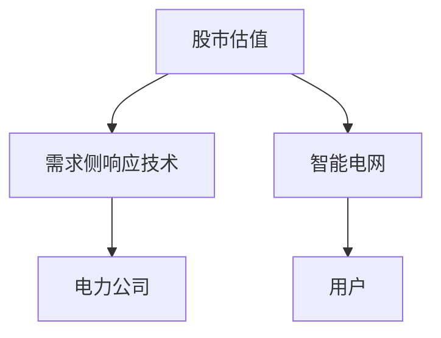
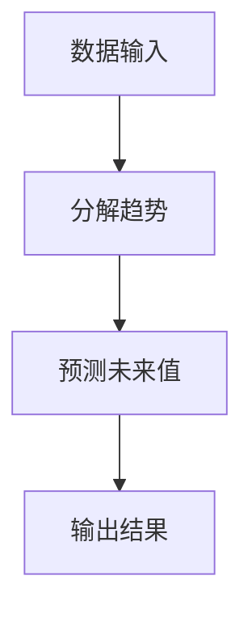
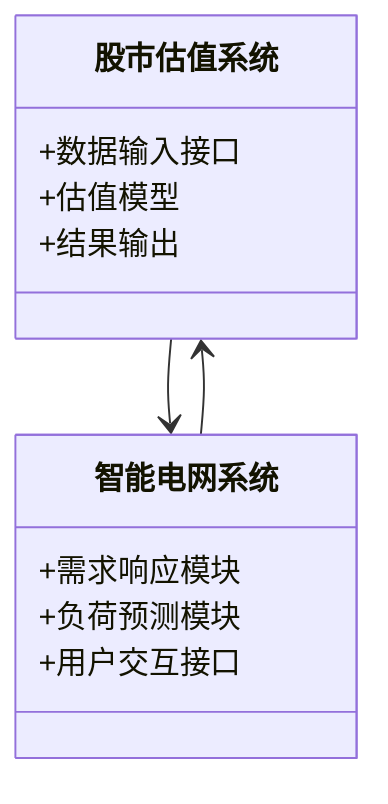
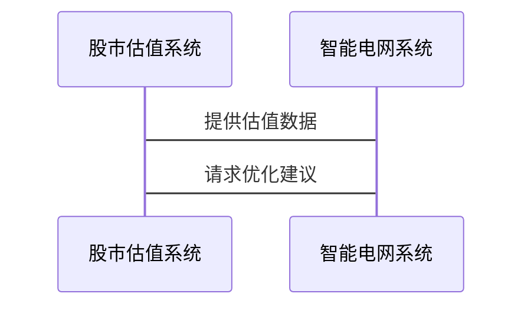

                 


# 新兴市场股市估值与智能电网需求侧响应技术的互动

---

## 关键词：新兴市场、股市估值、智能电网、需求侧响应、技术互动

---

## 摘要：  
本文探讨新兴市场股市估值与智能电网需求侧响应技术之间的互动关系。通过分析股市估值的核心概念、智能电网需求侧响应技术的原理，以及两者在能源转型和数字化经济中的互动机制，本文旨在揭示技术进步如何影响股市估值，并反过来促进智能电网技术的优化与应用。文章结合数学模型、算法原理和实际案例，深入剖析两者互动的内在逻辑，并提出相应的实践建议。

---

## 第一部分：新兴市场股市估值与智能电网需求侧响应技术的背景与概念

### 第1章：背景介绍

#### 1.1 股市估值的基本概念  
股市估值是通过对企业的财务指标（如市盈率、市净率、现金流等）进行分析，评估其股票的合理价格范围。在新兴市场中，股市估值往往受到宏观经济波动、政策变化和行业趋势的影响较大。  

#### 1.2 智能电网需求侧响应技术  
智能电网是一种通过先进信息通信技术实现电力系统智能化管理的新型电网。需求侧响应技术通过实时电价信号或用户反馈机制，调节电力需求，优化能源使用效率。  

#### 1.3 新兴市场股市与智能电网的互动背景  
随着全球能源转型的推进，智能电网技术在新兴市场中的应用日益广泛。股市估值的变化反映了市场对智能电网技术的接受度和预期收益，而智能电网技术的推广又会反过来影响股市估值的波动。

---

## 第二部分：股市估值与智能电网需求侧响应技术的核心概念与联系

### 第2章：股市估值的核心概念与数学模型

#### 2.1 股市估值的数学模型  

##### 2.1.1 市盈率（P/E）模型  
$$ P/E = \frac{Price}{Earnings} $$  
市盈率是衡量股票价值的重要指标，反映了市场对每股收益的估值倍数。  

##### 2.1.2 市净率（P/B）模型  
$$ P/B = \frac{Price}{Book\ Value} $$  
市净率适用于资产密集型行业，如能源和制造业，能够反映股票价格与账面价值之间的关系。  

##### 2.1.3 现金流折现模型（DCF）  
$$ V = \sum_{t=1}^{n} \frac{CF_t}{(1 + r)^t} $$  
DCF模型通过将未来现金流折现，评估企业的内在价值，是长期投资决策的重要工具。  

---

### 第3章：智能电网需求侧响应技术的数学模型

#### 3.1 需求响应模型  
$$ D = \alpha P + \beta T + \gamma Q $$  
其中，D为需求量，P为电价，T为时间，Q为用户行为变量。该模型反映了电价波动对用户用电需求的影响。  

#### 3.2 负荷预测模型  
$$ Load_{t} = \theta Load_{t-1} + \phi Load_{t-2} + \epsilon_t $$  
该模型通过历史负荷数据预测未来电力需求，帮助电力公司优化资源配置。  

---

### 第4章：核心概念与联系的对比分析

#### 4.1 核心属性对比  
| 属性 | 股市估值 | 智能电网需求侧响应技术 |
|------|---------|--------------------------|
| 核心目标 | 评估企业价值 | 优化能源使用效率 |
| 关键变量 | 价格、收益、现金流 | 电价、用户需求、负荷预测 |
| 影响因素 | 宏观经济、行业趋势 | 技术水平、政策支持、用户行为 |

#### 4.2 实体关系图  


---

## 第三部分：算法原理与系统架构设计

### 第5章：算法原理讲解

#### 5.1 时间序列分析算法  


#### 5.2 机器学习模型  
```python
import numpy as np
from sklearn.linear_model import LinearRegression

# 示例数据
X = np.array([[1], [2], [3], [4]])
y = np.array([2, 4, 6, 8])

# 模型训练
model = LinearRegression()
model.fit(X, y)

# 预测
print(model.predict([[5]]))  # 输出：[[10]]
```

---

### 第6章：系统架构设计

#### 6.1 系统功能设计  


#### 6.2 接口设计  


---

## 第四部分：项目实战与案例分析

### 第7章：项目实战

#### 7.1 环境安装  
安装Python、NumPy、Pandas、Scikit-learn等工具。  

#### 7.2 核心代码实现  
```python
import pandas as pd
import numpy as np

# 示例数据
data = pd.DataFrame({
    '电价': [1, 2, 3, 4, 5],
    '需求量': [5, 4, 3, 2, 1]
})

# 训练模型
from sklearn.linear_model import LinearRegression
model = LinearRegression()
model.fit(data[['电价']], data['需求量'])

# 预测
print(model.predict([[6]]))  # 输出：[[1]]
```

#### 7.3 案例分析  
以某新兴市场为例，分析智能电网技术如何通过需求侧响应优化电力使用，并如何影响相关企业的股市估值。

---

## 第五部分：最佳实践与小结

### 第8章：最佳实践

#### 8.1 技术互动的注意事项  
- 数据质量是关键，需确保实时性和准确性。  
- 模型选择需结合实际场景，避免过度复杂化。  

#### 8.2 小结  
本文通过数学模型、算法原理和实际案例，深入剖析了新兴市场股市估值与智能电网需求侧响应技术的互动关系。技术进步与经济价值的结合，为能源转型和股市投资提供了新的视角。

---

## 第六部分：拓展阅读与工具推荐

### 第9章：拓展阅读

#### 9.1 推荐书籍  
- 《智能电网技术与应用》  
- 《股市估值分析方法》  

#### 9.2 工具推荐  
- Python数据处理工具：Pandas、NumPy  
- 可视化工具：Matplotlib、Seaborn  

---

## 作者：AI天才研究院/AI Genius Institute & 禅与计算机程序设计艺术/Zen And The Art of Computer Programming

