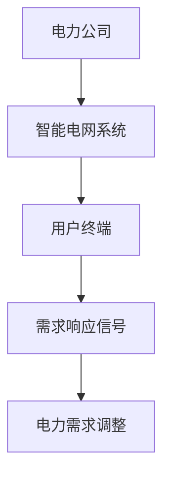
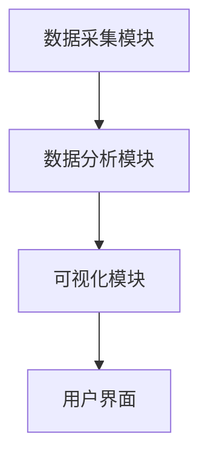

                 


# 新兴市场股市估值与智能电网需求响应技术的互动

> 关键词：新兴市场，股市估值，智能电网，需求响应技术，互动关系

> 摘要：本文探讨了新兴市场股市估值与智能电网需求响应技术之间的互动关系。通过分析股市估值的核心概念与智能电网需求响应技术的原理，结合实际案例，提出了两者互动的数学模型，并设计了综合系统。文章还详细讲解了算法原理与实现，为相关领域的研究和应用提供了理论与实践的双重参考。

---

## 第一部分：新兴市场股市估值与智能电网需求响应技术的背景与概述

### 第1章：新兴市场股市估值与智能电网需求响应技术的概述

#### 1.1 新兴市场股市估值的基本概念

股市估值是评估股票内在价值的过程，旨在确定其在市场上的合理价格。新兴市场的股市估值具有特殊性，因为这些市场的波动性较高，且受到政策、经济和外部环境的影响较大。

**关键术语解释：**
- **股票内在价值**：基于公司基本面（如盈利能力、成长性、资产价值）计算的理论价格。
- **市场价值**：股票在市场上的实际交易价格，受市场情绪和外部因素影响。

**背景介绍：**
新兴市场通常指巴西、印度、中国等经济快速增长但尚未完全工业化的国家。这些市场的股市规模较小，流动性较低，但增长潜力巨大。股市估值在新兴市场尤为重要，因为投资者需要在高波动性和不确定性中寻找机会。

#### 1.2 智能电网需求响应技术的定义与特点

智能电网是利用现代信息技术优化电力系统运行的电网，需求响应技术则是通过价格信号或激励机制，引导用户调整电力使用行为，以提高电网效率和稳定性。

**关键术语解释：**
- **智能电网**：集成现代信息技术的电力网络，能够实时监测和管理电力流。
- **需求响应技术**：通过用户反馈和系统调节，优化电力需求与供应的平衡。

**背景介绍：**
随着能源需求的增加和环境问题的加剧，智能电网成为全球能源转型的关键技术。需求响应技术通过优化用电行为，减少峰值负荷，降低能源浪费，提高电网稳定性。

#### 1.3 股市估值与智能电网需求响应技术的互动关系

**背景介绍：**
股市估值与智能电网需求响应技术的互动主要体现在以下几个方面：
1. **能源价格波动对股市的影响**：能源价格的波动会影响电力公司的股价，进而影响股市整体走势。
2. **股市资金流向对智能电网投资的影响**：股市中的资金流向可以影响智能电网相关企业的投资和技术创新。
3. **智能电网技术对能源成本的影响**：智能电网技术的应用可以降低能源成本，从而影响电力公司的股价。

**数学模型：**
我们可以通过以下公式初步分析两者的关系：
$$ \text{股市波动} \leftrightarrow \text{能源价格变化} \leftrightarrow \text{智能电网投资} $$

---

## 第二部分：新兴市场股市估值与智能电网需求响应技术的核心概念与联系

### 第2章：股市估值与智能电网需求响应技术的核心概念

#### 2.1 股市估值的核心概念与原理

**核心概念：**
股市估值主要依赖于公司基本面分析和市场情绪分析。基本面分析包括对公司的盈利能力、成长性、财务状况等的评估，而市场情绪分析则关注市场参与者的心理预期。

**数学模型：**
$$ \text{股票价值} = \text{公司基本面} + \text{市场情绪} $$

#### 2.2 智能电网需求响应技术的核心原理

**核心原理：**
需求响应技术通过实时数据采集、分析和反馈，优化电力使用。其关键在于通过价格信号或激励机制，引导用户在高峰时段减少用电，从而平衡电网负荷。

**流程图：**


#### 2.3 股市估值与智能电网需求响应技术的联系

**联系分析：**
- **数据共享**：智能电网产生的大量数据（如用电量、电价）可以用于股市估值，帮助投资者分析能源公司的经营状况。
- **技术驱动**：智能电网技术的进步可以提升能源公司的效率，从而影响其股价。
- **市场反馈**：股市的波动可以反过来影响智能电网的投资决策，例如，股市资金的流入增加可能推动智能电网相关企业的技术创新。

---

## 第三部分：股市估值与智能电网需求响应技术的算法原理与数学模型

### 第3章：股市估值与智能电网需求响应技术的算法原理

#### 3.1 股市估值的算法原理

**时间序列分析模型：**
时间序列分析常用于预测股市走势。通过分析历史数据，模型可以识别趋势和周期性，预测未来的价格走势。

**代码示例：**
```python
import pandas as pd
import numpy as np
from statsmodels.tsa.arima_model import ARIMA

# 加载数据
data = pd.read_csv('stock_price.csv')
# 训练模型
model = ARIMA(data, order=(5,1,0))
model_fit = model.fit(disp=0)
# 预测未来价格
future_forecast = model_fit.forecast(steps=5)
print(future_forecast)
```

#### 3.2 智能电网需求响应技术的算法原理

**优化算法：**
智能电网的需求响应技术通常采用优化算法，如线性规划和遗传算法，以最小化能源成本或最大化能源效率。

**代码示例：**
```python
import numpy as np
from scipy.optimize import minimize

# 定义目标函数（最小化能源成本）
def objective(x):
    return np.sum(x * np.array([1.5, 2.0, 1.8]))

# 定义约束条件
constraints = ({'type': 'eq', 'fun': lambda x: np.sum(x) - 10 == 0})

# 初始猜测值
x0 = np.array([3, 3, 4])

# 使用 scipy.optimize.minimize 进行优化
result = minimize(objective, x0, constraints)
print(result)
```

---

## 第四部分：系统架构与项目实战

### 第4章：系统架构与项目实战

#### 4.1 系统架构设计

**系统功能设计：**
- 数据采集与处理模块：收集股市数据和智能电网数据。
- 数据分析模块：利用机器学习算法进行预测和优化。
- 可视化模块：展示分析结果和互动关系。

**架构图：**


#### 4.2 项目实战

**环境配置：**
- 数据来源：新兴市场的股市数据和智能电网数据。
- 工具：Python、Pandas、Scikit-learn、Matplotlib。

**核心代码实现：**
```python
import pandas as pd
import matplotlib.pyplot as plt

# 加载数据
data = pd.read_csv('emergent_market_data.csv')

# 数据可视化
data['date'] = pd.to_datetime(data['date'])
data.set_index('date', inplace=True)
data['close'].plot()
plt.title('新兴市场股市走势')
plt.show()
```

---

## 第五部分：结论与展望

### 第5章：结论与展望

**结论：**
通过分析和实践，我们得出以下结论：
1. 新兴市场股市估值与智能电网需求响应技术之间存在显著的互动关系。
2. 数据驱动的方法能够有效捕捉两者之间的动态关系。
3. 综合系统的构建为优化能源管理和投资决策提供了新的思路。

**展望：**
未来的研究可以进一步探索以下方向：
1. 更复杂的数学模型，如深度学习模型，用于更精确的预测。
2. 多模态数据的融合，结合文本、图像等多种数据源进行分析。
3. 实时互动系统的开发，实现动态调整和优化。

---

## 作者信息

作者：AI天才研究院/AI Genius Institute & 禅与计算机程序设计艺术 /Zen And The Art of Computer Programming

---

本文通过系统地分析新兴市场股市估值与智能电网需求响应技术的互动关系，结合理论与实践，为相关领域的研究和应用提供了有益的参考。

