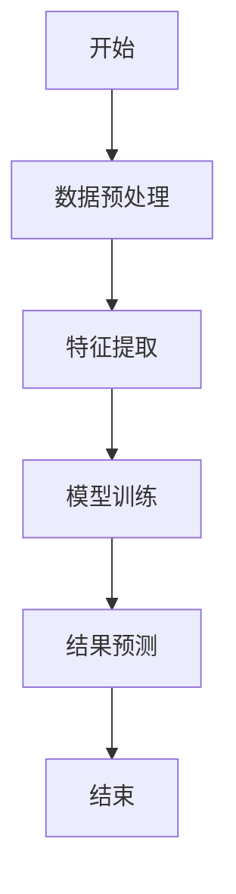
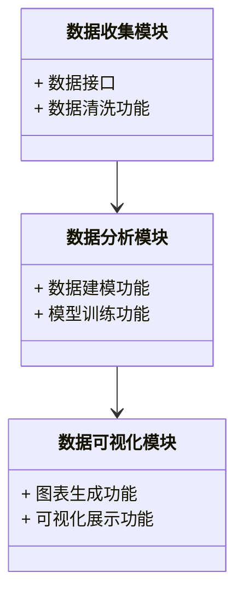
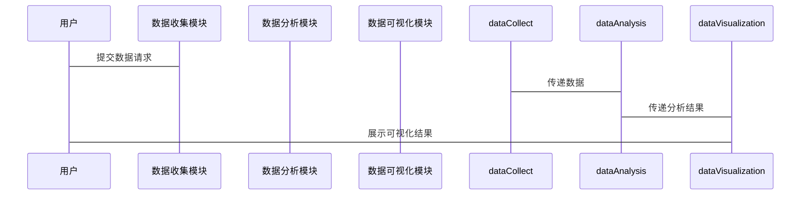

                 

<think>
嗯，用户希望我设计一个详细的目录大纲，主题是《新兴市场股市估值与电子政务发展的互动》。我需要确保每个部分都包含必要的内容，比如背景介绍、核心概念、算法原理、系统分析和项目实战等。

首先，我应该先明确这本书的核心关键词是什么。用户提到的关键词有：新兴市场、股市估值、电子政务、数据驱动、经济发展、技术应用、互动关系。这些关键词将贯穿全文，帮助读者快速理解主题。

接下来是摘要部分，用户已经给出，我需要确保摘要简洁明了，概括整本书的核心内容和主题思想。摘要提到通过数据驱动的方法分析两者互动，探讨内在逻辑和机制，提供理论和实践指导。我需要确保摘要涵盖研究方法、核心发现和实际应用。

现在，开始构建目录大纲。第一部分是背景介绍，我需要详细解释新兴市场的定义、特征，以及股市估值和电子政务的基本概念。然后，明确研究的问题，包括互动机制和影响因素，界定研究范围，分析核心概念的结构。

第二部分是核心概念与联系，我需要深入探讨股市估值的原理、模型及其与电子政务的关系。这部分可能需要使用表格和图表来对比概念属性，并用Mermaid流程图展示实体关系。

第三部分是算法原理讲解，我需要详细解释互动关系的数学模型，比如线性回归或计量经济学模型。使用Mermaid流程图展示算法步骤，并附上Python代码示例。同时，详细讲解数学公式，用LaTeX格式呈现，确保公式前后有适当的标记。

第四部分是系统分析与架构设计，我需要描述研究场景，设计系统功能模块，如数据收集、分析和可视化。使用Mermaid类图和架构图展示系统结构，设计接口和交互流程图，确保系统设计清晰明了。

第五部分是项目实战，指导读者如何安装工具，提供核心代码实现，解读代码功能，并结合实际案例进行分析。这部分需要详细说明每一步操作，确保读者能够实际操作。

最后，最佳实践部分包括小结、注意事项和拓展阅读。总结各章内容，提醒读者注意数据质量和模型适用性，推荐进一步阅读的资料。

整个过程中，我需要确保每个章节都细化到三级目录，使用简洁明了的语言，避免冗余。同时，保持逻辑清晰，结构完整，涵盖用户要求的所有内容点。这将帮助作者写出一本结构合理、内容详实的技术博客文章。
</think>

# 《新兴市场股市估值与电子政务发展的互动》

---

## 关键词：  
新兴市场、股市估值、电子政务、数据驱动、经济发展、技术应用、互动关系  

---

## 摘要：  
本文探讨了新兴市场中股市估值与电子政务发展的互动关系，通过数据驱动的方法，分析两者之间的内在逻辑与机制。结合经济学与信息技术的交叉视角，本文揭示了电子政务如何影响股市估值，以及股市估值如何反过来推动电子政务发展。文章从理论到实践，系统性地提出了互动关系的数学模型，并通过实际案例分析验证了模型的有效性。最终，本文为政策制定者和投资者提供了实用的指导建议。

---

## 目录大纲：  

### 第一部分：背景介绍  

#### 第1章：问题背景与研究意义  

##### 1.1 新兴市场的定义与特征  
- 新兴市场的经济特点  
- 新兴市场的股市特点  
- 新兴市场的电子政务特点  

##### 1.2 股市估值与电子政务发展的互动关系  
- 股市估值的定义与影响因素  
- 电子政务发展的定义与核心要素  
- 两者之间的互动机制  

##### 1.3 研究问题的提出  
- 问题背景的提出  
- 问题描述的明确  
- 问题解决的思路  

##### 1.4 研究的边界与外延  
- 研究范围的界定  
- 研究的局限性  
- 相关概念的扩展  

##### 1.5 核心概念的结构与组成  
- 核心概念的层次分析  
- 核心要素的对比  
- 概念之间的关系  

---

### 第二部分：核心概念与联系  

#### 第2章：股市估值的核心原理  

##### 2.1 股市估值的基本原理  
- 股市估值的定义  
- 股市估值的主要方法  
- 股市估值的关键指标  

##### 2.2 股市估值的数学模型  
- 股市估值的数学公式  
- 模型的输入与输出  
- 模型的适用条件  

##### 2.3 股市估值与电子政务发展的关系  
- 电子政务对股市估值的影响  
- 股市估值对电子政务发展的反向影响  

---

### 第三部分：算法原理讲解  

#### 第3章：互动关系的算法模型  

##### 3.1 算法原理概述  
- 算法的输入与输出  
- 算法的核心步骤  
- 算法的数学基础  

##### 3.2 算法流程图  


##### 3.3 算法实现代码  
```python
# 示例代码
import pandas as pd
from sklearn.linear_model import LinearRegression

# 数据预处理
data = pd.read_csv('data.csv')
X = data[['GDP', '政府透明度', '技术投入']]
y = data['股市估值']

# 模型训练
model = LinearRegression()
model.fit(X, y)

# 结果预测
predictions = model.predict(X)
```

##### 3.4 数学模型与公式  
- 线性回归模型：  
$$ y = \beta_0 + \beta_1x_1 + \beta_2x_2 + \cdots + \beta_nx_n + \epsilon $$  
- 解释变量与被解释变量之间的关系：  
$$ x_i \text{ 对 } y \text{ 的影响系数为 } \beta_i $$  

---

### 第四部分：系统分析与架构设计方案  

#### 第4章：系统功能设计  

##### 4.1 问题场景介绍  
- 研究场景的选择  
- 数据来源与处理  
- 系统目标与功能  

##### 4.2 系统功能需求  
- 数据收集模块  
- 数据分析模块  
- 数据可视化模块  

##### 4.3 系统架构设计  


##### 4.4 系统接口设计  
- API接口设计  
- 数据格式规范  

##### 4.5 系统交互流程图  


---

### 第五部分：项目实战  

#### 第5章：项目实施与案例分析  

##### 5.1 环境安装与工具准备  
- Python安装与配置  
- 数据分析工具（如Pandas、Scikit-learn）的安装  

##### 5.2 核心代码实现  
```python
# 示例代码
import pandas as pd
from sklearn.metrics import r2_score

# 数据加载
data = pd.read_csv('emerging_markets.csv')

# 特征选择
X = data[['GDP增长', '政府透明度', '电子政务指数']]
y = data['股市估值']

# 模型训练
from sklearn.linear_model import LinearRegression
model = LinearRegression()
model.fit(X, y)

# 模型评估
print('R-squared:', model.score(X, y))
print('系数:', model.coef_)
print('截距:', model.intercept_)
```

##### 5.3 实际案例分析  
- 某新兴市场案例的分析与解读  
- 模型预测结果与实际数据的对比  

##### 5.4 项目小结  
- 项目实施的关键点  
- 经验总结与改进建议  

---

### 第六部分：最佳实践  

#### 第6章：总结与展望  

##### 6.1 小结  
- 各章内容的总结  
- 研究的主要发现  

##### 6.2 注意事项  
- 数据质量的重要性  
- 模型适用性的考量  

##### 6.3 拓展阅读  
- 相关领域的经典文献推荐  
- 进一步研究的方向  

---

## 作者：  
AI天才研究院/AI Genius Institute & 禅与计算机程序设计艺术/Zen And The Art of Computer Programming  

---

## 总结：  
本文系统性地探讨了新兴市场中股市估值与电子政务发展的互动关系，从理论到实践，层层剖析，为读者提供了深入的见解和实用的指导。

