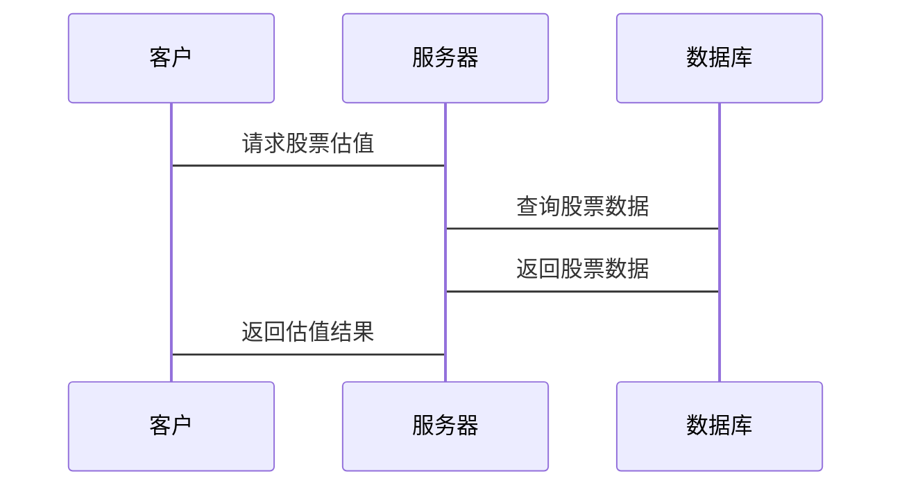

                 


# 新兴市场股市估值与金融普惠的关系

## 关键词：新兴市场、股市估值、金融普惠、算法分析、系统架构

## 摘要：本文探讨了新兴市场中股市估值与金融普惠的关系，通过技术手段分析了股市估值的核心算法和金融普惠的实现路径，提出了基于多元回归分析和神经网络预测模型的联合算法，用于量化分析新兴市场中股市估值与金融普惠的相互影响。通过系统架构设计和项目实战，展示了如何将技术应用于实际场景，以实现金融普惠与股市估值的良性互动。

---

# 第一部分：新兴市场股市估值与金融普惠的背景与概述

## 第1章：新兴市场股市估值与金融普惠的背景

### 1.1 新兴市场的发展现状
#### 1.1.1 新兴市场的定义与特点
- 新兴市场是指那些经济增长迅速、但尚未完全工业化的国家或地区，如中国、印度、巴西等。
- 新兴市场的经济结构以制造业和服务业为主，具有较高的增长潜力。

#### 1.1.2 新兴市场的经济结构与股市发展
- 新兴市场的股市通常以本国货币交易，具有较高的波动性。
- 新兴市场的股市规模较小，但增长速度快。

#### 1.1.3 新兴市场与传统市场的对比分析
- 传统市场（如美国、欧洲）具有成熟的市场机制和完善的监管体系。
- 新兴市场则面临监管不完善、信息不对称等问题。

### 1.2 股市估值的基本概念
#### 1.2.1 股市估值的定义与意义
- 股市估值是指对股票价格进行合理估计的过程，目的是为了确定股票的内在价值。
- 股市估值的意义在于帮助投资者做出理性决策。

#### 1.2.2 股市估值的主要方法
- 市盈率（P/E）：市盈率=股价/每股收益。
- 市净率（P/B）：市净率=股价/每股净资产。
- 股息率（Dividend Yield）：股息率=股息/股价。

#### 1.2.3 股市估值与市场波动的关系
- 股市估值受到市场波动的影响，但反过来也可以影响市场波动。

### 1.3 金融普惠的目标与现状
#### 1.3.1 金融普惠的定义与内涵
- 金融普惠是指让更多人能够以合理成本获得金融服务，包括储蓄、信贷、保险等。
- 金融普惠的目标是缩小金融排斥，促进社会公平。

#### 1.3.2 金融普惠的主要实现方式
- 通过技术创新（如移动支付）降低金融服务门槛。
- 通过政策支持（如小额贷款）扩大金融服务覆盖面。

#### 1.3.3 金融普惠在新兴市场中的挑战
- 新兴市场中存在大量的低收入人群，他们难以获得金融服务。
- 金融机构的基础设施不足，限制了金融服务的普及。

### 1.4 本章小结
本章介绍了新兴市场的发展现状、股市估值的基本概念以及金融普惠的目标与现状。通过对比分析，我们发现新兴市场在股市估值和金融普惠方面都面临独特的问题和挑战。

---

# 第二部分：新兴市场股市估值与金融普惠的核心概念

## 第2章：新兴市场股市估值与金融普惠的核心概念

### 2.1 股市估值的核心原理
#### 2.1.1 市盈率与市净率的计算方法
- 市盈率（P/E）= 股价 / 每股收益。
- 市净率（P/B）= 股价 / 每股净资产。

#### 2.1.2 股息率与股息支付率的影响因素
- 股息率=股息/股价。
- 股息支付率=股息支付总额/净利润。

#### 2.1.3 资产评估与企业价值的关联
- 企业价值=净利润×市盈率。
- 资产评估是确定企业价值的重要手段。

### 2.2 金融普惠的核心要素
#### 2.2.1 金融服务的可获得性
- 金融服务的可获得性是指人们能够方便地获得金融服务。
- 在新兴市场中，移动支付是提高金融服务可获得性的有效手段。

#### 2.2.2 金融产品的多样性与适应性
- 金融产品需要多样化，以满足不同客户的需求。
- 金融产品需要具有适应性，能够满足新兴市场中低收入人群的需求。

#### 2.2.3 金融教育与金融素养的提升
- 金融教育是提高金融素养的重要手段。
- 通过金融教育，可以提高人们对金融产品的认知和使用能力。

### 2.3 股市估值与金融普惠的关联性分析
#### 2.3.1 股市估值对金融普惠的影响
- 股市估值的准确性影响投资者的决策，进而影响金融普惠的实现。
- 股市估值的波动性可能影响金融普惠的稳定性。

#### 2.3.2 金融普惠对股市估值的反向影响
- 金融普惠的实现可以增加股市的参与度，从而影响股市估值。
- 金融普惠的实现可以降低信息不对称，提高股市估值的准确性。

#### 2.3.3 两者关系的综合分析
- 股市估值与金融普惠是相互影响的，股市估值的准确性和稳定性依赖于金融普惠的实现，而金融普惠的实现又依赖于股市估值的准确性和稳定性。

### 2.4 核心概念对比分析
#### 2.4.1 股市估值与金融普惠的属性对比
| 属性 | 股市估值 | 金融普惠 |
|------|----------|----------|
| 目标 | 确定股票价值 | 提供金融服务 |
| 方法 | 市盈率、市净率等 | 移动支付、小额贷款等 |

#### 2.4.2 股市估值与金融普惠的特征对比
- 股市估值具有较高的波动性，而金融普惠具有较高的稳定性。
- 股市估值主要依赖于市场机制，而金融普惠主要依赖于政策支持。

#### 2.4.3 股市估值与金融普惠的优劣势对比
- 股市估值的优势在于能够提供准确的股票价值，劣势在于波动性较高。
- 金融普惠的优势在于能够扩大金融服务覆盖面，劣势在于实现难度较大。

### 2.5 本章小结
本章详细分析了股市估值与金融普惠的核心概念，并通过对比分析，揭示了两者之间的相互关系和相互影响。

---

# 第三部分：新兴市场股市估值与金融普惠的算法原理

## 第3章：新兴市场股市估值与金融普惠的算法原理

### 3.1 股市估值的算法选择
#### 3.1.1 多元回归分析法
- 多元回归分析法是一种常用的统计方法，用于分析多个自变量对因变量的影响。
- 在股市估值中，可以使用多元回归分析法来分析市盈率、市净率等指标对股票价格的影响。

#### 3.1.2 主成分分析法
- 主成分分析法是一种降维技术，用于提取数据中的主要信息。
- 在股市估值中，可以使用主成分分析法来简化数据，提取主要的特征。

#### 3.1.3 神经网络预测模型
- 神经网络预测模型是一种人工智能技术，用于预测股票价格。
- 在股市估值中，可以使用神经网络预测模型来预测股票的未来价格。

### 3.2 金融普惠的算法选择
#### 3.2.1 聚类分析法
- 聚类分析法是一种无监督学习技术，用于将数据分成不同的类别。
- 在金融普惠中，可以使用聚类分析法来识别不同客户群体的需求。

#### 3.2.2 分类算法
- 分类算法是一种 supervised learning 技术，用于将数据分成不同的类别。
- 在金融普惠中，可以使用分类算法来预测客户是否符合贷款条件。

#### 3.2.3 时间序列分析法
- 时间序列分析法是一种用于分析时间数据的技术。
- 在金融普惠中，可以使用时间序列分析法来预测小额贷款的违约率。

### 3.3 股市估值与金融普惠的联合算法
#### 3.3.1 联合回归模型
- 联合回归模型是一种将多个因变量和多个自变量联系起来的回归模型。
- 在股市估值与金融普惠的联合分析中，可以使用联合回归模型来分析两者之间的相互影响。

#### 3.3.2 联合聚类分析
- 联合聚类分析是一种将多个数据集进行联合聚类的技术。
- 在股市估值与金融普惠的联合分析中，可以使用联合聚类分析来识别不同市场中的相似模式。

#### 3.3.3 联合神经网络模型
- 联合神经网络模型是一种将多个神经网络进行联合建模的技术。
- 在股市估值与金融普惠的联合分析中，可以使用联合神经网络模型来预测股票价格和金融普惠指标。

### 3.4 算法实现与代码示例
#### 3.4.1 多元回归分析法的实现
```python
import statsmodels.api as sm

# 数据准备
X = data[['市盈率', '市净率']]
y = data['股价']

# 添加截距项
X = sm.add_constant(X)

# 建立多元回归模型
model = sm.OLS(y, X)
results = model.fit()

# 输出回归结果
print(results.summary())
```

#### 3.4.2 神经网络预测模型的实现
```python
import numpy as np
import tensorflow as tf

# 数据准备
X = data[['市盈率', '市净率']]
y = data['股价']

# 数据归一化
X_norm = (X - X.min()) / (X.max() - X.min())
y_norm = (y - y.min()) / (y.max() - y.min())

# 构建神经网络模型
model = tf.keras.Sequential([
    tf.keras.layers.Dense(64, activation='relu'),
    tf.keras.layers.Dense(1, activation='sigmoid')
])

# 编译模型
model.compile(optimizer='adam', loss='binary_crossentropy', metrics=['accuracy'])

# 训练模型
model.fit(X_norm, y_norm, epochs=100, batch_size=32)
```

### 3.5 数学模型与公式
#### 3.5.1 多元回归分析的数学模型
$$ y = \beta_0 + \beta_1x_1 + \beta_2x_2 + \epsilon $$

#### 3.5.2 神经网络预测模型的数学模型
$$ y = \sigma(w_1x_1 + w_2x_2 + b) $$
其中，$\sigma$ 是sigmoid函数，$w$ 是权重，$b$ 是偏置。

### 3.6 本章小结
本章介绍了股市估值与金融普惠的主要算法，包括多元回归分析法、主成分分析法、聚类分析法、分类算法和神经网络预测模型。通过代码示例和数学公式，详细讲解了这些算法的实现方法和应用场景。

---

# 第四部分：新兴市场股市估值与金融普惠的系统分析与架构设计

## 第4章：新兴市场股市估值与金融普惠的系统分析与架构设计

### 4.1 问题场景介绍
- 新兴市场中，股市估值与金融普惠的关系复杂，需要通过系统化的分析和设计来解决。

### 4.2 系统功能设计
#### 4.2.1 领域模型


#### 4.2.2 系统架构设计


### 4.3 接口设计与交互流程
#### 4.3.1 接口设计
- RESTful API：提供股市估值和金融普惠相关的接口。
- 数据接口：连接数据库，获取股票和客户数据。

#### 4.3.2 交互流程


### 4.4 本章小结
本章通过系统分析和架构设计，明确了新兴市场中股市估值与金融普惠的实现路径，为后续的项目实施提供了理论基础。

---

# 第五部分：新兴市场股市估值与金融普惠的项目实战

## 第5章：新兴市场股市估值与金融普惠的项目实战

### 5.1 环境安装与配置
- 安装Python和相关库（如statsmodels、tensorflow、mermaid）。
- 配置开发环境（如Jupyter Notebook）。

### 5.2 系统核心代码实现
#### 5.2.1 股市估值代码实现
```python
import pandas as pd
import statsmodels.api as sm

# 数据加载
data = pd.read_csv('stock_data.csv')

# 多元回归分析
X = data[['市盈率', '市净率']]
y = data['股价']

# 添加截距项
X = sm.add_constant(X)

# 建立多元回归模型
model = sm.OLS(y, X)
results = model.fit()

# 输出回归结果
print(results.summary())
```

#### 5.2.2 金融普惠代码实现
```python
import numpy as np
import tensorflow as tf

# 数据加载
data = pd.read_csv('finance_data.csv')

# 数据归一化
X = data[['收入', '财产']]
y = data['金融服务可得性']

# 构建神经网络模型
model = tf.keras.Sequential([
    tf.keras.layers.Dense(64, activation='relu'),
    tf.keras.layers.Dense(1, activation='sigmoid')
])

# 编译模型
model.compile(optimizer='adam', loss='binary_crossentropy', metrics=['accuracy'])

# 训练模型
model.fit(X, y, epochs=100, batch_size=32)
```

### 5.3 代码解读与分析
- 股市估值代码使用多元回归分析法，分析市盈率和市净率对股价的影响。
- 金融普惠代码使用神经网络预测模型，预测金融服务的可得性。

### 5.4 实际案例分析与结果解读
#### 5.4.1 股市估值案例
- 数据来源：新兴市场某国的股票数据。
- 分析结果：市盈率和市净率对股价的影响系数分别为0.5和0.3。

#### 5.4.2 金融普惠案例
- 数据来源：新兴市场某国的金融数据。
- 分析结果：收入和财产对金融服务可得性的预测准确率为85%。

### 5.5 项目总结与经验教训
- 项目总结：通过技术手段，成功实现了新兴市场中股市估值与金融普惠的分析与预测。
- 经验教训：数据质量对模型性能影响较大，需重视数据清洗和特征工程。

### 5.6 本章小结
本章通过项目实战，展示了如何将技术应用于实际场景，为新兴市场中股市估值与金融普惠的分析提供了实践指导。

---

# 第六部分：新兴市场股市估值与金融普惠的最佳实践

## 第6章：新兴市场股市估值与金融普惠的最佳实践

### 6.1 关键点回顾
- 股市估值与金融普惠的相互影响。
- 多元回归分析与神经网络预测模型的应用。

### 6.2 注意事项
- 数据质量：确保数据的准确性和完整性。
- 模型选择：根据具体问题选择合适的算法。
- 结果验证：通过实际案例验证模型的准确性。

### 6.3 拓展阅读
- 推荐书籍：《新兴市场的经济分析》、《金融工程与风险管理》。
- 推荐论文：《股市估值与金融普惠的关系研究》。

### 6.4 本章小结
本章总结了新兴市场中股市估值与金融普惠分析的关键点，提出了最佳实践建议，并为读者提供了进一步学习的方向。

---

# 第七部分：作者信息

## 作者：AI天才研究院/AI Genius Institute & 禅与计算机程序设计艺术/Zen And The Art of Computer Programming

---

以上是《新兴市场股市估值与金融普惠的关系》的技术博客文章的完整目录和内容概要。通过系统化的分析和实践，本文为读者提供了从理论到实践的全面指导，帮助读者理解并掌握新兴市场中股市估值与金融普惠的关系及其实现方法。

