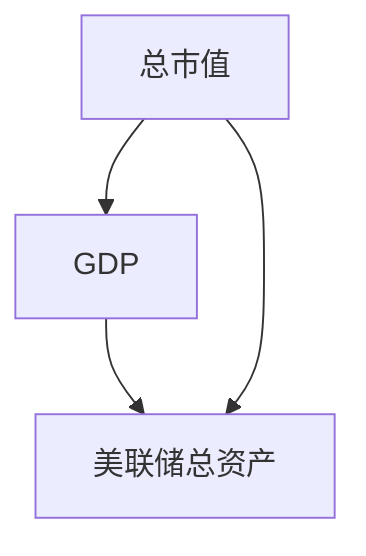
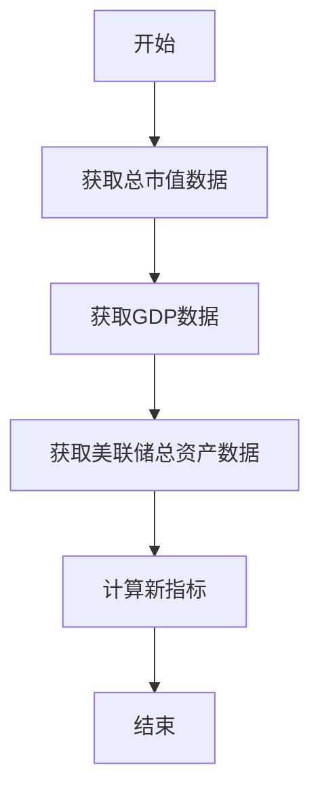
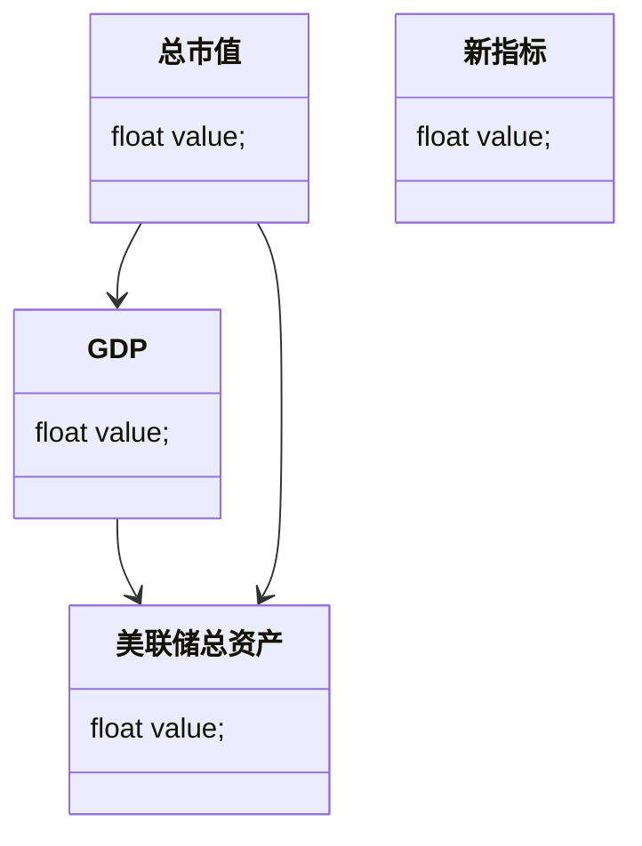

                 


# 新指标：总市值占GDP与美联储总资产之和的百分比

> 关键词：总市值，GDP，美联储总资产，经济指标，金融市场分析，宏观经济

> 摘要：本文提出了一种新的经济指标——“总市值占GDP与美联储总资产之和的百分比”，旨在通过结合金融市场、宏观经济和货币政策的多维度数据，提供一个更全面的经济分析工具。文章从背景、概念、算法、系统设计和项目实战等多个角度详细阐述了这一新指标的定义、计算方法和实际应用，为经济分析提供了新的视角和工具。

---

# 第一部分：新指标的背景与概念

## 第1章：新指标的背景与问题背景

### 1.1 问题背景

#### 1.1.1 当前经济指标的局限性
传统的经济指标（如GDP、CPI、失业率等）在衡量经济健康状况时存在一定的局限性，尤其是在金融市场波动加剧和货币政策复杂化的背景下，这些指标往往无法全面反映经济体系的真实状况。

#### 1.1.2 现有经济分析工具的不足
当前的经济分析工具主要依赖于单一指标（如GDP增长率）或少量指标的组合，难以同时反映金融市场、实体经济和货币政策的综合影响。

#### 1.1.3 新指标的提出动机
为了更全面地反映经济体系的健康状况，本文提出了一种新的经济指标——“总市值占GDP与美联储总资产之和的百分比”，旨在通过结合金融市场、宏观经济和货币政策的多维度数据，提供一个更全面的经济分析工具。

### 1.2 问题描述

#### 1.2.1 总市值、GDP与美联储总资产的定义
- **总市值**：指某个时间段内市场上所有上市公司股票的总价值。
- **GDP**：国内生产总值，衡量一个国家或地区的经济规模。
- **美联储总资产**：美联储持有的资产总和，包括政府债券、银行贷款等。

#### 1.2.2 新指标的定义与计算公式
新指标的定义为：总市值占GDP与美联储总资产之和的百分比，计算公式为：
$$ \text{新指标} = \frac{\text{总市值}}{\text{GDP} + \text{美联储总资产}} \times 100\% $$

#### 1.2.3 新指标的应用场景与目标
新指标可以用于以下几个场景：
1. 评估经济体系的整体健康状况。
2. 分析货币政策对金融市场的影响。
3. 识别潜在的经济风险和机会。

### 1.3 问题解决

#### 1.3.1 新指标如何弥补现有指标的不足
通过结合金融市场、宏观经济和货币政策的多维度数据，新指标能够更全面地反映经济体系的健康状况。

#### 1.3.2 新指标在经济分析中的潜在价值
新指标可以帮助政策制定者、投资者和研究人员更好地理解经济体系的复杂性，从而做出更明智的决策。

#### 1.3.3 新指标的边界与外延
新指标主要适用于经济分析，但在实际应用中需要考虑数据的时效性、准确性和完整性。

### 1.4 核心概念结构与组成

#### 1.4.1 总市值、GDP与美联储总资产的关系
- 总市值反映了金融市场的健康状况。
- GDP反映了实体经济的规模。
- 美联储总资产反映了货币政策的宽松程度。

#### 1.4.2 新指标的数学模型与公式
$$ \text{新指标} = \frac{\text{总市值}}{\text{GDP} + \text{美联储总资产}} \times 100\% $$

#### 1.4.3 新指标的实体关系图（ER图）


---

## 第2章：核心概念与联系

### 2.1 核心概念原理

#### 2.1.1 总市值的计算方法
总市值可以通过将所有上市公司股票的市场价格乘以发行量来计算。

#### 2.1.2 GDP的计算方法
GDP可以通过生产法、收入法或支出法来计算。

#### 2.1.3 美联储总资产的构成与计算
美联储总资产包括政府债券、银行贷款、其他资产等。

### 2.2 核心概念对比分析

#### 2.2.1 总市值与GDP的对比
- 总市值反映金融市场健康状况，GDP反映实体经济规模。
- 总市值受市场情绪影响较大，GDP受实体经济因素影响较大。

#### 2.2.2 GDP与美联储总资产的对比
- GDP反映经济规模，美联储总资产反映货币政策宽松程度。
- GDP与美联储总资产的变化趋势可能存在相关性。

#### 2.2.3 总市值与美联储总资产的对比
- 总市值反映金融市场健康状况，美联储总资产反映货币政策宽松程度。
- 两者的变化趋势可能受到货币政策和市场情绪的共同影响。

### 2.3 实体关系图（ER图）


---

## 第3章：新指标的算法与数学模型

### 3.1 数学模型

#### 3.1.1 新指标的计算公式
$$ \text{新指标} = \frac{\text{总市值}}{\text{GDP} + \text{美联储总资产}} \times 100\% $$

### 3.2 算法原理



### 3.3 代码实现

```python
def calculate_new_indicator(market_cap, gdp, fed_assets):
    new_indicator = (market_cap / (gdp + fed_assets)) * 100
    return new_indicator

# 示例数据
market_cap = 10000  # 总市值（单位：亿美元）
gdp = 5000          # GDP（单位：亿美元）
fed_assets = 2000   # 美联储总资产（单位：亿美元）

result = calculate_new_indicator(market_cap, gdp, fed_assets)
print(f"新指标为：{result}%")
```

---

## 第4章：系统分析与架构设计

### 4.1 系统功能设计

#### 4.1.1 领域模型


#### 4.1.2 系统架构设计


### 4.2 系统接口设计

#### 4.2.1 接口描述
- 数据获取接口：从数据库或API获取总市值、GDP和美联储总资产数据。
- 数据处理接口：对获取的数据进行清洗和预处理。
- 计算接口：调用计算函数计算新指标。
- 展示接口：将结果展示在界面上。

#### 4.2.2 接口实现

```python
# 数据获取
def get_market_cap():
    # 获取总市值数据
    pass

def get_gdp():
    # 获取GDP数据
    pass

def get_fed_assets():
    # 获取美联储总资产数据
    pass

# 数据处理
def process_data(market_cap, gdp, fed_assets):
    return market_cap, gdp, fed_assets

# 计算新指标
def calculate_new_indicator(market_cap, gdp, fed_assets):
    new_indicator = (market_cap / (gdp + fed_assets)) * 100
    return new_indicator

# 展示结果
def display_result(result):
    print(f"新指标为：{result}%")
```

---

## 第5章：项目实战

### 5.1 环境安装

#### 5.1.1 安装Python
确保安装了Python 3.8或更高版本。

#### 5.1.2 安装依赖库
安装必要的库，如`pandas`、`numpy`、`matplotlib`等。

### 5.2 核心实现

#### 5.2.1 数据获取与处理
```python
import pandas as pd

# 获取数据
market_cap = pd.read_csv('market_cap.csv')
gdp = pd.read_csv('gdp.csv')
fed_assets = pd.read_csv('fed_assets.csv')

# 数据处理
market_cap = market_cap['market_cap'].values[0]
gdp = gdp['gdp'].values[0]
fed_assets = fed_assets['fed_assets'].values[0]
```

#### 5.2.2 计算新指标
```python
def calculate_new_indicator(market_cap, gdp, fed_assets):
    new_indicator = (market_cap / (gdp + fed_assets)) * 100
    return new_indicator

result = calculate_new_indicator(market_cap, gdp, fed_assets)
print(f"新指标为：{result}%")
```

### 5.3 实际案例分析

#### 5.3.1 数据来源
- 总市值：美国股市总市值（2023年数据）。
- GDP：美国GDP（2023年数据）。
- 美联储总资产：美联储资产负债表（2023年数据）。

#### 5.3.2 数据计算
```python
market_cap = 40000  # 美国股市总市值（单位：亿美元）
gdp = 230000        # 美国GDP（单位：亿美元）
fed_assets = 90000  # 美联储总资产（单位：亿美元）

result = calculate_new_indicator(market_cap, gdp, fed_assets)
print(f"新指标为：{result}%")
```

---

## 第6章：总结与展望

### 6.1 总结
本文提出了一种新的经济指标——“总市值占GDP与美联储总资产之和的百分比”，并通过理论分析和实际案例验证了其可行性和潜在价值。

### 6.2 最佳实践
- 数据的准确性和及时性对新指标的计算至关重要。
- 在实际应用中，应结合其他经济指标进行综合分析。

### 6.3 注意事项
- 新指标的计算和分析需要结合具体的经济背景和政策环境。
- 数据的获取和处理需要遵循相关法律法规。

### 6.4 拓展阅读
- 阅读更多关于经济指标和货币政策的文献。
- 研究其他类似的新指标及其应用。

---

# 作者：AI天才研究院/AI Genius Institute & 禅与计算机程序设计艺术 /Zen And The Art of Computer Programming

