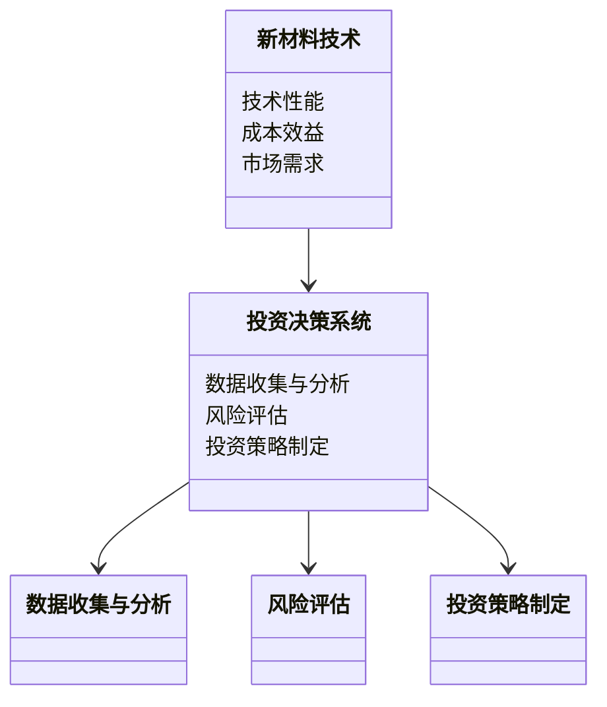
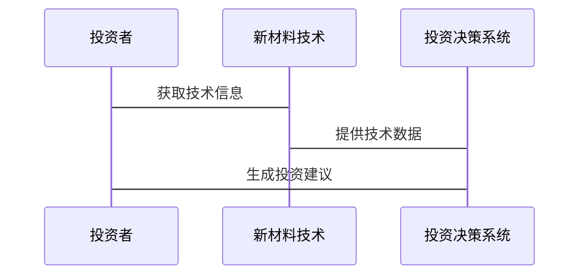

                 

# 新材料技术进步带来的产业变革与投资机会

---

## 关键词：
新材料技术、产业变革、投资机会、纳米材料、石墨烯、3D打印、绿色能源

---

## 摘要：
新材料技术的进步正在深刻改变全球产业结构，推动多个行业的转型升级，并为投资者带来了前所未有的机遇。本文从新材料技术的基本概念出发，分析其对传统产业的变革影响，探讨其在不同领域的应用，最后结合实际案例，为投资者提供科学的投资策略和建议。文章结构清晰，内容详实，旨在帮助读者全面了解新材料技术的潜力和投资价值。

---

# 第一部分: 新材料技术进步的背景与核心概念

## 第1章: 新材料技术进步的背景与意义

### 1.1 新材料技术的定义与分类

#### 1.1.1 新材料的定义
新材料是指通过材料科学与技术的创新，具有传统材料不具备的优异性能或功能的材料。它们通常结合了先进的制备技术和科学原理，以满足现代科技和产业发展对高性能、多功能材料的需求。

#### 1.1.2 新材料的主要分类
新材料可以按照其主要特性和应用领域进行分类：
1. **高性能材料**：如高温陶瓷、高性能合金等，用于极端环境下的应用。
2. **智能材料**：如形状记忆合金、压电材料，能够对外界刺激做出响应。
3. **生物材料**：如生物可降解塑料、医用高分子材料，用于医疗和生物领域。
4. **纳米材料**：如纳米金属、纳米氧化物，具有独特的物理和化学性质。
5. **绿色材料**：如可再生生物基材料、环保型复合材料，注重可持续性和环保性。

#### 1.1.3 新材料技术的核心要素
- **技术创新**：新材料的核心竞争力在于其独特的性能和制备工艺。
- **跨学科融合**：新材料技术需要材料科学、物理学、化学、生物学等多学科的结合。
- **产业化应用**：新材料的最终价值在于其在实际应用中的表现。

### 1.2 新材料技术的演进历程

#### 1.2.1 传统材料的局限性
传统材料如钢铁、塑料等在工业革命中发挥了重要作用，但随着科技的进步，其性能已难以满足现代高科技产业的需求。例如，传统塑料的不可降解性对环境造成了巨大压力。

#### 1.2.2 新材料技术的起源与发展
新材料技术起源于20世纪中叶，随着纳米技术、生物技术的进步，新材料的研究进入了快速发展阶段。21世纪初，石墨烯、纳米材料等新型材料的发现，推动了材料科学的革命。

#### 1.2.3 当前新材料技术的主要趋势
- **高性能化**：材料的强度、耐久性等性能不断提升。
- **多功能化**：材料具备多种功能，如同时具备导电性和柔韧性。
- **智能化**：材料能够感知环境并做出响应。
- **绿色化**：材料的生产过程和应用更加环保，可降解、可回收。

### 1.3 新材料技术对产业变革的推动作用

#### 1.3.1 新材料技术如何改变传统产业
新材料技术通过提高材料性能和降低生产成本，推动了传统产业的转型升级。例如，高性能复合材料的应用使航空航天产业的制造成本大幅降低，同时提升了飞行器的安全性和效率。

#### 1.3.2 新材料技术对创新的促进作用
新材料技术为科技创新提供了新的方向和可能性。例如，石墨烯的发现推动了电子设备小型化和高效化的研究。

#### 1.3.3 新材料技术对全球经济的影响
新材料技术的应用已经渗透到多个领域，成为经济增长的新引擎。例如，新能源材料的发展推动了可再生能源产业的快速发展，为全球经济的可持续发展提供了重要支撑。

### 1.4 本章小结
新材料技术不仅是科技进步的产物，更是推动产业变革的重要力量。通过对新材料技术的定义、分类及其发展趋势的分析，我们可以更好地理解其对全球经济和社会的深远影响。

---

## 第2章: 材料科学的基本原理与新材料的特性

### 2.1 材料科学的基本原理

#### 2.1.1 材料的微观结构
材料的性能与其微观结构密切相关。例如，纳米材料的微观结构决定了其独特的物理性质，如高强度和高导电性。

#### 2.1.2 材料的性能与结构关系
材料的性能可以通过对其微观结构的调控来优化。例如，通过改变晶体结构可以显著提高材料的强度和韧性。

#### 2.1.3 材料的制备与加工技术
材料的制备技术直接影响其性能和成本。例如，采用先进的3D打印技术可以制造复杂形状的材料，同时大幅提高生产效率。

### 2.2 新材料的特性分析

#### 2.2.1 高性能材料的特性
高性能材料通常具有高强度、高耐久性等优异性能，适用于极端环境下的应用。例如，高性能陶瓷用于制造高温发动机部件。

#### 2.2.2 智能材料的特性
智能材料能够对外界刺激（如温度、压力）做出响应，具备形状记忆功能。例如，智能纺织材料可以根据环境温度自动调节保暖性。

#### 2.2.3 生态材料的特性
生态材料注重环保性和可持续性，例如生物可降解塑料可以减少白色污染。

### 2.3 新材料与传统材料的对比分析

#### 2.3.1 性能对比
新材料在性能上远超传统材料，例如纳米材料的强度是传统材料的数百倍。

#### 2.3.2 成本对比
新材料的开发和生产成本较高，但随着技术进步和规模化生产，成本逐渐降低。

#### 2.3.3 应用领域的对比
新材料的应用范围更广，例如石墨烯可以用于电子设备、新能源等领域，而传统材料的应用相对单一。

### 2.4 本章小结
通过对材料科学基本原理和新材料特性的分析，我们可以更好地理解新材料技术的优势和潜力。

---

## 第3章: 新材料技术的关键领域与应用

### 3.1 纳米材料技术

#### 3.1.1 纳米材料的定义与特性
纳米材料是指尺度在纳米级别的材料，具有独特的物理和化学性质。例如，纳米金属具有高强度和高导电性。

#### 3.1.2 纳米材料的主要应用领域
纳米材料广泛应用于电子设备、医药、能源等领域。例如，纳米传感器可以用于环境监测。

#### 3.1.3 纳米材料技术的最新进展
最新的纳米材料技术包括自组装纳米结构和纳米复合材料，进一步提高了材料的性能和应用范围。

### 3.2 石墨烯材料技术

#### 3.2.1 石墨烯的定义与特性
石墨烯是一种由碳原子组成的二维材料，具有极高的导电性和机械强度。

#### 3.2.2 石墨烯的主要应用领域
石墨烯应用于电子设备、能源存储、生物医学等领域。例如，石墨烯基电池可以显著提高充电效率。

#### 3.2.3 石墨烯技术的最新进展
研究人员正在开发石墨烯基复合材料和柔性电子设备，进一步拓展其应用领域。

### 3.3 3D打印技术

#### 3.3.1 3D打印技术的定义与原理
3D打印技术是一种基于数字模型快速制造物体的技术，通过逐层堆砌材料来实现。

#### 3.3.2 3D打印技术的主要应用领域
3D打印技术广泛应用于航空航天、医疗、汽车制造等领域，可以制造复杂形状的零部件。

#### 3.3.3 3D打印技术的最新进展
最新的3D打印技术包括高精度打印和多材料打印，进一步提高了打印质量和效率。

### 3.4 其他前沿新材料技术

#### 3.4.1 生物材料技术
生物材料用于医疗和生物领域，例如生物可降解材料用于药物缓释。

#### 3.4.2 超导材料技术
超导材料用于电力传输和磁悬浮列车等领域，可以显著降低能源损耗。

#### 3.4.3 智能材料技术
智能材料能够感知环境并做出响应，例如智能窗户可以根据光照调节透明度。

### 3.5 本章小结
新材料技术在多个关键领域取得了重要进展，为各行业的创新发展提供了有力支持。

---

## 第4章: 新材料技术对产业变革的影响

### 4.1 传统产业的转型升级

#### 4.1.1 制造业的转型升级
新材料技术的应用使制造业的产品性能和生产效率显著提升，例如高性能复合材料的应用使航空航天制造业的成本大幅降低。

#### 4.1.2 建筑业的转型升级
新型建筑材料的应用使建筑物更加节能环保，例如绿色建筑材料用于绿色建筑的建设。

#### 4.1.3 信息技术产业的转型升级
新材料技术推动了电子设备的小型化和高效化，例如石墨烯的应用使电子设备的性能显著提升。

### 4.2 新产业的崛起

#### 4.2.1 新材料产业的崛起
新材料产业已成为全球经济增长的重要驱动力，例如高性能材料的需求推动了新材料企业的快速发展。

#### 4.2.2 绿色能源产业的崛起
新材料技术的发展推动了绿色能源产业的快速发展，例如新能源材料的应用使太阳能电池的效率显著提高。

#### 4.2.3 智能制造产业的崛起
新材料技术为智能制造提供了新的材料基础，例如智能传感器的应用推动了工业自动化的快速发展。

### 4.3 产业变革的驱动因素

#### 4.3.1 技术进步的驱动作用
新材料技术的不断进步为产业变革提供了技术支持。

#### 4.3.2 市场需求的驱动作用
市场需求的多样化推动了新材料技术的创新和应用。

#### 4.3.3 政策支持的驱动作用
政府政策的支持和资金投入为新材料技术的发展提供了重要保障。

### 4.4 本章小结
新材料技术的进步不仅推动了传统产业的转型升级，还催生了多个新兴行业，为全球经济发展注入了新的活力。

---

## 第5章: 新材料技术进步带来的投资机会

### 5.1 新材料技术投资的基本原则

#### 5.1.1 技术创新
新材料技术的核心竞争力在于其技术创新，投资者应关注具有自主创新能力的企业。

#### 5.1.2 市场需求
投资者应关注具有广阔市场需求的新材料技术，例如新能源材料和生物材料。

#### 5.1.3 政策支持
政府政策的支持和行业标准的制定对新材料技术的发展具有重要影响，投资者应关注政策动向。

#### 5.1.4 风险控制
新材料技术的投资风险较高，投资者应注重风险管理，分散投资。

### 5.2 新材料技术投资的高增长领域

#### 5.2.1 新能源材料
新能源材料是未来能源革命的核心，例如锂离子电池材料和太阳能电池材料。

#### 5.2.2 生物材料
生物材料在医疗和生物领域的应用前景广阔，例如生物可降解材料和医用高分子材料。

#### 5.2.3 智能材料
智能材料的应用领域不断拓展，例如智能传感器和智能纺织材料。

### 5.3 新材料技术投资策略

#### 5.3.1 长期视角
新材料技术的开发周期较长，投资者应具备长期投资的耐心。

#### 5.3.2 风险管理
新材料技术的投资风险较高，投资者应注重风险管理，分散投资。

#### 5.3.3 多元化投资
投资者应分散投资于不同的新材料领域，降低投资风险。

### 5.4 新材料技术投资案例

#### 5.4.1 投资背景
以某新能源材料公司为例，该公司专注于锂离子电池材料的研发和生产。

#### 5.4.2 技术研发
公司通过自主研发掌握了多项新能源材料的核心技术，具备较强的市场竞争力。

#### 5.4.3 市场应用
公司产品已应用于多个知名品牌的新能源设备，市场反馈良好。

#### 5.4.4 投资回报
公司通过技术创新和市场拓展，实现了快速增长，为投资者带来了丰厚的回报。

### 5.5 新材料技术投资中的风险与挑战

#### 5.5.1 技术风险
新材料技术的研发周期长、成本高，技术失败可能导致重大损失。

#### 5.5.2 市场风险
市场需求的变化和市场竞争的加剧可能影响新材料技术的商业成功。

#### 5.5.3 政策风险
政府政策的变化可能对新材料技术的发展和应用产生重大影响。

### 5.6 本章小结
新材料技术的投资机会与风险并存，投资者应具备长期视角和风险管理意识，选择具有技术优势和市场潜力的项目进行投资。

---

## 第6章: 系统分析与投资决策

### 6.1 问题场景介绍
新材料技术的投资决策需要考虑技术、市场、政策等多个因素，是一个复杂的系统工程。

### 6.2 系统功能设计（领域模型）

### 6.3 系统架构设计

### 6.4 系统接口设计
- **数据接口**：与新材料技术相关的数据源进行对接，获取技术性能、市场需求等信息。
- **用户接口**：为投资者提供直观的投资决策支持工具和报告。

### 6.5 系统交互设计

### 6.6 本章小结
通过系统化的分析和设计，投资者可以更好地进行新材料技术的投资决策，降低投资风险，提高投资收益。

---

## 第7章: 项目实战

### 7.1 案例背景
某新材料公司专注于新能源材料的研发和生产，拟投资开发新一代锂离子电池材料。

### 7.2 技术研发
公司通过自主研发掌握了锂离子电池材料的核心技术，具备较强的市场竞争力。

### 7.3 市场应用
公司产品已应用于多个知名品牌的新能源设备，市场反馈良好。

### 7.4 投资回报
公司通过技术创新和市场拓展，实现了快速增长，为投资者带来了丰厚的回报。

### 7.5 小结
通过实际案例的分析，我们可以看到新材料技术的投资潜力和实际应用价值。

---

## 第8章: 未来趋势与投资策略

### 8.1 未来趋势

#### 8.1.1 材料的智能化
随着人工智能和物联网技术的发展，材料的智能化将成为未来的重要趋势。

#### 8.1.2 材料的绿色化
环保和可持续发展成为全球共识，绿色材料的研发和应用将得到进一步加强。

#### 8.1.3 材料的多功能化
新材料将具备更多的功能，例如同时具备导电性和柔韧性。

### 8.2 投资策略

#### 8.2.1 长期视角
新材料技术的开发周期较长，投资者应具备长期投资的耐心。

#### 8.2.2 技术驱动
投资者应关注具有自主创新能力的企业，尤其是那些掌握核心技术的企业。

#### 8.2.3 风险管理
新材料技术的投资风险较高，投资者应注重风险管理，分散投资。

#### 8.2.4 多元化配置
投资者应根据市场变化和自身需求，合理配置新材料领域的投资组合。

### 8.3 结语
新材料技术的未来发展潜力巨大，投资者应抓住机遇，合理配置投资，实现长期稳健的收益。

---

## 作者：AI天才研究院/AI Genius Institute & 禅与计算机程序设计艺术 /Zen And The Art of Computer Programming

---

这篇文章系统地介绍了新材料技术的进步如何推动产业变革，并为投资者提供了科学的投资策略。通过详细的分析和实际案例，读者可以更好地理解新材料技术的潜力和投资价值。希望本文能为相关领域的读者提供有价值的参考和启发。

