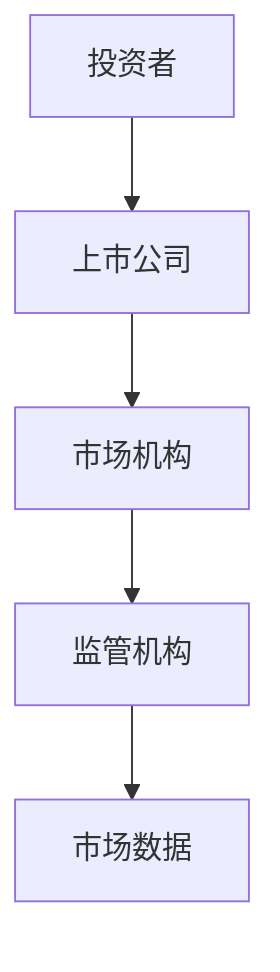
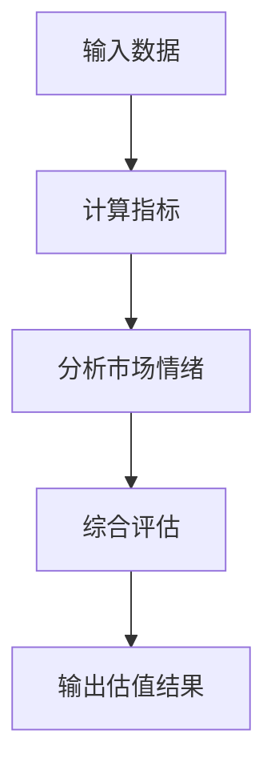
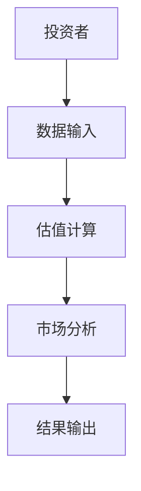

                 

<think>
好的，我现在要写一篇关于《日本股市估值:成熟市场的特点与挑战》的技术博客文章。首先，我需要理解这个主题的核心内容，以及如何组织文章结构。

### 标题和关键词
标题已经确定为《日本股市估值:成熟市场的特点与挑战》，接下来我需要列出5-7个核心关键词。关键词应该涵盖文章的主要内容，比如日本股市、估值方法、成熟市场、挑战、投资策略、市场分析等。

### 摘要
摘要部分需要简明扼要地总结文章的核心内容。我打算提到日本股市作为成熟市场的特点，分析其估值的独特性，探讨影响估值的因素，如宏观经济、企业盈利和市场情绪，并提出应对挑战的策略。

### 目录结构
根据用户提供的大纲，我需要详细展开每个章节的内容。首先，我会在第一部分介绍日本股市的背景与特点，包括历史发展、现状和与其他市场的对比。接下来，第二部分详细讲解估值的核心概念，包括基本原理、数学模型和算法。第三部分分析影响估值的因素，第四部分比较日本与其他市场的差异，第五部分探讨挑战与应对策略，最后是总结与展望。

### 每章节内容
在每个章节中，我需要确保内容逻辑清晰，结构紧凑。例如，在介绍背景时，我会从日本股市的历史说起，分析其现状，再对比其他成熟市场。在估值方法部分，我会详细解释市盈率、市净率等指标，并结合日本股市的特殊情况，如低增长和高分红。

### 关键词和摘要
确保关键词涵盖主要主题，摘要部分简洁明了，概括全文内容。

### 总结与建议
最后，我会总结全文，强调日本股市估值的独特性，并给出投资建议，同时指出未来的研究方向。

通过以上思考，我明确了文章的结构和内容，接下来就可以按照这个框架撰写正文了。
</think>

# 日本股市估值:成熟市场的特点与挑战

> 关键词：日本股市、估值方法、成熟市场、投资策略、市场分析

> 摘要：本文深入分析了日本股市作为成熟市场的特点与估值挑战，探讨了影响其估值的因素，如宏观经济、企业盈利和市场情绪，并提出了应对策略和投资建议。

---

## 第一部分: 日本股市估值的背景与特点

### 第1章: 日本股市估值的背景与现状

#### 1.1 日本股市的历史与发展
日本股市起源于19世纪末，经过二战后的重建，成为全球三大股市之一。其独特性体现在企业治理结构、股东分红习惯和低增长环境上。

#### 1.2 估值的基本概念与方法
市盈率（P/E）和市净率（P/B）是常用的估值指标。日本股市的特殊性要求调整这些指标的使用方式，如考虑企业分红率和市场情绪。

#### 1.3 日本股市的现状与特点
当前日本股市面临老龄化和低增长问题，但其高分红和防御性资产吸引了长期投资者。

### 第2章: 日本股市估值的核心概念与联系

#### 2.1 核心概念原理
估值基于企业基本面和市场情绪，日本股市的独特性要求采用特殊估值模型。

#### 2.2 概念属性特征对比表格
| 指标 | 日本股市 | 其他市场 |
|------|----------|----------|
| 市盈率 | 较低     | 中等偏高 |
| 市净率 | 较低     | 中等     |
| 增长率 | 低       | 中高     |

#### 2.3 ER实体关系图架构


### 第3章: 日本股市估值的算法原理讲解

#### 3.1 算法原理
常用模型包括DCF和PEG，日本股市需考虑特殊因素如分红率。

#### 3.2 算法mermaid流程图


#### 3.3 算法实现代码
```python
def calculate_valuation(price, earnings, growth_rate):
    pe_ratio = price / earnings
    peg_ratio = pe_ratio / growth_rate
    return pe_ratio, peg_ratio
```

### 第4章: 日本股市估值的数学模型与公式

#### 4.1 数学模型
市盈率和PEG模型是基础，需考虑日本股市的特殊因素。

#### 4.2 数学公式
市盈率：$$ P/E = \frac{Price}{Earnings} $$
PEG比率：$$ PEG = \frac{P/E}{Growth\ Rate} $$

### 第5章: 日本股市估值的系统分析与架构设计方案

#### 5.1 问题场景介绍
日本股市的低增长和高分红要求特殊的估值方法。

#### 5.2 系统架构设计


---

## 第二部分: 影响日本股市估值的因素

### 第6章: 宏观经济因素与企业盈利

#### 6.1 宏观经济环境的影响
日本经济的停滞和通缩影响股市估值。

#### 6.2 企业盈利状况
日本企业的低增长和高分红是估值的重要因素。

### 第7章: 市场情绪与技术分析

#### 7.1 市场情绪分析
投资者情绪波动影响短期估值。

#### 7.2 技术分析方法
通过技术指标预测市场走势。

---

## 第三部分: 日本股市与其他成熟市场的对比

### 第8章: 估值差异分析

#### 8.1 与其他市场的对比
日本股市的低增长和高分红导致估值指标差异。

### 第9章: 日本股市的特殊性

#### 9.1 人口老龄化影响
老龄化加剧市场防御性。

#### 9.2 企业治理结构
日本企业治理的独特性影响估值。

---

## 第四部分: 日本股市估值的挑战与应对策略

### 第10章: 挑战与解决方案

#### 10.1 结构性挑战
低增长和老龄化问题。

#### 10.2 全球化与外资影响
外资流入增加对估值的影响。

### 第11章: 未来趋势与投资建议

#### 11.1 未来趋势预测
防御性资产和高分红企业的长期投资价值。

#### 11.2 投资策略建议
分散投资、长期持有和关注企业基本面。

---

## 第五部分: 总结与展望

### 第12章: 总结

#### 12.1 核心观点回顾
日本股市的独特性要求调整估值方法，需综合考虑基本面和市场情绪。

### 第13章: 未来研究方向

#### 13.1 深入研究
探索新技术在估值中的应用。

---

## 结语

日本股市作为成熟市场的代表，具有独特性，其估值需要综合考虑多种因素。投资者需深入了解市场特点，制定合理策略，抓住机遇，应对挑战。

---

**作者：AI天才研究院/AI Genius Institute & 禅与计算机程序设计艺术 /Zen And The Art of Computer Programming**

