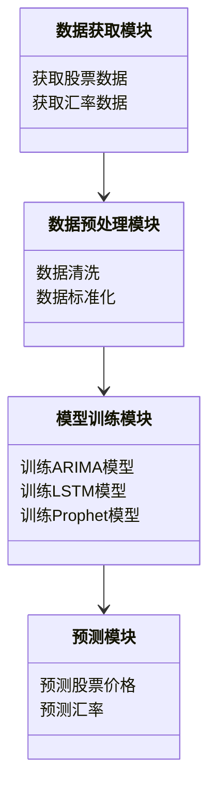
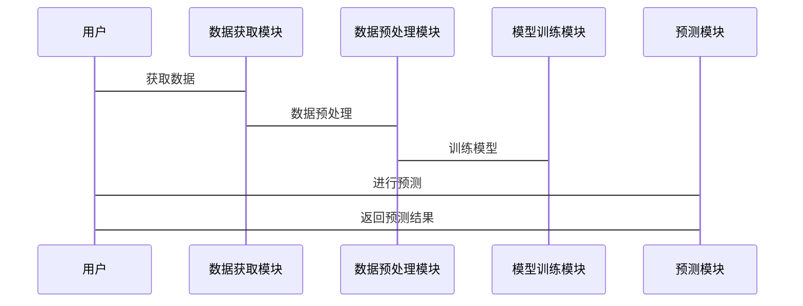

                 


# 时间序列预测模型在金融市场中的比较研究

## 关键词
时间序列预测, 金融市场, 机器学习模型, ARIMA, LSTM, Prophet

## 摘要
本文系统地探讨了时间序列预测模型在金融市场中的应用，重点比较了ARIMA、LSTM和Prophet三种模型的优缺点，并通过实际案例分析了它们在金融数据预测中的表现。文章从时间序列预测的基本概念入手，详细分析了各种模型的算法原理，并结合金融市场数据的特点，提出了优化建议和实践方案。

---

## 第一部分: 时间序列预测模型概述

### 第1章: 时间序列预测的基本概念

#### 1.1 时间序列预测的定义与特点
##### 1.1.1 时间序列数据的定义
时间序列数据是指按时间顺序排列的数据，通常以等间隔的时间点记录观测值。例如，股票价格、指数、成交量等金融数据都可以表示为时间序列。

##### 1.1.2 时间序列预测的核心特点
- **有序性**：数据按时间顺序排列，具有明确的时间依赖性。
- **平稳性**：许多时间序列数据可以通过差分等方法转化为平稳序列。
- **预测性**：通过对历史数据的分析，预测未来的趋势和变化。

##### 1.1.3 时间序列预测在金融领域的应用价值
时间序列预测在金融领域有广泛的应用，例如预测股票价格、汇率波动、市场指数走势等。准确的预测可以帮助投资者做出更明智的决策。

#### 1.2 金融市场中的时间序列数据
##### 1.2.1 金融时间序列数据的特征
- **波动性**：金融市场的数据通常波动较大。
- **趋势性**：数据可能呈现长期上升或下降的趋势。
- **周期性**：数据可能受到季节性或周期性因素的影响。

##### 1.2.2 金融时间序列数据的分类
- **股票价格**：单只股票或指数的收盘价、开盘价等。
- **汇率**：不同货币之间的汇率波动。
- **成交量**：交易量的变化。

##### 1.2.3 金融时间序列数据的获取与处理
- **数据获取**：通过API（如Yahoo Finance API）或数据库获取金融数据。
- **数据清洗**：处理缺失值、异常值等。
- **数据预处理**：标准化、归一化等。

#### 1.3 时间序列预测的基本方法
##### 1.3.1 经典的时间序列预测方法
- **简单平均法**：基于过去一段时间的平均值进行预测。
- **指数平滑法**：通过加权平均对数据进行平滑处理，预测未来值。

##### 1.3.2 基于机器学习的时间序列预测方法
- **监督学习**：将时间序列数据转化为监督学习问题，使用回归或分类模型进行预测。
- **深度学习**：利用RNN、LSTM等模型捕捉时间序列中的复杂模式。

##### 1.3.3 常用的时间序列预测模型介绍
- **ARIMA**：经典的时间序列模型，适用于线性平稳序列。
- **Prophet**：基于时间序列分解的模型，适合非平稳序列。
- **LSTM**：深度学习模型，适合捕捉复杂的时间序列模式。

---

### 第2章: 时间序列预测的核心概念与联系

#### 2.1 时间序列预测的核心原理
##### 2.1.1 时间序列的分解模型
时间序列可以分解为趋势、季节性、周期性和随机性四个部分。例如，Prophet模型就基于这种分解思想。

##### 2.1.2 时间序列的平稳性与差分
平稳序列是指统计特性不随时间变化的序列。非平稳序列可以通过差分（如一阶差分、二阶差分）转化为平稳序列。

##### 2.1.3 时间序列预测的误差分析
误差是预测值与实际值之间的差异，可以通过均方误差（MSE）、均方根误差（RMSE）等指标衡量。

#### 2.2 时间序列预测模型的分类与对比
##### 2.2.1 常用时间序列预测模型的分类
- **传统统计模型**：如ARIMA、SARIMA。
- **机器学习模型**：如随机森林、XGBoost。
- **深度学习模型**：如LSTM、Transformer。

##### 2.2.2 不同模型的优缺点对比
| 模型       | 优点                           | 缺点                           |
|------------|--------------------------------|--------------------------------|
| ARIMA      | 简单易用，适合线性平稳序列       | 不适合处理非线性或复杂模式       |
| LSTM       | 能捕捉复杂的时间依赖关系         | 需要大量数据，训练时间较长       |
| Prophet    | 易用性强，适合非平稳序列         | 黑箱模型，可解释性较差           |

##### 2.2.3 时间序列预测模型的适用场景
- **ARIMA**：适用于简单线性平稳序列。
- **LSTM**：适用于复杂非线性序列。
- **Prophet**：适用于有明确趋势和季节性变化的序列。

---

### 第3章: 时间序列预测模型的算法原理

#### 3.1 ARIMA模型
##### 3.1.1 ARIMA模型的定义与原理
ARIMA（AutoRegressive Integrated Moving Average）模型由自回归部分、差分部分和移动平均部分组成。

##### 3.1.2 ARIMA模型的参数选择
- **p**：自回归阶数。
- **d**：差分阶数。
- **q**：移动平均阶数。

##### 3.1.3 ARIMA模型的优缺点
- **优点**：简单易用，适合线性平稳序列。
- **缺点**：无法捕捉非线性模式。

##### 3.1.4 ARIMA模型的数学公式
ARIMA模型的数学公式如下：
$$
ARIMA(p, d, q) = y_t = \phi_1 y_{t-1} + \dots + \phi_p y_{t-p} + \theta_1 \epsilon_{t-1} + \dots + \theta_q \epsilon_{t-q} + \epsilon_t
$$

---

#### 3.2 LSTM模型
##### 3.2.1 LSTM模型的基本原理
LSTM（Long Short Term Memory）是一种特殊的RNN，通过门控机制（遗忘门、输入门、输出门）来处理长序列数据。

##### 3.2.2 LSTM模型的结构与优势
- **结构**：包括输入门、遗忘门、输出门和记忆单元。
- **优势**：能够捕捉长期依赖关系。

##### 3.2.3 LSTM模型的训练与优化
- **训练方法**：使用梯度下降或Adam优化器。
- **模型优化**：调整隐藏层大小、学习率等超参数。

##### 3.2.4 LSTM模型的数学公式
LSTM的核心公式包括：
- 遗忘门：$$ f_t = \sigma(W_f \cdot [h_{t-1}, x_t] + b_f) $$
- 输入门：$$ i_t = \sigma(W_i \cdot [h_{t-1}, x_t] + b_i) $$
- 输出门：$$ o_t = \sigma(W_o \cdot [h_{t-1}, x_t] + b_o) $$
- 记忆单元：$$ c_t = f_t \cdot c_{t-1} + i_t \cdot tanh(W_c \cdot [h_{t-1}, x_t] + b_c) $$
- 隐藏状态：$$ h_t = o_t \cdot tanh(c_t) $$

---

#### 3.3 Prophet模型
##### 3.3.1 Prophet模型的定义与特点
Prophet模型由Facebook开源，适用于非平稳时间序列数据，能够自动处理缺失值和异常值。

##### 3.3.2 Prophet模型的实现原理
Prophet模型基于时间序列分解，将数据分解为趋势、季节性和余项部分，然后分别建模。

##### 3.3.3 Prophet模型的适用场景
- 适合有明确趋势和季节性变化的金融数据。

##### 3.3.4 Prophet模型的数学公式
Prophet模型的核心公式包括：
- **趋势部分**：$$ g(t) = a + b t + \sum_{k=1}^K c_k \sin(d_k t + e_k) $$
- **季节性部分**：$$ s(t) = \sum_{m=1}^M f_m \sin(g_m t + h_m) $$
- **预测值**：$$ y(t) = g(t) + s(t) + \epsilon_t $$

---

### 第4章: 时间序列预测模型的比较分析

#### 4.1 模型性能的评价指标
##### 4.1.1 常用的评价指标介绍
- **均方误差（MSE）**：衡量预测值与实际值的平均平方差。
- **均方根误差（RMSE）**：MSE的平方根，单位与数据一致。
- **平均绝对误差（MAE）**：预测值与实际值的平均绝对差。

##### 4.1.2 不同评价指标的优缺点
| 指标   | 优点                   | 缺点                   |
|--------|------------------------|------------------------|
| MSE    | 能反映预测值与实际值的差异程度 | 易受异常值影响           |
| RMSE   | 单位与数据一致           | 易受异常值影响           |
| MAE    | 不受异常值影响           | 无法反映误差分布         |

---

#### 4.2 不同模型的比较与优化
##### 4.2.1 ARIMA、LSTM与Prophet模型的对比
从预测准确性和计算效率来看，Prophet模型在非平稳序列上表现较好，LSTM适合捕捉复杂模式，而ARIMA适合简单线性序列。

##### 4.2.2 不同模型在金融市场中的应用
- **股票价格预测**：适合使用Prophet模型捕捉趋势和季节性变化。
- **汇率预测**：适合使用LSTM捕捉复杂的非线性关系。

##### 4.2.3 模型优化建议
- **数据预处理**：对数据进行标准化、归一化处理。
- **超参数调整**：通过网格搜索优化模型性能。
- **模型集成**：将多种模型的结果进行融合，提升预测准确性。

---

## 第五部分: 金融市场中的时间序列预测系统设计

### 第5章: 金融时间序列预测系统设计

#### 5.1 问题场景介绍
本文设计了一个金融时间序列预测系统，旨在通过多种模型对股票价格、汇率等数据进行预测，并为用户提供决策支持。

#### 5.2 系统功能设计
##### 5.2.1 领域模型（Mermaid类图）


#### 5.3 系统架构设计
##### 5.3.1 系统架构图（Mermaid架构图）
```mermaid
docker
    service 数据获取服务 {
        image: data-fetcher
        ports: "8080"
    }
    service 数据预处理服务 {
        image: data-preprocessor
        ports: "8081"
    }
    service 模型训练服务 {
        image: model-trainer
        ports: "8082"
    }
    service 预测服务 {
        image: predictor
        ports: "8083"
    }
```

#### 5.4 系统接口设计
##### 5.4.1 API接口
- **数据获取接口**：`GET /fetch-data?symbol=XXX`
- **模型训练接口**：`POST /train-model`
- **预测接口**：`POST /predict`

#### 5.5 系统交互设计
##### 5.5.1 系统交互流程（Mermaid序列图）


---

## 第六部分: 项目实战与优化

### 第6章: 金融时间序列预测系统实现

#### 6.1 环境安装
- **Python环境**：安装Anaconda或Miniconda。
- **依赖库安装**：
  ```bash
  pip install numpy pandas scikit-learn keras tensorflow prophet
  ```

#### 6.2 核心代码实现
##### 6.2.1 数据获取模块
```python
import pandas as pd
from pandas_datareader import DataReader

def fetch_data(symbol, start_date, end_date):
    data = DataReader(symbol, 'yahoo', start_date, end_date)
    return data
```

##### 6.2.2 数据预处理模块
```python
def preprocess_data(data):
    data = data.dropna()
    data = data.pct_change().dropna()
    return data
```

##### 6.2.3 模型训练模块
```python
from sklearn.metrics import mean_squared_error
import tensorflow as tf
from tensorflow.keras.layers import LSTM, Dense, Dropout

def build_lstm_model(input_shape):
    model = tf.keras.Sequential()
    model.add(LSTM(50, return_sequences=True, input_shape=input_shape))
    model.add(Dropout(0.2))
    model.add(LSTM(50, return_sequences=False))
    model.add(Dense(1))
    model.compile(optimizer='adam', loss='mse')
    return model
```

##### 6.2.4 预测模块
```python
def predict_future(model, data, future_steps=30):
    predictions = []
    for _ in range(future_steps):
        next_pred = model.predict(data[-1].reshape(1, data.shape[1], 1))
        predictions.append(next_pred[0, 0])
        data = data.append(pd.Series(next_pred[0, 0]))
    return predictions
```

#### 6.3 项目实战：股票价格预测
##### 6.3.1 数据获取与预处理
```python
import datetime
symbol = 'AAPL'
start_date = datetime.datetime(2020, 1, 1)
end_date = datetime.datetime(2023, 12, 31)
data = fetch_data(symbol, start_date, end_date)
data = preprocess_data(data)
```

##### 6.3.2 模型训练与预测
```python
from tensorflow.keras.utils import np_utils
import numpy as np

data_np = np.array(data).reshape(-1, 1)
train_data = data_np[:int(len(data_np) * 0.8)]
test_data = data_np[int(len(data_np) * 0.8):]

input_shape = (None, 1)
model = build_lstm_model(input_shape)
model.fit(train_data, epochs=50, batch_size=32)
 predictions = predict_future(model, data, 10)
```

##### 6.3.3 结果分析与解读
将预测结果与实际数据进行对比，计算误差指标（如MSE、RMSE、MAE），并可视化预测结果与实际结果的趋势。

---

## 第七部分: 总结与展望

### 第7章: 总结与展望

#### 7.1 研究总结
本文系统地比较了ARIMA、LSTM和Prophet三种时间序列预测模型在金融市场的应用，分析了它们的优缺点，并通过实际案例展示了如何在金融市场中选择合适的模型。

#### 7.2 最佳实践 tips
- 根据数据特点选择模型。
- 对数据进行充分的预处理。
- 调整模型超参数以优化性能。

#### 7.3 未来展望
- 研究更复杂的时间序列模型（如Transformer）。
- 结合多模态数据（如新闻、社交媒体数据）进行预测。
- 提升模型的解释性和可 interpretability.

---

## 作者信息

作者：AI天才研究院/AI Genius Institute & 禅与计算机程序设计艺术/Zen And The Art of Computer Programming

---

本文通过详细分析时间序列预测模型在金融市场中的应用，为读者提供了一个全面的视角，帮助他们在实际应用中选择和优化合适的模型。

