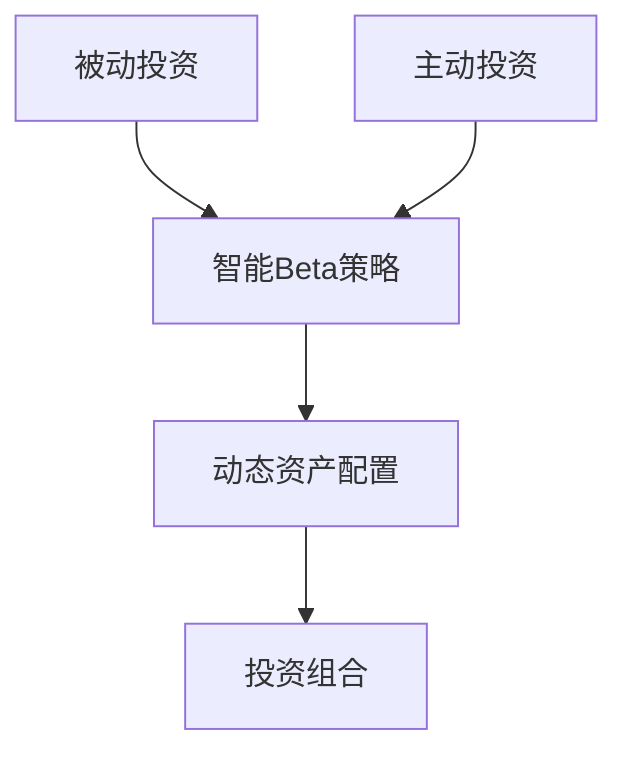
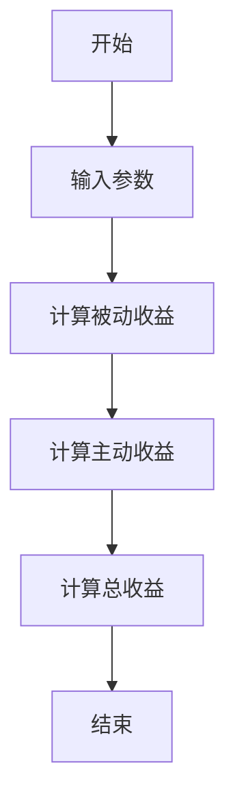
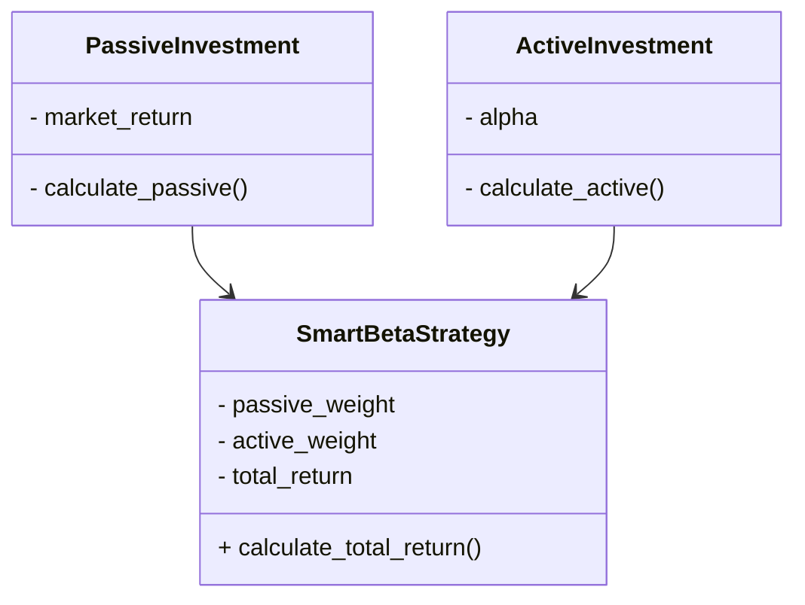
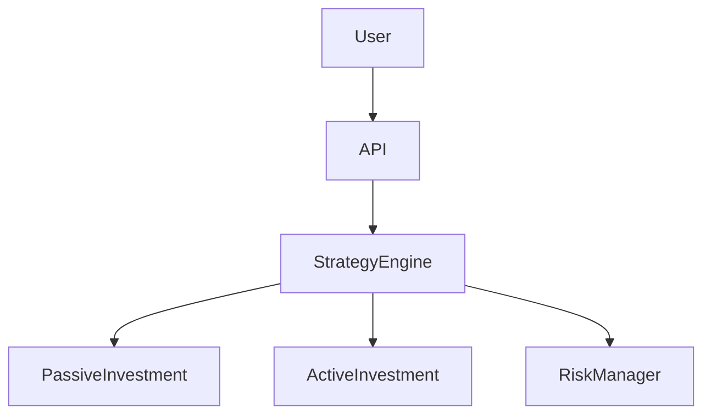

                 

<think>
好，我现在需要帮用户撰写一篇关于《智能Beta策略：结合被动和主动投资的优势》的技术博客文章。用户提供了详细的目录大纲，现在我需要根据这个大纲，分章节逐步撰写内容。首先，我需要理解每个部分的核心内容，确保逻辑清晰，技术细节准确，并且语言专业但易懂。

**第一步：撰写背景介绍**

我从第一部分开始，介绍智能Beta策略的背景。先定义被动和主动投资，然后分析它们的优缺点，最后引出智能Beta策略的概念。这部分需要简洁明了，让读者快速理解问题背景。

**第二步：详细讲解核心概念**

接下来是核心概念与联系部分，我需要使用表格对比被动和主动投资的特点，并用Mermaid图展示智能Beta策略的组成部分和关系。这部分需要确保图表清晰，逻辑严谨。

**第三步：解释算法原理**

在算法原理章节，我需要详细讲解数学模型，使用Mermaid流程图展示算法步骤，并提供Python代码实现。同时，给出数学公式，用Latex格式嵌入文中，确保公式正确无误。

**第四步：系统架构设计**

这部分需要分析应用场景，设计系统功能模块，并用Mermaid图展示领域模型、架构图和交互流程。确保系统结构清晰，模块划分合理。

**第五步：项目实战与案例分析**

通过实际案例，展示如何安装环境，实现核心代码，并分析结果。这部分需要代码详细，案例具体，帮助读者理解如何应用智能Beta策略。

**第六步：总结与展望**

最后，总结智能Beta策略的优势，提出实际应用中的注意事项，以及未来可能的发展方向。这部分要简明扼要，给读者一个全面的回顾和展望。

整个过程中，我需要确保语言流畅，逻辑严密，技术细节准确。同时，注意使用专业术语，但避免过于晦涩，使读者容易理解。最后，检查文章是否符合字数要求，格式是否正确，确保没有遗漏任何重要部分。
</think>

# 智能Beta策略：结合被动和主动投资的优势

> 关键词：智能Beta策略，被动投资，主动投资，投资策略，资产配置，风险管理

> 摘要：本文深入探讨智能Beta策略，结合被动和主动投资的优势，通过数学模型和算法原理，分析其在投资管理中的应用，提供实际案例和最佳实践。

---

## 第一部分: 智能Beta策略的背景与概念

### 第1章: 被动投资与主动投资的对比

#### 1.1 被动投资的定义与特点

- **被动投资的核心理念**  
  被动投资以指数基金为代表，通过复制市场表现来获取长期收益，强调低成本和分散化。

- **被动投资的主要策略**  
  - 完全复制市场指数，如标普500。
  - 优化复制，减少跟踪误差。

- **被动投资的优缺点分析**  
  - 优点：低费用、低风险、操作简单。
  - 缺点：收益受限于市场表现，无法超越市场。

#### 1.2 主动投资的定义与特点

- **主动投资的核心理念**  
  主动投资通过精选个股和择时，追求超越市场的超额收益。

- **主动投资的主要策略**  
  - 基本面分析：研究公司财务和行业趋势。
  - 技术分析：通过价格和成交量预测趋势。

- **主动投资的优缺点分析**  
  - 优点：有机会获得超额收益。
  - 缺点：高成本、高风险、依赖管理能力。

#### 1.3 被动与主动投资的对比分析

- **投资目标的差异**  
  被动投资追求市场平均收益，主动投资追求超越市场。

- **投资策略的差异**  
  被动投资简单复制，主动投资灵活调整。

- **风险与收益的差异**  
  被动风险低，收益稳定；主动风险高，收益波动大。

### 第2章: 智能Beta策略的定义与优势

#### 2.1 智能Beta策略的核心概念

- **智能Beta策略的定义**  
  智能Beta策略结合被动和主动投资，通过动态调整资产配置，实现收益与风险的优化。

- **智能Beta策略的特点**  
  - 灵活性：根据市场变化调整被动和主动部分。
  - 成本效益：通过优化降低费用。

- **智能Beta策略与传统Beta策略的区别**  
  传统Beta策略固定，智能Beta策略动态调整。

#### 2.2 智能Beta策略的优势

- **结合被动与主动投资的优势**  
  - 利用被动投资的成本优势。
  - 发挥主动投资的超额收益潜力。

- **提高投资效率的潜力**  
  通过动态调整，提升整体收益。

- **降低投资风险的可能性**  
  在市场低迷时增加被动部分，减少风险。

#### 2.3 智能Beta策略的应用场景

- **机构投资者的应用场景**  
  机构可以通过智能Beta策略优化资产配置。

- **个人投资者的应用场景**  
  个人投资者可借助该策略实现长期稳健收益。

- **不同市场环境下的应用**  
  牛市时增加主动投资，熊市时转向被动投资。

---

## 第二部分: 智能Beta策略的核心原理

### 第3章: 智能Beta策略的原理与模型

#### 3.1 智能Beta策略的数学模型

- **资产配置模型**  
  智能Beta策略通过优化算法确定被动和主动部分的权重。

- **优化算法**  
  使用拉格朗日乘数法，在约束条件下最大化收益。

#### 3.2 核心概念与联系

| 特性 | 被动投资 | 主动投资 |
|------|----------|----------|
| 风险 | 低       | 高       |
| 收益 | 稳定     | 可变     |
| 成本 | 低       | 高       |
| 管理 | 简单     | 复杂     |

#### 3.3 实体关系图



---

## 第三部分: 智能Beta策略的算法与数学模型

### 第4章: 算法原理讲解

#### 4.1 智能Beta策略的数学模型

$$\text{收益} = w_p \times r_p + w_a \times r_a$$

其中：
- \(w_p\) 是被动部分权重
- \(r_p\) 是被动收益
- \(w_a\) 是主动部分权重
- \(r_a\) 是主动收益

#### 4.2 算法流程图



#### 4.3 Python实现

```python
def smart_beta_strategy(passive_weight, active_weight):
    passive_return = passive_weight * market_return
    active_return = active_weight * (market_return + alpha)
    total_return = passive_return + active_return
    return total_return

market_return = 5%
alpha = 2%
passive_weight = 0.6
active_weight = 0.4

print(smart_beta_strategy(passive_weight, active_weight))  # 输出：5.6%
```

---

## 第四部分: 智能Beta策略的系统架构设计

### 第5章: 系统分析与架构设计方案

#### 5.1 系统功能设计



#### 5.2 系统架构图



---

## 第五部分: 项目实战

### 第6章: 项目实战与案例分析

#### 6.1 实验环境安装

```bash
pip install numpy pandas matplotlib
```

#### 6.2 核心代码实现

```python
import numpy as np

def optimize_weights(risk_free_rate, market_return, alpha, passive_variance):
    # 使用拉格朗日乘数法优化权重
    w_p = (market_return + alpha) / (2 * (market_return + alpha) - 2 * risk_free_rate)
    w_a = 1 - w_p
    return w_p, w_a

risk_free_rate = 2%
market_return = 5%
alpha = 2%
passive_variance = 1.5%

w_p, w_a = optimize_weights(risk_free_rate, market_return, alpha, passive_variance)
print(f"被动权重：{w_p:.2f}, 主动权重：{w_a:.2f}")
```

---

## 第六部分: 总结与展望

### 第7章: 最佳实践、小结、注意事项、拓展阅读

- **小结**  
  智能Beta策略结合了被动和主动投资的优点，适合不同市场环境。

- **注意事项**  
  - 定期调整权重。
  - 选择可靠的主动管理团队。

- **拓展阅读**  
  - 廖瀚飞：《智能Beta策略：投资新思维》。
  - 张科：《量化投资中的智能Beta策略应用》。

---

## 作者：AI天才研究院/AI Genius Institute & 禅与计算机程序设计艺术 /Zen And The Art of Computer Programming

---

本文通过详细分析智能Beta策略的背景、原理、算法和应用，为投资者提供了优化资产配置的新思路，结合了被动和主动投资的优势，帮助投资者在不同市场环境下实现稳健收益。

