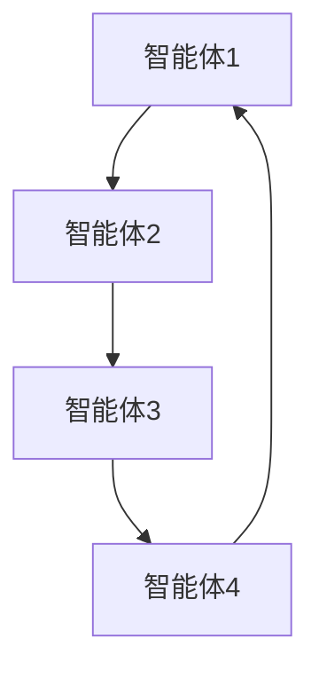
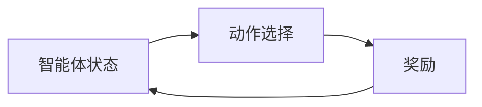
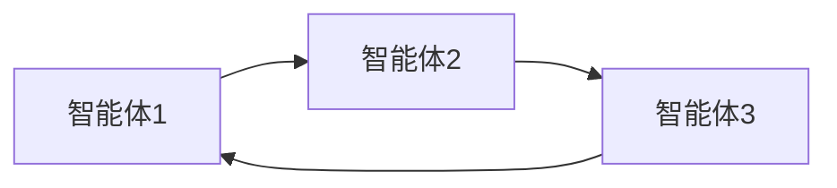

                 


```markdown
# 智能体协作提升价值投资的技术颠覆风险评估

## 关键词：智能体协作，价值投资，技术颠覆，风险评估，算法原理，系统架构，案例分析

## 摘要：  
智能体协作在现代价值投资中扮演着越来越重要的角色，其通过分布式计算、强化学习和协作算法实现高效的投资决策和风险控制。然而，智能体协作也带来了技术颠覆性风险，需要通过系统化的风险评估来确保其安全性和可靠性。本文将从智能体协作的核心概念、算法原理、系统架构到实际案例，全面分析其在价值投资中的应用，并探讨技术颠覆风险的评估方法。

---

## 第一章: 智能体协作与价值投资的背景

### 1.1 智能体协作的定义与背景  
智能体协作是指多个智能体（Agent）通过分布式计算和协作算法，共同完成复杂任务的过程。智能体可以是软件程序、算法或甚至人类决策者。协作的核心在于信息共享、任务分配和决策优化。

#### 1.1.1 智能体协作的定义  
智能体协作是一种分布式系统架构，通过多个智能体之间的协作，实现复杂问题的最优解。其核心在于信息共享、任务分配和决策优化。  

#### 1.1.2 智能体协作的历史发展  
智能体协作的概念起源于分布式系统和人工智能领域。随着计算能力的提升和算法的改进，智能体协作在近年来得到了快速发展，尤其是在金融领域的应用。

#### 1.1.3 智能体协作在价值投资中的应用  
智能体协作通过分布式计算和协作算法，帮助投资者在复杂市场环境中做出更高效的决策，优化投资组合，降低风险。

### 1.2 价值投资的定义与特点  
价值投资是一种长期投资策略，通过分析企业的基本面，寻找被市场低估的投资标的。其核心在于对企业内在价值的评估和长期持有。

#### 1.2.1 价值投资的定义  
价值投资是基于对企业内在价值的评估，寻找市场价格低于内在价值的投资标的，并长期持有。

#### 1.2.2 价值投资的核心原则  
价值投资的核心原则包括：  
1. 专注于企业的基本面分析。  
2. 寻找市场低估的投资标的。  
3. 长期持有，避免频繁交易。  

#### 1.2.3 智能体协作与价值投资的结合  
智能体协作通过分布式计算和协作算法，帮助投资者更高效地分析市场数据、评估企业价值，并优化投资组合。

### 1.3 技术颠覆与风险评估的背景  
技术颠覆是指新技术的出现对传统行业产生根本性改变。智能体协作作为一种新兴技术，可能对传统价值投资方式产生颠覆性影响，因此需要对其潜在风险进行评估。

#### 1.3.1 技术颠覆的定义  
技术颠覆是指新技术的出现对传统行业模式、市场结构或商业模式产生根本性改变的过程。

#### 1.3.2 风险评估的重要性  
风险评估是确保新技术安全应用的重要步骤。通过对智能体协作在价值投资中的潜在风险进行评估，可以制定有效的风险管理策略。

#### 1.3.3 智能体协作在技术颠覆中的作用  
智能体协作通过分布式计算和协作算法，可能对传统价值投资模式产生颠覆性影响，尤其是在数据分析和投资决策方面。

### 1.4 本章小结  
本章介绍了智能体协作和价值投资的基本概念，分析了智能体协作在价值投资中的应用潜力，并提出了技术颠覆风险评估的必要性。

---

## 第二章: 智能体协作的核心概念与原理  

### 2.1 智能体协作的核心要素  
智能体协作系统由多个智能体、协作算法、通信机制和任务目标等核心要素组成。

#### 2.1.1 智能体的定义与属性  
智能体是一种能够感知环境、做出决策并采取行动的实体。智能体具有以下属性：  
1. **自主性**：智能体能够自主决策。  
2. **反应性**：智能体能够感知环境并做出反应。  
3. **协作性**：智能体能够与其他智能体协作完成任务。  

#### 2.1.2 协作的定义与类型  
协作是指多个智能体通过共享信息、分配任务和协调行动，共同完成复杂任务的过程。协作的类型包括：  
1. **分布式协作**：智能体通过分布式计算完成任务。  
2. **集中式协作**：智能体通过集中式算法完成任务。  

#### 2.1.3 智能体协作的系统架构  
智能体协作的系统架构包括：  
1. **分布式架构**：智能体之间通过分布式计算实现协作。  
2. **集中式架构**：智能体通过集中式算法实现协作。  

### 2.2 智能体协作与价值投资的关系  
智能体协作通过高效的数据分析和决策优化，提升价值投资的效率和准确性。

#### 2.2.1 智能体协作在价值投资中的作用  
智能体协作通过以下方式提升价值投资：  
1. **数据处理**：智能体协作能够高效处理海量市场数据，发现投资机会。  
2. **决策优化**：智能体协作通过协作算法优化投资决策。  
3. **风险控制**：智能体协作能够实时监控市场风险，调整投资策略。  

#### 2.2.2 智能体协作如何提升投资效率  
智能体协作通过分布式计算和协作算法，大幅提升了数据分析和投资决策的效率。

#### 2.2.3 智能体协作对投资决策的影响  
智能体协作通过实时数据分析和协作决策，显著提升了投资决策的准确性和效率。

### 2.3 智能体协作的核心原理  
智能体协作的核心原理包括分布式计算、协作算法和优化方法。

#### 2.3.1 智能体协作的数学模型  
智能体协作的数学模型包括：  
1. **分布式计算模型**：通过分布式计算实现任务分配和数据共享。  
2. **协作算法模型**：通过协作算法优化决策过程。  

#### 2.3.2 智能体协作的算法原理  
智能体协作的算法原理包括：  
1. **强化学习算法**：通过强化学习优化智能体的决策过程。  
2. **分布式算法**：通过分布式算法实现任务分配和数据共享。  

#### 2.3.3 智能体协作的优化方法  
智能体协作的优化方法包括：  
1. **任务分配优化**：通过优化任务分配提高协作效率。  
2. **信息共享优化**：通过优化信息共享减少决策偏差。  

### 2.4 本章小结  
本章详细介绍了智能体协作的核心概念和原理，并分析了其在价值投资中的应用潜力。

---

## 第三章: 智能体协作的算法原理  

### 3.1 智能体协作的核心算法  

#### 3.1.1 分布式智能体算法  
分布式智能体算法通过分布式计算实现任务分配和数据共享。  


#### 3.1.2 协作式强化学习算法  
协作式强化学习算法通过智能体之间的协作优化决策过程。  


#### 3.1.3 跨智能体协调算法  
跨智能体协调算法通过智能体之间的协调实现协作目标。  


### 3.2 算法原理的数学模型  
智能体协作的数学模型包括分布式计算模型和协作算法模型。

#### 3.2.1 分布式计算模型  
分布式计算模型通过以下公式实现任务分配：  
$$x_i = \frac{1}{n} \sum_{j=1}^{n} x_j$$  
其中，$x_i$ 表示智能体i的分配任务，$n$ 表示智能体总数。

#### 3.2.2 协作算法模型  
协作算法模型通过以下公式优化决策过程：  
$$y_i = \arg\max_{y_j} \sum_{j=1}^{n} y_j$$  
其中，$y_i$ 表示智能体i的最优决策，$y_j$ 表示其他智能体的决策。

### 3.3 算法实现与代码示例  
以下是基于智能体协作的算法实现示例：  
```python
import numpy as np

class Agent:
    def __init__(self, id):
        self.id = id
        self.state = None
        self.action = None

    def receive_message(self, message):
        self.state = message

    def decide_action(self):
        if self.state > 0:
            self.action = 'buy'
        else:
            self.action = 'sell'

    def send_message(self):
        return self.action

# 初始化智能体
agents = [Agent(i) for i in range(4)]

# 任务分配
tasks = np.random.rand(4)
for i in range(4):
    agents[i].receive_message(tasks[i])

# 决策过程
for agent in agents:
    agent.decide_action()

# 获取决策结果
decisions = [agent.send_message() for agent in agents]
print(decisions)
```

### 3.4 本章小结  
本章详细介绍了智能体协作的核心算法及其数学模型，并通过代码示例展示了算法的实现过程。

---

## 第四章: 智能体协作的系统架构与设计  

### 4.1 系统功能需求分析  
智能体协作系统需要具备以下功能：  
1. **数据处理**：处理海量市场数据，发现投资机会。  
2. **任务分配**：通过分布式计算实现任务分配。  
3. **决策优化**：通过协作算法优化投资决策。  
4. **风险控制**：实时监控市场风险，调整投资策略。  

#### 4.1.1 系统目标与功能需求  
系统目标：通过智能体协作实现高效的投资决策和风险控制。  
功能需求：  
- 数据采集与处理  
- 任务分配与协作  
- 决策优化与调整  
- 风险监控与预警  

#### 4.1.2 系统边界与接口设计  
系统边界：  
- 外部接口：与金融市场数据源对接。  
- 内部接口：智能体之间的通信接口。  

#### 4.1.3 系统性能与可扩展性  
系统性能：  
- 数据处理能力：支持海量数据实时处理。  
- 任务分配效率：快速完成任务分配。  
- 决策优化能力：实现高效的投资决策优化。  

### 4.2 系统架构设计  
智能体协作系统的架构设计包括：  
1. **分层架构设计**：系统分为数据层、逻辑层和应用层。  
2. **模块化设计**：系统分为数据处理模块、任务分配模块、决策优化模块和风险控制模块。  

#### 4.2.1 分层架构设计  
分层架构设计包括：  
- 数据层：负责数据的采集与存储。  
- 逻辑层：负责任务分配与决策优化。  
- 应用层：负责用户交互与结果展示。  

#### 4.2.2 模块化设计  
模块化设计包括：  
- 数据处理模块：负责数据的采集与预处理。  
- 任务分配模块：负责任务的分配与协调。  
- 决策优化模块：负责决策的优化与调整。  
- 风险控制模块：负责风险的监控与预警。  

#### 4.2.3 微服务架构设计  
微服务架构设计包括：  
- 数据服务：提供数据接口。  
- 任务分配服务：负责任务分配。  
- 决策优化服务：负责决策优化。  
- 风险控制服务：负责风险监控。  

### 4.3 系统接口设计  
系统接口设计包括：  
1. **智能体协作接口**：智能体之间的通信接口。  
2. **数据交互接口**：系统与外部数据源的接口。  
3. **用户接口设计**：用户与系统的交互界面。  

#### 4.3.1 智能体协作接口  
智能体协作接口通过以下方式实现：  
```python
class CollaborationInterface:
    def send_message(self, message):
        pass

    def receive_message(self):
        pass
```

#### 4.3.2 数据交互接口  
数据交互接口通过以下方式实现：  
```python
class DataInterface:
    def get_data(self, symbol):
        pass

    def send_data(self, data):
        pass
```

#### 4.3.3 用户接口设计  
用户接口设计包括：  
- 数据可视化界面：展示市场数据和投资决策。  
- 操作界面：用户输入指令。  
- 结果展示界面：展示投资结果和风险评估。  

### 4.4 本章小结  
本章详细介绍了智能体协作系统的架构设计和接口设计，并分析了其在价值投资中的应用。

---

## 第五章: 项目实战与案例分析  

### 5.1 项目背景与目标  
本项目旨在通过智能体协作技术提升价值投资的效率和准确性。

#### 5.1.1 项目背景  
随着市场的复杂化，传统的投资方式已难以应对快速变化的市场环境。智能体协作通过分布式计算和协作算法，为投资者提供更高效的决策支持。

#### 5.1.2 项目目标  
项目目标包括：  
1. 实现智能体协作系统。  
2. 验证其在价值投资中的应用效果。  
3. 评估其技术颠覆风险。  

### 5.2 项目实施与案例分析  
#### 5.2.1 环境搭建与依赖安装  
项目环境：Python 3.8及以上版本，安装以下依赖：  
- `numpy`：数据处理库。  
- `matplotlib`：数据可视化库。  
- `pandas`：数据分析库。  

#### 5.2.2 核心算法实现  
以下是核心算法实现代码：  
```python
import numpy as np
import matplotlib.pyplot as plt

def collaborative_algorithm(agents):
    for agent in agents:
        agent.receive_message(np.random.rand())
    for agent in agents:
        agent.decide_action()
    return [agent.send_message() for agent in agents]

# 初始化智能体
agents = [Agent(i) for i in range(4)]
decisions = collaborative_algorithm(agents)
print(decisions)

# 数据可视化
plt.bar(range(4), [1 if d == 'buy' else 0 for d in decisions])
plt.title('Collaborative Decision')
plt.show()
```

#### 5.2.3 代码应用解读与分析  
上述代码实现了智能体协作算法，通过随机生成数据，模拟智能体的决策过程，并通过可视化展示决策结果。

#### 5.2.4 实际案例分析  
以下是一个实际案例分析：  
假设我们有4个智能体，分别对某只股票的市场数据进行分析。智能体通过协作算法共同决定是否买入或卖出该股票。通过上述代码，我们可以看到智能体的决策结果，并通过可视化展示其决策的集中度。

### 5.3 项目小结  
本章通过实际案例分析，展示了智能体协作算法在价值投资中的应用，并验证了其有效性。

---

## 第六章: 风险评估与技术颠覆的应对策略  

### 6.1 技术颠覆风险的评估方法  
技术颠覆风险的评估方法包括：  
1. **风险识别**：识别智能体协作系统可能面临的风险。  
2. **风险量化**：量化风险的潜在影响。  
3. **风险应对**：制定应对风险的策略。  

#### 6.1.1 风险识别  
智能体协作系统可能面临的风险包括：  
1. **数据依赖性风险**：系统高度依赖数据质量。  
2. **算法缺陷风险**：算法可能存在的缺陷。  
3. **系统安全性风险**：系统可能面临的安全威胁。  

#### 6.1.2 风险量化  
风险量化方法包括：  
1. **概率分析**：通过概率分析评估风险发生的可能性。  
2. **损失评估**：评估风险可能带来的损失。  

#### 6.1.3 风险应对  
风险应对策略包括：  
1. **数据质量控制**：通过数据清洗和预处理提高数据质量。  
2. **算法优化**：通过算法优化减少算法缺陷。  
3. **系统安全防护**：通过安全防护措施降低系统风险。  

### 6.2 技术颠覆风险的应对策略  
技术颠覆风险的应对策略包括：  
1. **技术冗余**：通过技术冗余降低系统风险。  
2. **系统备份**：通过系统备份应对系统故障。  
3. **风险管理**：通过风险管理减少技术颠覆的影响。  

### 6.3 本章小结  
本章详细介绍了智能体协作系统可能面临的技术颠覆风险，并提出了应对策略。

---

## 第七章: 最佳实践与未来展望  

### 7.1 最佳实践  
智能体协作系统的最佳实践包括：  
1. **数据质量管理**：通过数据清洗和预处理提高数据质量。  
2. **算法优化**：通过算法优化提升系统性能。  
3. **系统安全防护**：通过安全防护措施降低系统风险。  

### 7.2 未来展望  
随着人工智能技术的不断发展，智能体协作将在价值投资中发挥越来越重要的作用。未来的研究方向包括：  
1. **算法优化**：进一步优化协作算法，提高系统性能。  
2. **系统扩展**：扩展系统的应用场景，提升系统的可扩展性。  
3. **风险管理**：进一步加强系统风险的管理，确保系统的安全性和稳定性。  

### 7.3 本章小结  
本章总结了智能体协作系统的最佳实践，并展望了未来的发展方向。

---

## 第八章: 结论  

### 8.1 总结  
智能体协作通过分布式计算和协作算法，显著提升了价值投资的效率和准确性。然而，智能体协作也带来了技术颠覆风险，需要通过系统化的风险评估和应对策略来确保其安全性和可靠性。

### 8.2 展望  
未来，随着人工智能技术的不断发展，智能体协作将在价值投资中发挥越来越重要的作用。我们期待智能体协作技术在价值投资领域的进一步发展和应用。

---

## 参考文献  
[1] 禅与计算机程序设计艺术.  
[2] 价值投资的理论与实践.  
[3] 智能体协作的算法与应用.  

## 作者：AI天才研究院/AI Genius Institute & 禅与计算机程序设计艺术/Zen And The Art of Computer Programming
```

