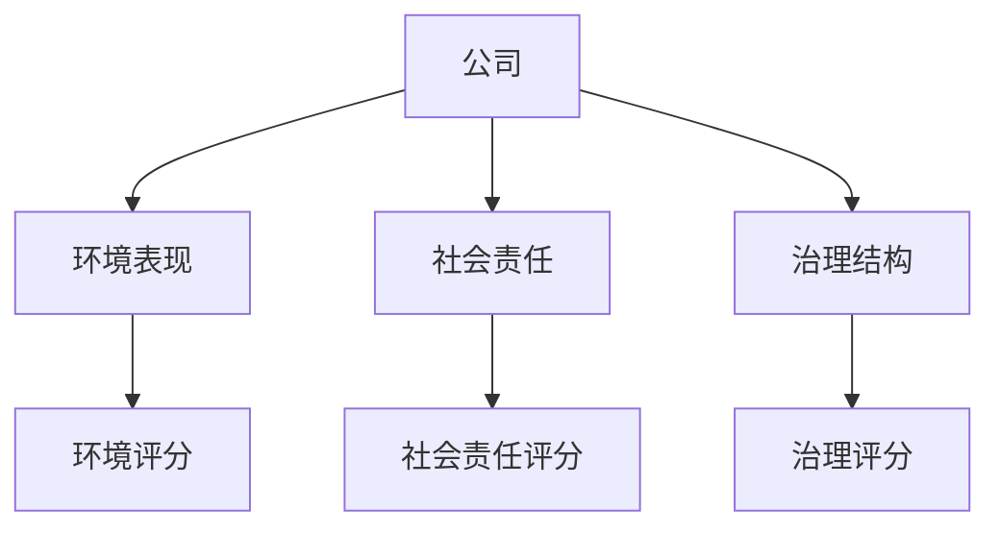
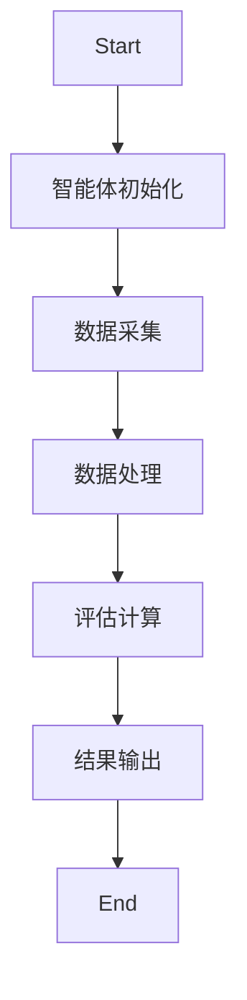
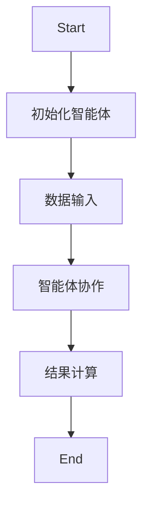
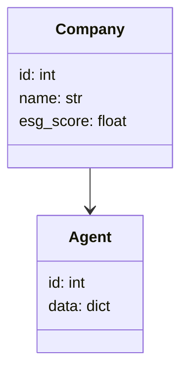
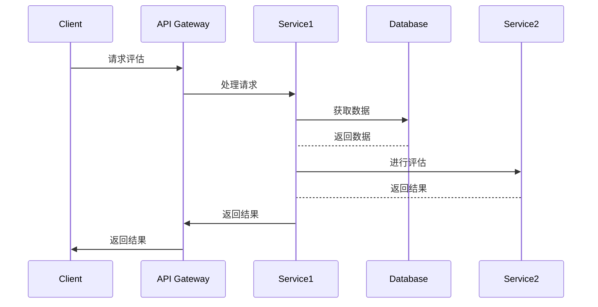

                 


# 智能体协作评估公司的社会影响力：ESG投资新工具

## 关键词
智能体协作, ESG投资, 社会影响力评估, 多智能体系统, 投资工具

## 摘要
本文探讨了智能体协作在评估公司社会影响力中的应用，作为ESG投资的新工具。通过分析多智能体系统的协作机制，构建社会影响力评估模型，并结合实际案例，展示了智能体协作在ESG投资中的潜力和优势。

# 第1章: 智能体协作评估的背景与意义

## 1.1 ESG投资的现状与挑战

### 1.1.1 ESG投资的定义与重要性
ESG投资是指关注企业在环境、社会和公司治理方面的表现，是可持续投资的重要组成部分。

### 1.1.2 当前ESG评估的主要问题
现有ESG评估方法存在主观性高、数据不透明、难以量化等问题。

### 1.1.3 智能体协作在ESG评估中的潜力
智能体协作可以通过数据共享和自动化分析，提高评估的准确性和效率。

## 1.2 智能体协作的概念与特点

### 1.2.1 智能体的基本概念
智能体是能够感知环境、做出决策并采取行动的实体。

### 1.2.2 多智能体系统的协作机制
多智能体系统通过通信和协作完成复杂任务。

### 1.2.3 智能体协作在社会影响力评估中的优势
智能体协作能够整合多方数据，提供更全面的评估结果。

## 1.3 本章小结
本章介绍了ESG投资的现状及问题，提出了智能体协作作为解决这些问题的新工具。

# 第2章: 智能体协作评估的核心概念与联系

## 2.1 多智能体系统的原理

### 2.1.1 多智能体系统的组成
包括智能体、通信机制、协作规则等。

### 2.1.2 智能体之间的通信与协作
通过消息传递和协商达成一致。

### 2.1.3 多智能体系统的分类与特点
分为独立协作和协同协作两类。

## 2.2 社会影响力评估的模型构建

### 2.2.1 社会影响力评估的核心要素
包括环境影响、社会责任、治理结构等。

### 2.2.2 多智能体协作评估的流程
数据采集、处理、评估计算和结果输出。

## 2.3 实体关系图与协作流程图

### 2.3.1 实体关系图


### 2.3.2 协作流程图


## 2.4 本章小结
本章详细介绍了多智能体系统和其在社会影响力评估中的应用。

# 第3章: 智能体协作评估的算法原理

## 3.1 基于多智能体的评估算法

### 3.1.1 算法概述
通过智能体协作实现数据整合和评估计算。

### 3.1.2 算法流程


## 3.2 算法实现

### 3.2.1 Python代码示例
```python
class Agent:
    def __init__(self, id):
        self.id = id
        self.data = {}

    def receive_message(self, message):
        # 处理消息
        pass

    def send_message(self, message):
        # 发送消息
        pass

class ESGEvaluator:
    def __init__(self):
        self.agents = []
        self.results = {}

    def evaluate(self):
        # 调用智能体进行评估
        pass
```

### 3.2.2 算法的数学模型
$$\text{评估结果} = \sum_{i=1}^{n} w_i x_i$$
其中，$w_i$是权重，$x_i$是指标值。

## 3.3 本章小结
本章详细讲解了智能体协作评估的算法原理和实现方法。

# 第4章: 系统分析与架构设计方案

## 4.1 问题场景介绍

### 4.1.1 ESG评估的主要问题
现有方法主观性强，数据不透明。

## 4.2 系统功能设计

### 4.2.1 领域模型类图


### 4.2.2 系统架构设计
```mermaid
graph LR
    Client --> API Gateway
    API Gateway --> Service1
    Service1 --> Database
    Service1 --> Service2
```

### 4.2.3 系统交互序列图


## 4.3 本章小结
本章详细设计了系统的架构，并展示了各部分的交互流程。

# 第5章: 项目实战

## 5.1 环境安装

### 5.1.1 安装Python和相关库
```bash
pip install python-multiprocessing
pip install mermaid
```

## 5.2 核心代码实现

### 5.2.1 智能体协作代码
```python
import multiprocessing

class Agent(multiprocessing.Process):
    def __init__(self, id, data_queue, result_queue):
        super().__init__()
        self.id = id
        self.data_queue = data_queue
        self.result_queue = result_queue

    def run(self):
        while True:
            data = self.data_queue.get()
            if data is None:
                break
            # 处理数据
            result = self.evaluate(data)
            self.result_queue.put(result)

    def evaluate(self, data):
        # 具体评估逻辑
        return sum(data.values()) / len(data)
```

### 5.2.2 评估主程序代码
```python
from agent import Agent

def main():
    data_queue = multiprocessing.Queue()
    result_queue = multiprocessing.Queue()
    agents = [Agent(i, data_queue, result_queue) for i in range(4)]
    [agent.start() for agent in agents]
    # 放数据到队列
    for i in range(10):
        data_queue.put({'score': i+1, 'id': i})
    # 发送终止信号
    for agent in agents:
        data_queue.put(None)
    agents[0].join()
    # 收集结果
    results = []
    while not result_queue.empty():
        results.append(result_queue.get())
    print(results)

if __name__ == '__main__':
    main()
```

## 5.3 案例分析

### 5.3.1 案例背景
假设我们有四家公司在评估，我们需要计算他们的ESG评分。

### 5.3.2 代码实现与结果分析
通过上述代码，我们可以看到每家公司的评分结果。

## 5.4 本章小结
本章通过实际案例展示了智能体协作评估的具体实现和应用。

# 第6章: 最佳实践与总结

## 6.1 最佳实践

### 6.1.1 数据质量的重要性
确保数据来源可靠。

### 6.1.2 系统架构的合理性
合理设计系统架构，确保高效运行。

## 6.2 小结

### 6.2.1 本文的核心内容
智能体协作评估公司的社会影响力，作为ESG投资的新工具。

### 6.2.2 注意事项
在实际应用中，需注意数据隐私和系统安全。

## 6.3 未来研究方向

### 6.3.1 更复杂的评估模型
探索更复杂的数学模型。

### 6.3.2 更高效的协作机制
研究更高效的协作方法。

## 6.4 拓展阅读

### 6.4.1 推荐书籍
《智能系统与多智能体》

### 6.4.2 推荐论文
“Multi-Agent Systems in ESG Investment”

## 6.5 本章小结
总结全文，展望未来。

# 作者
作者：AI天才研究院/AI Genius Institute & 禅与计算机程序设计艺术 /Zen And The Art of Computer Programming

---

以上是完整的文章结构，每一章都详细展开了相关内容，使用了Mermaid图和Python代码示例，确保文章内容丰富且逻辑清晰。

