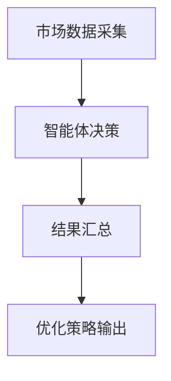
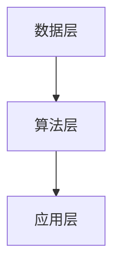
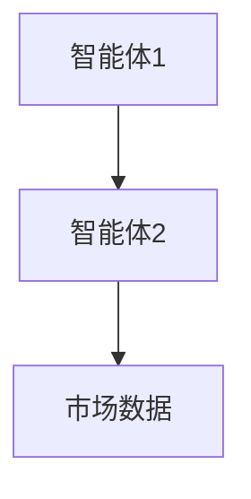

                 


# 智能体群体决策在资产配置优化中的应用：提高组合效率

> 关键词：智能体，群体决策，资产配置优化，组合效率，数学模型，算法实现

> 摘要：智能体群体决策是一种新兴的决策方法，通过多个智能体协作完成复杂决策任务。本文探讨了智能体群体决策在资产配置优化中的应用，分析了其优势与挑战，并通过具体案例展示了如何利用智能体群体决策提高资产配置的组合效率。文章从理论基础、算法实现、系统架构到项目实战，全面阐述了智能体群体决策在资产配置优化中的应用过程。

---

## 第1章: 智能体群体决策概述

### 1.1 智能体的基本概念

#### 1.1.1 智能体的定义与特征
智能体（Agent）是指能够感知环境、做出决策并采取行动的实体。智能体可以是软件程序、机器人或其他能够自主执行任务的系统。智能体的核心特征包括：
- **自主性**：能够独立决策。
- **反应性**：能够感知环境并实时调整行为。
- **主动性**：主动采取行动以实现目标。
- **社会性**：能够与其他智能体或人类进行交互。

#### 1.1.2 智能体的分类与应用场景
智能体可以分为**简单反射型智能体**、**基于模型的智能体**、**目标驱动型智能体**和**效用驱动型智能体**。在资产配置优化中，智能体通常用于实时市场分析、风险评估和投资决策。

#### 1.1.3 智能体与传统决策模型的对比
传统决策模型通常基于固定的规则或单点最优解，而智能体能够通过实时交互和分布式计算实现动态优化。下表对比了两者的差异：

| 对比维度 | 传统决策模型 | 智能体决策模型 |
|----------|--------------|----------------|
| 决策方式 | 单点优化      | 分布式优化      |
| 反应性   | 较低          | 较高            |
| 适应性   | 较差          | 较好            |

### 1.2 群体决策的基本原理

#### 1.2.1 群体决策的定义与特点
群体决策是指多个决策主体（智能体或人类）协作完成决策任务的过程。群体决策的优势在于能够结合不同主体的视角，避免单点决策的局限性。

#### 1.2.2 群体决策的优势与挑战
- **优势**：提高决策的全面性和鲁棒性，避免单点故障。
- **挑战**：信息同步困难、计算复杂度高、可能存在意见分歧。

#### 1.2.3 群体决策的数学模型
群体决策的数学模型通常基于**博弈论**，例如Nash均衡模型。以下是Nash均衡的定义：

$$ \text{Nash均衡：每个决策主体在其他主体策略不变的情况下，选择最优策略。} $$

## 第2章: 资产配置优化的背景与挑战

### 2.1 资产配置的基本概念

#### 2.1.1 资产配置的定义与目标
资产配置是指将资金分配到不同资产类别（如股票、债券、商品等）以实现投资目标（如收益最大化、风险最小化）。资产配置的核心目标是平衡风险与收益。

#### 2.1.2 资产配置的主要方法
传统资产配置方法包括**均值-方差优化**（Markowitz模型）和**风险平价法**。下表对比了两种方法的优缺点：

| 方法 | 均值-方差优化 | 风险平价法 |
|------|---------------|------------|
| 优势 | 最优解         | 鲁棒性好    |
| 劣势 | 计算复杂       | 过度分散风险 |

#### 2.1.3 资产配置的复杂性与挑战
- **复杂性**：市场波动、资产相关性、交易成本等因素增加了优化难度。
- **挑战**：传统方法难以应对动态市场环境。

### 2.2 智能体群体决策在资产配置中的应用前景

#### 2.2.1 智能体群体决策的优势
智能体能够实时感知市场信息并动态调整配置策略，显著提高了资产配置的灵活性和适应性。

#### 2.2.2 资产配置优化中的群体决策场景
- **多资产类别优化**：智能体协作优化股票、债券等资产的配置比例。
- **风险分散**：通过群体决策实现资产的多元化配置，降低投资风险。

#### 2.2.3 智能体群体决策的应用案例
例如，某量化投资机构利用智能体群体决策优化股票组合配置，显著提高了投资收益。

## 第3章: 智能体群体决策的算法与数学模型

### 3.1 基于博弈论的群体决策算法

#### 3.1.1 博弈论基础
博弈论是研究理性决策者在竞争环境中的行为的数学理论。智能体群体决策可以看作是一个博弈过程。

#### 3.1.2 Nash均衡与群体决策
Nash均衡是群体决策的重要理论基础。智能体在Nash均衡状态下，无法通过单方面改变策略而获得更好的结果。

#### 3.1.3 博弈论在资产配置中的应用
通过构建博弈模型，智能体可以在分布式环境中实现资产配置的最优解。

### 3.2 基于分布式计算的群体决策算法

#### 3.2.1 分布式计算的基本原理
分布式计算是指多个计算节点协作完成任务的过程。智能体群体决策依赖于分布式计算技术。

#### 3.2.2 分布式优化算法
分布式优化算法包括**交替方向乘子法（ADMM）**和**分布式梯度下降法**。以下是ADMM的优化步骤：

1. 初始化参数。
2. 分布式节点交替更新参数。
3. 汇总结果，迭代优化。

#### 3.2.3 分布式算法在资产配置中的应用
通过分布式计算，智能体可以实时更新市场信息并优化资产配置策略。

## 第4章: 资产配置优化的数学模型

### 4.1 资产配置的数学模型

#### 4.1.1 资产配置的优化目标
最大化投资收益或最小化投资风险是资产配置的核心目标。

#### 4.1.2 资产配置的约束条件
包括资金比例限制、风险承受能力等。

#### 4.1.3 资产配置的数学表达式
均值-方差优化模型的数学表达式为：

$$ \min_w \sum_{i=1}^n w_i^2 \sigma_i^2 $$
$$ \text{s.t.} \sum_{i=1}^n w_i = 1 $$

其中，\(w_i\) 是资产 \(i\) 的权重，\(\sigma_i^2\) 是资产 \(i\) 的波动率。

### 4.2 基于智能体群体决策的优化模型

#### 4.2.1 智能体群体决策的数学框架
智能体通过信息交互优化资产配置策略。

#### 4.2.2 智能体之间的信息交互模型
智能体通过共享市场信息和策略调整实现协作优化。

#### 4.2.3 智能体群体决策的优化算法
通过分布式优化算法实现资产配置的动态调整。

## 第5章: 系统架构与实现

### 5.1 系统功能设计

#### 5.1.1 系统功能模块划分
包括市场数据采集、智能体决策、结果汇总等功能模块。

#### 5.1.2 系统功能流程图
使用 mermaid 绘制系统功能流程图。



### 5.2 系统架构设计

#### 5.2.1 系统架构的分层设计
系统架构分为数据层、算法层和应用层。

#### 5.2.2 系统架构图
使用 mermaid 绘制系统架构图。



### 5.3 系统接口设计

#### 5.3.1 系统接口设计
包括智能体之间的通信接口和与外部系统的接口。

#### 5.3.2 系统交互流程图
使用 mermaid 绘制系统交互流程图。



## 第6章: 项目实战

### 6.1 环境安装

#### 6.1.1 环境需求
需要安装Python、Jupyter Notebook等工具。

#### 6.1.2 环境配置
安装必要的Python库，如numpy、pandas、matplotlib等。

### 6.2 系统核心实现源代码

#### 6.2.1 智能体类实现
```python
class Agent:
    def __init__(self, id):
        self.id = id
        self.portfolio = {}  # 资产配置比例
```

#### 6.2.2 分布式优化算法实现
```python
def admm_optimization(agents):
    # 初始化参数
    for agent in agents:
        agent.initialize_params()
    
    # 迭代优化
    while not convergence:
        for agent in agents:
            agent.update_params()
        aggregate_results(agents)
```

### 6.3 实际案例分析

#### 6.3.1 案例背景
假设一个包含5个智能体的资产配置优化系统。

#### 6.3.2 案例分析
智能体通过信息交互优化股票、债券等资产的配置比例。

### 6.4 项目小结

#### 6.4.1 项目总结
智能体群体决策能够显著提高资产配置的效率和效果。

#### 6.4.2 项目启示
未来可以进一步研究智能体之间的信息共享机制和优化算法。

---

## 总结

智能体群体决策为资产配置优化提供了新的思路和方法。通过群体决策，智能体能够实时调整配置策略，显著提高组合效率。本文从理论到实践，全面探讨了智能体群体决策在资产配置优化中的应用，为读者提供了深入的见解。

---

作者：AI天才研究院/AI Genius Institute & 禅与计算机程序设计艺术 /Zen And The Art of Computer Programming

