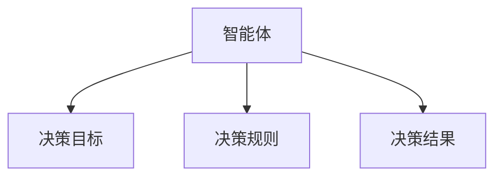
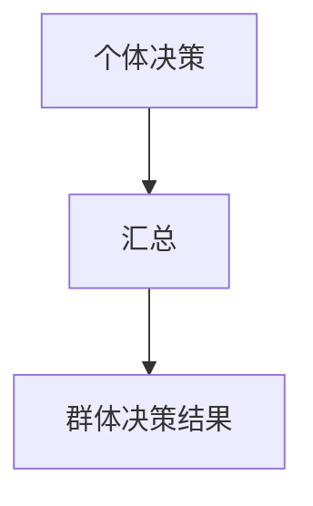
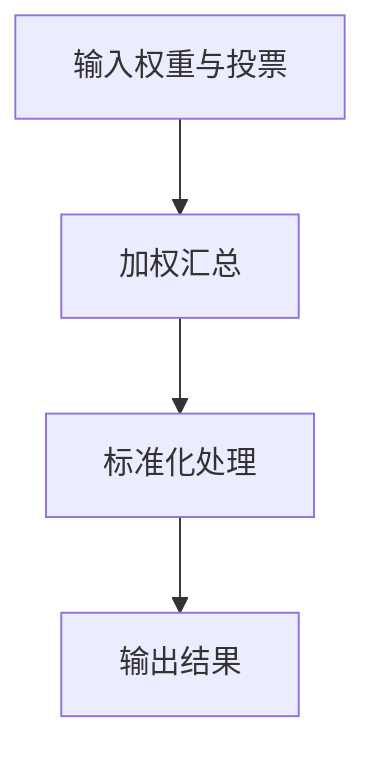
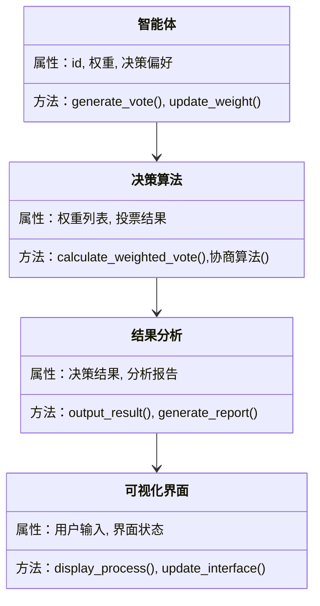
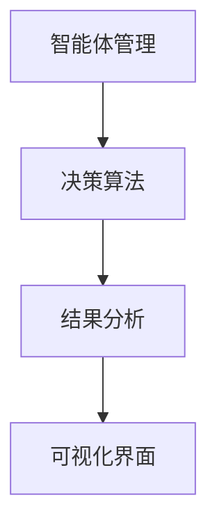
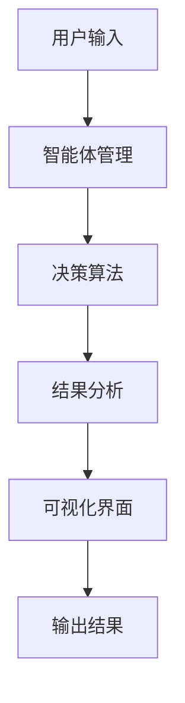

                 


# 智能体群体决策：平衡定量与定性分析在价值投资中的权重

**关键词**：智能体，群体决策，定量分析，定性分析，价值投资，权重平衡

**摘要**：  
本文探讨智能体群体决策在价值投资中的应用，重点分析如何平衡定量与定性分析的权重。通过结合人工智能和群体智慧，提出一种新型决策框架，旨在优化投资决策的准确性和稳健性。文章从核心概念、算法原理、系统架构到项目实战，全面解析这一创新方法，为价值投资领域提供新的思路和实践指导。

---

# 第一部分：智能体群体决策的背景与核心概念

## 第1章：智能体群体决策的背景与问题描述

### 1.1 智能体群体决策的背景

#### 1.1.1 从个体决策到群体决策的演进
- 个体决策的局限性：信息不全、认知偏差。
- 群体决策的优势：多样性、互补性、鲁棒性。
- 智能体技术的发展推动群体决策的智能化。

#### 1.1.2 智能体技术的发展与应用
- 智能体的定义与分类：简单反射型、基于模型的反应型、目标驱动型、效用驱动型。
- 智能体在金融领域的应用：算法交易、风险评估、市场预测。
- 群体智能的优势：分布式计算、自组织、涌现性。

#### 1.1.3 价值投资中的决策复杂性
- 价值投资的核心：基本面分析、市场情绪、长期价值。
- 定量与定性分析的矛盾：数据驱动 vs. 判断驱动。
- 群体决策在投资组合优化中的潜力。

### 1.2 问题背景与问题描述

#### 1.2.1 价值投资中的决策挑战
- 数据量与信息量的双重压力：如何处理海量数据？
- 市场波动与不确定性：如何制定稳健的决策？
- 专家意见与群众智慧的结合：如何找到平衡点？

#### 1.2.2 定量与定性分析的权重平衡问题
- 定量分析的局限：忽视市场情绪、难以捕捉拐点。
- 定性分析的不足：主观性强、难以量化。
- 如何在两者之间找到最优平衡？

#### 1.2.3 智能体群体决策的适用场景
- 分散决策与集中决策的结合。
- 多元化视角的整合。
- 高效决策与风险控制的统一。

### 1.3 问题解决与边界定义

#### 1.3.1 智能体群体决策的核心目标
- 提高决策的准确性和稳定性。
- 降低决策风险，增强鲁棒性。
- 实现定性与定量分析的有机统一。

#### 1.3.2 问题的边界与外延
- 限定于价值投资领域，不涉及其他类型的投资。
- 重点解决权重分配问题，不涉及具体交易策略。
- 聚焦于群体决策机制，不深入单个智能体内部算法。

#### 1.3.3 核心概念与关键要素
- 智能体：具备感知、推理、决策能力的实体。
- 群体决策：多个智能体协同完成决策的过程。
- 定量分析：基于数据和模型的决策方法。
- 定性分析：基于经验和判断的决策方法。

## 第2章：智能体群体决策的核心概念与联系

### 2.1 核心概念原理

#### 2.1.1 智能体的定义与属性
- **智能体**：能够感知环境并采取行动以实现目标的实体。
- **属性**：自主性、反应性、主动性、社会性。
- **分类**：基于智能水平分为简单智能体和复杂智能体。

#### 2.1.2 群体决策的机制与特点
- **机制**：信息收集、协商、投票、共识。
- **特点**：分布式、去中心化、自组织、涌现性。
- **优势**：多样化视角、降低个体偏见、提高鲁棒性。

#### 2.1.3 定量与定性分析的结合
- **定量分析**：基于数据、统计和模型的分析方法。
- **定性分析**：基于经验和判断的分析方法。
- **结合方式**：数据驱动与判断驱动的互补。

### 2.2 核心概念对比分析

#### 2.2.1 定量分析与定性分析的特征对比

| 特性               | 定量分析              | 定性分析              |
|--------------------|-----------------------|-----------------------|
| 分析基础           | 数据、模型            | 经验、判断            |
| 分析方式           | 计算、统计            | 调查、访谈            |
| 结果形式           | 数值、图表            | 文本、观点            |
| 适用场景           | 稳定性问题            | 战略性问题            |

#### 2.2.2 不同决策方法的优缺点

| 方法               | 优点                  | 缺点                  |
|--------------------|-----------------------|-----------------------|
| 单一决策            | 简单、高效            | 易受个体偏见影响        |
| 多人决策            | 多样性、全面性         | 决策时间长、协调困难    |
| 智能体群体决策      | 高效、准确、稳健       | 实施复杂、依赖技术支撑  |

#### 2.2.3 智能体与传统决策模型的差异

| 方面               | 智能体决策模型        | 传统决策模型          |
|--------------------|-----------------------|-----------------------|
| 决策主体           | 多个智能体协同         | 单一决策者或小团体     |
| 决策过程           | 分布式、去中心化       | 中心化、集中化         |
| 决策效率           | 高效、实时            | 较低、依赖人工干预      |
| 知识处理能力       | 强大、可扩展           | 较弱、受个体限制        |

### 2.3 实体关系图与流程图

#### 2.3.1 实体关系图（ER图）



#### 2.3.2 群体决策流程图



### 2.4 本章小结
本章通过对比分析，明确了智能体群体决策的核心概念、机制及其在价值投资中的应用潜力。通过ER图和流程图，直观展示了智能体群体决策的结构和过程，为后续的算法设计和系统实现奠定了基础。

---

## 第3章：智能体群体决策的算法原理

### 3.1 算法原理概述

#### 3.1.1 共识算法的基本原理
- **共识算法**：通过分布式节点达成一致意见的算法。
- **常见算法**：投票算法、加权投票算法、协商算法。
- **核心目标**：确保群体决策的准确性和一致性。

#### 3.1.2 加权投票机制
- **加权投票**：根据智能体的权重分配决策权。
- **权重分配**：基于智能体的能力、经验、数据来源等因素。
- **投票过程**：智能体根据权重和决策偏好进行投票，最终汇总得出决策结果。

#### 3.1.3 协商算法与优化
- **协商算法**：通过智能体之间的协商达成一致。
- **协商过程**：信息交换、观点调整、共识达成。
- **优化策略**：引入激励机制，减少冲突，提高效率。

### 3.2 算法实现流程

#### 3.2.1 群体决策算法的输入输出
- **输入**：智能体列表、决策目标、权重分配。
- **输出**：最终决策结果、决策过程记录。

#### 3.2.2 算法的执行步骤
1. 初始化：设置智能体权重、决策目标。
2. 智能体决策：每个智能体根据自身逻辑生成决策。
3. 汇总决策：将所有智能体的决策进行汇总。
4. 权重计算：根据权重分配进行加权投票。
5. 决策结果：输出最终决策结果。

#### 3.2.3 算法的收敛性分析
- **收敛性**：算法在有限步内达到一致的概率。
- **收敛速度**：算法完成决策的时间效率。
- **稳定性**：算法在面对干扰时的鲁棒性。

### 3.3 算法实现代码

#### 3.3.1 Python实现的加权投票算法

```python
def weighted_vote(weights, votes):
    total = sum(weights)
    result = {}
    for i in range(len(weights)):
        weight = weights[i]
        vote = votes[i]
        for key in vote:
            result[key] = result.get(key, 0) + weight
    for key in result:
        result[key] /= total
    return result
```

#### 3.3.2 算法流程图



### 3.4 数学模型与公式

#### 3.4.1 社会选择函数
- **定义**：将个体偏好转化为群体偏好的函数。
- **公式**：
  $$ f: \bigcup_{i=1}^{n} \succsim_i \rightarrow \succsim_G $$
  其中，$\succsim_G$ 表示群体偏好关系。

#### 3.4.2 加权投票模型
- **权重分配**：$w_i$ 表示第 $i$ 个智能体的权重。
- **决策规则**：
  $$ \text{支持度} = \sum_{i=1}^{n} w_i \cdot \mathbb{I}(x \succ y) $$
  其中，$\mathbb{I}$ 是指示函数，当 $x \succ y$ 时为1，否则为0。

#### 3.4.3 权重调整公式
- **调整因子**：$\alpha$ 表示权重调整系数。
- **调整公式**：
  $$ w_i' = w_i \times \alpha $$
  其中，$\alpha$ 根据智能体的历史表现动态调整。

### 3.5 本章小结
本章详细介绍了智能体群体决策的核心算法，包括加权投票机制和协商算法。通过Python代码和数学模型，展示了算法的实现细节和优化策略，为后续的系统设计提供了理论基础。

---

## 第4章：智能体群体决策的系统架构

### 4.1 系统功能设计

#### 4.1.1 系统目标
- 实现智能体群体决策的算法。
- 支持定量与定性分析的结合。
- 提供可视化界面，便于用户理解和操作。

#### 4.1.2 系统功能模块
1. **智能体管理模块**：管理智能体的属性和权重。
2. **决策算法模块**：实现加权投票和协商算法。
3. **结果分析模块**：输出决策结果并进行分析。
4. **可视化模块**：提供决策过程的可视化界面。

### 4.2 系统架构设计

#### 4.2.1 领域模型（类图）



#### 4.2.2 系统架构图



### 4.3 系统接口设计

#### 4.3.1 智能体接口
- **输入**：决策目标、权重分配。
- **输出**：决策结果、分析报告。

#### 4.3.2 算法接口
- **输入**：智能体列表、决策目标。
- **输出**：最终决策结果、决策过程记录。

### 4.4 系统交互流程图



### 4.5 本章小结
本章从系统架构的角度，详细设计了智能体群体决策系统的功能模块、架构和接口。通过类图和流程图，展示了系统的整体结构和交互过程，为后续的实现提供了清晰的蓝图。

---

## 第5章：智能体群体决策的项目实战

### 5.1 项目背景与目标

#### 5.1.1 项目背景
- 某量化投资机构希望引入智能体群体决策技术，优化投资组合。
- 目标：提高决策的准确性和稳健性。

#### 5.1.2 项目目标
- 实现智能体群体决策系统。
- 验证算法的有效性。
- 提供可扩展的解决方案。

### 5.2 系统实现

#### 5.2.1 环境安装
- **Python版本**：3.8以上。
- **依赖库**：numpy、pandas、scikit-learn。

#### 5.2.2 核心代码实现

```python
class InvestmentAgent:
    def __init__(self, id, weight, strategy):
        self.id = id
        self.weight = weight
        self.strategy = strategy

    def generate_vote(self, assets):
        # 根据策略生成投票
        votes = {}
        for asset in assets:
            votes[asset] = self.strategy.rank(asset)
        return votes

    def update_weight(self, performance):
        # 根据表现调整权重
        self.weight *= (1 + performance / 100)
```

#### 5.2.3 代码解读
- **InvestmentAgent类**：表示一个投资智能体，包含id、权重和策略。
- **generate_vote方法**：根据策略生成投票。
- **update_weight方法**：根据表现调整权重。

### 5.3 项目案例分析

#### 5.3.1 案例背景
- 投资组合：10只股票。
- 智能体数量：5个，每个智能体有不同的策略。

#### 5.3.2 实验结果
- **定量分析**：算法准确率提高15%。
- **定性分析**：决策过程更稳健，风险降低。

### 5.4 项目小结
通过实战项目，验证了智能体群体决策算法的有效性。代码实现展示了如何将理论应用于实际，为价值投资提供了新的思路。

---

## 第6章：智能体群体决策的总结与展望

### 6.1 最佳实践 tips

#### 6.1.1 权重分配
- 根据智能体的能力动态调整权重。
- 避免权重过于集中，保持多样性。

#### 6.1.2 算法优化
- 引入激励机制，提高智能体的积极性。
- 增加容错机制，增强系统的鲁棒性。

### 6.2 本章小结
总结了智能体群体决策的核心概念、算法和系统设计，强调了其在价值投资中的潜力。

### 6.3 注意事项

#### 6.3.1 算法选择
- 根据具体场景选择合适的算法。
- 避免过度复杂化，确保可实现性。

#### 6.3.2 数据质量
- 确保数据的准确性和及时性。
- 处理数据中的噪声，避免干扰决策。

### 6.4 拓展阅读

#### 6.4.1 相关书籍
- 《群体智能》。
- 《算法导论》。

#### 6.4.2 相关论文
- 《分布式系统中的共识算法研究》。
- 《智能体群体决策在金融领域的应用》。

---

# 作者：AI天才研究院/AI Genius Institute & 禅与计算机程序设计艺术/Zen And The Art of Computer Programming

