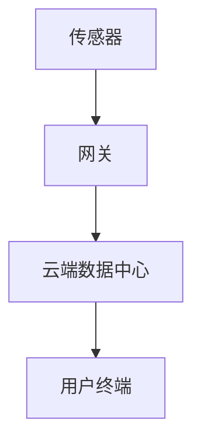
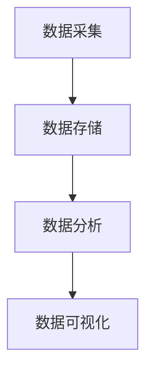
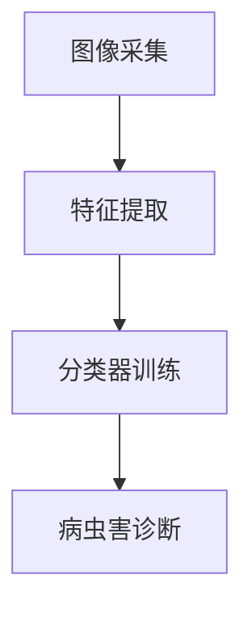

                 

<think>
嗯，我现在要写一篇关于《智能农业技术的进步与农业现代化投资》的技术博客文章。首先，我需要明确文章的结构和各个部分的内容，确保逻辑清晰、内容详实。

文章的标题已经确定，接下来是关键词部分。智能农业涉及物联网、大数据、人工智能等技术，农业现代化则涉及投资、模式分析和风险评估。所以我列出的关键词包括：智能农业、农业现代化、物联网、大数据、人工智能、投资模式、风险评估。

摘要部分需要简洁明了地概括文章的核心内容，说明智能农业技术如何提升农业生产效率，以及农业现代化投资的重要性，为读者提供整体框架。

接下来是目录大纲，分成五个章节。每个章节都有背景介绍、技术分析、投资策略、经济影响和结合部分。我需要确保每个部分都详细讲解，包括核心概念、技术原理、算法流程、系统架构等。

在正文部分，每个章节都要有详细的讲解。比如，在智能农业的核心技术部分，我需要解释物联网、大数据和人工智能如何具体应用到农业中，可能涉及到传感器、数据采集和机器学习算法。同时，用图表展示系统架构和算法流程。

投资策略部分，我需要分析不同的投资模式，如政府投资、企业投资和社会资本合作，还要进行案例分析，展示实际的成功经验。这里可能需要引用一些具体的案例数据，帮助读者更好地理解。

经济影响部分，要说明智能农业如何提高生产效率、增加农民收入以及推动农村经济发展。可能需要引用一些统计数据，如生产成本降低的百分比，或者农民收入增长的具体数值。

最后，在智能农业与投资结合部分，需要详细分析技术如何驱动投资，以及技术应用对投资收益的影响。这部分可能需要一些数学模型，比如收益与技术投入的关系，或者风险评估的数学公式。

整体来看，我需要确保文章结构清晰，每个部分都有足够的细节和实例支持，同时语言要专业但易懂，适合技术读者阅读。此外，结尾部分要总结全文，并给出最佳实践建议和未来展望，帮助读者更好地理解和应用这些技术。

现在，我需要按照这个思路逐步展开每个部分，确保每个章节都涵盖所有必要的内容，同时保持整体的连贯性和逻辑性。
</think>

# 智能农业技术的进步与农业现代化投资

> 关键词：智能农业，农业现代化，物联网，大数据，人工智能，投资模式，风险评估

> 摘要：智能农业技术的进步正在 revolutionize 农业生产方式，而农业现代化投资则为这些技术的落地提供了资金支持。本文从智能农业的核心技术、农业现代化的投资策略、技术与投资的结合等方面展开分析，探讨智能农业技术如何推动农业现代化进程，并为投资者提供科学的投资决策参考。

---

# 第1章: 智能农业与农业现代化的背景

## 1.1 智能农业的定义与核心概念

### 1.1.1 什么是智能农业
智能农业是通过物联网、大数据和人工智能等技术，实现农业生产、管理和服务的智能化。它强调数据驱动的决策和自动化操作，以提高生产效率、降低成本并优化资源利用。

### 1.1.2 智能农业的核心技术特征
- **物联网（IoT）**：通过传感器和网络连接设备，实时采集农业数据。
- **大数据（Big Data）**：处理和分析海量农业数据，提供决策支持。
- **人工智能（AI）**：利用机器学习算法优化农业生产过程。
- **自动化**：实现无人化或少人化操作，减少人工干预。

### 1.1.3 农业现代化的内涵与外延
农业现代化不仅仅是技术的应用，还包括生产方式、管理模式和组织形式的变革。它旨在通过技术创新和制度创新，推动农业向高效、可持续的方向发展。

---

## 1.2 智能农业与传统农业的对比

### 1.2.1 传统农业的局限性
- 依赖人工劳动，效率低下。
- 农业数据分散，难以进行科学决策。
- 资源浪费严重，如水、肥料的过度使用。

### 1.2.2 智能农业的优势与创新
- 提高生产效率，降低成本。
- 实现精准农业，减少资源浪费。
- 通过数据分析优化农业生产过程。

### 1.2.3 两者在技术、模式和效率上的差异
| 特性       | 传统农业                          | 智能农业                          |
|------------|-----------------------------------|------------------------------------|
| 技术水平    | 低，依赖人工操作                  | 高，应用物联网、大数据、AI        |
| 操作模式    | 人工为主，自动化程度低            | 自动化为主，人工辅助                |
| 生产效率    | 低，资源利用效率低                | 高，资源利用效率高                |

---

## 1.3 农业现代化投资的背景与意义

### 1.3.1 农业现代化的必要性
随着人口增长和资源有限性，传统农业难以满足未来的需求。通过现代化技术提升农业生产力，是实现粮食安全的重要途径。

### 1.3.2 投资在农业现代化中的作用
资金是推动农业技术创新和基础设施建设的关键。通过投资，可以引入先进的技术和管理模式，提升农业整体竞争力。

### 1.3.3 农业现代化与可持续发展的关系
农业现代化不仅是提高生产效率，更是实现资源可持续利用和环境保护的重要手段。智能农业技术的应用有助于减少对环境的负面影响。

---

## 1.4 本章小结
智能农业通过技术创新改变了传统农业的生产模式，而农业现代化投资为这些技术的推广提供了资金支持。两者结合，不仅提高了农业生产效率，也为农业可持续发展提供了保障。

---

# 第2章: 智能农业技术的核心要素

## 2.1 物联网技术在农业中的应用

### 2.1.1 农业物联网的定义与组成
物联网系统由传感器、通信网络和数据处理中心组成，用于实时监测和管理农业生产环境。

### 2.1.2 常见的农业物联网系统架构

### 2.1.3 物联网在农业中的具体应用场景
- **环境监测**：监测温湿度、光照强度等环境参数。
- **精准灌溉**：根据土壤湿度自动调整灌溉量。
- **病虫害监测**：通过图像识别技术检测作物病虫害。

---

## 2.2 大数据技术在农业中的应用

### 2.2.1 农业大数据的定义与特征
农业大数据是指在农业生产过程中产生的海量数据，具有多样性、实时性和关联性。

### 2.2.2 数据采集、存储与分析的流程

### 2.2.3 大数据在农业预测与决策中的作用
- **预测作物产量**：通过历史数据和气候数据预测未来产量。
- **优化种植计划**：根据市场需求调整种植结构。

---

## 2.3 人工智能技术在农业中的应用

### 2.3.1 人工智能在农业中的主要应用领域
- **作物识别**：通过图像识别技术识别不同作物。
- **病虫害诊断**：利用深度学习模型诊断作物病害。

### 2.3.2 机器学习在作物生长监测中的应用

### 2.3.3 自然语言处理在农业信息提取中的应用
通过NLP技术分析农业相关的文本数据，提取有价值的信息。

---

## 2.4 本章小结
物联网、大数据和人工智能技术共同构成了智能农业的核心技术体系，它们在农业生产、管理和决策中的应用极大地提升了农业的生产效率和管理水平。

---

# 第3章: 农业现代化投资的模式与策略

## 3.1 农业现代化投资的主要模式

### 3.1.1 政府投资模式
政府通过财政拨款或补贴支持农业现代化项目，如建设农业物联网基础设施。

### 3.1.2 企业投资模式
企业直接投资于农业现代化项目，如智能灌溉系统或农业大数据平台。

### 3.1.3 社会资本合作模式
政府与社会资本合作，共同投资农业现代化项目，分担风险，共享收益。

---

## 3.2 投资策略的制定与实施

### 3.2.1 投资前的市场调研与风险评估
- **市场调研**：了解市场需求和技术可行性。
- **风险评估**：分析技术风险、市场风险和政策风险。

### 3.2.2 投资项目的可行性分析
- **技术可行性**：评估技术的成熟度和可推广性。
- **经济可行性**：分析投资回报周期和收益率。

### 3.2.3 投资后的运营管理与效益分析
- **运营管理**：建立专业的运营团队，确保项目顺利实施。
- **效益分析**：定期评估项目的经济效益和社会效益。

---

## 3.3 投资案例分析

### 3.3.1 国内农业现代化投资的成功案例
- **案例1**：某企业投资建设智能灌溉系统，显著提高了水资源利用效率。
- **案例2**：政府与企业合作建设农业大数据平台，提升了农业生产决策效率。

### 3.3.2 国际农业现代化投资的经验借鉴
- **以色列**：通过滴灌技术和智能传感器实现高效农业。
- **美国**：广泛应用无人机和卫星遥感技术监测作物生长。

---

## 3.4 本章小结
农业现代化投资需要结合实际情况选择合适的模式和策略，通过科学的规划和管理，确保投资项目的顺利实施和效益最大化。

---

# 第4章: 智能农业技术的经济与社会影响

## 4.1 智能农业对农业生产效率的提升

### 4.1.1 生产成本的降低
通过自动化和精准管理，减少人工成本和资源浪费。

### 4.1.2 生产效率的提高
智能农业技术的应用显著提高了作物产量和质量。

### 4.1.3 资源利用效率的优化
通过精准农业技术，优化水肥使用，减少资源浪费。

---

## 4.2 智能农业对农民收入的影响

### 4.2.1 农民收入的增加途径
- **技术转让**：农民可以将技术转让给其他农户。
- **参与分红**：农民可以通过入股方式分享投资收益。

### 4.2.2 农民技能提升的需求
智能农业技术的应用要求农民具备一定的技术素养，需要加强技能培训。

---

## 4.3 农业现代化对农村经济发展的推动

### 4.3.1 农村产业升级的促进
通过农业现代化，推动农村产业升级，增加附加值。

### 4.3.2 农村就业结构的变化
智能农业技术的应用可能减少部分传统农业岗位，但会创造新的技术岗位。

### 4.3.3 农村基础设施建设的改善
农业现代化投资往往伴随着基础设施的改善，如互联网和交通条件的提升。

---

## 4.4 本章小结
智能农业技术的应用不仅提升了农业生产效率，还促进了农村经济发展，增加了农民收入，对社会和经济的影响力显著。

---

# 第5章: 智能农业技术与农业现代化投资的结合

## 5.1 技术驱动投资的模式分析

### 5.1.1 技术创新对投资的推动作用
技术创新降低了农业生产的成本，提高了效率，吸引了更多的投资。

### 5.1.2 技术应用对投资收益的影响
技术的应用可以提升农产品的附加值，增加投资收益。

---

## 5.2 投资对技术创新的推动作用

### 5.2.1 投资推动技术研发
资金支持是技术研发的重要保障，投资可以促进智能农业技术的创新。

### 5.2.2 投资促进技术产业化
通过投资，智能农业技术可以更快地实现产业化应用。

---

## 5.3 技术与投资的协同发展

### 5.3.1 技术创新与投资回报的关系
技术创新是投资回报的重要来源，投资是技术创新的重要推动力。

### 5.3.2 技术与投资的协同发展策略
- **加强技术研发**：通过投资支持技术研发，提升技术竞争力。
- **优化投资环境**：通过政策支持和基础设施建设，吸引更多的投资。

---

## 5.4 本章小结
智能农业技术与农业现代化投资相互促进，协同发展。技术的进步为投资提供了新的机遇，而投资则为技术的推广和应用提供了资金支持。

---

# 第6章: 结论与展望

## 6.1 本文总结
智能农业技术的进步正在 revolutionize 农业生产方式，而农业现代化投资为这些技术的落地提供了资金支持。通过技术创新和投资驱动，农业现代化进程不断加速。

## 6.2 未来展望
未来，随着技术的不断进步和投资的持续增加，智能农业将更加普及，农业现代化将向更高层次发展。人工智能、大数据和物联网技术将在农业中发挥更大的作用，为农业的可持续发展提供更强有力的支持。

---

# 作者：AI天才研究院/AI Genius Institute & 禅与计算机程序设计艺术 /Zen And The Art of Computer Programming

---

**本文是对智能农业技术与农业现代化投资的系统分析，通过技术与经济的双重视角，探讨了智能农业技术的进步及其对农业现代化投资的影响。希望本文能为读者提供有价值的信息和启发。**

