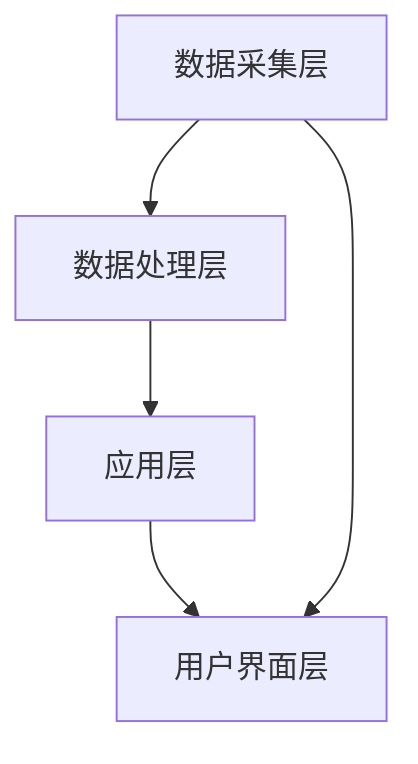
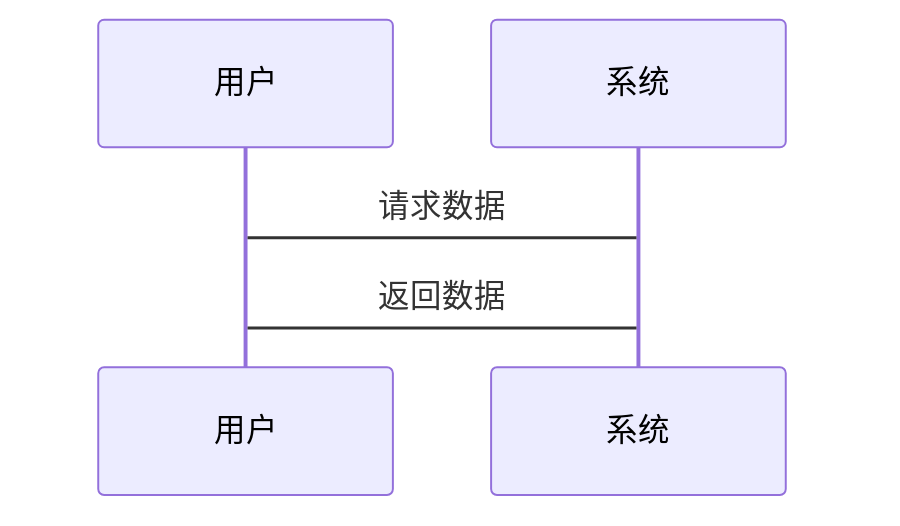

                 


# 第一部分: 智能制造趋势下的产业链投资背景

## 第1章: 智能制造的背景与概念

### 1.1 智能制造的定义与内涵
#### 1.1.1 制造业的数字化与智能化转型
- 数字化转型是指将传统制造业中的物理设备和流程通过数字技术进行改造，实现数据的采集、分析和应用。
- 智能化转型是在数字化的基础上，进一步引入人工智能、机器学习等技术，使制造系统能够自主决策和优化。

#### 1.1.2 智能制造的核心概念与特征
- **核心概念**：智能制造以数据驱动为基础，通过物联网、工业互联网、人工智能等技术实现生产过程的智能化。
- **特征**：自动化、数据化、智能化、网络化。

#### 1.1.3 智能制造与传统制造的对比分析
- **传统制造**：依赖人工操作，生产效率低，质量不稳定。
- **智能制造**：通过自动化设备和智能系统提高生产效率和产品质量，降低成本。

### 1.2 智能制造的技术演进
#### 1.2.1 从自动化到智能化的演进过程
- **自动化阶段**：引入机械臂和自动化设备，减少人工干预。
- **数据化阶段**：通过传感器和物联网技术采集生产数据。
- **智能化阶段**：利用人工智能和大数据分析优化生产过程。

#### 1.2.2 数字化转型对制造业的影响
- 提高生产效率，降低成本。
- 提高产品质量，增强竞争力。
- 支持快速响应市场变化。

#### 1.2.3 工业4.0与智能制造的关系
- 工业4.0是智能制造的一种实现方式，强调智能化生产、数据交换和网络化制造。

## 第2章: 智能制造的核心技术与应用

### 2.1 工业互联网与物联网
#### 2.1.1 工业互联网的概念与架构
- **工业互联网**：通过互联网连接工业设备，实现数据的实时传输和分析。
- **架构**：包括边缘层、网络层、平台层和应用层。

#### 2.1.2 物联网在制造业中的应用
- **设备监控**：通过物联网技术实时监控设备运行状态。
- **预测性维护**：基于历史数据预测设备故障，提前进行维护。

#### 2.1.3 工业大数据的采集与分析
- **数据采集**：通过传感器和物联网设备采集生产数据。
- **数据分析**：利用大数据技术分析数据，提取有价值的信息。

### 2.2 人工智能与机器学习
#### 2.2.1 人工智能在智能制造中的应用领域
- **质量检测**：利用计算机视觉技术进行产品质量检测。
- **生产优化**：通过机器学习算法优化生产流程。

#### 2.2.2 机器学习算法在生产优化中的作用
- **预测性维护**：利用机器学习预测设备故障，减少停机时间。
- **生产调度优化**：通过算法优化生产计划，提高效率。

#### 2.2.3 智能预测性维护的实现原理
- **数据采集**：通过传感器采集设备运行数据。
- **数据分析**：利用机器学习算法分析数据，预测设备故障。
- **维护决策**：根据预测结果安排维护计划。

### 2.3 5G与边缘计算
#### 2.3.1 5G技术对智能制造的支持
- **高速数据传输**：5G的高速传输能力支持大量数据的实时传输。
- **低延迟**：5G的低延迟特性适用于实时控制场景。

#### 2.3.2 边缘计算在实时数据处理中的应用
- **边缘计算**：将计算能力部署在靠近数据源的边缘设备，减少数据传输延迟。
- **实时分析**：在边缘设备上实时分析数据，快速做出决策。

#### 2.3.3 5G与边缘计算的协同效应
- **数据协同**：5G提供高速数据传输，边缘计算提供实时分析，两者结合实现高效的数据处理。

## 第3章: 智能制造产业链的投资分析框架

### 3.1 产业链的细分领域
#### 3.1.1 装备制造与自动化
- **装备制造业**：生产自动化设备和机器人，是智能制造的核心部分。
- **自动化技术**：包括机器人、自动化控制系统等。

#### 3.1.2 工业软件与工业互联网平台
- **工业软件**：包括CAD、CAM、MES等软件，用于生产过程的管理和优化。
- **工业互联网平台**：提供数据采集、分析和应用的平台，支持企业的数字化转型。

#### 3.1.3 智能传感器与工业机器人
- **智能传感器**：用于采集生产过程中的各种数据。
- **工业机器人**：用于自动化生产，提高生产效率。

### 3.2 各细分领域的投资机会
#### 3.2.1 上游：核心技术与关键设备
- **核心技术**：包括人工智能、大数据、5G等技术。
- **关键设备**：包括传感器、工业机器人、自动化设备等。

#### 3.2.2 中游：系统集成与解决方案
- **系统集成**：将各种技术整合到一个系统中，提供完整的解决方案。
- **解决方案**：包括智能制造系统设计、实施和优化。

#### 3.2.3 下游：行业应用与服务
- **行业应用**：智能制造技术在不同行业的应用，如汽车、电子、制药等。
- **服务**：包括技术支持、维护服务、培训等。

### 3.3 投资策略与风险分析
#### 3.3.1 投资策略的制定原则
- **技术驱动**：投资具有技术优势的企业。
- **市场需求**：关注市场需求大的行业。
- **竞争格局**：分析行业竞争格局，选择有竞争优势的企业。

#### 3.3.2 风险分析与风险管理
- **技术风险**：技术更新快，需要持续创新。
- **市场需求风险**：市场需求变化可能影响投资回报。
- **政策风险**：政策变化可能影响行业发展。

#### 3.3.3 投资回报周期与退出机制
- **回报周期**：智能制造行业的回报周期较长，通常需要5-10年。
- **退出机制**：可以通过并购、上市等方式退出，获得投资回报。

# 第二部分: 智能制造产业链的核心技术与投资机会

## 第4章: 工业大数据与人工智能算法

### 4.1 工业大数据的分析框架
#### 4.1.1 数据采集与预处理
- **数据采集**：通过传感器和物联网设备采集生产数据。
- **数据预处理**：清洗数据，去除噪声，提取有用信息。

#### 4.1.2 数据分析与挖掘
- **数据分析**：利用大数据技术分析数据，提取有价值的信息。
- **数据挖掘**：通过数据挖掘技术发现数据中的模式和规律。

#### 4.1.3 数据可视化与决策支持
- **数据可视化**：通过图表等形式直观展示数据。
- **决策支持**：基于数据分析结果，提供决策支持。

### 4.2 人工智能算法在智能制造中的应用
#### 4.2.1 预测性维护的算法实现
- **算法选择**：使用机器学习算法，如随机森林、支持向量机等。
- **数据特征提取**：提取设备运行数据中的特征，用于故障预测。
- **模型训练**：利用历史数据训练模型，提高预测准确性。

#### 4.2.2 生产优化的算法实现
- **算法选择**：使用强化学习算法，如Q-learning。
- **生产调度优化**：通过算法优化生产计划，提高效率。
- **资源分配优化**：合理分配资源，降低成本。

#### 4.2.3 人工智能算法的数学模型和公式
- **随机森林算法**：基于决策树的集成算法，用于分类和回归。
- **支持向量机（SVM）**：用于分类和回归的监督学习算法。
- **强化学习算法**：通过试错方式优化决策过程。

### 4.3 算法实现的Python代码示例
#### 预测性维护的Python代码示例
```python
import pandas as pd
from sklearn.ensemble import RandomForestClassifier
from sklearn.metrics import accuracy_score

# 数据加载
data = pd.read_csv('machine_failure.csv')

# 特征选择
features = data[['feature1', 'feature2', 'feature3']]
target = data['target']

# 数据分割
train_features = features[:-10]
train_target = target[:-10]
test_features = features[-10:]
test_target = target[-10:]

# 模型训练
model = RandomForestClassifier()
model.fit(train_features, train_target)

# 预测
predictions = model.predict(test_features)

# 准确率计算
accuracy = accuracy_score(test_target, predictions)
print(f'预测准确率：{accuracy}')
```

#### 生产优化的Python代码示例
```python
import numpy as np
from sklearn.model_selection import GridSearchCV
from sklearn.neighbors import KNeighborsClassifier

# 数据加载
data = pd.read_csv('production.csv')

# 特征选择
features = data[['feature1', 'feature2', 'feature3']]
target = data['target']

# 参数优化
param_grid = {'n_neighbors': [3,5,7]}
grid_search = GridSearchCV(KNeighborsClassifier(), param_grid)
grid_search.fit(features, target)

# 最佳模型
best_model = grid_search.best_estimator_
print(f'最佳参数：{grid_search.best_params_}')

# 预测
predictions = best_model.predict(features)
print(f'预测结果：{predictions}')
```

## 第5章: 智能制造系统的架构设计与实现

### 5.1 系统架构设计
#### 5.1.1 系统架构的分层设计
- **数据采集层**：负责数据的采集和传输。
- **数据处理层**：对数据进行预处理和分析。
- **应用层**：提供各种应用功能，如预测性维护、生产优化等。
- **用户界面层**：提供友好的用户界面，方便用户操作。

#### 5.1.2 系统架构的模块划分
- **数据采集模块**：负责采集设备数据。
- **数据处理模块**：对数据进行处理和分析。
- **应用模块**：提供各种应用功能。
- **用户界面模块**：提供用户交互界面。

### 5.2 系统功能设计
#### 5.2.1 系统功能模块的设计
- **数据监控模块**：实时监控设备运行状态。
- **预测性维护模块**：预测设备故障，安排维护计划。
- **生产优化模块**：优化生产流程，提高效率。
- **数据可视化模块**：以图表形式展示数据。

#### 5.2.2 系统功能的实现
- **数据监控**：通过物联网设备实时监控设备运行状态。
- **预测性维护**：基于机器学习算法预测设备故障。
- **生产优化**：通过优化算法优化生产流程。
- **数据可视化**：使用图表展示数据，方便用户理解和分析。

### 5.3 系统架构的Mermaid图


### 5.4 系统接口设计
#### 5.4.1 系统接口的设计
- **数据接口**：与物联网设备对接，获取数据。
- **API接口**：提供RESTful API，方便其他系统调用。

#### 5.4.2 系统交互的序列图


## 第6章: 项目实战与案例分析

### 6.1 项目实战
#### 6.1.1 环境安装与配置
- **环境配置**：安装Python、Jupyter Notebook、TensorFlow等工具。
- **数据准备**：收集和整理生产数据，建立数据集。

#### 6.1.2 核心代码实现
- **数据预处理**：清洗数据，提取特征。
- **模型训练**：选择算法，训练模型。
- **模型部署**：将模型部署到生产环境中，实时监控设备状态。

### 6.2 案例分析
#### 6.2.1 智能工厂的优化
- **项目背景**：某汽车制造厂希望通过智能制造技术优化生产流程。
- **实施过程**：引入工业互联网平台，部署预测性维护系统，优化生产调度。
- **效果评估**：生产效率提高15%，成本降低10%。

#### 6.2.2 数据分析与优化
- **数据分析**：通过对生产数据的分析，发现设备故障率较高的设备。
- **优化建议**：针对高故障率设备进行维护，减少停机时间。

## 第7章: 总结与展望

### 7.1 总结
#### 7.1.1 核心内容回顾
- 智能制造的核心技术包括工业互联网、物联网、人工智能等。
- 产业链的细分领域包括装备制造、工业软件、智能传感器等。
- 投资机会存在于上游核心技术、中游系统集成和下游行业应用。

#### 7.1.2 投资策略与风险分析
- 投资策略：关注技术驱动、市场需求大的企业。
- 风险分析：技术风险、市场需求风险、政策风险。

### 7.2 展望
#### 7.2.1 智能制造的未来发展趋势
- 更高的自动化和智能化。
- 更广泛的应用领域。
- 更强的行业协同效应。

#### 7.2.2 产业链投资的未来机会
- 新兴技术如AI、5G的应用。
- 行业应用的拓展。
- 全球化布局。

### 7.3 最佳实践与注意事项
#### 7.3.1 最佳实践
- 技术驱动：投资具有技术优势的企业。
- 市场需求：关注市场需求大的行业。
- 行业协同：加强产业链上下游的协同合作。

#### 7.3.2 注意事项
- 技术风险：技术更新快，需要持续创新。
- 市场需求变化：需要灵活调整投资策略。
- 政策风险：关注政策变化，合理规避风险。

### 7.4 拓展阅读与学习资源
#### 7.4.1 推荐书籍
- 《工业4.0： Industrie 4.0》
- 《智能制造：数字化转型之路》
- 《人工智能在制造业中的应用》

#### 7.4.2 在线资源
- 工业4.0官方文档
- 智能制造联盟网站
- 人工智能技术博客

### 7.5 小结
智能制造是一个复杂的系统工程，涉及多个技术领域和产业链环节。投资者需要全面了解智能制造的核心技术、产业链结构和投资机会，制定合理的投资策略，规避风险，抓住未来的投资机会。

## 作者：AI天才研究院/AI Genius Institute & 禅与计算机程序设计艺术 /Zen And The Art of Computer Programming

