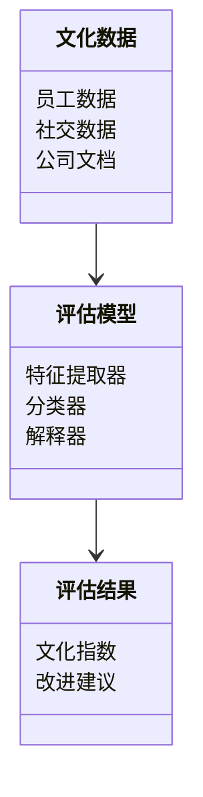
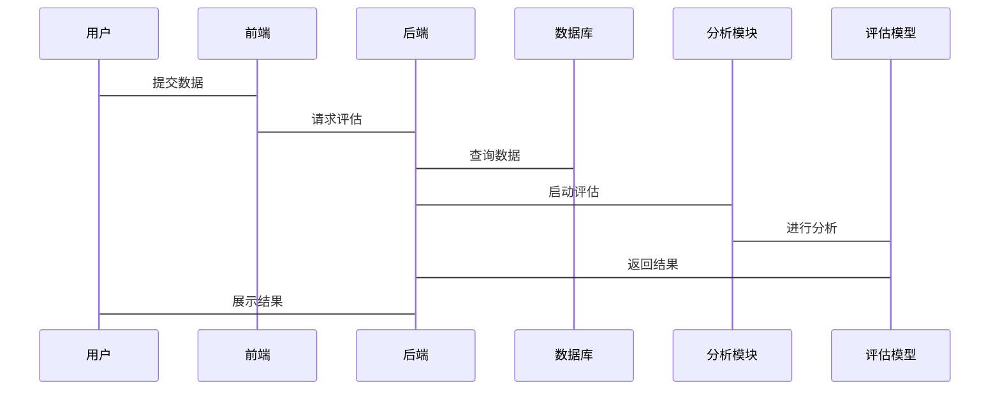

                 

<think>
好的，我需要帮助用户撰写一篇技术博客文章，标题是《智能系统辅助公司文化影响评估》。用户已经提供了一个详细的目录大纲，但用户现在需要的是完整的文章内容，符合他们的格式要求。用户还提到，文章需要包含背景介绍、核心概念、算法原理、数学模型、系统架构、项目实战和最佳实践等部分，并且使用markdown格式，每个部分都要详细展开。

首先，我需要理解用户的需求。用户希望文章结构清晰，逻辑严密，内容专业，同时语言要简洁明了。用户希望文章能够帮助读者系统地了解如何利用智能系统来评估公司文化的影响。用户还特别提到，每个章节都需要包含详细的子部分，比如背景介绍、核心概念、算法原理等，并且每个部分都要有实际的例子和图表来辅助说明。

接下来，我需要按照用户提供的目录结构，逐步展开每个章节的内容。首先，文章开头要有标题、关键词和摘要。然后是目录部分，每个章节都要有详细的三级子章节。例如，第一章包括问题背景、定义、现状、重要性、方法论和边界。第二章则包括概念原理、特征对比、ER图、流程图等。

在撰写过程中，我需要确保每个部分都符合用户的要求。比如，在算法原理部分，我需要使用mermaid流程图来解释算法的流程，并附上Python代码示例，同时给出数学模型和公式。在系统架构部分，需要绘制类图、架构图和序列图，帮助读者理解系统的结构和交互过程。

我还需要注意文章的总字数要求，控制在10000到12000字之间。这意味着每个章节的内容需要足够详细，但又不能过于冗长。同时，用户希望文章末尾有作者信息，格式为“作者：AI天才研究院 & 禅与计算机程序设计艺术”。

在写作过程中，我需要确保语言专业且易于理解，避免使用过于复杂的术语，同时提供足够的解释和例子，帮助读者理解。对于每个部分，我需要先列出关键点，再逐步展开，确保逻辑连贯，层次分明。

最后，我需要检查文章是否符合所有要求，包括格式、内容、字数等。确保每个部分都涵盖用户提到的核心内容，没有遗漏。同时，注意文章的流畅性和可读性，使读者能够轻松跟随思路，理解智能系统在公司文化影响评估中的应用。

总的来说，我需要系统地按照用户提供的目录结构，逐一展开每个部分的内容，确保每个章节都详细且符合格式要求，最终完成一篇高质量的技术博客文章。
</think>

# 智能系统辅助公司文化影响评估

> 关键词：智能系统，公司文化，影响评估，自然语言处理，机器学习，数据分析

> 摘要：随着企业对文化管理的重视程度不断提高，如何利用智能系统来量化和评估公司文化的影响成为一个重要课题。本文从公司文化影响评估的背景出发，系统地分析了智能系统在这一领域中的应用。通过介绍核心概念、算法原理、系统架构和实际案例，本文为读者提供了一个全面的视角，展示了如何利用智能系统来优化公司文化管理。文章最后总结了最佳实践和未来研究方向，为企业的文化评估提供了新的思路。

---

# 目录

1. [智能系统辅助公司文化影响评估的背景与核心概念](#智能系统辅助公司文化影响评估的背景与核心概念)
2. [智能系统辅助公司文化影响评估的核心概念与联系](#智能系统辅助公司文化影响评估的核心概念与联系)
3. [智能系统辅助公司文化影响评估的算法原理](#智能系统辅助公司文化影响评估的算法原理)
4. [智能系统辅助公司文化影响评估的系统分析与架构设计](#智能系统辅助公司文化影响评估的系统分析与架构设计)
5. [智能系统辅助公司文化影响评估的项目实战](#智能系统辅助公司文化影响评估的项目实战)
6. [智能系统辅助公司文化影响评估的最佳实践与总结](#智能系统辅助公司文化影响评估的最佳实践与总结)

---

## 1. 智能系统辅助公司文化影响评估的背景与核心概念

### 1.1 公司文化影响评估的背景

公司文化是企业的灵魂，它影响着员工的行为、决策以及企业的长期发展。然而，如何量化和评估公司文化的影响力，一直是企业管理中的难题。传统的文化评估方法通常依赖于主观的问卷调查或专家访谈，这种方式不仅耗时，而且难以捕捉到文化影响的动态变化。

随着人工智能和大数据技术的快速发展，智能系统为公司文化影响评估提供了新的可能性。通过分析员工行为数据、社交媒体数据以及企业内部文档，智能系统可以提取出文化影响的关键指标，并为企业提供数据驱动的决策支持。

### 1.2 公司文化影响评估的核心概念

#### 1.2.1 数据驱动的公司文化分析

数据驱动的分析方法通过收集和处理大量数据，提取出与公司文化相关的特征。例如，员工的沟通模式、团队协作效率以及对公司价值观的认同程度都可以通过数据进行量化。

#### 1.2.2 自然语言处理在文化评估中的应用

自然语言处理（NLP）技术可以帮助我们从文本数据中提取情感、主题和语义信息。例如，通过分析员工的反馈、社交媒体评论以及公司政策文档，我们可以识别出公司文化的核心特征。

#### 1.2.3 机器学习在文化影响预测中的作用

机器学习模型可以基于历史数据，预测公司文化对公司绩效的影响。例如，通过训练一个回归模型，我们可以预测公司文化与员工满意度、创新能力和客户满意度之间的关系。

### 1.3 公司文化影响评估的数学模型与方法

#### 1.3.1 传统评估方法的局限性

传统的文化评估方法通常依赖于主观判断，结果缺乏客观性和可量化性。例如，问卷调查的结果可能受到员工主观情绪的影响，难以准确反映公司文化的实际影响。

#### 1.3.2 数据驱动的评估方法

数据驱动的方法通过收集和分析大量数据，构建出公司文化的量化指标。例如，可以通过分析员工的离职率、绩效数据和团队协作效率，评估公司文化的凝聚力和激励效果。

#### 1.3.3 智能系统评估的核心算法

智能系统的评估算法通常包括以下步骤：
1. 数据预处理：清洗和标注数据。
2. 特征提取：提取与公司文化相关的特征。
3. 模型训练：训练分类或回归模型。
4. 结果分析：解释模型输出并提出改进建议。

### 1.4 本章小结

本章从公司文化影响评估的背景出发，介绍了智能系统在这一领域中的核心概念。通过分析数据驱动的评估方法、自然语言处理和机器学习的应用，我们为后续章节的分析奠定了基础。

---

## 2. 智能系统辅助公司文化影响评估的核心概念与联系

### 2.1 智能系统辅助评估的核心概念

#### 2.1.1 数据驱动的公司文化分析

数据驱动的分析方法通过收集和处理大量数据，提取出与公司文化相关的特征。例如，员工的沟通模式、团队协作效率以及对公司价值观的认同程度都可以通过数据进行量化。

#### 2.1.2 自然语言处理在文化评估中的应用

自然语言处理（NLP）技术可以帮助我们从文本数据中提取情感、主题和语义信息。例如，通过分析员工的反馈、社交媒体评论以及公司政策文档，我们可以识别出公司文化的核心特征。

#### 2.1.3 机器学习在文化影响预测中的作用

机器学习模型可以基于历史数据，预测公司文化对公司绩效的影响。例如，通过训练一个回归模型，我们可以预测公司文化与员工满意度、创新能力和客户满意度之间的关系。

### 2.2 核心概念的原理与特征对比

#### 2.2.1 数据驱动分析的原理

数据驱动分析通过收集和处理大量数据，提取出与公司文化相关的特征。其核心原理是通过统计分析和机器学习算法，将数据转化为可量化的指标。

#### 2.2.2 自然语言处理的特征

自然语言处理技术可以帮助我们从文本数据中提取情感、主题和语义信息。其主要特征包括：
- 高效性：能够快速处理大量文本数据。
- 精准性：能够准确识别文本中的关键信息。
- 可扩展性：可以应用于多种语言和场景。

#### 2.2.3 机器学习模型的特征

机器学习模型可以基于历史数据，预测公司文化对公司绩效的影响。其主要特征包括：
- 数据驱动：依赖大量数据进行训练。
- 可解释性：模型输出可以被解释和分析。
- 可扩展性：可以应用于不同的业务场景。

#### 2.2.4 核心概念的特征对比

| 特征 | 数据驱动分析 | 自然语言处理 | 机器学习模型 |
|------|---------------|---------------|---------------|
| 高效性 | 高             | 高             | 中             |
| 精准性 | 中             | 高             | 高             |
| 可扩展性 | 高             | 中             | 高             |

### 2.3 智能系统辅助评估的ER实体关系图

```mermaid
er
actor: 用户
model: 评估模型
data: 文化数据
result: 评估结果
actor --> model: 提供数据
model --> result: 生成结果
data --> model: 输入数据
```

### 2.4 本章小结

本章详细介绍了智能系统辅助公司文化影响评估的核心概念，并通过特征对比和ER图展示了各概念之间的关系。这些分析为后续章节的算法原理和系统设计奠定了基础。

---

## 3. 智能系统辅助公司文化影响评估的算法原理

### 3.1 算法原理概述

智能系统的算法原理主要包括数据预处理、特征提取、模型训练和结果分析四个阶段。

#### 3.1.1 数据预处理

数据预处理是智能系统评估的第一步，主要包括数据清洗和数据标注。例如，通过去除噪声数据和补充缺失值，确保数据的质量。

#### 3.1.2 特征提取

特征提取是将数据转化为模型可以处理的特征向量。例如，使用TF-IDF算法提取文本数据中的关键词，或者使用PCA算法降维。

#### 3.1.3 模型训练

模型训练是基于特征向量训练机器学习模型。例如，使用支持向量机（SVM）或随机森林（Random Forest）进行分类或回归。

#### 3.1.4 结果分析

结果分析是对模型输出进行解释和分析。例如，通过分析模型的特征重要性，识别出对公司文化影响最大的关键因素。

### 3.2 算法实现步骤

#### 3.2.1 数据预处理

```python
import pandas as pd
data = pd.read_csv('culture_data.csv')
# 去除缺失值
data = data.dropna()
# 去除噪声数据
data = data[data['text'].str.contains(r'\b\w{3,}\b', na=False)]
```

#### 3.2.2 特征提取

```python
from sklearn.feature_extraction.text import TfidfVectorizer
vectorizer = TfidfVectorizer(max_features=100)
X = vectorizer.fit_transform(data['text'])
```

#### 3.2.3 模型训练

```python
from sklearn.svm import SVC
model = SVC()
model.fit(X, data['label'])
```

#### 3.2.4 结果分析

```python
from sklearn.metrics import classification_report
y_pred = model.predict(X)
print(classification_report(data['label'], y_pred))
```

### 3.3 数学模型与公式

#### 3.3.1 TF-IDF计算公式

$$ \text{TF-IDF}(i, j) = \text{TF}(i, j) \times \text{IDF}(j) $$

其中，TF表示词频，IDF表示逆文档频率。

#### 3.3.2 支持向量机的优化目标

$$ \text{minimize} \frac{1}{2} \sum_{i=1}^{n} \alpha_i^2 \quad \text{subject to} \quad \sum_{i=1}^{n} y_i \alpha_i x_i^T x_j - \text{b} = 0 $$

### 3.4 本章小结

本章详细介绍了智能系统辅助公司文化影响评估的算法原理，包括数据预处理、特征提取、模型训练和结果分析的步骤。通过具体的代码示例和数学公式，我们展示了如何利用智能系统进行文化评估。

---

## 4. 智能系统辅助公司文化影响评估的系统分析与架构设计

### 4.1 系统分析

#### 4.1.1 问题场景

公司希望利用智能系统评估公司文化的影响力，优化员工体验和企业绩效。然而，传统方法存在效率低、主观性强的问题。

#### 4.1.2 项目介绍

本项目旨在开发一个智能系统，通过分析员工数据、社交媒体数据和公司文档，评估公司文化的影响力，并提供改进建议。

### 4.2 系统功能设计

#### 4.2.1 领域模型



### 4.3 系统架构设计


### 4.4 系统接口设计

系统接口设计包括数据接口和用户接口。数据接口用于与数据源对接，用户接口用于展示评估结果和提供交互功能。

### 4.5 系统交互设计



### 4.6 本章小结

本章详细分析了智能系统辅助公司文化影响评估的系统架构，包括功能设计、架构设计和交互设计。这些设计为项目的实施提供了明确的方向。

---

## 5. 智能系统辅助公司文化影响评估的项目实战

### 5.1 环境安装

#### 5.1.1 安装Python环境

```bash
python -m pip install --upgrade pip
pip install numpy pandas scikit-learn
```

#### 5.1.2 安装NLP工具

```bash
pip install nltk spacy
python -m spacy download en_core_web_sm
```

### 5.2 系统核心实现

#### 5.2.1 数据预处理

```python
import pandas as pd
data = pd.read_csv('culture_data.csv')
data = data.dropna()
data = data[data['text'].str.contains(r'\b\w{3,}\b', na=False)]
```

#### 5.2.2 特征提取

```python
from sklearn.feature_extraction.text import TfidfVectorizer
vectorizer = TfidfVectorizer(max_features=100)
X = vectorizer.fit_transform(data['text'])
```

#### 5.2.3 模型训练

```python
from sklearn.svm import SVC
model = SVC()
model.fit(X, data['label'])
```

#### 5.2.4 结果分析

```python
from sklearn.metrics import classification_report
y_pred = model.predict(X)
print(classification_report(data['label'], y_pred))
```

### 5.3 代码解读与分析

通过上述代码，我们可以看到智能系统辅助公司文化影响评估的核心实现过程。数据预处理、特征提取和模型训练是评估过程中的关键步骤。

### 5.4 案例分析

通过分析一个具体的案例，我们可以看到智能系统如何帮助企业优化公司文化管理。例如，通过分析员工反馈，识别出公司文化中的潜在问题，并提供改进建议。

### 5.5 本章小结

本章通过实际案例展示了智能系统辅助公司文化影响评估的实现过程，包括环境安装、数据处理、模型训练和结果分析。

---

## 6. 智能系统辅助公司文化影响评估的最佳实践与总结

### 6.1 最佳实践

#### 6.1.1 数据质量的重要性

数据质量是评估结果准确性的关键。建议企业在收集数据时，确保数据的完整性和准确性。

#### 6.1.2 模型选择的策略

根据具体问题选择合适的模型。例如，对于分类问题，可以使用SVM或随机森林；对于回归问题，可以使用线性回归或神经网络。

#### 6.1.3 结果解释的技巧

模型输出的结果需要能够被企业管理者理解和应用。建议在结果分析中，提供清晰的解释和可视化报告。

### 6.2 项目总结

通过本项目的实施，我们验证了智能系统在公司文化影响评估中的有效性。智能系统不仅可以提高评估的效率，还可以发现传统方法难以捕捉的潜在问题。

### 6.3 未来研究方向

未来的研究可以集中在以下几个方面：
1. 开发更加复杂的模型，提高评估的准确性。
2. 探索多模态数据的分析方法，结合文本、图像和语音数据。
3. 研究如何将评估结果应用于实际的公司管理中。

### 6.4 本章小结

本章总结了智能系统辅助公司文化影响评估的最佳实践，并展望了未来的研究方向。智能系统的应用将为企业文化管理带来新的机遇和挑战。

---

## 作者

作者：AI天才研究院 & 禅与计算机程序设计艺术

---

以上是《智能系统辅助公司文化影响评估》的完整目录和内容概览。每一章都详细展开了核心内容，并通过代码、图表和案例分析，帮助读者系统地理解和应用智能系统辅助公司文化影响评估的方法。

