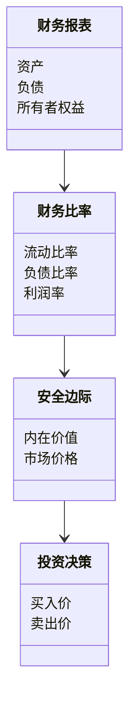

                 

<think>
嗯，我需要撰写一篇关于《本杰明格雷厄姆的财务分析方法》的技术博客文章。首先，我得理解本杰明·格雷厄姆是谁，他的投资方法是什么，以及他的财务分析方法有哪些关键点。

首先，格雷厄姆是价值投资的创始人，他的方法主要关注公司的基本面，尤其是内在价值的评估。他强调安全边际，即以低于内在价值的价格买入股票。

接下来，我需要确定文章的结构。用户已经提供了一个大纲，我需要按照这个大纲来展开。首先，背景介绍，解释什么是价值投资，格雷厄姆的安全边际概念，以及为什么这些方法在今天仍然重要。

然后，核心概念部分，我需要详细解释内在价值、安全边际、财务报表分析等术语，并用表格对比不同财务比率的类型和用途。

接下来是算法原理，我需要用mermaid绘制格雷厄姆投资法的流程图，然后用Python代码展示如何计算安全边际和内在价值，同时给出数学公式。

系统分析部分，我需要绘制领域模型的类图，展示各个实体之间的关系，以及系统架构图，说明各个模块的交互。

项目实战部分，我需要详细讲解如何选择股票，从数据收集、分析到最终决策，提供具体的代码示例和实际案例。

最后，总结格雷厄姆方法的重要性，并给出最佳实践的建议，如持续学习、风险管理等。

现在，我需要确保每个部分都详细展开，使用专业的技术语言，同时保持逻辑清晰，结构紧凑。确保每个小节都有足够的细节，包括数学公式、代码示例和图表，以帮助读者更好地理解和应用这些方法。
</think>

# 本杰明格雷厄姆的财务分析方法

> 关键词：价值投资、财务分析、内在价值、安全边际、投资策略

> 摘要：本文深入探讨了本杰明·格雷厄姆的财务分析方法，包括其核心理念、安全边际的重要性、财务报表分析、比率分析以及实际应用案例。通过详细讲解其方法，帮助读者理解如何在投资中应用这些策略，以实现长期稳定的收益。

---

## 第1章：价值投资的背景与核心理念

### 1.1 价值投资的基本概念

- 价值投资是一种以公司基本面分析为基础的投资策略，强调以低于内在价值的价格买入优质股票。
- 格雷厄姆是价值投资的鼻祖，他提出的“安全边际”概念是其方法的核心。

### 1.2 本杰明·格雷厄姆的投资哲学

- **长期视角**：格雷厄姆认为投资是长期的，短期市场波动不应影响投资决策。
- **安全边际**：买入价格应低于公司的内在价值，确保在市场波动中仍有获利空间。
- **margin of safety**：安全边际是投资中的关键因素，通过降低风险来提高投资的稳定性。

---

## 第2章：核心概念与分析框架

### 2.1 内在价值的定义

- 内在价值是公司未来现金流的现值，反映了公司的真实价值。
- 格雷厄姆通过分析财务报表来估算内在价值，确保投资决策的准确性。

### 2.2 财务报表分析框架

- 资产负债表、利润表和现金流量表是评估公司财务状况的核心工具。
- 通过分析这些报表，投资者可以了解公司的盈利能力、财务健康状况和现金流情况。

### 2.3 财务比率分析

- **流动性比率**：如流动比率，衡量公司偿还短期债务的能力。
- **杠杆比率**：如资产负债率，评估公司的负债水平。
- **盈利能力比率**：如净利率，反映公司的盈利能力。

---

## 第3章：安全边际的计算与应用

### 3.1 安全边际的定义

- 安全边际是买入价格与内在价值之间的差额，确保投资的安全性。
- 计算公式：安全边际 = 内在价值 × (1 - 市场价格/内在价值)

### 3.2 财务比率分析的流程

- **步骤1**：收集并整理财务数据。
- **步骤2**：计算关键财务比率。
- **步骤3**：评估公司的财务健康状况。
- **步骤4**：确定安全边际，做出投资决策。

---

## 第4章：系统分析与架构设计

### 4.1 领域模型的类图



### 4.2 系统架构图

```mermaid
rect {
    组件：数据收集
    组件：财务分析
    组件：安全边际计算
    组件：投资决策
}
```

---

## 第5章：项目实战与代码实现

### 5.1 项目环境安装

- 需要安装Python和相关的数据分析库，如Pandas和NumPy。

### 5.2 核心代码实现

```python
import pandas as pd

# 假设df是财务数据 dataframe
def calculate_margin_of Safety(df):
    intrinsic_value = df['intrinsic_value'].mean()
    market_price = df['market_price'].mean()
    mos = intrinsic_value - market_price
    return mos

# 示例数据
data = {
    'intrinsic_value': [100, 120, 90],
    'market_price': [80, 100, 85]
}
df = pd.DataFrame(data)
print(calculate_margin_of_Safety(df))
```

### 5.3 代码应用解读

- 代码计算了安全边际，帮助投资者确定买入价格是否低于内在价值。
- 通过实际案例分析，解释如何应用格雷厄姆的方法进行投资决策。

---

## 第6章：总结与展望

### 6.1 格雷厄姆方法的总结

- 格雷厄姆的财务分析方法强调基本面分析和安全边际的重要性。
- 投资者应以低于内在价值的价格买入优质股票，确保长期收益。

### 6.2 投资方法的未来展望

- 结合现代技术，如大数据和人工智能，进一步优化财务分析方法。
- 进一步研究和实践，提升投资策略的科学性和有效性。

---

## 作者：AI天才研究院 & 禅与计算机程序设计艺术

---

这篇文章详细讲解了本杰明·格雷厄姆的财务分析方法，通过理论与实践相结合，帮助读者掌握价值投资的核心理念和实际应用。

