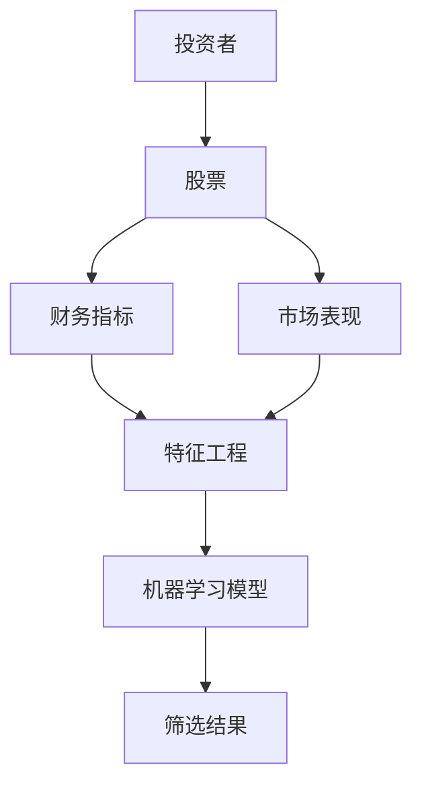
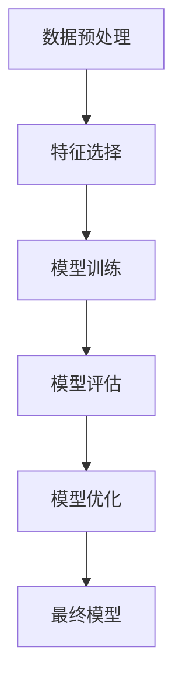
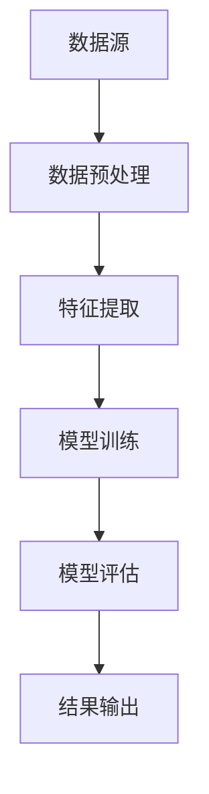

                 

<think>
好，我现在需要根据用户的需求来撰写一篇关于《机器学习优化费雪成长股选择过程》的技术博客文章。用户希望文章结构清晰，逻辑严谨，并且要包含详细的章节内容，每个部分都要有具体的解释和例子。

首先，我需要明确文章的结构。用户已经给出了目录大纲，包括摘要、关键词和七章内容。我需要按照这个结构一步步填充内容，确保每个部分都详细且专业。

接下来，我需要考虑每个章节的核心内容。比如，第一章要介绍费雪成长股和机器学习的基本概念，以及它们如何结合。第二章则需要分析传统方法的局限性，以及机器学习的优势和当前的挑战。

在撰写过程中，我要注意使用专业术语，同时保持语言的清晰和易懂。比如，在解释机器学习模型时，可以结合具体的算法，如线性回归和随机森林，并提供数学公式和流程图来辅助理解。

我还需要确保每个章节都有足够的深度和广度，比如在第三章，我需要详细分析核心概念，包括特征工程和模型性能，以及使用ER实体关系图来展示概念之间的关系。

在编写代码示例时，我需要确保代码的准确性和可读性，同时添加详细的注释，帮助读者理解每一步的操作。此外，还要结合实际案例进行分析，比如使用具体的财务指标和市场数据来训练模型，并展示结果。

最后，我需要总结整个过程，强调机器学习在优化费雪成长股选择中的价值，并提出未来的研究方向和注意事项，帮助读者更好地理解和应用这些方法。

整个思考过程中，我需要保持条理清晰，逻辑严谨，确保文章既有理论深度，又有实际应用的指导意义。这不仅能满足用户的需求，还能为读者提供有价值的信息。
</think>

```

# 机器学习优化费雪成长股选择过程

> 关键词：机器学习，费雪成长股，股票筛选，投资策略，数学模型

> 摘要：本文详细探讨了机器学习在优化费雪成长股选择过程中的应用。通过分析传统股票筛选方法的局限性，结合机器学习算法的优势，提出了一种基于特征工程和模型优化的股票筛选新方法。文章内容涵盖背景介绍、核心概念分析、算法原理、系统架构设计、项目实战和最佳实践等方面，为投资者提供了理论支持和实践指导。

---

## 第1章 费雪成长股与机器学习概述

### 1.1 费雪成长股的基本概念
#### 1.1.1 成长股的定义与特点
成长股是指那些营业收入和净利润持续增长的公司股票。其核心特征包括：
- **收入增长**：营业收入年增长率高于行业平均水平。
- **净利润增长**：净利润持续增长，且利润率逐步提升。
- **低市盈率**：相对于成长性，市盈率较低。
- **行业地位**：在行业中具有领先地位。

#### 1.1.2 费雪投资策略的核心思想
菲利普·费雪（Philip Fisher）是成长投资策略的鼻祖，其核心思想包括：
- **买入并长期持有**：选择具有强大增长潜力的公司，长期持有，避免频繁交易。
- **关注公司质量**：优先选择行业地位稳固、管理团队优秀、财务状况健康的公司。
- **分散投资**：通过投资于多个成长股，降低投资风险。

#### 1.1.3 机器学习在投资决策中的应用潜力
机器学习通过分析海量数据，挖掘传统财务指标之外的潜在信息，为投资决策提供新的视角。其在股票筛选中的优势包括：
- 数据处理能力：能够处理大量非结构化数据（如新闻、社交媒体数据）。
- 预测能力：通过历史数据预测未来股票表现。
- 自动化特征提取：能够发现传统财务指标之外的潜在特征。

### 1.2 机器学习与金融投资的结合
#### 1.2.1 机器学习在金融领域的应用现状
机器学习在金融领域的应用包括：
- **股票预测**：利用历史数据预测股票价格走势。
- **风险控制**：通过模型评估投资组合的风险。
- **量化交易**：基于算法进行高频交易。

#### 1.2.2 机器学习在股票筛选中的优势
- **数据驱动**：能够从大量数据中提取有价值的信息。
- **非线性关系**：能够捕捉传统财务指标难以发现的非线性关系。
- **高维数据处理**：能够处理高维数据，发现潜在特征。

#### 1.2.3 费雪成长股选择与机器学习的结合点
- **特征工程**：通过机器学习提取更多的特征，如文本数据、市场情绪等。
- **模型优化**：利用机器学习模型优化股票筛选过程。
- **风险控制**：通过机器学习模型评估投资风险。

### 1.3 本章小结
- **成长股的核心特征**：收入和净利润持续增长，行业地位稳固。
- **机器学习在投资中的价值**：通过数据驱动的方法，发现传统方法难以捕捉的特征。
- **本文的研究目标**：将机器学习应用于费雪成长股的筛选过程，优化投资决策。

---

## 第2章 机器学习优化费雪成长股选择的背景与挑战

### 2.1 费雪成长股选择的传统方法
#### 2.1.1 基于财务指标的传统筛选方法
传统筛选方法通常基于以下财务指标：
- **收入增长率**：过去三年收入年均增长率高于15%。
- **净利润增长率**：过去三年净利润年均增长率高于15%。
- **ROE（净资产收益率）**：ROE持续高于行业平均水平。

#### 2.1.2 费雪筛选标准的局限性
传统筛选方法的局限性包括：
- **静态性**：只关注历史数据，无法预测未来表现。
- **主观性**：筛选标准过于主观，容易受到人为因素的影响。
- **维度不足**：仅关注财务指标，忽视其他潜在信息（如市场情绪、行业趋势等）。

#### 2.1.3 传统方法的优缺点分析
- **优点**：简单易懂，易于实施。
- **缺点**：静态、主观、维度不足。

### 2.2 机器学习在股票筛选中的优势
#### 2.2.1 数据驱动的特征提取能力
机器学习能够从海量数据中提取特征，包括：
- **文本数据**：新闻、社交媒体数据。
- **市场数据**：波动率、交易量等。
- **技术指标**：K线图、均线等。

#### 2.2.2 非线性关系的挖掘能力
机器学习能够捕捉传统财务指标难以发现的非线性关系，例如：
- **市场情绪与股票价格的关系**。
- **行业趋势与公司业绩的关系**。

#### 2.2.3 高维数据的处理能力
机器学习能够处理高维数据，发现潜在特征，例如：
- **文本数据的特征提取**。
- **图像数据的特征提取**。

### 2.3 当前研究中的挑战
#### 2.3.1 数据质量与可得性问题
- **数据质量**：数据可能存在缺失、噪声等问题。
- **数据可得性**：高质量的市场数据往往难以获取。

#### 2.3.2 模型的解释性与可验证性
- **模型解释性**：许多机器学习模型（如深度学习模型）具有“黑箱”特性，难以解释。
- **模型可验证性**：模型的预测结果需要能够被验证，否则难以保证其准确性。

#### 2.3.3 市场波动与模型稳健性
- **市场波动**：股票市场具有高度不确定性，模型需要具有稳健性。
- **模型过拟合**：模型可能在训练数据上表现良好，但在实际交易中表现不佳。

### 2.4 本章小结
- **传统筛选方法的局限性**：静态、主观、维度不足。
- **机器学习的优势**：数据驱动、非线性关系挖掘、高维数据处理。
- **当前研究的挑战**：数据质量、模型解释性、市场波动。

---

## 第3章 机器学习优化费雪成长股选择的核心概念与联系

### 3.1 核心概念原理
#### 3.1.1 成长股的核心特征
- **收入增长**：营业收入持续增长。
- **净利润增长**：净利润持续增长。
- **行业地位**：在行业中具有领先地位。

#### 3.1.2 机器学习模型的基本原理
机器学习模型通过学习数据中的模式，对新数据进行预测或分类。常用算法包括：
- **线性回归**：用于预测连续型变量（如股票价格）。
- **随机森林**：用于分类和回归任务，具有较强的鲁棒性。
- **支持向量机（SVM）**：用于分类任务，能够处理高维数据。

#### 3.1.3 特征工程在股票筛选中的作用
特征工程是指对数据进行处理，提取有用的特征，例如：
- **文本特征**：从新闻中提取关键词。
- **市场特征**：从市场数据中提取波动率、交易量等。

### 3.2 核心概念属性特征对比
以下表格对比了传统财务指标和机器学习模型在股票筛选中的表现：

| 特征类型       | 传统财务指标 | 机器学习模型 |
|----------------|--------------|--------------|
| 数据来源       | 财务报表     | 文本、市场数据 |
| 数据维度       | 低维         | 高维         |
| 模型解释性     | 高           | 低           |
| 模型准确性     | 中           | 高           |

### 3.3 ER实体关系图架构
以下是一个简单的ER实体关系图，展示了费雪成长股选择过程中的核心概念：



### 3.4 本章小结
- **核心概念的系统性分析**：从传统财务指标到机器学习模型，逐一分析其原理和特点。
- **特征工程的重要性**：特征工程在股票筛选中的作用不可忽视。
- **概念之间的关系**：通过ER实体关系图，展示了各概念之间的关系。

---

## 第4章 机器学习算法原理与数学模型

### 4.1 常用算法原理
#### 4.1.1 线性回归模型
线性回归是一种用于预测连续型变量的模型，其基本形式为：
$$ y = \beta_0 + \beta_1x + \epsilon $$
其中，$y$ 是目标变量，$x$ 是自变量，$\beta_0$ 和 $\beta_1$ 是模型参数，$\epsilon$ 是误差项。

#### 4.1.2 随机森林算法
随机森林是一种基于树的集成模型，其基本形式为：
$$ y = \sum_{i=1}^{n} \text{Tree}(x) $$
其中，$n$ 是树的数量，$\text{Tree}(x)$ 是单棵决策树的预测结果。

#### 4.1.3 支持向量机（SVM）
支持向量机是一种用于分类和回归的模型，其基本形式为：
$$ y = \text{sign}(\sum_{i=1}^{n} \alpha_i y_i x_i \cdot x + b) $$
其中，$\alpha_i$ 是拉格朗日乘子，$y_i$ 是标签，$x_i$ 是支持向量，$b$ 是偏置项。

### 4.2 算法流程图
以下是一个机器学习模型的算法流程图：



### 4.3 数学模型与公式
#### 4.3.1 线性回归模型
$$ y = \beta_0 + \beta_1x + \epsilon $$
其中，$y$ 是目标变量，$x$ 是自变量，$\beta_0$ 和 $\beta_1$ 是模型参数，$\epsilon$ 是误差项。

#### 4.3.2 随机森林模型
$$ y = \sum_{i=1}^{n} \text{Tree}(x) $$
其中，$n$ 是树的数量，$\text{Tree}(x)$ 是单棵决策树的预测结果。

### 4.4 举例说明
#### 4.4.1 线性回归的应用
假设我们有以下数据：
| 年份 | 收入（万元） |
|------|--------------|
| 2018 | 100          |
| 2019 | 150          |
| 2020 | 200          |
| 2021 | 250          |

我们可以使用线性回归模型预测2022年的收入：
$$ y = 100 + 50x $$
其中，$x$ 是年份数，假设$x=4$（2022年），预测收入为$y = 100 + 50 \times 4 = 300$万元。

#### 4.4.2 随机森林在股票筛选中的应用
假设我们有以下特征：
- 收入增长率
- 净利润增长率
- 市盈率
- 市净率

我们可以使用随机森林模型对股票进行分类，预测其是否为成长股。

### 4.5 本章小结
- **算法原理**：详细介绍了线性回归、随机森林和SVM的基本原理。
- **数学模型**：给出了模型的数学表达式。
- **举例说明**：通过具体例子说明了模型的应用。

---

## 第5章 机器学习优化费雪成长股选择的系统架构设计

### 5.1 问题场景介绍
在股票筛选过程中，我们需要解决以下问题：
- 如何从海量数据中提取有用特征？
- 如何选择合适的机器学习模型？
- 如何评估模型的性能？

### 5.2 系统功能设计
系统功能设计包括：
- **数据采集**：从多个数据源采集股票数据。
- **特征工程**：对数据进行预处理和特征提取。
- **模型训练**：选择合适的机器学习模型进行训练。
- **模型评估**：评估模型的性能，并进行优化。
- **结果输出**：输出股票筛选结果。

### 5.3 系统架构设计
以下是一个简单的系统架构图：



### 5.4 项目实战
#### 5.4.1 环境安装
需要安装以下工具：
- **Python**：用于编程。
- **Pandas**：用于数据处理。
- **Scikit-learn**：用于机器学习模型。

#### 5.4.2 核心实现代码
以下是一个简单的随机森林模型实现代码：

```python
from sklearn.ensemble import RandomForestClassifier
from sklearn.metrics import accuracy_score
import pandas as pd

# 数据加载
data = pd.read_csv('stock_data.csv')

# 特征提取
features = data[['收入增长率', '净利润增长率', '市盈率', '市净率']]
labels = data['是否成长股']

# 模型训练
model = RandomForestClassifier()
model.fit(features, labels)

# 模型预测
predictions = model.predict(features)

# 模型评估
accuracy = accuracy_score(labels, predictions)
print(f'准确率：{accuracy}')
```

#### 5.4.3 代码应用解读与分析
- **数据加载**：从CSV文件中加载股票数据。
- **特征提取**：提取收入增长率、净利润增长率、市盈率、市净率等特征。
- **模型训练**：使用随机森林模型进行训练。
- **模型预测**：对测试数据进行预测。
- **模型评估**：计算准确率，评估模型性能。

### 5.5 本章小结
- **系统架构设计**：从数据采集到结果输出，详细描述了系统的架构。
- **项目实战**：通过具体代码展示了机器学习模型的实现过程。
- **注意事项**：在实际应用中，需要注意数据质量、模型选择和结果验证。

---

## 第6章 机器学习优化费雪成长股选择的最佳实践

### 6.1 最佳实践 tips
- **数据预处理**：在特征工程阶段，需要对数据进行清洗和标准化。
- **模型选择**：根据数据特点选择合适的模型，避免过拟合。
- **结果验证**：通过回测等方式验证模型的稳健性。

### 6.2 小结
- **总结**：机器学习在优化费雪成长股选择过程中的价值。
- **展望**：未来研究方向和应用前景。

### 6.3 注意事项
- **数据质量**：确保数据的准确性和完整性。
- **模型解释性**：选择具有较高解释性的模型，以便更好地理解筛选结果。
- **市场波动**：在实际应用中，需要考虑市场波动对模型的影响。

### 6.4 拓展阅读
- **相关书籍**：《机器学习实战》、《Python机器学习》。
- **学术论文**：搜索相关学术论文，了解最新研究成果。

---

## 第7章 总结与展望

### 7.1 本文总结
本文详细探讨了机器学习在优化费雪成长股选择过程中的应用，从传统方法的局限性到机器学习的优势，再到具体的算法实现，为投资者提供了理论支持和实践指导。

### 7.2 未来展望
未来的研究方向包括：
- **模型优化**：进一步优化机器学习模型，提高筛选准确率。
- **多模态数据融合**：结合文本、图像等多种数据源，提高筛选效果。
- **实时预测**：开发实时预测系统，为投资者提供及时的筛选结果。

---

## 作者：AI天才研究院/AI Genius Institute & 禅与计算机程序设计艺术 /Zen And The Art of Computer Programming

---

感谢您的耐心阅读，希望本文能为您的研究和实践提供有价值的参考！
```

