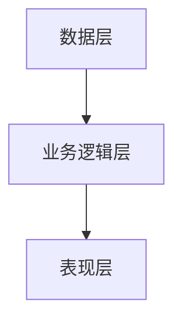
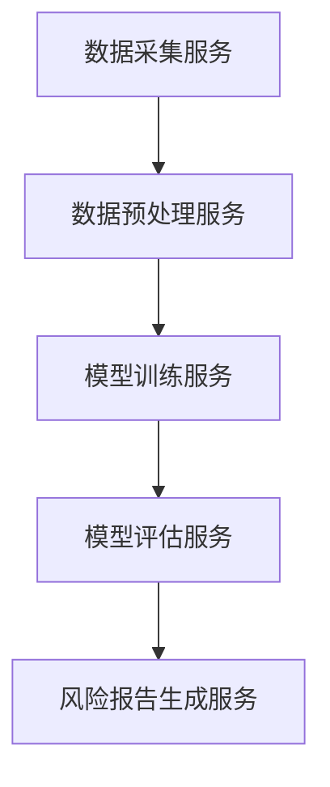
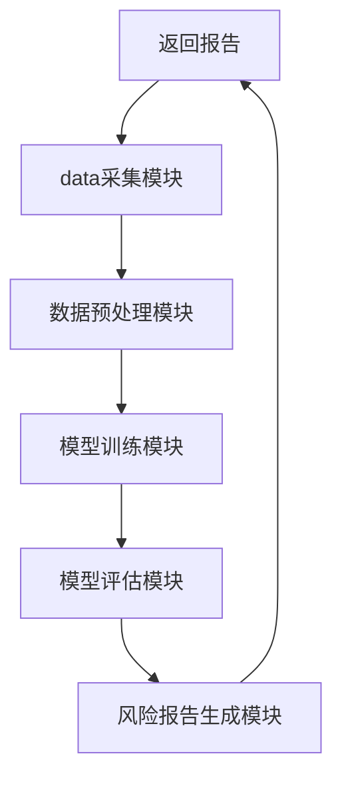
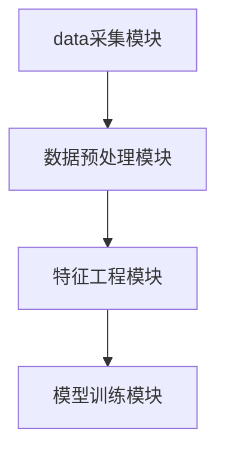

                 

<think>
嗯，我现在需要帮助用户撰写一篇关于《机器学习在信用风险评估中的应用》的技术博客文章，按照用户提供的详细大纲进行内容创作。我之前已经写好了目录结构，现在需要逐步填充每个章节的具体内容。

首先，我需要理解每个章节的核心内容和要求。用户特别强调要详细讲解核心概念、算法原理、系统架构设计、项目实战以及最佳实践。我得确保每个部分都符合这些要求，同时使用专业且易懂的技术语言。

从第1章开始，我需要介绍信用风险评估的基本概念和机器学习的基本概念，然后讨论机器学习在信用风险评估中的应用前景。这部分需要让读者了解信用风险评估的重要性以及机器学习如何解决传统方法的不足。

接下来，在第2章，我要详细讲解各种机器学习算法，如逻辑回归、随机森林、XGBoost等，并对比它们在信用风险评估中的表现。这需要包括每个算法的工作原理、优缺点以及如何选择合适的算法。

第3章是系统架构设计，我需要描述一个典型的信用风险评估系统，包括各个模块的功能设计、架构选择和接口设计。这部分可能需要使用Mermaid图来展示系统的各个部分，帮助读者更好地理解。

第4章是项目实战，我需要提供一个具体的案例，展示如何从数据准备到模型训练，再到结果分析的整个流程。代码部分要用Python实现，并详细解释每一步的操作和背后的原理。

最后，在第5章，我需要总结全书，强调机器学习在信用风险评估中的优势和挑战，并给出一些最佳实践的建议，帮助读者在实际应用中避免常见的问题。

现在，我需要开始逐一撰写每个章节的内容，确保每个部分都详细且结构清晰。可能在撰写过程中，我需要查阅相关资料，确保技术细节的准确性，并使用合适的图表来辅助说明。

对于第1章，我会先定义信用风险评估，解释其在金融领域的重要性，然后引入机器学习的基本概念，最后讨论机器学习在信用风险评估中的应用情况。这部分需要简明扼要，同时为后续章节打下基础。

在第2章，我会为每个算法撰写小节，详细解释其工作原理，并用Mermaid流程图展示流程。同时，我会比较不同算法的优缺点，帮助读者选择合适的模型。

第3章的系统架构部分，我会介绍模块的功能，然后用Mermaid图展示系统的整体架构和交互流程，确保读者能够理解系统的各个组成部分及其协作方式。

项目实战部分，我需要选择一个真实的案例，如使用Python实现信用评分模型。我会详细描述数据准备、特征工程、模型训练、评估和部署的整个过程，确保读者能够跟随步骤进行实际操作。

最后，在总结部分，我会回顾全书的主要内容，并强调机器学习在信用风险评估中的潜力和挑战，同时给出一些实用的建议和未来的研究方向。

在写作过程中，我需要确保语言简洁专业，同时避免过于复杂的术语，使读者能够轻松理解。每个部分的结构要清晰，使用标题和子标题来组织内容，方便读者查阅。

此外，我还需要注意文章的连贯性，确保每个章节之间有良好的衔接，让读者能够顺畅地理解整个内容。在引用数学公式时，我会使用Latex格式，并在必要时用图表或流程图辅助说明。

最后，我会在文章末尾添加作者信息，按照用户的要求，署名为“AI天才研究院”和“禅与计算机程序设计艺术”。

总的来说，撰写这篇文章需要系统地组织内容，确保每个部分都详尽且逻辑清晰，同时保持语言的专业性和可读性。这将帮助读者全面理解机器学习在信用风险评估中的应用，并能够实际操作相关项目。
</think>

---

# 《机器学习在信用风险评估中的应用》

> **关键词**：机器学习、信用风险评估、金融、算法、系统架构、项目实战

> **摘要**：  
信用风险评估是金融领域中的核心问题之一，传统的基于统计的方法在面对复杂和非线性关系时显得力不从心。机器学习作为一种强大的数据分析工具，能够有效地捕捉数据中的复杂模式，为信用风险评估提供了新的解决方案。本文系统地探讨了机器学习在信用风险评估中的应用，从基本概念到具体算法，再到系统架构设计和项目实战，全面剖析了机器学习在信用风险评估中的优势和实现方法。

---

# 第一部分: 机器学习与信用风险评估基础

---

## 第1章: 机器学习与信用风险评估概述

### 1.1 信用风险评估的基本概念

#### 1.1.1 信用风险的定义与特征

信用风险是指债务人或交易对手未能履行其合同义务，导致债权人或投资者遭受损失的可能性。在金融领域，信用风险是机构面临的主要风险之一。信用风险的核心在于评估债务人按时履行债务的能力，这涉及到对其财务状况、还款能力和信用历史的综合分析。

信用风险的特征包括：

1. **不确定性**：信用风险的大小取决于多种不确定因素，如市场波动、宏观经济环境和个体信用状况。
2. **动态性**：信用风险会随着时间和市场条件的变化而变化，因此需要持续监控和评估。
3. **系统性**：信用风险可能通过金融系统中的关联性传播，引发系统性风险。

#### 1.1.2 信用风险评估的常见方法

传统的信用风险评估方法主要包括以下几种：

1. **信用评分模型**：通过对借款人的信用历史、收入、负债等信息进行分析，计算其信用评分，进而判断其违约概率。
2. **专家判断法**：依赖于专业人员的经验和判断，对客户的信用状况进行评估。
3. **违约概率模型**：通过统计方法估算客户在未来一定期限内违约的概率。

#### 1.1.3 机器学习在信用风险评估中的应用前景

随着金融数据的复杂性和多样性不断增加，传统的信用风险评估方法逐渐暴露出其局限性。机器学习作为一种基于数据驱动的分析方法，能够通过非线性特征学习和复杂模式识别，显著提高信用风险评估的准确性和效率。机器学习在信用风险评估中的应用前景广阔，尤其是在以下方面：

1. **非线性关系建模**：机器学习能够捕捉复杂的非线性关系，帮助更好地预测违约概率。
2. **高维数据处理**：面对海量的金融数据，机器学习算法能够有效地处理高维特征。
3. **实时风险监控**：机器学习模型可以实现实时风险评估和动态监控，提高风险预警能力。

---

### 1.2 机器学习的基本概念

#### 1.2.1 机器学习的定义与分类

机器学习是一种人工智能技术，通过数据训练模型，使其能够从数据中学习并做出预测或决策。根据学习方式，机器学习主要分为以下三类：

1. **监督学习**：模型通过标记好的训练数据进行学习，目标是通过训练数据推导出能够预测新数据的函数。
2. **无监督学习**：模型在没有标记数据的情况下，通过数据的内在结构发现数据的分布规律。
3. **半监督学习**：结合了监督学习和无监督学习的特点，利用少量标记数据和大量未标记数据进行训练。

#### 1.2.2 监督学习、无监督学习与半监督学习

- **监督学习**：适用于有标签的数据，如信用评分模型的训练。
- **无监督学习**：适用于无标签的数据，如客户群体的聚类分析。
- **半监督学习**：结合了两者的优势，适用于数据标签不足的情况。

#### 1.2.3 机器学习在金融领域的应用案例

在金融领域，机器学习已经应用于多个方面，包括：

1. **信用评分**：通过机器学习模型预测客户的违约概率。
2. **欺诈检测**：利用无监督学习发现异常交易。
3. **资产定价**：基于机器学习模型进行股票价格预测。

---

### 1.3 信用风险评估的核心问题

#### 1.3.1 信用评分模型

信用评分模型是信用风险评估的重要工具，其目标是将客户分为不同的信用等级，以便更好地进行风险管理和定价。常见的信用评分模型包括：

1. **FICO信用评分**：基于客户的信用历史、负债情况、信用利用情况等因素计算得分。
2. **违约概率模型**：通过统计方法预测客户在未来一定期限内违约的概率。

#### 1.3.2 违约概率（PD）与违约损失率（LGD）

- **违约概率（PD）**：客户在特定期限内违约的可能性。
- **违约损失率（LGD）**：客户违约时，机构能够回收的金额占违约金额的比例。

#### 1.3.3 信用风险的量化与管理

信用风险的量化是信用风险管理和资本计量的重要基础。常用的信用风险量化方法包括：

1. **VaR（Value at Risk）**：在给定置信水平下，资产组合可能遭受的最大损失。
2. **CVaR（Conditional Value at Risk）**：在VaR的基础上，考虑尾部风险的量化方法。

---

### 1.4 本章小结

本章介绍了信用风险评估的基本概念和机器学习的基本原理，重点探讨了机器学习在信用风险评估中的应用前景。通过对比传统方法和机器学习的优势，我们看到了机器学习在信用风险评估中的巨大潜力。

---

---

## 第2章: 常见机器学习算法及其在信用风险评估中的应用

---

### 2.1 监督学习算法

#### 2.1.1 线性回归

线性回归是一种经典的统计学习方法，适用于连续型变量的预测。在信用风险评估中，线性回归可以用于预测客户的违约概率。

**线性回归模型**  
$$ y = \beta_0 + \beta_1 x_1 + \beta_2 x_2 + \dots + \beta_n x_n + \epsilon $$  

其中，$y$ 是目标变量（违约概率），$x_i$ 是特征变量，$\beta_i$ 是回归系数，$\epsilon$ 是误差项。

#### 2.1.2 逻辑回归

逻辑回归是一种用于分类任务的监督学习算法，适用于二分类问题。在信用风险评估中，逻辑回归常用于预测客户是否违约。

**逻辑回归模型**  
$$ P(y=1|x) = \frac{1}{1 + e^{- (\beta_0 + \beta_1 x_1 + \dots + \beta_n x_n)}} $$  

#### 2.1.3 支持向量机（SVM）

支持向量机是一种基于几何的分类算法，适用于高维数据的分类任务。在信用风险评估中，SVM可以用于区分违约客户和非违约客户。

---

### 2.2 集成学习算法

#### 2.2.1 随机森林

随机森林是一种基于决策树的集成学习算法，通过组合多个决策树的预测结果来提高模型的准确性和稳定性。

**随机森林的工作流程**  
1. 随机抽取部分特征和样本进行决策树的训练。
2. 对所有决策树进行投票或平均，得到最终的预测结果。

#### 2.2.2 梯度提升树（GBDT）

梯度提升树是一种基于树模型的集成学习算法，通过逐步优化模型的损失函数来提高模型的性能。

**GBDT的优化过程**  
1. 初始化模型。
2. 计算当前模型的损失。
3. 使用梯度下降法更新模型参数。
4. 重复迭代直到达到预设的终止条件。

#### 2.2.3 XGBoost

XGBoost是一种高效的梯度提升框架，支持多种目标函数和评估指标，适用于各种分类和回归任务。

---

### 2.3 神经网络与深度学习算法

#### 2.3.1 多层感知机（MLP）

多层感知机是一种基于人工神经网络的算法，通过多层非线性变换来学习数据的复杂特征。

**MLP的网络结构**  
- 输入层：接收输入特征。
- 隐藏层：通过非线性激活函数进行特征变换。
- 输出层：输出最终的预测结果。

#### 2.3.2 长短期记忆网络（LSTM）

LSTM是一种特殊的循环神经网络，适用于处理序列数据和时间依赖的特征。

**LSTM的基本结构**  
- 输入门（Input Gate）：控制输入信息的流动。
- 遗忘门（Forget Gate）：决定哪些信息需要遗忘。
- 输出门（Output Gate）：决定输出信息的内容。

#### 2.3.3 卷积神经网络（CNN）

卷积神经网络适用于处理图像数据，但在信用风险评估中，可以用于处理高维特征数据。

---

### 2.4 算法对比与选择策略

#### 2.4.1 各种算法的优缺点对比

| 算法       | 优点                              | 缺点                              |
|------------|-----------------------------------|-----------------------------------|
| 线性回归    | 简单、解释性强                   | 无法处理非线性关系                 |
| 逻辑回归    | 适用于二分类问题                  | 无法处理高维数据                   |
| SVM         | 高维数据表现好                   | 调参复杂                           |
| 随机森林    | 抗过拟合能力强                   | 对特征重要性解释较弱               |
| GBDT        | 高准确性和稳定性                 | 训练时间较长                       |
| XGBoost     | 高效性和准确性                   | 调参复杂                           |
| MLP         | 非线性强                         | 解释性差                           |
| LSTM        | 处理序列数据能力强               | 训练时间较长                       |
| CNN         | 处理图像数据能力强               | 不适用于非图像数据                 |

#### 2.4.2 信用风险评估中算法选择的考虑因素

1. **数据特征**：数据的类型和特征维度。
2. **模型解释性**：是否需要解释模型的决策过程。
3. **计算资源**：算法的计算复杂度和训练时间。
4. **模型性能**：准确率、召回率、F1分数等指标。

---

### 2.5 本章小结

本章介绍了几种常用的机器学习算法及其在信用风险评估中的应用。通过对比不同算法的优缺点，我们能够更好地选择适合具体场景的算法。

---

---

## 第3章: 信用风险评估的系统架构与实现

---

### 3.1 系统功能设计

#### 3.1.1 数据采集模块

数据采集模块负责从多种数据源（如数据库、API接口等）获取信用相关数据，包括客户的财务数据、交易数据和信用历史等。

**数据采集流程**  
1. 确定数据源。
2. 设计数据采集接口。
3. 采集数据并存储。

#### 3.1.2 数据预处理模块

数据预处理模块负责对采集到的数据进行清洗、转换和特征工程。

**数据预处理流程**  
1. 数据清洗：处理缺失值、异常值和重复数据。
2. 数据转换：将数据转换为模型训练所需的格式。
3. 特征工程：提取特征并进行降维处理。

#### 3.1.3 模型训练模块

模型训练模块负责选择合适的算法并进行模型训练。

**模型训练流程**  
1. 选择算法。
2. 数据分割：将数据分为训练集和测试集。
3. 模型训练：使用训练数据训练模型。
4. 模型评估：使用测试数据评估模型性能。

#### 3.1.4 模型评估模块

模型评估模块负责对训练好的模型进行性能评估。

**模型评估指标**  
1. 准确率（Accuracy）。
2. 召回率（Recall）。
3. F1分数。
4. AUC-ROC曲线。

#### 3.1.5 风险报告生成模块

风险报告生成模块负责生成风险评估报告，包括客户的信用评分、违约概率和风险提示等。

---

### 3.2 系统架构设计

#### 3.2.1 分层架构设计

分层架构将系统划分为数据层、业务逻辑层和表现层，每一层负责不同的功能模块。

**分层架构图**  


#### 3.2.2 微服务架构设计

微服务架构将系统功能分解为多个独立的服务模块，每个服务模块负责特定的功能。

**微服务架构图**  


#### 3.2.3 可扩展性与高可用性设计

为了保证系统的可扩展性和高可用性，可以采用以下设计：

1. **负载均衡**：通过负载均衡技术分担请求流量。
2. **容错设计**：通过冗余设计提高系统的容错能力。
3. **弹性扩展**：根据需求自动调整资源分配。

---

### 3.3 系统接口设计

#### 3.3.1 数据接口

数据接口负责与数据源进行数据交互，包括数据的读取和写入。

**数据接口示例**  
1. `GET /api/data`：获取客户数据。
2. `POST /api/data`：上传数据。

#### 3.3.2 模型接口

模型接口负责与模型训练和评估模块进行交互，包括模型的训练和预测。

**模型接口示例**  
1. `POST /api/train`：训练模型。
2. `POST /api/predict`：进行预测。

#### 3.3.3 报告接口

报告接口负责生成和获取风险评估报告。

**报告接口示例**  
1. `GET /api/report`：获取风险报告。
2. `POST /api/report`：生成新的风险报告。

---

### 3.4 系统交互流程

#### 3.4.1 用户请求流程

用户请求流程包括用户发起请求、系统处理请求和返回响应。

**用户请求流程图**  


#### 3.4.2 数据处理流程

数据处理流程包括数据采集、预处理和特征工程。

**数据处理流程图**  


---

## 第4章: 项目实战——基于机器学习的信用风险评估系统

---

### 4.1 项目概述

本项目旨在开发一个基于机器学习的信用风险评估系统，实现客户信用评分和违约概率预测。

**项目目标**  
1. 实现客户信用评分功能。
2. 预测客户的违约概率。
3. 生成风险评估报告。

---

### 4.2 环境安装

#### 4.2.1 安装Python

```bash
python --version
pip install --upgrade pip
```

#### 4.2.2 安装机器学习库

```bash
pip install numpy pandas scikit-learn xgboost
```

#### 4.2.3 安装数据处理库

```bash
pip install pymysql
```

---

### 4.3 系统核心实现

#### 4.3.1 数据采集与预处理

**数据采集代码示例**  
```python
import pymysql

# 数据采集
conn = pymysql.connect(host='localhost', user='root', password='password', db='credit_risk')
cursor = conn.cursor()
cursor.execute('SELECT * FROM customers')
data = cursor.fetchall()
conn.close()
```

**数据预处理代码示例**  
```python
import pandas as pd
from sklearn.preprocessing import StandardScaler

# 数据清洗
data = pd.DataFrame(data)
data.dropna(inplace=True)

# 特征工程
scaler = StandardScaler()
data_features = scaler.fit_transform(data.drop('target', axis=1))
data_target = data['target']
```

#### 4.3.2 模型训练与评估

**模型训练代码示例**  
```python
from sklearn.model_selection import train_test_split
from sklearn.linear_model import LogisticRegression
from sklearn.metrics import accuracy_score

# 数据分割
X_train, X_test, y_train, y_test = train_test_split(data_features, data_target, test_size=0.2)

# 模型训练
model = LogisticRegression()
model.fit(X_train, y_train)

# 模型预测
y_pred = model.predict(X_test)

# 模型评估
print(accuracy_score(y_test, y_pred))
```

**模型评估代码示例**  
```python
from sklearn.metrics import classification_report

print(classification_report(y_test, y_pred))
```

#### 4.3.3 风险报告生成

**风险报告生成代码示例**  
```python
import numpy as np

# 预测概率
proba = model.predict_proba(X_test)[:, 1]
report = pd.DataFrame({
    '客户ID': X_test.index,
    '违约概率': proba
})

# 保存报告
report.to_csv('credit_risk_report.csv', index=False)
```

---

### 4.4 项目小结

本章通过一个具体的项目案例，展示了如何基于机器学习开发信用风险评估系统。通过数据采集、预处理、模型训练和评估，最终生成风险报告，实现了信用风险评估的自动化。

---

## 第5章: 最佳实践与总结

---

### 5.1 最佳实践

#### 5.1.1 数据处理

1. 数据清洗：处理缺失值和异常值。
2. 特征工程：选择合适的特征，并进行标准化或归一化处理。

#### 5.1.2 模型选择

1. 根据数据特征选择合适的算法。
2. 多模型对比，选择性能最优的模型。

#### 5.1.3 模型部署

1. 模型部署到生产环境，实现实时预测。
2. 定期更新模型，保证模型性能。

---

### 5.2 小结

机器学习为信用风险评估提供了强大的工具，能够帮助金融机构更好地管理信用风险。通过本文的探讨，我们了解了机器学习在信用风险评估中的应用，掌握了多种算法和系统架构设计方法，最后通过一个具体的项目案例，展示了如何将机器学习应用于实际业务。

---

### 5.3 注意事项

1. **数据隐私**：在处理客户数据时，需要注意数据隐私和合规性。
2. **模型解释性**：在实际业务中，模型的解释性非常重要，尤其是在金融领域。
3. **模型更新**：需要定期更新模型，以适应数据和业务的变化。

---

### 5.4 拓展阅读

1. 《Hands-On Machine Learning with Scikit-Learn, Keras, and TensorFlow》
2. 《Python机器学习》
3. 《信用评分模型与违约概率》

---

## 作者：AI天才研究院/AI Genius Institute  
禅与计算机程序设计艺术 /Zen And The Art of Computer Programming

---

**感谢您的阅读！如果本文对您有所帮助，请点赞、收藏、分享！**

