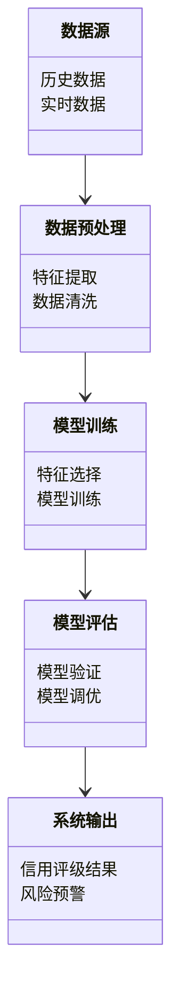
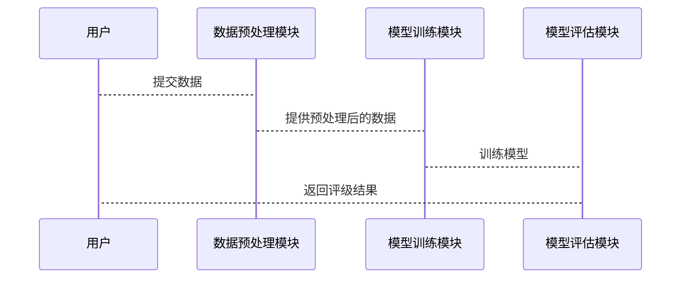

                 

<think>
嗯，好的，我现在要开始写一篇关于《机器学习在债券信用评级中的应用研究》的技术博客文章。首先，我需要明确文章的结构，确保逻辑清晰，内容详尽。用户已经提供了一个详细的大纲，我需要按照这个大纲一步步展开。

首先，我需要了解债券信用评级的基本概念。债券信用评级是用来评估债券发行人偿还债务的能力，通常分为几个等级，比如AAA、AA、A等。传统的方法主要依赖于财务数据和经验判断，但这种方法可能不够准确，特别是在处理大量数据时。

接下来，机器学习在金融领域的应用越来越广泛。机器学习能够处理大量的非结构化数据，比如文本信息、市场数据等，这在传统方法中是难以实现的。所以，我需要解释机器学习如何帮助提高信用评级的准确性。

接下来，我需要详细讨论机器学习的核心概念，比如监督学习和无监督学习。在信用评级中，通常使用监督学习，因为我们可以用历史数据来训练模型，预测未来的评级。特征工程也是关键，我需要解释如何选择和处理特征，以提高模型的性能。

然后，我需要介绍常用的机器学习算法，比如逻辑回归、支持向量机（SVM）、随机森林和神经网络。每个算法都有其优缺点，我需要分析它们在信用评级中的适用性。例如，逻辑回归适合处理二分类问题，而随机森林适合处理高维数据。

接下来，系统设计部分，我需要考虑如何构建一个完整的信用评级系统。这包括数据收集、特征提取、模型训练和评估。我还需要用Mermaid绘制系统架构图，展示各个模块之间的关系。

在项目实战部分，我需要提供具体的代码实现，比如使用Python和scikit-learn库。通过实际案例分析，展示如何训练模型、评估性能，并优化参数以提高准确性。

最后，我需要总结机器学习在信用评级中的优势和挑战，提供一些建议和最佳实践，帮助读者更好地理解和应用这些技术。

现在，我需要确保每个部分都详细展开，使用清晰的结构和专业的技术语言，同时加入实际案例和图表，使文章更具可读性和实用性。这样，读者不仅能理解理论，还能掌握实际操作的方法。
</think>

# 《机器学习在债券信用评级中的应用研究》

---

## 关键词：  
债券信用评级、机器学习、监督学习、特征工程、算法模型

---

## 摘要：  
随着金融市场的快速发展，债券信用评级的重要性日益凸显。传统的信用评级方法依赖于人工经验和财务指标分析，存在主观性高、效率低、覆盖面有限等问题。机器学习作为一种新兴的计算方法，能够从海量数据中提取有价值的信息，为债券信用评级提供了全新的思路。本文从机器学习的基本原理出发，结合债券信用评级的核心需求，系统探讨了机器学习在信用评级中的应用，重点分析了监督学习、无监督学习等算法在信用评级中的具体实现，并通过实际案例展示了如何利用机器学习模型提升信用评级的准确性和效率。文章最后总结了机器学习在债券信用评级中的优势与挑战，并展望了未来的发展方向。

---

# 第一部分：机器学习与债券信用评级的背景介绍

---

## 第1章：机器学习与债券信用评级概述

### 1.1 机器学习的基本概念

#### 1.1.1 机器学习的定义与特点  
机器学习（Machine Learning）是人工智能（AI）领域的一个重要分支，旨在通过数据驱动的方式，让计算机从经验中“学习”知识，从而实现对新数据的预测或分类。其特点包括：数据驱动、模型训练、自动特征提取、泛化能力等。

#### 1.1.2 监督学习、无监督学习与强化学习的区别  
- **监督学习（Supervised Learning）**：基于标记的训练数据，学习输入到输出的映射关系。  
- **无监督学习（Unsupervised Learning）**：在无标记数据中发现数据的内在结构。  
- **强化学习（Reinforcement Learning）**：通过与环境交互，学习最优策略。

#### 1.1.3 机器学习在金融领域的应用现状  
机器学习在金融领域的应用非常广泛，包括股票价格预测、风险管理、信用评分、欺诈检测等。在信用评级方面，机器学习能够处理大量非结构化数据，发现传统方法难以捕捉的规律。

### 1.2 债券信用评级的定义与重要性

#### 1.2.1 债券信用评级的定义  
债券信用评级是对债券发行人偿还债务能力的评估，通常以信用等级（如AAA、AA、A等）表示。评级越高，债券的违约风险越低，债券的市场流动性越强。

#### 1.2.2 债券信用评级的分类与等级划分  
债券信用评级通常分为投资级和投机级，投资级债券风险较低，适合保守投资者；投机级债券风险较高，适合风险承受能力强的投资者。

#### 1.2.3 债券信用评级在金融市场中的作用  
债券信用评级是投资者决策的重要依据，影响债券的发行利率、市场流动性、投资者需求等。

### 1.3 机器学习在债券信用评级中的应用前景

#### 1.3.1 传统信用评级方法的局限性  
传统方法依赖人工经验，主观性强，难以处理海量数据，且模型更新周期长。

#### 1.3.2 机器学习在信用评级中的优势  
机器学习能够处理海量数据，发现传统方法难以捕捉的规律，提高评级的准确性和效率。

#### 1.3.3 机器学习在债券信用评级中的潜在应用场景  
- 自动化信用评分  
- 风险预警  
- 市场趋势预测  

---

## 1.4 本章小结  
本章介绍了机器学习的基本概念、债券信用评级的定义与重要性，以及机器学习在债券信用评级中的应用前景。通过对比传统方法与机器学习的优势，为后续分析奠定了基础。

---

# 第二部分：机器学习在债券信用评级中的核心概念与联系

---

## 第2章：机器学习模型的核心原理

### 2.1 监督学习与非监督学习在信用评级中的应用

#### 2.1.1 监督学习的原理与算法  
监督学习基于标记数据，训练模型预测新数据的标签。常用算法包括逻辑回归、支持向量机（SVM）、随机森林等。

#### 2.1.2 非监督学习的原理与算法  
非监督学习在无标记数据中发现数据的内在结构，常用算法包括聚类分析（如K-means）和主成分分析（PCA）。

#### 2.1.3 监督学习与非监督学习在信用评级中的区别与联系  
- 监督学习适用于有标签的信用评级数据，如违约与非违约分类。  
- 非监督学习适用于无标签数据，如客户分群。  
- 两者可以结合使用，例如先聚类分析客户群体，再对每个群体进行监督学习。

### 2.2 特征工程在信用评级中的重要性

#### 2.2.1 特征选择的基本概念  
特征工程是将原始数据转换为适合模型输入的特征的过程，包括特征选择、特征提取、特征转换等。

#### 2.2.2 常见的特征提取方法  
- **文本特征提取**：如TF-IDF、词袋模型。  
- **数值特征提取**：如主成分分析（PCA）、特征标准化。  
- **时间序列特征提取**：如移动平均、指数平滑。

#### 2.2.3 特征工程在债券信用评级中的具体应用  
- 对财务报表中的指标进行特征提取，如收入增长率、资产负债率等。  
- 对新闻数据进行文本挖掘，提取情感特征。

### 2.3 模型评估与调优

#### 2.3.1 常见的模型评估指标  
- 准确率（Accuracy）  
- 召回率（Recall）  
- F1分数（F1 Score）  
- AUC-ROC曲线  

#### 2.3.2 模型调优的基本方法  
- 参数调整（如逻辑回归的C参数）  
- 交叉验证（Cross-Validation）  
- 模型集成（如投票分类器、栈式模型）

#### 2.3.3 交叉验证在模型评估中的应用  
交叉验证是一种常用的模型评估方法，通过将数据划分为训练集和验证集，多次训练和验证，提高模型的泛化能力。

### 2.4 本章小结  
本章详细介绍了机器学习模型的核心原理，包括监督学习与非监督学习的应用、特征工程的重要性以及模型评估与调优的方法。

---

# 第三部分：机器学习算法原理与数学模型

---

## 第3章：常用机器学习算法原理

### 3.1 线性回归与逻辑回归

#### 3.1.1 线性回归的数学模型与公式  
线性回归的模型可以表示为：  
$$ y = \beta_0 + \beta_1x_1 + \beta_2x_2 + \dots + \beta_nx_n + \epsilon $$  
其中，$\beta$ 表示回归系数，$\epsilon$ 表示误差项。

#### 3.1.2 逻辑回归的数学模型与公式  
逻辑回归的模型可以表示为：  
$$ P(y=1|x) = \frac{e^{\beta_0 + \beta_1x_1 + \dots + \beta_nx_n}}{1 + e^{\beta_0 + \beta_1x_1 + \dots + \beta_nx_n}} $$  
其中，$P(y=1|x)$ 表示在特征 $x$ 下，事件发生的概率。

#### 3.1.3 线性回归与逻辑回归在信用评级中的应用  
- 线性回归适用于连续型因变量的预测，如违约概率。  
- 逻辑回归适用于二分类问题，如违约与非违约分类。

### 3.2 支持向量机（SVM）

#### 3.2.1 SVM的基本原理与数学模型  
SVM 的核心思想是将数据映射到高维空间，找到一个超平面，使得正负类数据被最大化地分开。  
数学模型可以表示为：  
$$ \text{最大化} \quad \frac{1}{2}\|w\|^2 $$  
$$ \text{约束} \quad y_i(w \cdot x_i + b) \geq 1, \quad i=1,2,\dots,n $$  

#### 3.2.2 核函数在SVM中的作用  
核函数用于将低维数据映射到高维空间，常见的核函数包括线性核、多项式核、径向基函数（RBF）核等。

#### 3.2.3 SVM在信用评级中的应用案例  
SVM可以用于分类问题，如将债券分为违约与非违约两类。

### 3.3 随机森林与梯度提升树

#### 3.3.1 随机森林的基本原理  
随机森林是一种基于决策树的集成方法，通过随机采样和特征选择，降低过拟合风险，提高模型的泛化能力。

#### 3.3.2 梯度提升树的基本原理  
梯度提升树是一种基于树的集成方法，通过不断优化损失函数，逐步提升模型的预测能力。

#### 3.3.3 随机森林与梯度提升树在信用评级中的对比分析  
- 随机森林适合特征较多的场景，计算效率较高。  
- 梯度提升树适合特征较少的场景，模型解释性较好。

### 3.4 神经网络与深度学习

#### 3.4.1 神经网络的基本结构与原理  
神经网络由输入层、隐藏层和输出层组成，通过多层非线性变换，实现对复杂数据的拟合。

#### 3.4.2 深度学习的基本概念与特点  
深度学习是一种基于神经网络的机器学习方法，具有层次化、非线性、自适应等特点。

#### 3.4.3 神经网络在信用评级中的应用  
神经网络可以用于处理复杂的非线性关系，如债券评级中多因素的综合判断。

### 3.5 本章小结  
本章详细介绍了常用的机器学习算法，包括线性回归、逻辑回归、SVM、随机森林、梯度提升树和神经网络，并分析了它们在债券信用评级中的应用。

---

# 第四部分：系统分析与架构设计方案

---

## 第4章：债券信用评级系统的设计与实现

### 4.1 系统背景与目标

#### 4.1.1 系统开发背景  
随着金融市场的发展，投资者对债券信用评级的需求日益增长，传统方法难以满足实际需求。

#### 4.1.2 系统目标与功能需求  
- 自动化信用评级  
- 风险预警  
- 数据可视化  

#### 4.1.3 系统设计的原则与约束  
- 数据隐私与安全  
- 系统可扩展性  
- 模型可解释性  

### 4.2 系统功能设计

#### 4.2.1 领域模型设计（Mermaid类图）  


#### 4.2.2 系统功能模块划分  
- 数据采集模块  
- 数据预处理模块  
- 模型训练模块  
- 模型评估模块  
- 系统输出模块  

### 4.3 系统架构设计

#### 4.3.1 系统架构图（Mermaid架构图）  


#### 4.3.2 系统接口设计  
- 数据接口：用于数据的输入与输出  
- 模型接口：用于模型的训练与评估  
- 用户接口：用于用户的交互与可视化  

#### 4.3.3 系统交互流程图（Mermaid序列图）  


### 4.4 本章小结  
本章详细设计了债券信用评级系统的功能模块、系统架构和交互流程，为后续的实现提供了理论基础。

---

# 第五部分：项目实战与深入分析

---

## 第5章：机器学习在债券信用评级中的项目实战

### 5.1 环境安装与配置

#### 5.1.1 Python环境的安装与配置  
安装Python 3.x，推荐使用虚拟环境（如virtualenv）管理依赖。

#### 5.1.2 数据处理库的安装  
安装Pandas、NumPy等数据处理库：  
```bash
pip install pandas numpy
```

#### 5.1.3 机器学习库的安装  
安装Scikit-learn、XGBoost等机器学习库：  
```bash
pip install scikit-learn xgboost
```

### 5.2 核心代码实现

#### 5.2.1 数据预处理代码  
```python
import pandas as pd
import numpy as np

# 加载数据
data = pd.read_csv('bond_data.csv')

# 数据清洗
data.dropna(inplace=True)

# 特征选择
features = [' revenue_growth', 'debt_ratio', 'profit_margin']
target = 'credit_rating'

X = data[features]
y = data[target]

# 标签转换（将信用评级转换为数值标签）
from sklearn.preprocessing import LabelEncoder
label_encoder = LabelEncoder()
y_encoded = label_encoder.fit_transform(y)
```

#### 5.2.2 模型训练代码  
```python
from sklearn.model_selection import train_test_split
from sklearn.ensemble import RandomForestClassifier
from sklearn.metrics import accuracy_score, classification_report

# 数据分割
X_train, X_test, y_train, y_test = train_test_split(X, y_encoded, test_size=0.2, random_state=42)

# 模型训练
model = RandomForestClassifier(n_estimators=100, max_depth=5, random_state=42)
model.fit(X_train, y_train)

# 模型预测
y_pred = model.predict(X_test)

# 模型评估
print("Accuracy:", accuracy_score(y_test, y_pred))
print("Classification Report:", classification_report(y_test, y_pred))
```

#### 5.2.3 模型优化代码  
```python
from sklearn.model_selection import GridSearchCV

# 参数搜索
param_grid = {
    'n_estimators': [100, 200],
    'max_depth': [5, 10],
    'min_samples_split': [2, 5]
}

grid_search = GridSearchCV(estimator=model, param_grid=param_grid, cv=5, scoring='accuracy')
grid_search.fit(X_train, y_train)

# 最佳参数
best_params = grid_search.best_params_
print("Best Parameters:", best_params)
```

### 5.3 代码实现与解读

#### 5.3.1 数据预处理  
- 加载数据：使用Pandas加载CSV格式的数据。  
- 数据清洗：删除缺失值。  
- 特征选择：选择与信用评级相关的特征。  
- 标签转换：将信用评级（如AAA、AA、A）转换为数值标签（如0、1、2）。

#### 5.3.2 模型训练  
- 数据分割：将数据划分为训练集和测试集。  
- 模型选择：选择随机森林作为分类器。  
- 模型训练：使用训练数据训练模型。  
- 模型预测：使用测试数据预测信用评级。  
- 模型评估：计算准确率、召回率等指标。

#### 5.3.3 模型优化  
- 参数搜索：使用网格搜索（Grid Search）优化模型参数。  
- 最佳参数：输出最佳模型参数，提高模型性能。

### 5.4 实际案例分析与深入剖析

#### 5.4.1 案例背景  
假设我们有一家公司的债券数据，包括收入增长率、资产负债率等特征，我们需要预测其信用评级。

#### 5.4.2 数据分析  
通过特征重要性分析，识别哪些特征对信用评级影响较大，如收入增长率、资产负债率等。

#### 5.4.3 模型预测与解读  
通过训练好的模型，预测目标债券的信用评级，并结合实际市场数据进行验证。

### 5.5 本章小结  
本章通过实际案例展示了机器学习在债券信用评级中的应用，详细讲解了数据预处理、模型训练、模型优化等步骤，并通过代码实现，帮助读者理解机器学习的实际操作。

---

# 第六部分：系统架构设计与最佳实践

---

## 第6章：系统架构设计与最佳实践

### 6.1 系统架构设计

#### 6.1.1 系统架构图（Mermaid架构图）  


#### 6.1.2 系统交互流程图（Mermaid序列图）  


### 6.2 最佳实践与注意事项

#### 6.2.1 数据处理  
- 数据清洗：处理缺失值、异常值。  
- 特征工程：选择、提取和转换特征，提高模型性能。  

#### 6.2.2 模型选择与优化  
- 根据数据类型选择合适的算法，如分类问题选择逻辑回归或随机森林。  
- 使用交叉验证评估模型性能。  
- 调优模型参数，避免过拟合。  

#### 6.2.3 系统部署与维护  
- 使用云平台部署模型，如AWS、Google Cloud。  
- 定期更新模型，适应市场变化。  
- 监控系统性能，及时发现和解决问题。  

### 6.3 本章小结  
本章总结了系统架构设计与最佳实践，为读者提供了实际应用中的指导。

---

# 第七部分：总结与展望

---

## 第7章：总结与展望

### 7.1 总结  
机器学习为债券信用评级提供了新的思路和技术支持，通过特征工程、模型选择与优化，能够显著提高信用评级的准确性和效率。本文详细探讨了机器学习的核心原理、算法实现以及系统设计，为实际应用提供了理论和实践指导。

### 7.2 展望  
未来，随着机器学习技术的不断发展，债券信用评级将更加智能化和自动化。深度学习、强化学习等新技术的应用将进一步提升信用评级的精度，同时，如何提高模型的可解释性、保护数据隐私也将成为研究的重点方向。

---

## 作者：AI天才研究院/AI Genius Institute & 禅与计算机程序设计艺术 /Zen And The Art of Computer Programming

---

以上是《机器学习在债券信用评级中的应用研究》的技术博客文章的完整目录和内容概要。通过逻辑清晰的章节划分和深入的技术分析，本文全面探讨了机器学习在债券信用评级中的应用，从理论到实践，为读者提供了详尽的指导。

