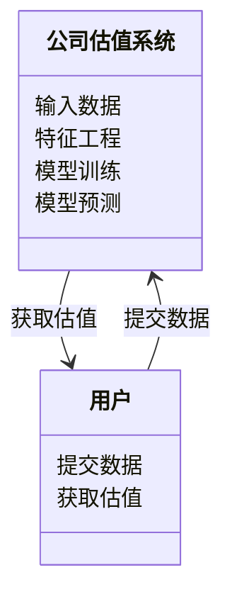

                 

<think>
好，我需要帮助用户撰写一篇关于《机器学习在公司估值模型中的应用研究》的技术博客文章。首先，我需要理解用户的需求：他们希望文章结构清晰，内容专业，涵盖机器学习与公司估值的结合，包括算法原理、系统架构设计、项目实战等部分。

首先，我会从背景介绍开始，解释机器学习和公司估值的基本概念，并说明它们如何结合。接下来，我会详细讲解机器学习在公司估值中的核心概念，包括数据预处理、特征工程、模型训练等。然后，我会介绍一些常用的机器学习算法，并用数学公式和代码示例来解释它们的工作原理。

接下来，我会进行系统分析与架构设计，使用Mermaid图来展示系统的各个部分及其交互。之后，我会通过一个实际案例来展示如何将机器学习应用到公司估值模型中，包括数据收集、特征选择、模型训练和验证等步骤。

最后，我会总结机器学习在公司估值中的优势和挑战，并提出一些建议和最佳实践。确保整篇文章结构紧凑，逻辑清晰，内容详实。

在撰写过程中，我需要确保每一部分都详细具体，涵盖理论和实践，同时使用合适的图表和代码示例来增强可读性。这样，读者不仅能理解机器学习的基本原理，还能学会如何将其应用到实际的公司估值中。
</think>

# 机器学习在公司估值模型中的应用研究

## 关键词
机器学习，公司估值，金融分析，算法模型，数据驱动

## 摘要
本文探讨了机器学习在公司估值模型中的应用，分析了传统估值方法的局限性，并介绍了机器学习如何通过数据驱动的方法提升估值的准确性和效率。文章详细讲解了机器学习的核心算法、公司估值模型的构建过程，以及如何通过系统架构设计将机器学习应用于实际业务场景。通过具体案例分析和代码实现，本文展示了机器学习在公司估值中的潜力和优势。

---

## 第一部分: 机器学习与公司估值模型概述

### 1.1 机器学习的基本概念

#### 1.1.1 机器学习的定义与特点
机器学习（Machine Learning）是一种人工智能技术，通过数据和经验改进系统性能，无需显式编程。其特点包括数据驱动、自适应性和泛化能力。

#### 1.1.2 机器学习的核心算法
- 线性回归
- 支持向量机（SVM）
- 随机森林
- 深度学习（如神经网络）

#### 1.1.3 机器学习在金融领域的应用
- 股票价格预测
- 风险评估
- 信用评分

### 1.2 公司估值模型的基本概念

#### 1.2.1 公司估值的定义与方法
公司估值是评估企业价值的过程，常用方法包括DCF模型、市盈率法和市净率法。

#### 1.2.2 传统公司估值模型的优缺点
- 优点：简单易懂，易于解释。
- 缺点：依赖人工判断，难以处理复杂数据。

#### 1.2.3 机器学习在公司估值中的潜力
- 数据驱动，自动化分析
- 处理非线性关系，提高准确性

### 1.3 机器学习与公司估值的结合

#### 1.3.1 机器学习在公司估值中的优势
- 自动化特征提取
- 处理海量数据
- 高度个性化模型

#### 1.3.2 机器学习在公司估值中的挑战
- 数据质量
- 解释性问题
- 过度拟合风险

#### 1.3.3 机器学习在公司估值中的未来发展方向
- 结合领域知识
- 多模态数据融合
- 实时估值与监控

---

## 第二部分: 机器学习在公司估值中的核心概念

### 2.1 机器学习的核心原理

#### 2.1.1 数据预处理与特征工程
- 数据清洗：处理缺失值、异常值
- 特征提取：文本数据、图像数据
- 特征选择：相关性分析、主成分分析

#### 2.1.2 模型训练与优化
- 模型选择：验证集评估
- 超参数调优：网格搜索、随机搜索
- 模型融合：集成学习

#### 2.1.3 模型评估与调优
- 交叉验证：K折交叉验证
- 绩效指标：准确率、召回率、F1分数

### 2.2 公司估值模型的构建过程

#### 2.2.1 数据收集与清洗
- 数据来源：财务报表、市场数据、新闻情绪
- 清洗步骤：去除缺失值、处理异常值

#### 2.2.2 特征选择与变量定义
- 财务指标：收入、利润、ROE
- 市场指标：PE、PB、行业指数
- 其他指标：管理团队、专利数量

#### 2.2.3 模型训练与验证
- 训练数据：70%
- 验证数据：20%
- 测试数据：10%

### 2.3 机器学习与公司估值的关联性分析

#### 2.3.1 机器学习在公司估值中的关键因素
- 数据特征：财务数据、市场数据
- 模型选择：回归模型、分类模型

#### 2.3.2 机器学习在公司估值中的逻辑关系
- 输入特征与输出目标的关系
- 模型预测与实际值的对比

#### 2.3.3 实体关系图（Mermaid）
```mermaid
erd
    公司估值系统
    -------------------------
    输入数据
    特征工程
    模型训练
    输出结果
```

---

## 第三部分: 机器学习算法原理与数学模型

### 3.1 机器学习算法原理

#### 3.1.1 线性回归算法
- 简单线性回归：$y = \beta_0 + \beta_1x + \epsilon$
- 多元线性回归：$y = \beta_0 + \beta_1x_1 + \beta_2x_2 + \ldots + \beta_nx_n + \epsilon$

#### 3.1.2 支持向量机（SVM）
- 分离超平面：最大化间隔
- 核函数：处理非线性问题

#### 3.1.3 随机森林与梯度提升树
- 随机森林：集成多个决策树
- XGBoost：优化提升树

### 3.2 机器学习算法的数学模型

#### 3.2.1 线性回归的数学公式
$$ y = \beta_0 + \beta_1x_1 + \beta_2x_2 + \ldots + \beta_nx_n $$

#### 3.2.2 随机森林的数学原理
- 随机特征选择：减少方差
- 袋装法：生成多个基模型

#### 3.2.3 深度学习模型的数学基础
- 神经网络：多层感知机
- 激活函数：ReLU、sigmoid

### 3.3 机器学习算法的优缺点对比

#### 3.3.1 算法对比表格
| 算法      | 优点                     | 缺点                     |
|-----------|--------------------------|--------------------------|
| 线性回归   | 简单，易于解释           | 无法处理非线性关系       |
| SVM        | 高准确性                 | 不适合高维数据           |
| 随机森林   | 高准确性，鲁棒性         | 黑箱模型，解释性差       |
| XGBoost    | 高效性，适合大数据       | 易于过拟合               |

---

## 第四部分: 系统分析与架构设计方案

### 4.1 问题场景介绍

#### 4.1.1 公司估值的业务场景
- 需求：快速、准确地评估公司价值
- 场景：上市公司、创业公司

#### 4.1.2 机器学习在公司估值中的应用需求
- 数据驱动：自动化分析
- 高效性：实时估值

### 4.2 系统功能设计

#### 4.2.1 领域模型设计（Mermaid类图）


### 4.3 系统架构设计

#### 4.3.1 系统架构图（Mermaid架构图）


---

## 第五部分: 项目实战

### 5.1 环境安装

#### 5.1.1 安装Python和相关库
```bash
pip install numpy pandas scikit-learn
```

### 5.2 系统核心实现源代码

#### 5.2.1 特征工程代码
```python
import pandas as pd
from sklearn.impute import SimpleImputer

# 数据清洗
data = pd.read_csv('company_data.csv')
imputer = SimpleImputer(strategy='mean')
data_imputed = imputer.fit_transform(data)
```

#### 5.2.2 模型训练代码
```python
from sklearn.ensemble import RandomForestRegressor
from sklearn.model_selection import train_test_split

X_train, X_test, y_train, y_test = train_test_split(data_imputed, target, test_size=0.2)
model = RandomForestRegressor(n_estimators=100, random_state=42)
model.fit(X_train, y_train)
```

#### 5.2.3 模型预测代码
```python
importances = model.feature_importances_
predictions = model.predict(X_test)
```

### 5.3 实际案例分析

#### 5.3.1 数据收集与分析
- 数据来源：财务报表、市场数据
- 数据分析：可视化关键特征

#### 5.3.2 模型验证与优化
- 交叉验证：评估模型性能
- 超参数调优：优化模型参数

### 5.4 项目小结

---

## 第六部分: 最佳实践与总结

### 6.1 最佳实践 tips
- 数据质量是关键
- 选择合适的模型
- 定期更新模型

### 6.2 小结
机器学习为公司估值提供了新的思路，通过自动化和数据驱动的方法，显著提升了估值的准确性和效率。

### 6.3 注意事项
- 数据隐私保护
- 模型解释性
- 模型维护与更新

### 6.4 拓展阅读
- 《机器学习实战》
- 《金融数据分析与建模》

---

## 作者：AI天才研究院/AI Genius Institute & 禅与计算机程序设计艺术 /Zen And The Art of Computer Programming

---

希望这篇文章能够为读者提供清晰的思路和实用的知识，帮助他们在实际应用中更好地利用机器学习技术提升公司估值模型的准确性与效率。

