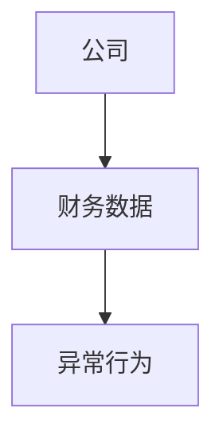
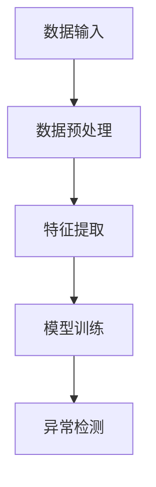
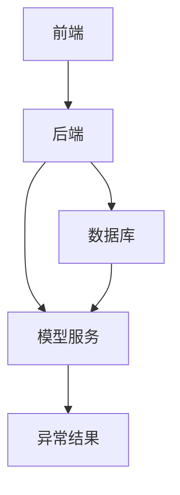
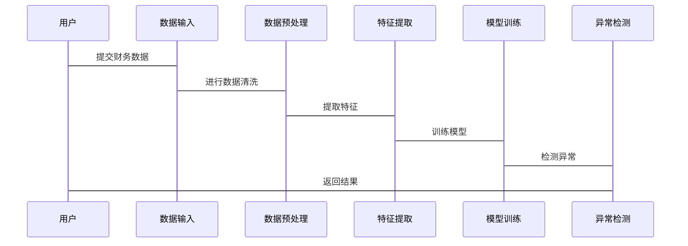

                 


# 《机器学习在公司财务异常检测中的应用》

> **关键词**：机器学习，财务异常检测，数据挖掘，预测模型，企业风险管理

> **摘要**：本文详细探讨了机器学习技术在公司财务异常检测中的应用，从基础概念到实际案例，系统性地分析了如何利用机器学习算法识别财务风险，优化企业财务管理。文章内容涵盖背景介绍、核心概念、算法原理、系统架构设计以及项目实战，为读者提供了从理论到实践的全面指导。

---

# 第一部分：背景介绍

## 第1章：机器学习与财务异常检测的背景

### 1.1 机器学习的基本概念
- **定义**：机器学习是一种通过数据训练模型，使其能够从经验中学习并做出预测的技术。
- **核心思想**：通过数据训练模型，使其能够识别模式和规律。
- **应用领域**：广泛应用于图像识别、自然语言处理、金融分析等领域。

### 1.2 财务异常检测的定义与重要性
- **定义**：通过分析财务数据，识别出与正常情况不符的异常行为或数据点。
- **重要性**：帮助企业在财务风险早期发现问题，避免重大损失。
- **应用场景**：企业财务审计、欺诈 detection、信用评估等。

### 1.3 机器学习在财务异常检测中的应用前景
- **技术优势**：能够处理大量非结构化数据，发现复杂模式。
- **发展趋势**：随着数据量和计算能力的提升，机器学习在财务领域的作用将更加显著。

---

## 第2章：核心概念与联系

### 2.1 机器学习与财务数据的关系
- **数据特征**：财务数据通常包括收入、支出、利润等，具有结构化特征。
- **模型选择**：根据数据分布选择合适的算法，如线性回归、随机森林等。
- **评价指标**：准确率、召回率、F1分数等。

### 2.2 实体关系图与流程图
#### **实体关系图（ER图）**


#### **流程图**


---

# 第二部分：算法原理

## 第3章：常见算法及其原理

### 3.1 逻辑回归
- **原理**：通过sigmoid函数将线性回归的输出映射到概率空间。
- **公式**：
  $$ P(y=1|x) = \frac{1}{1 + e^{-(\beta_0 + \beta_1x)}} $$
- **应用场景**：适合二分类问题，如欺诈 detection。

### 3.2 随机森林
- **原理**：通过构建多棵决策树，利用投票机制进行预测。
- **优势**：能够处理高维数据，具有较强的抗过拟合能力。
- **代码示例**：
  ```python
  from sklearn.ensemble import RandomForestClassifier
  model = RandomForestClassifier(n_estimators=100)
  model.fit(X_train, y_train)
  ```

### 3.3 神经网络
- **原理**：通过多层神经元网络模拟人脑的决策过程。
- **公式**：
  $$ a^{(l+1)} = g(a^{(l)}w + b) $$
  其中，$g$ 是激活函数，如ReLU或sigmoid。

---

## 第4章：数学模型与公式

### 4.1 逻辑回归模型
- **概率函数**：
  $$ P(y=1|x) = \frac{1}{1 + e^{-(\beta_0 + \beta_1x)}} $$
- **损失函数**：
  $$ L = -\sum_{i=1}^{n} [y_i \ln h(x_i) + (1 - y_i) \ln (1 - h(x_i))] $$

### 4.2 支持向量机模型
- **超平面方程**：
  $$ w \cdot x + b = 0 $$
- **软边距最大化**：
  $$ \max \xi_i \geq 0 $$

---

# 第三部分：系统分析与架构设计

## 第5章：系统架构设计

### 5.1 问题场景介绍
- **目标**：构建一个能够实时检测财务异常的系统。
- **用户角色**：财务部门、审计人员、企业管理层。

### 5.2 系统功能设计
#### **领域模型类图**


### 5.3 系统架构图


### 5.4 接口设计
- **REST API**：
  - 输入：财务数据 JSON 格式。
  - 输出：异常检测结果。

---

## 第6章：系统交互设计

### 6.1 序列图


---

# 第四部分：项目实战

## 第7章：环境安装与代码实现

### 7.1 环境安装
- **Python**：3.8+
- **库**：numpy、pandas、scikit-learn、matplotlib。

### 7.2 核心代码实现
#### **数据预处理**
```python
import pandas as pd
import numpy as np

# 示例数据
data = {
    '收入': [100, 200, 300, 400],
    '支出': [50, 100, 150, 200],
    '利润': [50, 100, 150, 200]
}
df = pd.DataFrame(data)
```

#### **特征提取**
```python
from sklearn.preprocessing import StandardScaler

scaler = StandardScaler()
scaled_data = scaler.fit_transform(df)
```

#### **模型训练**
```python
from sklearn.linear_model import LogisticRegression

model = LogisticRegression()
model.fit(scaled_data, df['利润'])
```

#### **异常检测**
```python
preds = model.predict(scaled_data)
print(preds)
```

### 7.3 案例分析
- **数据预处理**：清洗缺失值和异常值。
- **特征提取**：选择收入、支出作为特征。
- **模型训练**：使用逻辑回归进行分类。
- **结果分析**：评估模型准确率、召回率。

---

## 第8章：最佳实践与小结

### 8.1 最佳实践
- **数据质量**：确保数据清洗和标准化。
- **特征选择**：选择合适的特征，避免维度灾难。
- **模型调优**：通过交叉验证优化模型参数。

### 8.2 小结
- 机器学习为财务异常检测提供了强大的工具。
- 通过合理选择算法和优化模型，可以显著提升检测精度。

### 8.3 注意事项
- 数据隐私问题：确保数据安全。
- 模型解释性：选择易于解释的模型，便于业务人员理解。

### 8.4 拓展阅读
- 推荐书籍：《机器学习实战》、《深入浅出机器学习》。
- 工具推荐：Scikit-learn、TensorFlow、PyTorch。

---

# 作者

**作者：AI天才研究院/AI Genius Institute & 禅与计算机程序设计艺术 /Zen And The Art of Computer Programming**

---

希望这篇文章能够为您提供有价值的见解和实践指导。如果需要进一步讨论或获取更多资源，请随时联系！

