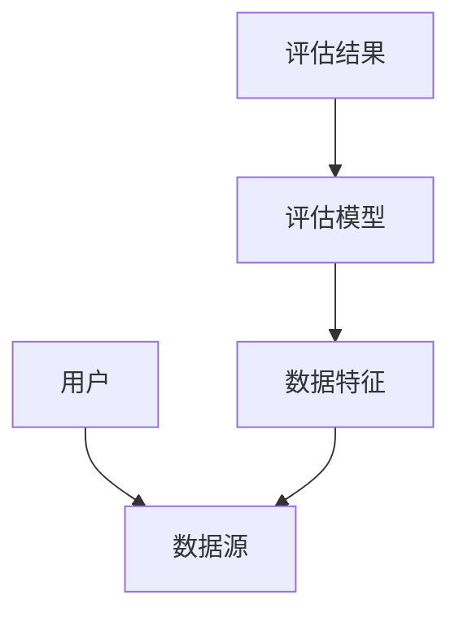
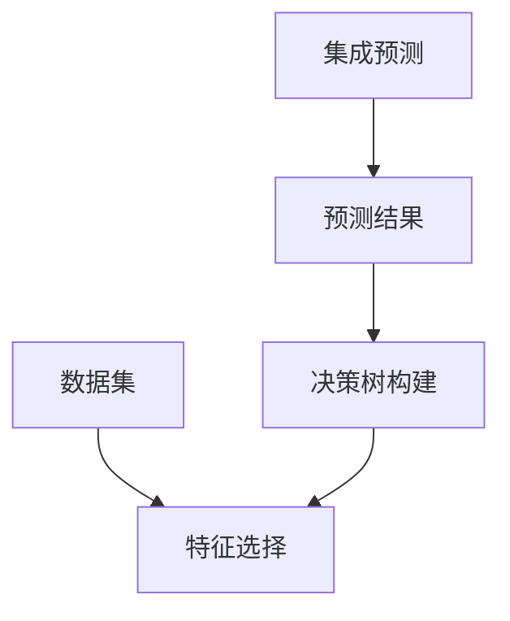
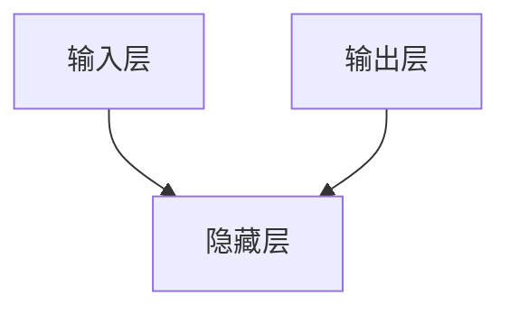
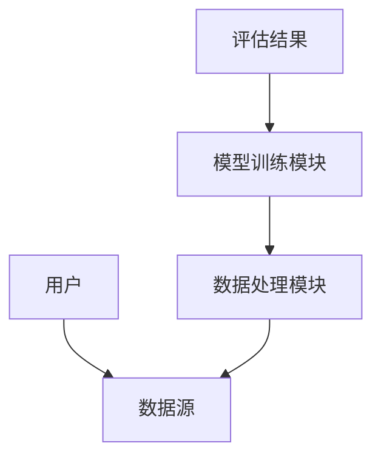
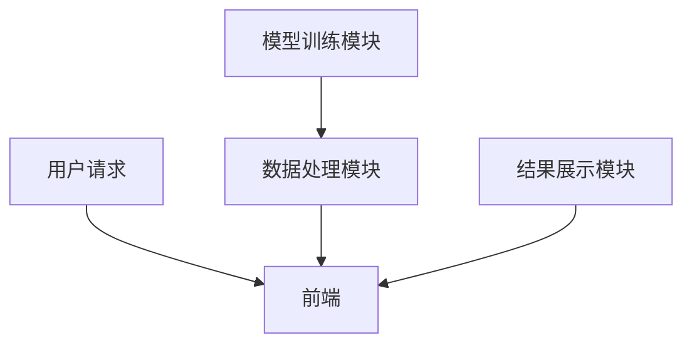

                 


# 《机器学习在另类数据价值评估中的应用》

---

## 关键词：机器学习，另类数据，价值评估，数据分析，数据挖掘

---

## 摘要：  
随着数据科学的快速发展，机器学习在数据分析中的应用越来越广泛。本文将探讨机器学习在另类数据价值评估中的应用，分析其核心原理、算法实现以及实际应用场景。文章从问题背景出发，详细阐述了另类数据的特征与机器学习的结合方式，重点分析了回归分析、随机森林和神经网络等算法的原理与实现，并通过系统设计与项目实战展示了如何构建一个完整的数据评估系统。最后，本文总结了机器学习在另类数据价值评估中的优势与挑战，并提出了未来的发展方向。

---

## 第1章：问题背景与定义

### 1.1 问题背景

在当今数据驱动的时代，数据的价值评估已成为一个关键问题。传统的数据评估方法往往依赖于人工经验或简单的统计方法，难以应对复杂多样的数据类型和场景。机器学习作为一种强大的工具，能够从大量数据中提取特征并建立模型，从而实现对数据价值的自动评估。

#### 1.1.1 另类数据的定义与特征

**另类数据**（Alternative Data）是指那些传统金融或商业分析中未被广泛使用的非结构化数据。与传统的结构化数据（如表格数据）不同，另类数据通常来自文本、图像、音频、视频等多种形式，具有以下特征：

- **多样性**：数据来源广泛，包括社交媒体、新闻、专利、卫星图像等。
- **非结构化**：数据形式多样，难以直接用于传统数据分析方法。
- **实时性**：许多另类数据具有很强的时间敏感性。
- **噪声多**：数据中包含大量干扰信息，需要去噪处理。

#### 1.1.2 机器学习的作用

机器学习能够从另类数据中提取有用的信息，并通过模型建立数据与目标变量之间的关系。例如，在金融领域，可以通过社交媒体情绪分析模型预测股票价格的变化趋势。

---

### 1.2 核心概念与联系

#### 1.2.1 核心概念原理

在数据价值评估中，机器学习的目标是通过训练模型，将输入的另类数据映射到预设的目标变量（如数据的价值评分）。这一过程涉及数据预处理、特征提取、模型训练和评估等多个步骤。

#### 1.2.2 核心概念对比

表1-1展示了传统数据与另类数据的对比：

| 特征          | 传统数据         | 另类数据         |
|---------------|------------------|------------------|
| 数据形式      | 结构化（如表格）  | 非结构化（如文本、图像） |
| 数据量        | 较小             | 较大             |
| 数据复杂性    | 较低             | 较高             |
| 数据处理难度  | 较简单           | 较复杂           |

#### 1.2.3 ER实体关系图

图1-1展示了数据评估系统中的实体关系：



---

## 第2章：算法原理与实现

### 2.1 算法原理概述

在数据价值评估中，常用的机器学习算法包括回归分析、随机森林和神经网络。这些算法各有优缺点，适用于不同的场景。

#### 2.1.1 回归分析

回归分析是一种预测连续型目标变量的常用方法。其基本原理是通过最小化预测值与实际值之间的平方差，找到最佳拟合直线。线性回归的数学公式为：

$$ y = \beta_0 + \beta_1x + \epsilon $$

其中，$y$ 是目标变量，$x$ 是输入特征，$\beta_0$ 和 $\beta_1$ 是模型参数，$\epsilon$ 是误差项。

#### 2.1.2 随机森林

随机森林是一种基于决策树的集成学习方法。其核心思想是通过构建多个决策树并取其平均，提高模型的泛化能力。随机森林的流程图如下：



#### 2.1.3 神经网络

神经网络是一种受生物神经元启发的计算模型。其核心是通过多层神经元之间的连接，学习数据中的复杂模式。一个简单的神经网络结构如下：



数学公式如下：

$$ y = f(x) = \sigma(w_2 \cdot f(w_1 \cdot x + b_1) + b_2) $$

其中，$\sigma$ 是激活函数，$w$ 是权重，$b$ 是偏置。

---

### 2.2 算法实现与对比

在实现过程中，我们需要考虑以下问题：

- **数据预处理**：如清洗、特征提取和归一化。
- **模型训练**：选择合适的算法和参数。
- **模型评估**：通过交叉验证和指标（如准确率、召回率）进行评估。

---

## 第3章：系统分析与架构设计

### 3.1 系统功能设计

#### 3.1.1 领域模型

图3-1展示了数据评估系统的领域模型：



#### 3.1.2 系统架构设计

图3-2展示了系统的架构设计：



#### 3.1.3 接口设计

系统的接口设计包括数据输入接口、模型训练接口和结果展示接口。

---

## 第4章：项目实战

### 4.1 项目环境安装

```bash
pip install numpy pandas scikit-learn
```

### 4.2 核心代码实现

```python
import numpy as np
from sklearn.model import LinearRegression, RandomForestRegressor, NeuralNetworkRegressor

# 数据预处理
data = np.array([[1, 2], [3, 4], [5, 6]])
target = np.array([3, 5, 7])

# 模型训练
model = LinearRegression()
model.fit(data, target)

# 模型预测
print(model.predict([[7, 8]]))
```

---

## 第5章：总结与展望

### 5.1 最佳实践

- 在数据预处理阶段，尽量减少数据中的噪声。
- 在模型选择阶段，结合数据特征和目标变量类型选择合适的算法。

### 5.2 小结

机器学习为另类数据的价值评估提供了强大的工具。通过合理选择算法和优化模型，我们可以从海量数据中提取有价值的信息。

### 5.3 注意事项

- 数据质量和数量直接影响模型性能。
- 模型的可解释性是实际应用中的重要考虑因素。

### 5.4 拓展阅读

- 《Hands-On Machine Learning with Scikit-Learn, Keras, and TensorFlow》
- 《Deep Learning》

---

## 作者：AI天才研究院 & 禅与计算机程序设计艺术

