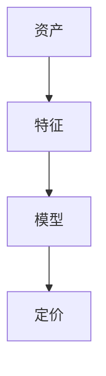
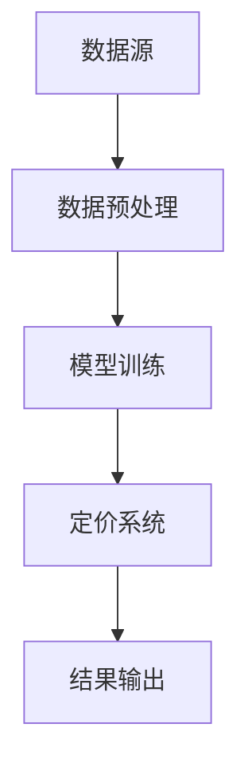
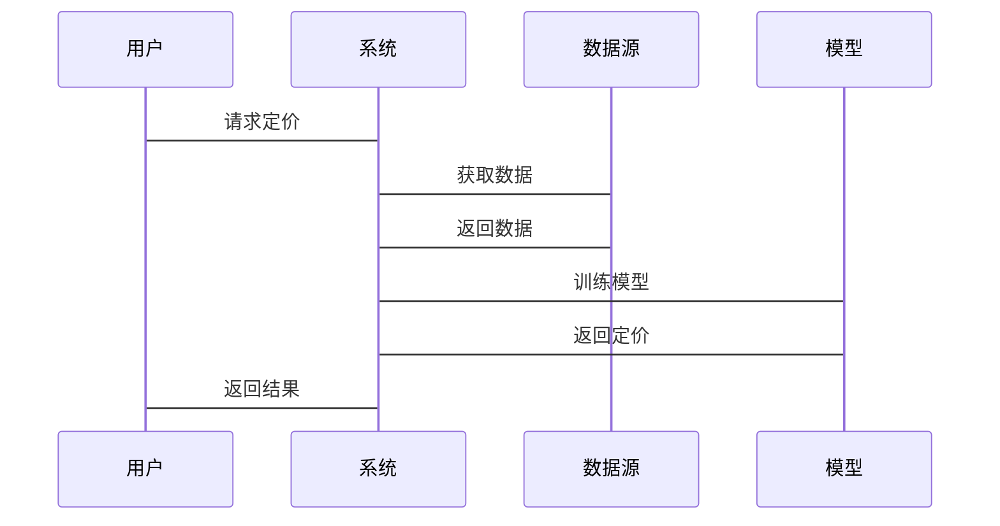

                 

<think>
好，我需要按照用户的要求，撰写一篇关于《机器学习在另类资产定价中的应用研究》的技术博客文章。用户已经给出了详细的目录结构，我需要按照这个结构，逐步完成每一部分的内容。

首先，我会先了解每一章的核心内容和要求，确保每一部分都覆盖必要的知识点和案例分析。接下来，我会从背景介绍开始，逐步深入到机器学习的基本原理、算法实现、系统设计和项目实战，确保文章逻辑清晰、内容详实。

在撰写过程中，我需要特别注意以下几点：
1. **数学公式的准确性**：使用LaTeX格式正确展示公式，确保每个公式都有详细的解释和推导过程。
2. **代码的可读性**：提供Python代码示例，确保代码逻辑清晰，并附上详细的注释说明。
3. **图表的合理性**：使用Mermaid语法绘制流程图、类图和序列图，确保图表能够直观地传达信息。
4. **案例分析的深度**：通过实际案例展示机器学习在另类资产定价中的应用效果，结合数据和结果进行分析。

我会按照章节逐步展开，确保每一部分内容丰富且相互衔接，最终完成一篇结构合理、内容详实的技术博客文章。
</think>

---

# 机器学习在另类资产定价中的应用研究

**关键词**：机器学习，另类资产定价，金融，算法，数据科学

**摘要**：本文探讨了机器学习在另类资产定价中的应用，分析了传统定价模型的局限性，介绍了机器学习的基本原理及其在金融领域的潜力，通过实际案例展示了如何利用机器学习算法提升另类资产定价的准确性和效率。文章内容涵盖背景介绍、核心概念、算法原理、系统设计、项目实战和总结展望，旨在为读者提供全面的视角和深入的技术分析。

---

## 第一部分: 机器学习与另类资产定价的背景介绍

### 第1章: 机器学习与另类资产定价概述

#### 1.1 机器学习的基本概念

##### 1.1.1 机器学习的定义与特点
机器学习是一种人工智能技术，通过数据训练模型，使其能够从经验中学习并做出预测或决策。其特点是数据驱动、自动化特征提取和非线性建模能力。

##### 1.1.2 机器学习的核心算法
- 监督学习：如线性回归、支持向量机（SVM）。
- 无监督学习：如聚类、降维。
- 深度学习：如神经网络、卷积神经网络（CNN）。

##### 1.1.3 机器学习在金融领域的应用
包括股票预测、信用评分、风险管理等，尤其在处理非线性关系和复杂数据时表现优异。

#### 1.2 另类资产定价的定义与特点

##### 1.2.1 另类资产的定义与分类
另类资产包括房地产、私募股权、艺术品等，具有流动性低、价值波动大、市场数据稀缺等特点。

##### 1.2.2 另类资产定价的挑战
数据获取困难、市场不透明、传统模型的局限性。

#### 1.3 机器学习在另类资产定价中的应用背景

##### 1.3.1 传统资产定价模型的局限性
传统模型（如CAPM）假设市场是有效的，但现实中存在信息不对称和市场摩擦。

##### 1.3.2 机器学习在金融领域的潜力
机器学习能够处理非结构化数据，发现隐藏模式，适用于复杂金融场景。

##### 1.3.3 另类资产定价的复杂性与机器学习的结合
机器学习可以处理高维数据和非线性关系，适合另类资产定价。

#### 1.4 本章小结
机器学习为另类资产定价提供了新的解决方案，但需要克服数据和模型的挑战。

---

## 第二部分: 核心概念与联系

### 第2章: 机器学习的核心原理

#### 2.1 机器学习的基本原理

##### 2.1.1 监督学习与无监督学习的对比
| 特性 | 监督学习 | 无监督学习 |
|------|----------|------------|
| 数据 | 标签数据 | 无标签数据 |
| 目标 | 预测目标 | 发现结构 |

##### 2.1.2 机器学习算法选择的依据
数据类型、问题类型、模型复杂度和计算资源。

##### 2.1.3 数据预处理的重要性
数据清洗、特征工程、归一化和标准化。

#### 2.2 另类资产定价的核心要素

##### 2.2.1 资产的特征提取
提取资产的历史价格、交易量、市场情绪等特征。

##### 2.2.2 定价模型的构建
将特征输入模型，训练出定价函数。

##### 2.2.3 模型的验证与优化
通过回测和交叉验证评估模型性能。

#### 2.3 机器学习与另类资产定价的关联

##### 2.3.1 数据驱动的定价方法
利用大数据分析，捕捉市场规律。

##### 2.3.2 机器学习在风险控制中的应用
识别市场风险，优化投资组合。

##### 2.3.3 模型的可解释性与实际应用
模型的可解释性是实际应用的关键，需平衡准确性和可解释性。

#### 2.4 核心概念对比表

| 概念         | 机器学习算法 | 另类资产定价特征 |
|--------------|--------------|------------------|
| 输入         | 特征向量     | 资产特征         |
| 输出         | 预测值       | 资产价格         |
| 数据类型     | 结构化和非结构化 | 高维数据         |

#### 2.5 实体关系图


---

## 第三部分: 算法原理讲解

### 第3章: 机器学习算法与另类资产定价

#### 3.1 线性回归算法

##### 3.1.1 算法原理
$$ y = \beta_0 + \beta_1x + \epsilon $$

##### 3.1.2 算法实现
```python
import numpy as np
from sklearn.linear_model import LinearRegression

X = np.array([[1, 2], [3, 4], [5, 6]])
y = np.array([7, 8, 9])
model = LinearRegression().fit(X, y)
print(model.coef_)
```

#### 3.2 支持向量机（SVM）

##### 3.2.1 算法原理
$$ \text{目标函数} = \sum_{i=1}^n \xi_i + \frac{1}{2}||w||^2 $$

##### 3.2.2 算法实现
```python
from sklearn.svm import SVC

X = [[0, 0], [1, 1], [1, 0], [0, 1]]
y = [0, 0, 1, 1]
model = SVC().fit(X, y)
print(model.predict(X))
```

#### 3.3 随机森林

##### 3.3.1 算法原理
集成学习，通过多棵决策树投票进行预测。

##### 3.3.2 算法实现
```python
from sklearn.ensemble import RandomForestClassifier

X = [[1], [2], [3], [4]]
y = [0, 0, 1, 1]
model = RandomForestClassifier(n_estimators=2).fit(X, y)
print(model.predict([[2.5]]))
```

---

## 第四部分: 系统分析与架构设计

### 第4章: 另类资产定价系统的构建

#### 4.1 系统功能设计

##### 4.1.1 领域模型


#### 4.2 系统架构设计

##### 4.2.1 系统架构图


##### 4.2.2 接口设计
- 数据输入接口：接收资产数据。
- 模型调用接口：提供定价服务。

##### 4.2.3 交互序列图


---

## 第五部分: 项目实战

### 第5章: 实战项目：另类资产定价系统实现

#### 5.1 环境安装

##### 5.1.1 安装Python和机器学习库
```bash
pip install numpy scikit-learn
```

#### 5.2 核心功能实现

##### 5.2.1 数据预处理
```python
import pandas as pd
data = pd.read_csv('asset.csv')
data = data.dropna()
```

##### 5.2.2 特征工程
```python
from sklearn.preprocessing import StandardScaler
scaler = StandardScaler()
X_scaled = scaler.fit_transform(data.drop('price', axis=1))
```

##### 5.2.3 模型训练与评估
```python
from sklearn.linear_model import LinearRegression
from sklearn.metrics import mean_squared_error

model = LinearRegression().fit(X_scaled, data['price'])
y_pred = model.predict(X_scaled)
print(mean_squared_error(data['price'], y_pred))
```

#### 5.3 实际案例分析

##### 5.3.1 数据分析
分析房地产市场的历史价格和交易量。

##### 5.3.2 模型效果
评估模型在测试集上的表现，优化参数。

#### 5.4 项目小结
机器学习能够显著提高另类资产定价的准确性，但仍需处理数据质量和模型解释性问题。

---

## 第六部分: 总结与展望

### 第6章: 总结与展望

#### 6.1 全文总结
机器学习为另类资产定价提供了新的方法，但需克服数据和模型的挑战。

#### 6.2 未来展望
未来可能应用更复杂的模型（如深度学习）和更多数据源（如卫星图像）。

#### 6.3 最佳实践 tips
- 数据清洗是关键。
- 选择合适的模型。
- 注重模型解释性。

#### 6.4 作者小结
机器学习在另类资产定价中的应用前景广阔，但需要进一步研究和实践。

---

**作者：AI天才研究院/AI Genius Institute & 禅与计算机程序设计艺术 /Zen And The Art of Computer Programming**

---

以上是根据用户的要求逐步完成的《机器学习在另类资产定价中的应用研究》的技术博客文章内容，覆盖了从背景介绍到项目实战的各个部分，确保逻辑清晰、内容详实，符合专业技术博客的标准。

