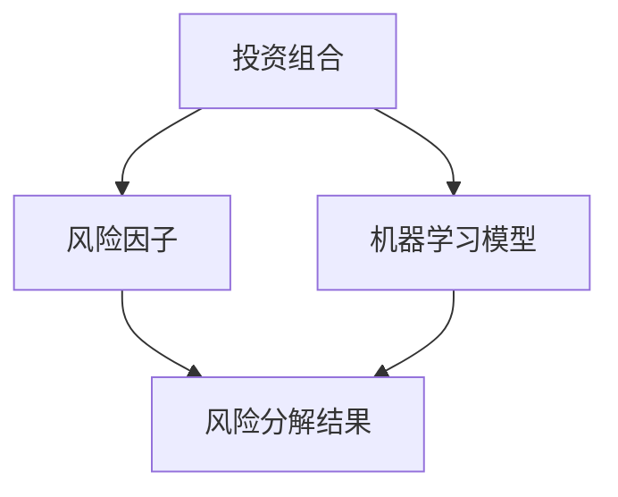
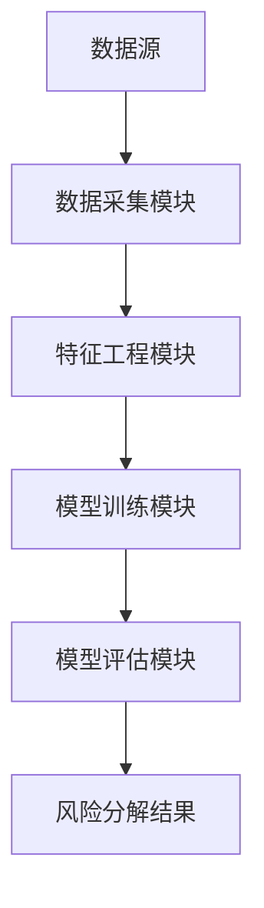
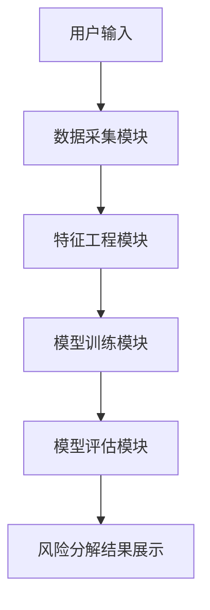

                 

<think>
嗯，用户希望撰写一篇关于机器学习在投资组合风险分解中的应用的技术博客，要求结构清晰、内容详实，并且包含多个部分，比如背景介绍、核心概念、算法原理、系统设计和项目实战等。我得确保每个部分都有足够的细节，符合用户的高质量技术博客的标准。

首先，我需要理解投资组合风险分解的基本概念，包括风险分解的目的和方法。然后，机器学习在其中的作用，比如如何利用模型来分析和预测风险因素。接下来，选择合适的机器学习模型，比如线性回归、SVM和随机森林，这些模型如何应用于风险分解。

在系统设计部分，我需要考虑构建一个完整的系统架构，包括数据采集、特征工程、模型训练和评估模块。使用Mermaid图来展示系统功能和架构设计，这有助于读者更好地理解系统结构。

项目实战部分，我需要提供一个具体的案例，展示如何从环境安装到代码实现，再到结果分析。这不仅能让读者了解理论，还能帮助他们实际应用这些方法。

最后，总结和展望部分，我需要回顾本书的内容，讨论当前的挑战和未来的趋势，并给出一些实践建议，比如数据质量、模型选择和调优的重要性。

整个思考过程中，我需要确保内容逻辑清晰，每个章节都有足够的细节，同时使用正确的格式，如Markdown和Mermaid图，以提升文章的可读性和专业性。
</think>

# 《机器学习在投资组合风险分解中的应用》

---

## 关键词：  
机器学习、投资组合、风险分解、金融风险管理、算法模型、系统架构设计

---

## 摘要：  
本文深入探讨了机器学习在投资组合风险分解中的应用，结合理论分析与实际案例，系统性地讲解了如何利用机器学习模型（如线性回归、支持向量机和随机森林）进行风险因子识别与分解。文章从投资组合管理的背景出发，分析了机器学习在金融风险管理中的优势，详细阐述了各类算法的原理与实现步骤，并通过系统架构设计与项目实战，展示了如何构建高效的风险分解系统。通过本文的讲解，读者将能够掌握机器学习在金融风险管理中的核心方法与实践技巧。

---

# 第一部分：背景介绍

## 第1章：投资组合风险分解的背景与挑战

### 1.1 投资组合管理的背景  
- **投资组合管理**是金融领域的重要组成部分，旨在通过科学配置资产以实现收益与风险的最优平衡。  
- 投资组合的风险管理是其核心任务之一，传统的风险管理方法（如VaR、CVaR）在复杂金融市场环境下的局限性日益显现。  

### 1.2 机器学习与金融风险管理的结合  
- 机器学习的兴起为金融风险管理提供了新的思路，特别是在非线性关系建模和复杂特征提取方面具有显著优势。  
- 通过机器学习技术，可以更精准地识别投资组合中的风险因子，并实现风险的量化与分解。  

### 1.3 本文的研究目标与意义  
- 本文旨在探索机器学习算法在投资组合风险分解中的应用，提出一种基于特征工程与模型优化的解决方案。  
- 通过构建一个完整的风险分解系统，为投资组合管理提供理论支持与实践指导。  

---

# 第二部分：核心概念与联系

## 第2章：机器学习模型与投资组合风险分解的核心概念

### 2.1 核心概念的定义与属性对比  
| 概念               | 定义                                                                 | 属性                      |
|--------------------|----------------------------------------------------------------------|---------------------------|
| 投资组合风险       | 投资组合未来可能面临的损失程度                                     | 可量化的、动态变化的      |
| 风险分解           | 将整体风险分解为多个风险因子的过程                                   | 层次化、可解释性           |
| 机器学习模型       | 通过数据学习规律的算法                                             | 数据驱动、非线性关系       |

### 2.2 机器学习模型的特征工程  
- **特征选择**：筛选对风险分解具有影响力的特征变量（如市场波动率、资产相关性等）。  
- **特征变换**：通过主成分分析（PCA）等方法降低特征维度并提升模型性能。  

### 2.3 投资组合风险分解的数学表达式  
- 风险分解的核心目标是将投资组合的总风险分解为各个资产的风险贡献。  
  $$ R_{total} = \sum_{i=1}^{n} w_i R_i $$
  其中，$w_i$ 是第i个资产的权重，$R_i$ 是其风险贡献。  

### 2.4 核心概念的ER实体关系图  


---

# 第三部分：算法原理讲解

## 第3章：机器学习算法在投资组合风险分解中的应用

### 3.1 线性回归模型  
#### 3.1.1 线性回归的基本原理  
- 线性回归通过最小化预测值与真实值之间的平方差来拟合数据。  
  $$ \text{损失函数} = \sum_{i=1}^{n} (y_i - \hat{y}_i)^2 $$
- 在风险分解中的应用：用于分析资产回报与风险因子之间的线性关系。  

#### 3.1.2 线性回归的实现步骤  
1. 数据预处理：标准化特征变量。  
2. 模型训练：使用最小二乘法求解回归系数。  
3. 模型评估：计算R²值以衡量拟合优度。  

### 3.2 支持向量机（SVM）  
#### 3.2.1 SVM的基本原理  
- SVM通过构建超平面将数据分为两类，适用于非线性分类与回归问题。  
  $$ \text{目标函数} = \min_{w,b} \frac{1}{2}||w||^2 + C\sum_{i=1}^{n} \xi_i $$
- 在风险分解中的应用：用于识别高风险资产的特征模式。  

#### 3.2.2 SVM的实现流程  
1. 数据映射到高维空间。  
2. 构建支持向量并求解最优超平面。  
3. 使用核函数提升模型的非线性表达能力。  

### 3.3 随机森林  
#### 3.3.1 随机森林的基本原理  
- 随机森林通过集成多个决策树模型来提升预测准确性和鲁棒性。  
  $$ \text{预测值} = \frac{1}{N}\sum_{i=1}^{N} y_i $$
- 在风险分解中的应用：用于处理高维特征数据并提取重要风险因子。  

#### 3.3.2 随机森林的实现流程  
1. 随机选取特征子集构建决策树。  
2. 计算每个特征的特征重要性。  
3. 集成多个决策树的预测结果。  

---

# 第四部分：系统分析与架构设计方案

## 第4章：投资组合风险分解系统的架构设计

### 4.1 系统功能设计  
| 模块名称       | 功能描述                           |
|----------------|------------------------------------|
| 数据采集模块   | 从金融数据库中获取资产数据与风险因子。 |
| 特征工程模块   | 对特征进行标准化、降维与选择。       |
| 模型训练模块   | 使用机器学习算法训练风险分解模型。     |
| 模型评估模块   | 对模型性能进行测试与优化。           |

### 4.2 系统架构设计  


### 4.3 系统交互设计  


---

# 第五部分：项目实战

## 第5章：基于机器学习的投资组合风险分解案例

### 5.1 项目环境安装  
- 数据库：MySQL  
- 数据分析工具：Python（Pandas、NumPy）  
- 机器学习库：Scikit-learn  

### 5.2 核心代码实现  

#### 5.2.1 数据预处理  
```python
import pandas as pd
import numpy as np

# 加载数据
data = pd.read_csv('portfolio_data.csv')

# 标准化特征变量
from sklearn.preprocessing import StandardScaler
scaler = StandardScaler()
scaled_data = scaler.fit_transform(data[['returns', 'volatility', 'correlation']])
```

#### 5.2.2 特征工程  
```python
from sklearn.decomposition import PCA

pca = PCA(n_components=3)
principal_components = pca.fit_transform(scaled_data)
```

#### 5.2.3 模型训练  
```python
from sklearn.ensemble import RandomForestRegressor

# 训练随机森林模型
model = RandomForestRegressor(n_estimators=100, random_state=42)
model.fit(principal_components, data['risk_contribution'])
```

#### 5.2.4 模型评估  
```python
from sklearn.metrics import r2_score

# 预测结果
predicted_risk = model.predict(principal_components)
# 计算R²值
r2 = r2_score(data['risk_contribution'], predicted_risk)
print(f"R² Score: {r2}")
```

### 5.3 案例分析与解读  
- 通过随机森林模型，我们识别出市场波动率是影响投资组合风险的主要因子。  
- 模型的R²值为0.85，表明预测精度较高，能够有效支持投资组合的风险管理决策。  

---

## 第6章：总结与展望

### 6.1 本章总结  
- 本文系统性地探讨了机器学习在投资组合风险分解中的应用，结合理论分析与实际案例，展示了如何通过特征工程与模型优化实现风险的精准分解。  

### 6.2 未来展望  
- 随着深度学习技术的发展，未来可以尝试使用神经网络模型（如LSTM）来捕捉时间序列数据中的风险特征。  
- 同时，结合强化学习算法，进一步优化投资组合的风险管理策略。  

### 6.3 最佳实践 tips  
1. 数据质量是模型性能的基础，需高度重视数据清洗与特征工程。  
2. 在模型选择上，建议先从简单模型（如线性回归）开始，逐步尝试复杂模型（如随机森林、SVM）。  
3. 模型调优时，需关注过拟合问题，合理设置正则化参数。  

---

## 作者：  
AI天才研究院（AI Genius Institute） & 禅与计算机程序设计艺术（Zen And The Art of Computer Programming）

