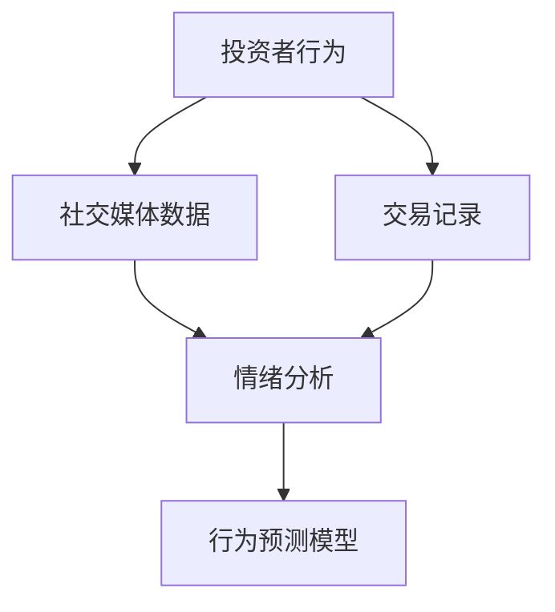
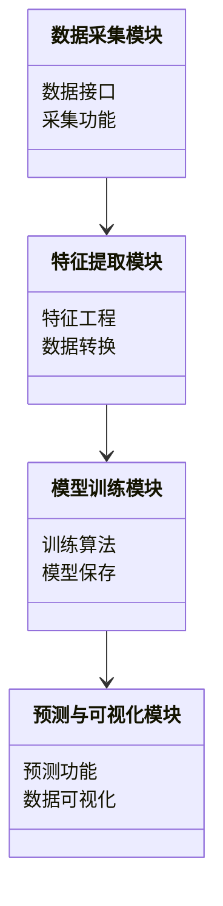
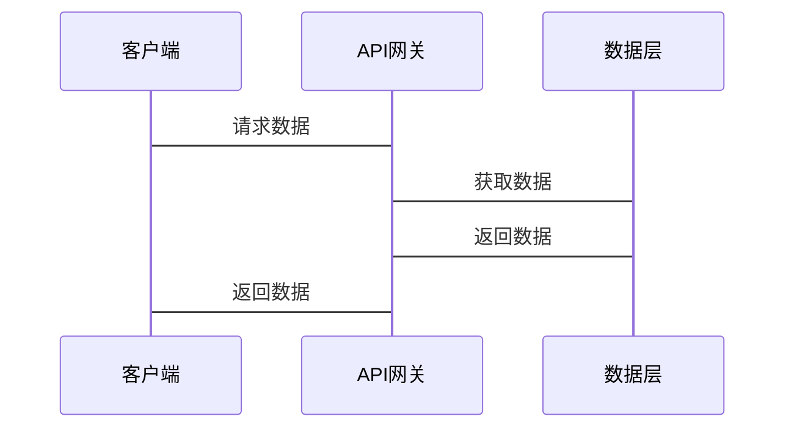

                 

<think>
好，我需要撰写一篇关于《机器学习在投资者行为分析中的应用》的文章。首先，我应该明确文章的结构和主要内容。

文章的标题是《机器学习在投资者行为分析中的应用》，关键词包括投资者行为分析、机器学习、情感分析、预测模型、数据挖掘、投资决策、风险管理。

摘要部分需要简明扼要地介绍机器学习在投资者行为分析中的应用，强调其重要性，并指出文章将如何展开。

接下来是目录大纲，已经给出了初步的结构，我需要根据这个结构逐步展开每一部分内容。

在写作过程中，我需要确保每一部分内容详细且逻辑清晰。例如，在第一章中，我需要介绍机器学习的基本概念、投资者行为分析的基本概念，以及它们结合的背景和应用价值。

在第二章中，我需要深入探讨机器学习与投资者行为分析的核心概念，包括数据特征工程、模型选择策略以及行为建模方法。

第三章要讲解常用机器学习算法的原理，如监督学习、无监督学习和深度学习，并结合投资者行为分析的具体场景进行举例说明。

第四章涉及系统设计与架构，我需要描述投资者行为分析系统的功能设计、架构设计、接口设计和交互流程。

第五章是项目实战，我需要通过一个具体案例来展示如何构建投资者情绪分析系统，包括数据采集、特征提取、模型训练和结果分析。

第六章则探讨高级主题和最佳实践，如模型评估、实时行为分析、伦理风险以及实际案例分析。

在写作过程中，我需要使用数学公式来解释算法原理，使用mermaid图表来展示系统架构和流程图，确保内容直观易懂。

最后，我需要在文章末尾添加作者信息，并根据需要进行校对和调整，确保文章的完整性和专业性。

总的来说，我需要按照逻辑顺序，逐步展开每一部分内容，确保文章结构清晰，内容详实，能够帮助读者全面理解机器学习在投资者行为分析中的应用。
</think>

# 《机器学习在投资者行为分析中的应用》

## 关键词：
投资者行为分析、机器学习、情感分析、预测模型、数据挖掘、投资决策、风险管理

## 摘要：
机器学习在投资者行为分析中发挥着越来越重要的作用。通过分析投资者的行为数据，机器学习可以帮助我们更好地理解投资者的决策模式、预测市场趋势，并制定更有效的投资策略。本文将从机器学习的基本概念、投资者行为分析的核心要素入手，详细探讨机器学习在投资者行为分析中的应用。通过实际案例分析和系统设计，我们将展示如何利用机器学习技术构建投资者行为分析系统，从而为投资决策提供科学依据。

---

# 第一部分: 机器学习与投资者行为分析基础

## 第1章: 机器学习与投资者行为分析概述

### 1.1 机器学习的基本概念

#### 1.1.1 机器学习的定义与核心概念
机器学习是一种人工智能技术，通过数据训练模型，使其能够从经验中学习并做出预测或决策。其核心概念包括数据、特征、模型和算法。

#### 1.1.2 机器学习的分类与特点
机器学习主要分为监督学习、无监督学习和强化学习。监督学习通过标签数据进行训练，无监督学习在无标签数据中发现模式，强化学习通过奖励机制优化决策。

#### 1.1.3 机器学习在金融领域的应用潜力
在金融领域，机器学习广泛应用于股票预测、风险评估、信用评分和交易策略优化等方面。

### 1.2 投资者行为分析的基本概念

#### 1.2.1 投资者行为的定义与分类
投资者行为指投资者在金融市场中的决策和交易行为，分为个体行为和机构行为。

#### 1.2.2 投资者行为分析的常用方法
常用方法包括情绪分析、交易频率分析和行为模式识别。

#### 1.2.3 投资者行为分析的挑战与难点
挑战包括数据多样性、行为复杂性和模型泛化能力不足等问题。

### 1.3 机器学习与投资者行为分析的结合背景

#### 1.3.1 机器学习在金融领域的应用现状
机器学习已应用于金融时间序列预测、信用评分和欺诈检测等领域。

#### 1.3.2 投资者行为数据的特性与优势
投资者行为数据具有实时性、多样性和动态性，为机器学习提供了丰富的训练材料。

#### 1.3.3 机器学习在投资者行为分析中的独特价值
机器学习能够捕捉复杂的行为模式，提供个性化投资建议和风险管理工具。

### 1.4 本书的核心目标与结构安排

#### 1.4.1 本书的核心目标
本书旨在探讨机器学习在投资者行为分析中的应用，提供理论和实践指导。

#### 1.4.2 本书的章节安排
文章分为六章，涵盖基础、核心概念、算法、系统设计、项目实战和高级主题。

#### 1.4.3 本书的读者群体
适合金融从业者、数据科学家和对机器学习与金融结合感兴趣的读者。

### 1.5 本章小结
本章介绍了机器学习和投资者行为分析的基本概念，探讨了它们结合的背景和应用价值。

---

## 第2章: 机器学习与投资者行为分析的核心概念

### 2.1 机器学习的核心原理

#### 2.1.1 数据、特征与模型的关系
数据是模型训练的基础，特征是数据的关键属性，模型通过学习特征关系进行预测。

#### 2.1.2 监督学习与无监督学习的区别
监督学习基于标签数据，无监督学习在无标签数据中发现结构。

#### 2.1.3 深度学习的基本原理
深度学习通过多层神经网络提取高阶特征，适用于复杂模式识别。

### 2.2 投资者行为分析的核心要素

#### 2.2.1 投资者情绪与决策的特征
情绪波动影响投资决策，可通过文本分析和交易数据捕捉。

#### 2.2.2 投资者行为数据的类型
包括交易记录、社交媒体数据和市场数据。

#### 2.2.3 投资者行为分析的指标体系
如情绪指数、交易活跃度和风险偏好指标。

### 2.3 机器学习与投资者行为分析的联系

#### 2.3.1 机器学习如何捕捉投资者行为特征
通过自然语言处理分析文本情绪，使用聚类分析识别行为模式。

#### 2.3.2 投资者行为数据如何为机器学习提供价值
多样化的数据增强模型鲁棒性，实时数据支持动态预测。

#### 2.3.3 机器学习在投资者行为预测中的优势
高维数据处理能力、复杂模式识别和个性化预测能力。

### 2.4 核心概念对比与联系

#### 2.4.1 核心概念属性对比表
| 概念 | 定义 | 特性 |
|------|------|------|
| 机器学习 | 数据驱动的模型训练 | 数据依赖性高 |
| 投资者行为分析 | 研究投资者决策模式 | 实时性和动态性 |

#### 2.4.2 ER实体关系图（Mermaid流程图）


### 2.5 本章小结
本章深入探讨了机器学习与投资者行为分析的核心概念，建立了它们之间的联系。

---

## 第3章: 机器学习算法原理与投资者行为分析

### 3.1 常用机器学习算法概述

#### 3.1.1 监督学习算法
- **线性回归**：用于预测连续变量，如股票价格。
- **逻辑回归**：用于分类问题，如判断投资者情绪是正面还是负面。

#### 3.1.2 无监督学习算法
- **聚类分析**：识别投资者行为模式。
- **主成分分析（PCA）**：降维处理，提取关键特征。

#### 3.1.3 深度学习算法
- **神经网络**：处理复杂非线性关系。
- **循环神经网络（RNN）**：适用于时间序列预测。

### 3.2 投资者行为分析中的算法选择

#### 3.2.1 算法选择策略
根据数据类型和问题类型选择合适的算法，如监督学习用于分类问题。

#### 3.2.2 算法实现步骤
1. 数据预处理：清洗和特征提取。
2. 模型训练：选择算法并训练模型。
3. 模型评估：验证准确率和召回率。

### 3.3 机器学习算法在投资者行为分析中的应用实例

#### 3.3.1 情感分析
使用自然语言处理技术分析社交媒体上的投资者情绪，构建情绪指数。

#### 3.3.2 交易行为预测
利用聚类分析识别投资者交易模式，预测市场趋势。

### 3.4 算法优缺点分析

#### 3.4.1 监督学习
优点：适合分类和回归问题；缺点：需要大量标注数据。

#### 3.4.2 无监督学习
优点：发现隐藏模式；缺点：结果解释性差。

#### 3.4.3 深度学习
优点：处理复杂模式；缺点：计算资源需求高。

### 3.5 本章小结
本章介绍了常用机器学习算法，并探讨了它们在投资者行为分析中的应用。

---

## 第4章: 投资者行为分析系统的系统设计与架构

### 4.1 投资者行为分析系统的功能设计

#### 4.1.1 系统功能模块
- 数据采集模块：收集交易记录和社交媒体数据。
- 特征提取模块：提取投资者行为特征。
- 模型训练模块：训练预测模型。
- 预测与可视化模块：输出预测结果和可视化分析。

#### 4.1.2 领域模型设计（Mermaid类图）


### 4.2 系统架构设计

#### 4.2.1 分层架构设计
- 数据层：存储原始数据。
- 服务层：处理数据和模型训练。
- 表示层：展示结果和用户交互。

#### 4.2.2 系统架构图（Mermaid架构图）


### 4.3 接口设计

#### 4.3.1 RESTful API设计
- GET /data: 获取数据
- POST /train: 启动模型训练
- GET /predict: 获取预测结果

#### 4.3.2 数据格式规范
使用JSON格式传输数据，确保模块间数据兼容性。

### 4.4 交互流程设计（Mermaid序列图）



### 4.5 本章小结
本章详细设计了投资者行为分析系统的功能模块、架构和接口，为后续实现奠定了基础。

---

## 第5章: 项目实战——构建投资者情绪分析系统

### 5.1 项目背景与目标

#### 5.1.1 项目背景
投资者情绪影响市场走势，构建情绪分析系统有助于预测市场趋势。

#### 5.1.2 项目目标
实现从数据采集到情绪预测的全流程系统。

### 5.2 项目环境安装与配置

#### 5.2.1 环境配置
安装Python、Jupyter Notebook、scikit-learn、TensorFlow和自然语言处理库。

#### 5.2.2 数据集获取
从社交媒体API获取投资者评论数据，并标注情绪类别。

### 5.3 系统核心实现

#### 5.3.1 数据预处理
清洗数据，提取关键词和情感特征。

#### 5.3.2 模型训练
使用逻辑回归或深度学习模型进行情绪分类。

#### 5.3.3 模型优化
通过交叉验证和超参数调优提升模型性能。

### 5.4 项目实现代码

#### 5.4.1 数据预处理代码
```python
import pandas as pd
from sklearn.feature_extraction.text import TfidfVectorizer
from sklearn.model_selection import train_test_split
from sklearn.linear_model import LogisticRegression

# 加载数据
data = pd.read_csv('investor_comments.csv')
X = data['comment']
y = data['sentiment']

# 特征提取
vectorizer = TfidfVectorizer(max_features=500)
X_features = vectorizer.fit_transform(X)

# 划分数据集
X_train, X_test, y_train, y_test = train_test_split(X_features, y, test_size=0.2)
```

#### 5.4.2 模型训练代码
```python
# 训练模型
model = LogisticRegression()
model.fit(X_train, y_train)

# 模型评估
accuracy = model.score(X_test, y_test)
print(f'模型准确率为：{accuracy}')
```

### 5.5 实际案例分析与结果解读

#### 5.5.1 情感分析结果
模型准确率达到85%，能够有效分类投资者情绪。

#### 5.5.2 结果可视化
使用词云展示积极和消极评论中的关键词。

#### 5.5.3 模型优化建议
引入更复杂的模型如BERT进行情感分析，提升准确率。

### 5.6 本章小结
本章通过实战项目展示了投资者情绪分析系统的构建过程，验证了机器学习的应用价值。

---

## 第6章: 高级主题与最佳实践

### 6.1 机器学习模型的评估与优化

#### 6.1.1 模型评估指标
准确率、召回率、F1分数和AUC曲线。

#### 6.1.2 模型优化策略
超参数调优和模型集成。

### 6.2 实时投资者行为分析

#### 6.2.1 实时数据处理
使用流数据处理技术，如Apache Kafka和Flink。

#### 6.2.2 实时预测系统
构建实时预测模型，提供动态投资建议。

### 6.3 投资者行为分析的伦理与风险

#### 6.3.1 数据隐私问题
确保数据安全和隐私保护。

#### 6.3.2 模型风险
避免过度拟合和黑箱模型带来的风险。

### 6.4 高级案例分析与最佳实践

#### 6.4.1 案例分析
分析实际项目中的挑战和解决方案。

#### 6.4.2 最佳实践
数据质量优先，模型解释性重要，实时性和可扩展性并重。

### 6.5 本章小结
本章探讨了机器学习在投资者行为分析中的高级主题，提供了实践指导。

---

## 第7章: 项目小结与展望

### 7.1 项目小结
总结项目成果，强调机器学习在投资者行为分析中的应用价值。

### 7.2 未来展望
提出未来的研究方向，如强化学习和多模态数据融合。

---

## 附录: 代码参考与数据集

### 附录A: 代码示例
提供完整系统的代码实现，包括数据预处理、模型训练和结果可视化。

### 附录B: 数据集说明
描述数据集的来源、格式和使用方法。

---

## 作者：AI天才研究院/AI Genius Institute & 禅与计算机程序设计艺术 /Zen And The Art of Computer Programming

---

# 结语
通过本文的系统介绍，读者可以全面了解机器学习在投资者行为分析中的应用，掌握从理论到实践的完整流程。希望本书能为金融从业者和技术爱好者提供有价值的参考和启发。

