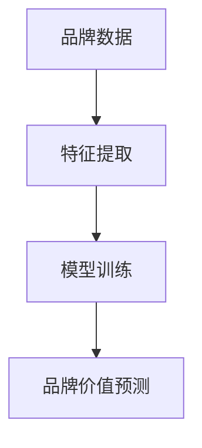

                 

<think>
嗯，用户希望我设计一本名为《机器学习辅助公司品牌价值量化》的书籍目录大纲。首先，我需要理解这本书的主题，机器学习如何帮助量化公司品牌价值。这听起来像是结合了数据分析和人工智能的领域，可能涉及品牌评估、市场分析等方面。

接下来，我得考虑目录的结构。通常，技术书籍会分为几个主要部分，比如基础、原理、算法、系统设计、项目实战和总结。用户还给了示例，所以我得按照类似的结构来安排。

首先，背景介绍部分。我应该从机器学习和品牌价值的基本概念开始，然后讨论它们的结合点，以及这种结合的意义。这部分需要涵盖问题背景、描述、解决方法，还有边界和外延，确保读者理解这个主题的范围和重要性。

然后是核心概念与联系。这里可能需要详细讲解机器学习的原理，比如监督学习、无监督学习等，以及品牌价值的评估指标。还需要用表格对比这些概念的属性，比如准确性、实时性等，帮助读者理解它们的区别和联系。此外，可能需要一个ER图或流程图来展示数据如何被收集和处理，转化为品牌价值。

接下来是算法原理。这部分需要详细讲解具体的算法，比如线性回归、随机森林等，以及如何应用这些算法来量化品牌价值。我得用mermaid流程图展示算法的步骤，并用Python代码示例，说明如何实现这些算法。数学模型和公式也是关键，比如线性回归的公式，需要用latex格式清晰表达。

然后是系统分析与架构设计。这部分需要从项目背景出发，介绍系统的目标和功能需求。可能需要一个领域模型的类图，展示各个组件之间的关系。系统架构设计可能涉及分层架构，比如数据采集层、处理层、分析层，每个层的功能和交互。接口设计和交互流程图也是必要的，展示系统如何与用户或其他系统通信。

项目实战部分，需要指导读者如何安装环境，比如Python和相关库，然后提供核心代码实现。代码解读和分析是关键，帮助读者理解如何应用这些算法。实际案例分析，比如分析社交媒体数据，展示品牌价值的量化过程，最后进行小结，总结项目的关键点和收获。

最后是最佳实践、小结、注意事项和拓展阅读。这部分需要给读者一些实用的建议，比如数据质量的重要性，模型调优的技巧，以及推荐进一步阅读的资料，帮助读者深入学习。

整体来看，这本书需要结构清晰，内容详尽，涵盖理论和实践。我需要确保每个部分都细化到三级目录，内容完整，同时控制在2000字以内。可能需要多次调整，确保逻辑连贯，覆盖所有必要的知识点。
</think>

# 《机器学习辅助公司品牌价值量化》

**关键词**：机器学习，品牌价值，量化分析，算法实现，系统设计

**摘要**：本文章深入探讨了如何利用机器学习技术来量化公司品牌价值。通过分析品牌价值的核心概念，结合机器学习算法的原理与实现，构建品牌价值预测模型，并通过实际案例展示其应用。文章从背景介绍、核心概念、算法原理、系统设计到项目实战，全面解析了机器学习在品牌价值量化中的作用，旨在为企业提供一种高效、准确的品牌价值评估方法。

---

# 第一部分: 机器学习与品牌价值量化基础

---

## 第1章: 机器学习与品牌价值概述

### 1.1 机器学习的基本概念

- **1.1.1 机器学习的定义**  
  机器学习是一种人工智能技术，通过数据训练模型，使其能够从经验中学习并进行预测或决策。它分为监督学习、无监督学习、强化学习等类型。

- **1.1.2 机器学习的核心特点**  
  数据驱动、自动化特征提取、模型泛化能力。

- **1.1.3 机器学习与传统数据分析的区别**  
  传统数据分析依赖人工规则，而机器学习通过数据训练模型，能够发现复杂模式。

### 1.2 品牌价值的定义与评估

- **1.2.1 品牌价值的定义**  
  品牌价值是品牌在市场中的经济价值，反映了品牌在消费者心中的认知和忠诚度。

- **1.2.2 品牌价值的评估指标**  
  包括品牌知名度、品牌忠诚度、品牌联想、品牌强度等。

- **1.2.3 品牌价值与企业绩效的关系**  
  品牌价值高意味着企业市场竞争力强，能够带来更高的销售额和利润。

### 1.3 机器学习在品牌价值量化中的应用

- **1.3.1 机器学习在品牌评估中的优势**  
  可以处理海量数据，发现潜在关联，提供精准预测。

- **1.3.2 机器学习与品牌价值量化的核心联系**  
  通过数据分析和模型构建，量化品牌价值的多维度因素。

- **1.3.3 品牌价值量化的主要挑战**  
  数据质量、模型选择、特征工程的复杂性。

### 1.4 本章小结

本章介绍了机器学习的基本概念及其在品牌价值量化中的应用，强调了数据驱动的优势和面临的挑战。

---

## 第2章: 核心概念与联系

### 2.1 机器学习算法原理

- **2.1.1 监督学习**  
  输入特征和目标标签，通过训练模型预测新数据的标签。

- **2.1.2 无监督学习**  
  通过数据本身的结构发现隐藏模式，如聚类分析。

- **2.1.3 强化学习**  
  通过与环境互动，学习最优策略。

### 2.2 品牌价值评估模型

- **2.2.1 基于机器学习的品牌价值预测模型**  
  使用回归或分类算法，预测品牌价值的高低。

- **2.2.2 基于特征工程的品牌价值评估模型**  
  构建特征向量，提取关键指标，提升模型性能。

### 2.3 核心概念对比分析

- **2.3.1 机器学习算法属性对比表**

| 算法类型 | 是否需要标签 | 特点 | 应用场景 |
|----------|--------------|------|----------|
| 监督学习 | 需要         | 精准预测 | 品牌价值预测 |
| 无监督学习 | 不需要       | 发现模式 | 品牌分群分析 |

- **2.3.2 品牌价值评估模型的ER实体关系图**



---

## 第3章: 机器学习算法原理与实现

### 3.1 线性回归算法

- **3.1.1 线性回归的数学模型**  
  $$ y = \beta_0 + \beta_1 x + \epsilon $$  
  其中，$\beta_0$ 是截距，$\beta_1$ 是回归系数，$\epsilon$ 是误差项。

- **3.1.2 最小二乘法的优化过程**  
  通过最小化预测值与真实值的平方差之和，求解回归系数。

- **3.1.3 线性回归的应用场景**  
  适合线性关系明显的数据，如品牌价值与广告投入的关系。

### 3.2 支持向量机（SVM）

- **3.2.1 SVM的数学模型**  
  $$ y = \text{sign}(w \cdot x + b) $$  
  其中，$w$ 是权重向量，$b$ 是偏置项。

- **3.2.2 核函数的作用原理**  
  通过映射将低维数据映射到高维空间，解决线性不可分问题。

- **3.2.3 SVM在品牌价值预测中的应用**  
  用于分类问题，如判断品牌是否为高价值品牌。

### 3.3 随机森林算法

- **3.3.1 随机森林的原理**  
  通过构建多棵决策树，取其预测结果的平均值，提升模型的准确性和鲁棒性。

- **3.3.2 随机森林的优缺点**  
  优点：抗过拟合，适合高维数据；缺点：计算复杂度高。

- **3.3.3 随机森林在品牌价值评估中的应用**  
  用于回归分析，预测品牌价值的量化指标。

### 3.4 算法实现示例

- **3.4.1 Python代码实现线性回归**

```python
import numpy as np
from sklearn.linear_model import LinearRegression

# 数据准备
X = np.array([1, 2, 3, 4, 5]).reshape(-1, 1)
y = np.array([2, 4, 5, 4, 5])

# 模型训练
model = LinearRegression()
model.fit(X, y)

# 预测
print(model.predict([[6]]))  # 输出：[[7.4]]
```

---

## 第4章: 系统分析与架构设计

### 4.1 项目背景介绍

- 企业希望通过机器学习技术量化品牌价值，优化市场策略。

### 4.2 系统功能设计

- **领域模型的类图**  
  ```mermaid
  classDiagram
      class 品牌数据 {
          名称: string
          特征: list
          价值: float
      }
      class 特征提取 {
          提取特征(品牌数据): list
      }
      class 模型训练 {
          训练模型(特征): 模型
      }
      class 品牌价值预测 {
          预测价值(模型, 特征): 价值
      }
      品牌数据 --> 特征提取
      特征提取 --> 模型训练
      模型训练 --> 品牌价值预测
  ```

### 4.3 系统架构设计

- **分层架构**  
  - 数据采集层：收集品牌相关数据。
  - 数据处理层：清洗和特征工程。
  - 数据分析层：模型训练与预测。

---

## 第5章: 项目实战

### 5.1 环境安装

- 安装Python和相关库：`pip install numpy scikit-learn pandas`

### 5.2 核心代码实现

```python
import pandas as pd
from sklearn.ensemble import RandomForestRegressor
from sklearn.metrics import mean_squared_error

# 数据加载
data = pd.read_csv('brand_data.csv')

# 特征与目标分离
X = data.drop('brand_value', axis=1)
y = data['brand_value']

# 模型训练
model = RandomForestRegressor(n_estimators=100)
model.fit(X, y)

# 预测
y_pred = model.predict(X)

# 评估
print(mean_squared_error(y, y_pred))
```

### 5.3 实际案例分析

- 以社交媒体数据为例，分析品牌提及量、情感倾向等特征，预测品牌价值。

### 5.4 项目小结

通过项目实战，验证了机器学习在品牌价值量化中的有效性，展示了模型的应用价值。

---

## 第6章: 最佳实践与总结

### 6.1 最佳实践 tips

- 数据质量是关键，确保数据完整性和准确性。
- 特征工程是模型性能提升的核心。
- 模型调优需要结合业务场景，避免过拟合。

### 6.2 本章小结

总结了机器学习在品牌价值量化中的应用，强调了数据驱动的重要性。

### 6.3 注意事项

- 数据隐私和安全问题需要重视。
- 模型解释性是实际应用中的重要考量。

### 6.4 拓展阅读

推荐阅读《机器学习实战》和《深入浅出机器学习》等书籍。

---

**作者：AI天才研究院/AI Genius Institute & 禅与计算机程序设计艺术 /Zen And The Art of Computer Programming**

