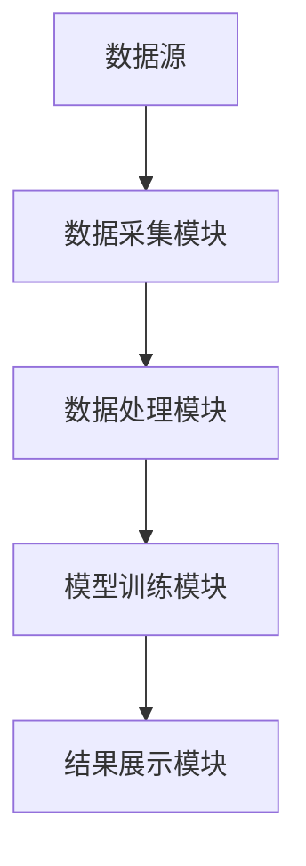
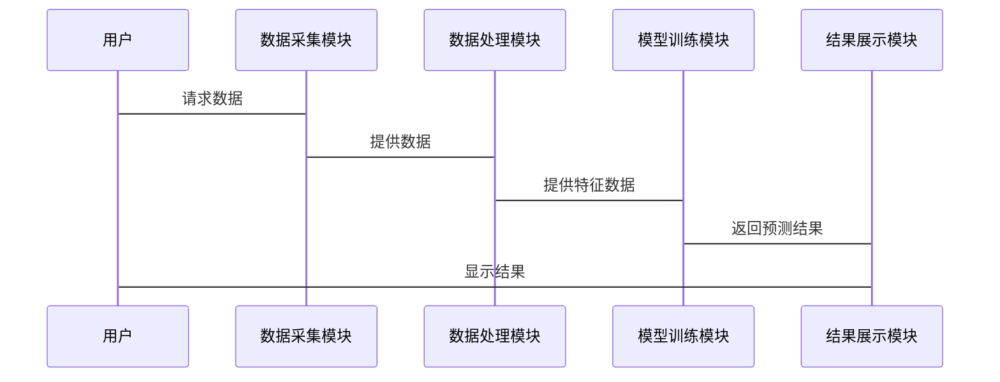

                 


# 机器学习预测公司盈利质量变化

> 关键词：机器学习，盈利质量，企业财务预测，数据挖掘，算法实现

> 摘要：本文将详细探讨如何利用机器学习技术预测公司盈利质量的变化。通过分析影响盈利质量的多维度因素，结合常见的机器学习算法，构建预测模型，并通过实际案例展示模型的实现与优化。文章旨在帮助读者理解机器学习在企业财务预测中的应用，掌握从数据处理到模型部署的完整流程。

---

# 第一部分: 机器学习预测公司盈利质量变化的背景与概念

# 第1章: 公司盈利质量变化的背景与问题描述

## 1.1 公司盈利质量变化的定义与重要性

### 1.1.1 盈利质量的定义

盈利质量是指企业在一定时期内实现的利润与其所消耗资源的效率和可持续性。它不仅关注净利润的大小，还关注企业盈利的来源、结构和未来的持续性。

### 1.1.2 盈利质量变化对企业的影响

盈利质量的变化直接影响企业的财务健康状况，进而影响投资者信心、股价波动和企业融资能力。通过预测盈利质量的变化，企业可以提前采取措施，优化财务管理，降低风险。

### 1.1.3 机器学习在预测盈利质量变化中的作用

机器学习能够从大量历史数据中提取特征，发现传统财务分析难以捕捉的模式，从而提供更精准的预测。

---

## 1.2 问题背景与数据来源

### 1.2.1 企业盈利预测的传统方法

传统方法主要依赖财务报表分析、行业趋势分析和管理判断。然而，这些方法往往主观性强，难以量化和预测复杂的变化。

### 1.2.2 机器学习在企业盈利预测中的优势

机器学习能够处理非结构化数据，发现隐藏的模式，并实时更新预测结果，提高预测的准确性和及时性。

### 1.2.3 数据来源与特征分析

数据来源包括企业财务报表、市场数据、行业趋势、政策变化等。特征分析需要筛选出与盈利质量变化高度相关的指标，例如营业收入增长率、净利润率、研发投入占比等。

---

## 1.3 问题目标与解决思路

### 1.3.1 预测目标的明确

本文的目标是通过机器学习模型，预测公司未来季度或年度的盈利质量变化趋势。

### 1.3.2 机器学习模型的选择与优化

选择合适的算法（如线性回归、随机森林、支持向量机等），并通过数据预处理、特征工程和模型调优提高预测精度。

### 1.3.3 数据预处理与特征工程

数据清洗、特征标准化、特征选择等步骤是构建高质量模型的前提。

---

## 1.4 本章小结

本章介绍了公司盈利质量变化的定义、重要性及其预测的背景。通过对比传统方法与机器学习的优势，明确了本文的研究目标和解决思路。

---

# 第二部分: 机器学习预测公司盈利质量变化的核心概念

# 第2章: 盈利质量变化的多维度分析

## 2.1 盈利质量变化的核心影响因素

### 2.1.1 财务指标分析

盈利能力（如净利润率）、运营效率（如存货周转率）、偿债能力（如资产负债率）等指标是影响盈利质量的重要因素。

### 2.1.2 市场环境因素

宏观经济波动、行业竞争状况、政策法规变化等外部因素也会显著影响企业的盈利质量。

### 2.1.3 公司内部管理因素

公司战略、管理效率、研发投入等内部因素同样关键。

---

## 2.2 盈利质量变化的量化指标

### 2.2.1 净利润增长率

净利润增长率 = (本年净利润 - 上年净利润) / 上年净利润 × 100%

### 2.2.2 营业利润率

营业利润率 = 净利润 / 营业收入 × 100%

### 2.2.3 现金流健康度

现金流健康度反映了企业经营活动的现金流入是否能够覆盖其日常运营和偿债需求。

---

## 2.3 盈利质量变化的预测模型构建

### 2.3.1 数据特征的选择

选择与盈利质量高度相关的特征，如营业收入增长率、研发投入占比、行业景气度等。

### 2.3.2 模型评估指标

常用的评估指标包括准确率、召回率、F1分数等。

### 2.3.3 模型优化策略

通过交叉验证、网格搜索等方法优化模型参数，选择最优算法。

---

## 2.4 本章小结

本章从多维度分析了影响公司盈利质量变化的因素，并提出了构建预测模型的基本思路。

---

# 第三部分: 机器学习算法原理与实现

# 第3章: 常见机器学习算法原理

## 3.1 线性回归模型

### 3.1.1 线性回归的基本原理

线性回归通过建立自变量与因变量之间的线性关系，预测目标变量的值。

### 3.1.2 普通最小二乘法的数学推导

$$ \text{损失函数} = \sum_{i=1}^{n} (y_i - \hat{y}_i)^2 $$

$$ \hat{y}_i = \beta_0 + \beta_1 x_1 + \cdots + \beta_k x_k $$

### 3.1.3 线性回归的优缺点

优点：简单易懂、计算高效；缺点：无法处理非线性关系。

---

## 3.2 支持向量机（SVM）

### 3.2.1 SVM的基本原理

SVM通过构建超平面，将数据点分为不同的类别，适用于分类和回归问题。

### 3.2.2 核函数的作用与选择

核函数可以将低维数据映射到高维空间，常用的核函数包括线性核、多项式核、径向基函数（RBF）核等。

### 3.2.3 SVM的数学模型

$$ \text{目标函数} = \min_{\beta, \beta_0} \frac{1}{2} \|\beta\|^2 + C \sum_{i=1}^{n} \xi_i $$

$$ y_i = \text{sign}(\beta_0 + \beta^T x_i) $$

---

## 3.3 随机森林

### 3.3.1 随机森林的基本原理

随机森林通过构建多棵决策树，并行集成预测结果，提高模型的准确性和稳定性。

### 3.3.2 随机森林的优缺点

优点：抗过拟合、鲁棒性强；缺点：计算量较大。

### 3.3.3 随机森林的实现步骤

1. 从训练集中有放回地抽取样本，构建决策树。
2. 对特征进行随机选择，减少决策树之间的相关性。
3. 集成所有决策树的预测结果，取多数投票或平均值。

---

## 3.4 算法选择与优化

### 3.4.1 算法选择的依据

根据数据特征和问题类型选择合适的算法，例如线性回归适合线性关系，随机森林适合复杂非线性关系。

### 3.4.2 模型调优策略

通过交叉验证优化模型参数，例如调整树的深度、学习率等。

---

## 3.5 本章小结

本章详细介绍了几种常用的机器学习算法，并分析了它们的优缺点及适用场景。

---

# 第四部分: 系统架构设计与实现

# 第4章: 系统架构设计与实现

## 4.1 问题场景介绍

构建一个基于机器学习的公司盈利质量预测系统，帮助用户实时监控和预测企业的盈利变化。

## 4.2 系统功能设计

### 4.2.1 数据采集模块

从数据库或API获取企业财务数据和市场数据。

### 4.2.2 数据处理模块

进行数据清洗、特征提取和标准化处理。

### 4.2.3 模型训练模块

选择合适的算法，训练并优化预测模型。

### 4.2.4 结果展示模块

将预测结果以可视化形式展示，便于用户理解和分析。

---

## 4.3 系统架构设计

### 4.3.1 系统架构图



### 4.3.2 系统接口设计

- 数据采集模块接口：提供数据导入功能。
- 模型训练模块接口：接收特征数据，返回预测结果。
- 结果展示模块接口：展示预测结果和可视化图表。

---

## 4.4 系统交互流程

### 4.4.1 系统交互序列图



---

## 4.5 本章小结

本章详细设计了公司盈利质量预测系统的架构，并通过图表展示了系统的功能模块和交互流程。

---

# 第五部分: 项目实战与结果分析

# 第5章: 项目实战与结果分析

## 5.1 项目环境安装

### 5.1.1 安装Python环境

```bash
python --version
pip install numpy pandas scikit-learn matplotlib
```

### 5.1.2 数据集准备

下载企业财务数据和市场数据，整理成CSV格式。

---

## 5.2 系统核心实现源代码

### 5.2.1 数据预处理代码

```python
import pandas as pd
import numpy as np

# 读取数据
df = pd.read_csv('company_data.csv')

# 数据清洗
df.dropna(inplace=True)
df = df[~df['revenue'].isin([0])]  # 去除收入为零的行

# 特征提取
X = df[['revenue_growth', 'profit_margin', 'research_expense_ratio']]
y = df['profit_quality_change']

# 特征标准化
from sklearn.preprocessing import StandardScaler
scaler = StandardScaler()
X_scaled = scaler.fit_transform(X)
```

### 5.2.2 模型训练代码

```python
from sklearn.ensemble import RandomForestRegressor
from sklearn.metrics import mean_squared_error

# 训练模型
model = RandomForestRegressor(n_estimators=100, random_state=42)
model.fit(X_scaled, y)

# 预测结果
y_pred = model.predict(X_scaled)

# 评估模型
mse = mean_squared_error(y, y_pred)
print(f'均方误差：{mse}')
```

---

## 5.3 代码应用解读与分析

### 5.3.1 数据预处理

通过数据清洗和特征标准化，确保数据质量，提高模型训练效果。

### 5.3.2 模型训练与优化

使用随机森林模型进行训练，并通过网格搜索优化模型参数。

### 5.3.3 模型评估与结果分析

通过均方误差、R²分数等指标评估模型的性能，并分析预测结果与实际值的差异。

---

## 5.4 实际案例分析和详细讲解剖析

以某公司为例，展示数据处理、模型训练和结果分析的全过程，并解释预测结果的含义和应用价值。

---

## 5.5 本章小结

本章通过实际案例展示了如何利用机器学习技术预测公司盈利质量的变化，并详细解读了代码实现和结果分析。

---

# 第六部分: 最佳实践与拓展阅读

# 第6章: 最佳实践与拓展阅读

## 6.1 小结

机器学习在公司盈利质量预测中的应用具有重要意义，通过合理选择算法和优化模型，可以显著提高预测的准确性和实用性。

## 6.2 注意事项

- 数据质量直接影响模型性能，需重视数据清洗和特征工程。
- 模型部署后需定期更新，以适应数据和业务的变化。
- 在实际应用中，需结合业务知识进行模型解释和调整。

## 6.3 拓展阅读

- 《机器学习实战》
- 《Python机器学习》
- 《企业财务分析与管理》

---

# 作者：AI天才研究院/AI Genius Institute & 禅与计算机程序设计艺术 /Zen And The Art of Computer Programming

