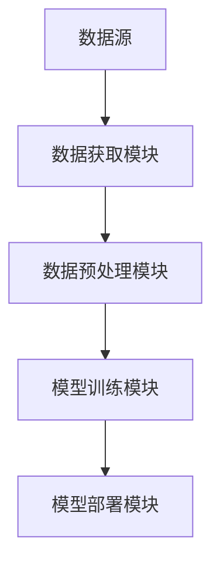

                 

# 机器学习预测公司自由现金流

> 关键词：机器学习、自由现金流、回归分析、特征工程、模型评估、系统架构

> 摘要：本文详细探讨了如何利用机器学习技术预测公司自由现金流。通过分析自由现金流的定义、重要性以及机器学习在预测中的应用，本文介绍了多种回归算法，如线性回归、支持向量回归和随机森林回归，并详细讲解了特征工程、模型评估与优化、系统架构设计等关键步骤。结合实际案例分析和项目实战，本文为读者提供了一套完整的机器学习预测公司自由现金流的解决方案。

---

# 第一部分: 机器学习预测公司自由现金流的背景与基础

## 第1章: 自由现金流与机器学习概述

### 1.1 自由现金流的定义与重要性

#### 1.1.1 自由现金流的定义
自由现金流（Free Cash Flow，FCF）是指公司在扣除所有必要的支出后，剩余可用于偿还债务、股息分配或其他投资的资金。它是衡量企业财务健康状况的重要指标，通常用于评估企业的盈利能力和抗风险能力。

#### 1.1.2 自由现金流在企业中的重要性
- **评估企业价值**：自由现金流是企业价值评估的核心指标，常用于计算企业市值。
- **投资决策**：企业可以通过自由现金流预测来决定是否进行新项目投资或并购。
- **风险管理**：预测自由现金流可以帮助企业更好地应对财务风险。

#### 1.1.3 自由现金流预测的挑战与意义
- **挑战**：自由现金流预测受到多种因素影响，如市场波动、企业内部管理、宏观经济环境等。
- **意义**：准确预测自由现金流有助于企业优化资源配置、制定科学的财务计划。

### 1.2 机器学习的基本概念

#### 1.2.1 机器学习的定义
机器学习（Machine Learning）是一种人工智能技术，通过数据训练模型，使其能够从数据中学习并做出预测或决策。

#### 1.2.2 机器学习的核心原理
- 数据驱动：机器学习模型通过大量数据训练，提取数据中的模式和特征。
- 模型训练：通过优化算法，调整模型参数以最小化预测误差。

#### 1.2.3 机器学习与传统统计学的区别
| 特性 | 机器学习 | 传统统计学 |
|------|----------|------------|
| 数据量 | 大数据集 | 小数据集   |
| 模型复杂度 | 高复杂度 | 低复杂度   |
| 可解释性 | 较低     | 较高       |
| 应用场景 | 非线性关系 | 线性关系    |

### 1.3 监督学习与回归分析

#### 1.3.1 监督学习的定义
监督学习是一种机器学习方法，通过 labeled 数据训练模型，使其能够预测新的数据点。

#### 1.3.2 回归分析的原理
回归分析是一种统计学方法，用于建立自变量和因变量之间的关系模型。

#### 1.3.3 回归分析在现金流预测中的应用
- **线性回归**：适用于简单线性关系的预测。
- **支持向量回归**：适用于复杂非线性关系的预测。
- **随机森林回归**：适用于高维数据和复杂数据分布的预测。

---

## 第2章: 机器学习算法与特征工程

### 2.1 线性回归

#### 2.1.1 线性回归的原理
线性回归通过最小化预测值与实际值之间的平方差之和，找到最佳拟合直线。

#### 2.1.2 线性回归的数学模型
$$ y = \beta_0 + \beta_1 x + \epsilon $$
其中，$y$ 是目标变量，$x$ 是自变量，$\beta_0$ 和 $\beta_1$ 是回归系数，$\epsilon$ 是误差项。

#### 2.1.3 线性回归在现金流预测中的应用
- 适用于简单的线性关系，如销售额与广告支出的关系。

### 2.2 支持向量回归

#### 2.2.1 支持向量回归的原理
支持向量回归（Support Vector Regression，SVR）通过构建支持向量，将数据映射到高维空间，然后进行线性回归。

#### 2.2.2 支持向量回归的数学模型
$$ y = \sum_{i=1}^n \alpha_i k(x_i, x) + b $$
其中，$k(x_i, x)$ 是核函数，$\alpha_i$ 是拉格朗日乘子，$b$ 是偏置项。

#### 2.2.3 支持向量回归的优势与局限
- **优势**：适用于非线性关系。
- **局限**：对参数敏感，计算复杂度较高。

### 2.3 随机森林回归

#### 2.3.1 随机森林回归的原理
随机森林回归通过构建多棵决策树，并将它们的结果进行集成，提高预测准确性。

#### 2.3.2 随机森林回归的数学模型
$$ y = \frac{1}{n} \sum_{i=1}^n T_i(x) $$
其中，$T_i(x)$ 是第 $i$ 棵树的预测值，$n$ 是树的数量。

#### 2.3.3 随机森林回归在现金流预测中的应用
- 适用于高维数据和复杂数据分布。

### 2.4 本章小结

---

## 第3章: 特征工程与数据预处理

### 3.1 特征选择的重要性

#### 3.1.1 特征选择的基本概念
特征选择是指从大量特征中选择对目标变量影响最大的特征。

#### 3.1.2 特征选择的方法
- **过滤法**：基于统计学方法筛选特征。
- **包裹法**：通过训练模型评估特征的重要性。
- **嵌入法**：利用模型自身特性进行特征选择。

#### 3.1.3 特征选择在现金流预测中的应用
- 通过分析财务报表和市场数据，筛选对自由现金流影响最大的特征。

### 3.2 数据清洗与预处理

#### 3.2.1 数据清洗的定义
数据清洗是指对数据进行处理，去除噪声和异常值。

#### 3.2.2 数据清洗的方法
- **填补缺失值**：使用均值、中位数或插值法填补缺失值。
- **去除异常值**：通过统计方法或模型检测异常值。

#### 3.2.3 数据清洗在现金流预测中的应用
- 对历史财务数据进行清洗，确保数据质量。

### 3.3 特征工程的实践

#### 3.3.1 特征工程的基本步骤
1. **特征选择**：筛选对目标变量影响大的特征。
2. **特征变换**：对特征进行标准化或归一化处理。
3. **特征组合**：将多个特征组合成新的特征。

#### 3.3.2 特征工程的工具与方法
- **工具**：Python（pandas、scikit-learn）。
- **方法**：PCA（主成分分析）、特征缩放。

#### 3.3.3 特征工程在现金流预测中的案例
- 对财务指标（如营业收入、净利润）和市场指标（如行业指数、宏观经济指标）进行特征工程处理。

### 3.4 本章小结

---

## 第4章: 模型评估与优化

### 4.1 模型评估的指标

#### 4.1.1 均方误差（MSE）
$$ MSE = \frac{1}{n} \sum_{i=1}^n (y_i - \hat{y}_i)^2 $$

#### 4.1.2 均方根误差（RMSE）
$$ RMSE = \sqrt{\frac{1}{n} \sum_{i=1}^n (y_i - \hat{y}_i)^2} $$

#### 4.1.3 R平方值（R²）
$$ R^2 = 1 - \frac{SSE}{SST} $$
其中，SSE是预测值与实际值的平方差之和，SST是实际值与均值的平方差之和。

### 4.2 模型验证的方法

#### 4.2.1 K折交叉验证
将数据集分成K份，每次使用其中K-1份训练模型，1份验证模型。

#### 4.2.2 留出法
将数据集分成训练集和验证集，分别用于模型训练和验证。

### 4.3 超参数调优

#### 4.3.1 超参数调优的定义
超参数调优是指通过调整模型的超参数，优化模型性能。

#### 4.3.2 超参数调优的方法
- **网格搜索**：遍历所有可能的超参数组合，找到最优组合。
- **随机搜索**：随机选择超参数组合，找到最优组合。

### 4.4 本章小结

---

## 第5章: 系统架构与项目实战

### 5.1 系统架构设计

#### 5.1.1 系统功能设计
- 数据获取模块：获取公司财务数据和市场数据。
- 数据预处理模块：清洗和特征工程处理数据。
- 模型训练模块：训练机器学习模型。
- 模型部署模块：部署模型并进行预测。

#### 5.1.2 系统架构图

### 5.2 项目实战

#### 5.2.1 数据获取与预处理
使用Python的pandas库获取公司财务数据，并进行清洗和特征工程处理。

#### 5.2.2 模型训练与优化
选择合适的回归算法（如随机森林回归）进行模型训练，并通过超参数调优优化模型性能。

#### 5.2.3 模型部署与预测
将训练好的模型部署到生产环境，进行自由现金流预测。

### 5.3 本章小结

---

## 第6章: 总结与展望

### 6.1 总结
本文详细介绍了机器学习预测公司自由现金流的全过程，包括数据获取、特征工程、模型训练和部署等步骤。

### 6.2 展望
未来可以进一步研究更复杂的模型（如深度学习模型）和更高效的数据处理方法，以提高自由现金流预测的准确性。

---

## 作者信息

作者：AI天才研究院/AI Genius Institute & 禅与计算机程序设计艺术 /Zen And The Art of Computer Programming

---

# 结语
通过本文的详细讲解，读者可以掌握机器学习预测公司自由现金流的核心方法和实践技巧。希望本文能为相关领域的研究和应用提供有价值的参考。

