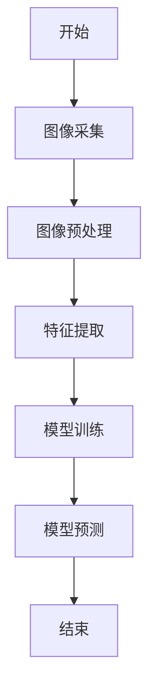
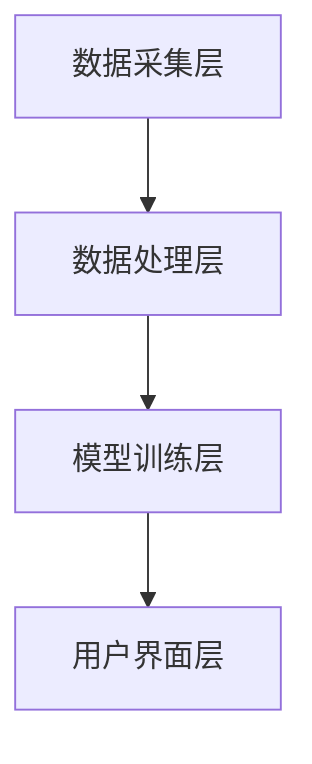

                 

# 机器视觉技术在市场技术分析中的运用

---

## 关键词：
机器视觉技术、市场技术分析、图像处理、模式识别、深度学习、金融数据分析、股票预测

---

## 摘要：
机器视觉技术作为一种新兴的跨学科技术，正在逐步改变传统的市场技术分析方式。本文从机器视觉技术的基本概念出发，结合市场技术分析的需求，详细探讨了机器视觉在市场分析中的应用场景、算法实现以及系统架构设计。通过分析图像处理、特征提取、模式识别等关键技术，本文提出了基于机器视觉的市场分析方法，并通过具体案例展示了其在股票预测中的实际应用。最后，本文总结了机器视觉技术在市场分析中的优势，并展望了其未来的发展方向。

---

## 第一部分：机器视觉技术与市场技术分析的背景

### 第1章：机器视觉技术概述

#### 1.1 机器视觉的基本概念
机器视觉（Machine Vision）是通过计算机模拟人类视觉系统的技术，主要利用图像处理、模式识别等方法对图像进行分析和理解。其核心目标是让计算机能够“看懂”图像并做出相应的决策。

- **1.1.1 机器视觉的定义与核心原理**
  机器视觉的核心原理包括图像采集、预处理、特征提取和目标识别等步骤。通过这些步骤，计算机可以提取图像中的有用信息，并将其用于后续的分析和决策。

- **1.1.2 机器视觉的关键技术与应用领域**
  机器视觉技术广泛应用于工业自动化、医疗图像分析、自动驾驶等领域。在金融市场中，机器视觉技术可以通过分析K线图、技术指标等市场数据，提取隐含的市场信息。

- **1.1.3 机器视觉在金融市场的潜力**
  金融市场中的数据具有高度的复杂性和不确定性，传统的技术分析方法往往难以捕捉市场中的潜在规律。而机器视觉技术可以通过图像处理和模式识别，发现市场数据中的隐藏模式，从而为投资者提供更精准的决策支持。

#### 1.2 市场技术分析的基本概念
市场技术分析（Market Technical Analysis）是通过分析历史市场数据，预测未来市场走势的一种方法。其核心在于通过技术指标、K线图等工具，发现市场的买卖信号。

- **1.2.1 市场技术分析的定义与方法**
  市场技术分析主要依赖于价格和成交量数据，通过绘制K线图、移动平均线、MACD等技术指标，分析市场的趋势和波动。

- **1.2.2 市场技术分析中的技术指标与数据特征**
  技术指标如RSI（相对强弱指数）、MACD（移动平均收敛散度）等，能够反映市场的买卖情绪和趋势强度。这些指标通常以数值或图像的形式呈现，为投资者提供决策依据。

- **1.2.3 传统市场技术分析的局限性**
  传统技术分析方法依赖于经验丰富的分析师，且容易受到主观因素的影响。此外，面对海量的市场数据，传统的分析方法往往显得效率低下，难以捕捉复杂的市场模式。

#### 1.3 机器视觉与市场技术分析的结合
机器视觉技术的应用为市场技术分析提供了新的思路，通过图像处理和模式识别，可以更高效地提取市场数据中的有用信息。

- **1.3.1 机器视觉在市场分析中的优势**
  机器视觉技术能够快速处理大量的市场数据，并通过图像识别发现隐藏的市场模式。此外，机器视觉技术的自动化特点，使其能够实时监控市场动态，提供及时的决策支持。

- **1.3.2 机器视觉与市场技术分析的结合场景**
  在股票市场中，机器视觉技术可以用于分析K线图中的形态变化，识别技术指标的交叉信号，并预测市场的短期走势。在期货市场中，机器视觉技术可以用于分析价格波动的周期性特征，优化交易策略。

- **1.3.3 机器视觉在市场分析中的应用前景**
  随着深度学习技术的不断发展，机器视觉在市场分析中的应用前景广阔。未来，机器视觉技术将与自然语言处理、大数据分析等技术结合，构建更加智能化的市场分析系统。

---

## 第二部分：机器视觉技术的核心概念与原理

### 第2章：机器视觉技术的核心概念

#### 2.1 图像处理与特征提取
图像处理是机器视觉技术的核心步骤，其目的是通过对图像的预处理，提取出有助于后续分析的特征。

- **2.1.1 图像处理的基本流程**
  图像处理的基本流程包括图像采集、噪声去除、边缘检测、特征提取等步骤。通过这些步骤，可以将原始图像转换为可供计算机分析的特征信息。

- **2.1.2 特征提取的关键技术**
  特征提取是图像处理的重要环节，其目标是提取能够反映图像本质特征的信息。常用的技术包括边缘检测、纹理分析、形状识别等。

- **2.1.3 机器视觉中的模式识别与分类**
  模式识别是机器视觉技术的重要组成部分，其目标是通过训练模型，识别图像中的目标物体或模式。常用的模式识别方法包括支持向量机（SVM）、卷积神经网络（CNN）等。

#### 2.2 市场技术分析中的数据特征
市场技术分析中的数据特征主要体现在K线图和技术指标中。

- **2.2.1 K线图与市场数据的特征提取**
  K线图是市场技术分析的核心工具，其形态特征如头肩顶、双底等，可以通过图像处理技术提取出来。

- **2.2.2 技术指标的视觉化表示**
  技术指标如MACD、RSI等，可以通过图像的形式展示市场的强弱变化。通过图像处理技术，可以提取这些指标的交叉点、趋势变化等特征。

- **2.2.3 市场数据的时空特征与模式识别**
  市场数据具有时空特征，可以通过模式识别技术发现市场的周期性变化和趋势特征。

#### 2.3 机器视觉与市场分析的结合模型
结合模型是机器视觉技术在市场分析中的关键部分，其目标是将图像处理与市场分析相结合，构建高效的市场预测模型。

- **2.3.1 机器视觉模型的输入与输出**
  机器视觉模型的输入是市场数据的图像形式，输出是对市场走势的预测结果。

- **2.3.2 市场数据的视觉化表示方法**
  市场数据可以通过K线图、技术指标图等形式进行视觉化表示。通过图像处理技术，可以将这些图像转换为模型可识别的特征信息。

- **2.3.3 机器视觉模型的训练与优化**
  机器视觉模型的训练需要大量市场数据和标签，通过监督学习方法优化模型的预测能力。常用的优化方法包括随机梯度下降（SGD）、Adam优化器等。

### 第3章：机器视觉技术的核心原理

#### 3.1 图像处理与特征提取的数学模型
图像处理的数学模型是机器视觉技术的核心基础，其目标是通过数学变换提取图像特征。

- **3.1.1 图像变换与滤波器**
  图像变换如傅里叶变换、小波变换等，可以通过频域分析提取图像特征。滤波器如高斯滤波器、Sobel算子等，用于消除图像噪声，增强边缘特征。

- **3.1.2 特征提取的数学公式**
  边缘检测的微分算子如Sobel算子，可以通过以下公式实现：
  $$ G_x = \frac{\partial I}{\partial x} $$
  $$ G_y = \frac{\partial I}{\partial y} $$
  其中，\( I \) 是输入图像，\( G_x \) 和 \( G_y \) 分别是水平和垂直方向的梯度。

- **3.1.3 图像分割与区域检测的算法原理**
  图像分割算法如阈值分割、区域生长等，通过将图像分割为多个区域，提取感兴趣的目标区域。

#### 3.2 模式识别与分类的算法原理
模式识别与分类是机器视觉技术的重要组成部分，其目标是通过训练模型识别图像中的目标模式。

- **3.2.1 支持向量机（SVM）的分类原理**
  SVM是一种常用的分类算法，其目标是找到一个超平面，将数据分成不同的类别。SVM的数学模型如下：
  $$ y = sign(w \cdot x + b) $$
  其中，\( w \) 是权重向量，\( b \) 是偏置项，\( x \) 是输入样本，\( y \) 是输出类别。

- **3.2.2 卷积神经网络（CNN）的图像分类流程**
  CNN是一种常用的图像分类模型，其主要步骤包括卷积、池化、激活函数和全连接层。通过这些步骤，CNN可以提取图像的高层次特征，并进行分类。

- **3.2.3 集成学习与特征选择的优化方法**
  集成学习是一种通过组合多个模型来提高预测精度的方法。特征选择则是通过选择重要的特征，减少模型的复杂度，提高预测效率。

#### 3.3 市场技术分析中的模式识别
市场技术分析中的模式识别是机器视觉技术的重要应用，其目标是通过图像处理技术发现市场的买卖信号。

- **3.3.1 市场数据的模式识别需求**
  市场数据的模式识别需求包括趋势识别、形态识别、技术指标交叉点识别等。

- **3.3.2 机器视觉在市场模式识别中的应用**
  通过图像处理技术，可以将K线图中的形态变化、技术指标的交叉点等特征提取出来，并通过模式识别技术进行分类。

- **3.3.3 市场数据的特征提取与分类流程**
  市场数据的特征提取与分类流程包括图像采集、特征提取、模型训练和预测等步骤。通过这些步骤，可以实现对市场走势的自动化预测。

---

## 第三部分：机器视觉技术在市场分析中的算法实现

### 第4章：机器视觉算法在市场分析中的应用

#### 4.1 机器视觉算法在市场分析中的应用
机器视觉算法在市场分析中的应用主要体现在图像处理和模式识别两个方面。

- **4.1.1 图像处理在市场分析中的应用**
  通过图像处理技术，可以将K线图中的形态变化、技术指标的交叉点等特征提取出来，并通过这些特征进行市场预测。

- **4.1.2 模式识别在市场分析中的应用**
  模式识别技术可以用于识别K线图中的形态变化，如头肩顶、双底等，并通过这些形态预测市场的未来走势。

#### 4.2 机器视觉算法的实现步骤
机器视觉算法的实现步骤包括图像采集、预处理、特征提取、模型训练和预测等。

- **4.2.1 图像采集与预处理**
  图像采集是通过摄像头或API接口获取市场数据的图像。图像预处理包括噪声去除、对比度调整等，以提高图像质量。

- **4.2.2 特征提取与分类**
  特征提取是通过图像处理技术提取图像中的有用特征。分类则是通过训练模型，对图像进行分类预测。

- **4.2.3 模型训练与优化**
  模型训练是通过大量市场数据训练模型，优化模型的预测能力。优化方法包括随机梯度下降、Adam优化器等。

#### 4.3 机器视觉算法的数学模型
机器视觉算法的数学模型主要体现在图像处理和模式识别两个方面。

- **4.3.1 图像处理的数学模型**
  图像处理的数学模型包括傅里叶变换、小波变换等，用于提取图像的频域特征。

- **4.3.2 模式识别的数学模型**
  模式识别的数学模型包括支持向量机、卷积神经网络等，用于分类图像中的目标模式。

#### 4.4 机器视觉算法的流程图
机器视觉算法的流程图如下：

---

## 第五部分：系统分析与架构设计方案

### 第5章：系统架构设计

#### 5.1 问题场景介绍
本系统的目标是利用机器视觉技术，实现对股票市场的技术分析。通过分析K线图和相关技术指标，发现市场的买卖信号，辅助投资者做出决策。

- **5.1.1 问题背景**
  股票市场具有高度的不确定性和复杂性，传统的技术分析方法难以捕捉市场的潜在规律。

- **5.1.2 问题描述**
  本系统需要实现对股票市场的技术分析，通过图像处理和模式识别，发现市场的买卖信号。

#### 5.2 系统功能设计
系统的功能设计包括图像采集、特征提取、模型训练和预测等。

- **5.2.1 系统功能模块**
  系统功能模块包括图像采集模块、特征提取模块、模型训练模块和预测模块。

- **5.2.2 功能模块的实现**
  图像采集模块通过API接口获取股票数据，并将其转换为K线图。特征提取模块通过图像处理技术提取K线图的特征。模型训练模块通过深度学习算法训练分类模型。预测模块通过模型预测市场的未来走势。

#### 5.3 系统架构设计
系统的架构设计包括数据采集层、数据处理层、模型训练层和用户界面层。

- **5.3.1 数据采集层**
  数据采集层通过API接口获取股票数据，并将其存储在数据库中。

- **5.3.2 数据处理层**
  数据处理层通过图像处理技术提取K线图的特征，并将其传递给模型训练层。

- **5.3.3 模型训练层**
  模型训练层通过深度学习算法训练分类模型，并将模型部署到预测层。

- **5.3.4 用户界面层**
  用户界面层通过图形化界面展示市场的分析结果，辅助投资者做出决策。

#### 5.4 系统架构图
系统架构图如下：

---

## 第六部分：项目实战

### 第6章：项目实战

#### 6.1 项目背景与目标
本项目的背景是利用机器视觉技术，实现对股票市场的技术分析。项目的

