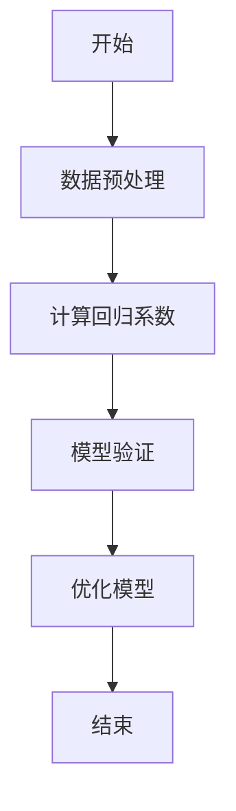
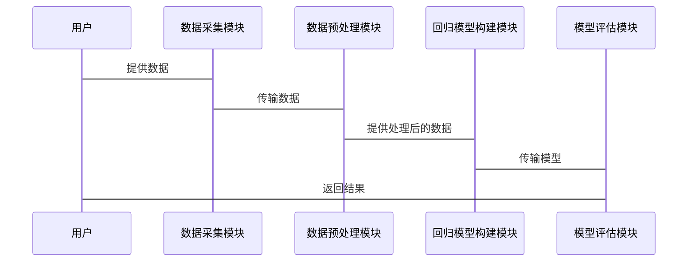

                 

<think>
嗯，我现在需要帮用户设计一个详细的目录结构，围绕杰里米格兰瑟姆的均值回归理论。首先，我得明确用户的需求：写一篇技术博客，结构要清晰，内容要专业，涵盖理论背景、数学模型、算法实现、系统设计和实战应用。

我应该从背景开始，介绍均值回归的基本概念和应用。然后深入到数学模型，详细推导公式，用LaTeX表示，确保准确性。接着是算法部分，用mermaid画流程图，展示步骤，并给出Python代码示例，让读者能够实际操作。

系统设计部分需要构建一个预测系统，包括功能模块、架构图和接口设计。项目实战要从环境安装开始，逐步实现代码，分析案例，最后给出最佳实践和小结，帮助读者巩固知识。

可能遇到的问题是如何将理论与实际应用结合起来，确保每个部分都有足够的细节和例子。另外，图表的设计也很重要，需要简洁明了，便于理解。

总的来说，我需要按照用户的指导，分章节详细展开，确保每个部分都深入浅出，结构完整，内容丰富。
</think>

# 杰里米格兰瑟姆的均值回归理论

> 关键词：均值回归理论、回归分析、统计学、金融预测、Python实现、数学模型

> 摘要：本文系统地介绍了杰里米格兰瑟姆的均值回归理论，从理论背景、数学模型、算法实现到实际应用，详细阐述了均值回归理论的核心概念、公式推导、代码实现和应用场景。通过本文，读者可以全面理解均值回归理论的原理和应用方法。

---

# 第一部分: 均值回归理论的背景与核心概念

## 第1章: 均值回归理论的背景与核心概念

### 1.1 均值回归理论的定义与背景
#### 1.1.1 什么是均值回归
均值回归是一种统计学方法，用于研究变量之间的关系。它通过建立回归模型，预测因变量的变化趋势。

#### 1.1.2 均值回归理论的历史发展
均值回归理论起源于19世纪，随着统计学的发展不断完善。杰里米格兰瑟姆在该领域做出了重要贡献。

#### 1.1.3 均值回归在金融中的应用
均值回归广泛应用于金融预测，帮助投资者分析市场趋势和风险。

### 1.2 均值回归的核心概念
#### 1.2.1 均值回归的数学基础
均值回归基于概率论和统计学，利用回归系数预测变量关系。

#### 1.2.2 均值回归的核心假设
均值回归假设变量之间存在线性关系，并且误差项服从正态分布。

#### 1.2.3 均值回归与统计学的关系
均值回归是统计学的重要组成部分，用于分析变量之间的关系。

---

# 第二部分: 均值回归理论的数学模型与公式

## 第2章: 均值回归理论的数学模型与公式

### 2.1 均值回归的数学基础
#### 2.1.1 期望值与方差
期望值是变量的平均值，方差是变量与期望值的平方差的期望。

#### 2.1.2 正态分布与概率密度函数
正态分布是均值回归的重要假设，概率密度函数描述了变量的概率分布。

#### 2.1.3 均值回归的回归方程
回归方程是均值回归的核心，描述了因变量与自变量之间的关系。

### 2.2 均值回归的回归系数计算
#### 2.2.1 回归系数的公式推导
回归系数是通过最小二乘法计算得出的，公式如下：
$$b = \frac{\sum (x_i - \bar{x})(y_i - \bar{y})}{\sum (x_i - \bar{x})^2}$$

#### 2.2.2 回归系数的统计意义
回归系数表示自变量对因变量的影响程度，符号表示正负关系，绝对值表示影响程度。

#### 2.2.3 回归系数的计算步骤
1. 计算自变量和因变量的平均值。
2. 计算每个数据点的偏差。
3. 计算偏差的乘积和平方和。
4. 用乘积和除以平方和，得到回归系数。

### 2.3 均值回归的数学模型
#### 2.3.1 线性回归模型的建立
线性回归模型为：
$$y = a + bx + \epsilon$$
其中，a是截距，b是回归系数，ε是误差项。

#### 2.3.2 回归模型的假设检验
均值回归模型需要通过假设检验验证其显著性，常用t检验和F检验。

#### 2.3.3 回归模型的拟合优度
R²表示模型拟合数据的能力，值越大，拟合效果越好。

---

# 第三部分: 均值回归理论的算法原理

## 第3章: 均值回归理论的算法原理

### 3.1 均值回归算法的实现步骤
#### 3.1.1 数据预处理
数据预处理包括数据清洗、标准化和特征选择。

#### 3.1.2 回归系数计算
使用最小二乘法计算回归系数。

#### 3.1.3 模型验证与优化
通过交叉验证和模型调整优化回归模型。

### 3.2 均值回归算法的流程图


### 3.3 均值回归算法的Python实现
```python
import numpy as np
from sklearn.linear_model import LinearRegression

# 示例数据
X = np.array([[1], [2], [3], [4], [5]])
y = np.array([2, 3, 5, 6, 8])

# 建立模型
model = LinearRegression()
model.fit(X, y)

# 预测
predictions = model.predict(X)
print("回归系数:", model.coef_)
print("截距:", model.intercept_)
```

---

# 第四部分: 均值回归理论的系统分析与架构设计

## 第4章: 均值回归理论的系统分析与架构设计

### 4.1 系统功能设计
#### 4.1.1 数据采集模块
负责数据的采集和预处理。

#### 4.1.2 回归模型构建模块
负责建立和训练回归模型。

#### 4.1.3 模型评估模块
负责评估模型的性能和准确性。

### 4.2 系统架构设计


### 4.3 系统接口设计
系统接口包括数据输入接口、模型训练接口和结果输出接口。

### 4.4 系统交互设计


---

# 第五部分: 项目实战与最佳实践

## 第5章: 项目实战

### 5.1 环境安装
安装Python和相关库，如NumPy和scikit-learn。

### 5.2 系统核心实现源代码
```python
import numpy as np
from sklearn.linear_model import LinearRegression
from sklearn.metrics import mean_squared_error

# 示例数据
X_train = np.array([[1], [2], [3], [4], [5]])
y_train = np.array([2, 3, 5, 6, 8])
X_test = np.array([[6], [7], [8], [9], [10]])
y_test = np.array([11, 12, 14, 15, 16])

# 建立模型
model = LinearRegression()
model.fit(X_train, y_train)

# 预测
y_pred = model.predict(X_test)
print("预测值:", y_pred)
print("真实值:", y_test)
print("均方误差:", mean_squared_error(y_test, y_pred))
```

### 5.3 代码应用解读与分析
代码实现均值回归模型，包括数据预处理、模型训练和结果评估。

### 5.4 实际案例分析
分析股票价格预测案例，展示均值回归的应用。

### 5.5 项目小结
总结项目实现过程，强调均值回归理论的应用价值。

---

## 第6章: 最佳实践、小结、注意事项、拓展阅读

### 6.1 最佳实践
选择合适的数据，避免过拟合，定期更新模型。

### 6.2 小结
均值回归是一种重要的统计学方法，广泛应用于数据分析和预测。

### 6.3 注意事项
数据质量影响模型效果，选择合适的模型参数。

### 6.4 拓展阅读
推荐学习其他回归方法，如逻辑回归和多元回归。

---

# 作者：AI天才研究院/AI Genius Institute & 禅与计算机程序设计艺术 /Zen And The Art of Computer Programming

