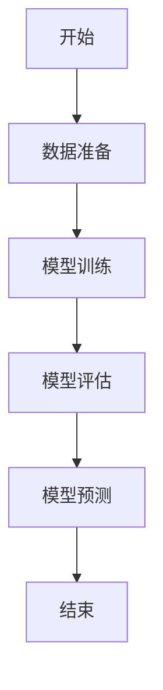
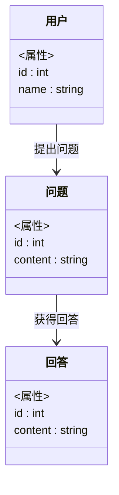
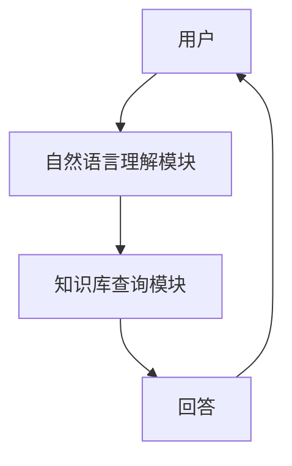

                 

<think>
好的，我现在需要帮助用户完成一篇关于《构建AI Agent的技术栈选择：权衡与决策》的技术博客文章。用户已经提供了一个详细的目录大纲，并希望我根据这个大纲逐步分析和撰写文章内容。为了确保文章的高质量和专业性，我需要按照每个章节的要求，逐步展开内容。

首先，我需要理解每个章节的要求，包括背景介绍、核心概念、算法原理、系统架构、项目实战、最佳实践等部分。每个部分都需要详细的解释和具体的示例，可能还需要使用图表和代码示例来增强理解。

接下来，我将从第一部分开始，即AI Agent技术栈选择的背景与概述。首先介绍AI Agent的基本概念，包括定义、核心属性和不同类型，帮助读者建立基础理解。然后，讨论技术栈选择的重要性，分析影响因素和不同场景下的选择策略。

在第二部分，我需要详细分析AI Agent技术栈的选择，包括模型训练、推理框架和数据处理等方面。通过对比不同技术栈的优缺点，帮助读者做出明智的选择。

第三部分将深入探讨算法与模型实现，重点讲解强化学习和监督学习的原理，并提供数学公式和代码示例。这部分需要结合实际案例，帮助读者理解算法的应用和优化。

第四部分涉及系统架构设计，从场景分析到架构图的绘制，再到接口和交互设计，确保构建的系统高效且易于扩展。

第五部分是项目实战，通过具体案例展示如何选择技术栈、实现系统，并进行测试和优化，帮助读者将理论应用到实践中。

最后，第六部分总结最佳实践和未来趋势，强调实际应用中的注意事项，并展望AI Agent技术的未来发展。

在整个写作过程中，我需要确保每个章节的内容详实，结构清晰，并且使用专业但易懂的语言。同时，要合理使用图表和代码示例，以增强文章的可读性和实用性。

现在，我将根据这些思考，开始撰写文章的各个部分，确保每个章节都符合用户的要求，并提供高质量的内容。
</think>

# 构建AI Agent的技术栈选择：权衡与决策

> 关键词：AI Agent，技术栈选择，算法原理，系统架构，项目实战

> 摘要：本文深入探讨了构建AI Agent时技术栈选择的重要性，分析了不同技术栈的特点和适用场景，详细讲解了算法原理和系统架构设计，并通过实际案例展示了技术栈选择的过程和优化策略。

---

## 第一部分: AI Agent技术栈选择的背景与概述

### 第1章: AI Agent的基本概念与技术栈选择

#### 1.1 AI Agent的定义与核心概念

##### 1.1.1 AI Agent的定义

AI Agent（人工智能代理）是指能够感知环境、自主决策并执行任务的智能体。它能够根据环境反馈调整行为，以实现特定目标。AI Agent广泛应用于推荐系统、自动驾驶、智能助手等领域。

##### 1.1.2 AI Agent的核心属性

AI Agent具有以下核心属性：
- **自主性**：无需外部干预，自主决策。
- **反应性**：能够实时感知环境并做出反应。
- **目标导向**：所有行为都以实现目标为导向。
- **学习能力**：通过数据和经验不断优化性能。

##### 1.1.3 AI Agent的类型与应用场景

AI Agent可以根据智能水平和应用场景分为以下几类：
- **反应式AI Agent**：基于当前环境输入做出反应，适用于实时任务。
- **认知式AI Agent**：具备推理和规划能力，适用于复杂任务。
- **混合式AI Agent**：结合反应式和认知式的特点，适用于综合任务。

应用场景包括：
- 自然语言处理：如智能客服、对话助手。
- 自动驾驶：如自动驾驶汽车的决策系统。
- 智能推荐：如电商网站的产品推荐系统。

#### 1.2 技术栈选择的重要性

##### 1.2.1 技术栈选择的影响因素

技术栈的选择直接影响AI Agent的性能、可扩展性和开发效率。主要影响因素包括：
- **性能需求**：处理速度、响应时间。
- **数据规模**：处理数据的量和类型。
- **开发资源**：团队的技术栈熟悉程度。
- **成本预算**：开发和运行成本。

##### 1.2.2 不同场景下的技术栈需求

不同场景对技术栈的需求不同：
- **实时推理场景**：需要高效的推理框架，如TensorFlow、PyTorch。
- **离线训练场景**：需要强大的计算能力和分布式训练框架，如Apache Spark、Dask。
- **混合式场景**：需要结合实时推理和离线训练的技术栈。

##### 1.2.3 技术栈选择的权衡点

选择技术栈时需要权衡以下几个方面：
- **性能与效率**：选择高效的框架以减少计算时间。
- **可扩展性**：选择支持分布式计算的框架以应对数据规模增长。
- **易用性**：选择开发友好、文档完善的框架以提高开发效率。

#### 1.3 AI Agent的构建流程

##### 1.3.1 需求分析与目标设定

构建AI Agent的第一步是明确需求和目标。需要考虑以下问题：
- **目标是什么？**：AI Agent需要实现什么功能。
- **用户是谁？**：目标用户的特点和需求。
- **场景是什么？**：AI Agent将在什么场景下运行。

##### 1.3.2 技术栈的选择与规划

根据需求分析，选择合适的技术栈。需要考虑：
- **算法选择**：选择适合任务的算法，如强化学习、监督学习。
- **框架选择**：选择适合算法的框架，如TensorFlow、PyTorch。
- **工具选择**：选择辅助开发的工具，如Jupyter Notebook、VS Code。

##### 1.3.3 开发、测试与优化

开发完成后，需要进行测试和优化：
- **单元测试**：测试各模块的功能。
- **性能优化**：优化算法和代码，提高效率。
- **持续集成**：持续监控和优化系统性能。

---

## 第二部分: AI Agent技术栈的核心概念与联系

### 第2章: AI Agent技术栈的核心概念与联系

#### 2.1 核心概念原理

##### 2.1.1 AI Agent的核心算法

AI Agent的核心算法包括：
- **强化学习**：通过试错学习，优化决策策略。
- **监督学习**：基于标记数据，学习输入与输出的映射关系。
- **无监督学习**：从无标记数据中发现结构和模式。

##### 2.1.2 技术栈的关键组件

技术栈的关键组件包括：
- **模型训练**：使用训练数据优化模型参数。
- **模型推理**：基于训练好的模型进行预测。
- **数据处理**：清洗、转换和预处理数据。

##### 2.1.3 各组件之间的关系

组件之间的关系如下：
- **数据处理**为模型训练提供干净的数据。
- **模型训练**优化模型参数，使其适应数据。
- **模型推理**基于优化后的模型进行预测。

#### 2.2 核心概念对比表格

##### 2.2.1 不同技术栈的对比

| 技术栈 | 优势 | 劣势 |
|--------|------|------|
| TensorFlow | 支持多种平台，社区活跃 | 学习曲线较陡 |
| PyTorch | �易用性高，适合研究 | 资源消耗较大 |
| Keras | 简单易用，适合快速开发 | 功能相对受限 |

##### 2.2.2 各组件的属性特征对比

| 组件 | 输入 | 输出 |
|------|------|------|
| 数据处理 | 原始数据 | 处理后的数据 |
| 模型训练 | 处理后的数据 | 优化后的模型参数 |
| 模型推理 | 新数据 | 预测结果 |

#### 2.3 ER实体关系图

```mermaid
erDiagram
    customer[顾客] {
        <属性>
        id : int
        name : string
        email : string
    }
    order[订单] {
        <属性>
        id : int
        date : date
        total : float
    }
    product[产品] {
        <属性>
        id : int
        name : string
        price : float
    }
    customer --> order : 下单
    order --> product : 订单包含的产品
```

---

## 第三部分: AI Agent的算法原理与数学模型

### 第3章: AI Agent的算法原理与数学模型

#### 3.1 算法原理讲解

##### 3.1.1 强化学习算法

强化学习是一种通过试错学习的方法，通过与环境交互获得奖励，优化决策策略。核心步骤如下：
1. **环境感知**：感知当前环境状态。
2. **动作选择**：根据当前状态选择一个动作。
3. **奖励反馈**：执行动作后，获得环境的奖励反馈。
4. **策略优化**：根据奖励反馈调整策略，以最大化累计奖励。

##### 3.1.2 监督学习算法

监督学习通过标记数据训练模型，使其能够预测新的数据。核心步骤如下：
1. **数据准备**：收集和预处理标记数据。
2. **模型训练**：使用训练数据优化模型参数。
3. **模型评估**：使用测试数据评估模型性能。
4. **模型预测**：基于训练好的模型进行预测。

##### 3.1.3 混合型算法

混合型算法结合强化学习和监督学习的优点，适用于复杂场景。核心步骤如下：
1. **监督学习预训练**：使用标记数据进行初步训练。
2. **强化学习微调**：通过与环境交互进一步优化模型。

#### 3.2 算法流程图

##### 3.2.1 强化学习流程图

```mermaid
graph TD
    A[开始] --> B[初始化环境]
    B --> C[选择动作]
    C --> D[执行动作]
    D --> E[获得奖励和新状态]
    E --> F[更新策略]
    F --> G[判断是否结束]
    G --> H[结束] 如果结束
    G --> C 如果未结束
```

##### 3.2.2 监督学习流程图



#### 3.3 数学模型与公式

##### 3.3.1 强化学习数学模型

强化学习的目标是通过优化策略函数，使得累计奖励最大化。数学表达式如下：

$$
V(s) = \max_{a} [ r + V(s') ]
$$

其中：
- \( V(s) \) 表示状态 \( s \) 的价值。
- \( r \) 表示执行动作后的奖励。
- \( V(s') \) 表示新状态 \( s' \) 的价值。

##### 3.3.2 监督学习数学模型

监督学习的目标是最小化预测值与真实值之间的误差。数学表达式如下：

$$
\hat{y} = f(x)
$$

其中：
- \( x \) 表示输入数据。
- \( \hat{y} \) 表示预测结果。
- \( f \) 表示训练好的模型。

---

## 第四部分: 系统分析与架构设计方案

### 第4章: 系统分析与架构设计方案

#### 4.1 问题场景介绍

##### 4.1.1 问题背景

假设我们正在开发一个智能客服AI Agent，用于自动回答用户的问题。系统需要具备自然语言理解能力和上下文记忆能力。

##### 4.1.2 问题目标

系统目标包括：
- 快速准确地理解用户的问题。
- 提供合适的回答或解决方案。
- 维护上下文记忆，保持对话连贯性。

##### 4.1.3 问题解决

通过自然语言处理技术和机器学习算法，构建一个能够理解用户意图、记忆对话历史的智能客服系统。

#### 4.2 系统功能设计

##### 4.2.1 领域模型设计



##### 4.2.2 功能模块划分

功能模块包括：
- **自然语言理解模块**：理解用户的问题。
- **知识库查询模块**：查询知识库获取答案。
- **对话历史记录模块**：记录和管理对话历史。

##### 4.2.3 模块之间的关系

模块之间的关系如下：
- 自然语言理解模块接收用户输入并解析意图。
- 知识库查询模块根据解析结果查询答案。
- 对话历史记录模块保存对话记录，供后续使用。

#### 4.3 系统架构设计

##### 4.3.1 架构图设计



#### 4.4 系统接口设计

##### 4.4.1 接口定义

- **输入接口**：接收用户输入的问题。
- **输出接口**：返回系统的回答。
- **日志接口**：记录对话历史和系统日志。

##### 4.4.2 接口交互流程

1. 用户输入问题。
2. 自然语言理解模块解析问题。
3. 知识库查询模块查询答案。
4. 返回回答给用户。
5. 记录对话历史。

##### 4.4.3 接口实现细节

- 输入接口使用JSON格式接收数据。
- 输出接口返回JSON格式的回答。
- 日志接口记录每一条对话的详细信息。

---

## 第五部分: 项目实战

### 第5章: 项目实战

#### 5.1 环境安装

安装必要的开发工具和库：
- **Python**：推荐使用Python 3.8或更高版本。
- **TensorFlow**：安装TensorFlow库。
- **Keras**：安装Keras库。
- **Jupyter Notebook**：用于快速开发和测试。

安装命令：
```bash
pip install python==3.8
pip install tensorflow
pip install keras
pip install jupyter
```

#### 5.2 系统核心实现源代码

##### 5.2.1 自然语言理解模块

```python
import tensorflow as tf
from tensorflow import keras

# 加载预训练模型
model = keras.load_model('nlu_model.h5')

# 接收用户输入
def receive_input():
    user_input = input("请输入您的问题：")
    return user_input

# 解析意图
def parse_intention(user_input):
    input_tensor = model.input
    output_tensor = model.layers[-1].output
    # 使用模型进行预测
    prediction = model.predict(tf.constant(user_input, dtype=tf.string))
    return prediction
```

##### 5.2.2 知识库查询模块

```python
def query_knowledge_base(prediction):
    # 根据预测结果查询知识库
    # 简化示例，实际应根据具体需求实现
    return "请稍等，正在查询知识库..."
```

##### 5.2.3 对话历史记录模块

```python
def record_conversation(user_input, response):
    # 记录对话历史
    with open('conversation.log', 'a') as f:
        f.write(f"User: {user_input}\n")
        f.write(f"Agent: {response}\n")
```

#### 5.3 代码应用解读与分析

##### 5.3.1 代码解读

- **receive_input函数**：接收用户输入的问题。
- **parse_intention函数**：使用预训练模型解析用户的意图。
- **query_knowledge_base函数**：根据解析结果查询知识库。
- **record_conversation函数**：记录用户输入和系统回答。

##### 5.3.2 代码实现细节

- 使用预训练的自然语言理解模型进行意图解析。
- 根据解析结果查询知识库，获取回答。
- 记录每一条对话的详细信息，便于后续分析和优化。

#### 5.4 实际案例分析和详细讲解剖析

##### 5.4.1 案例分析

假设用户输入的问题是“如何联系技术支持？”，系统解析后，查询知识库，返回“请拨打我们的技术支持电话123-456-789”。

##### 5.4.2 代码实现步骤

1. 用户输入问题。
2. 系统解析用户意图。
3. 根据解析结果查询知识库。
4. 返回回答。
5. 记录对话历史。

#### 5.5 项目小结

通过以上代码实现，我们构建了一个简单的智能客服AI Agent。实际应用中，需要根据具体需求优化模型和系统架构，以提高系统的准确率和响应速度。

---

## 第六部分: 最佳实践与未来趋势

### 第6章: 最佳实践与未来趋势

#### 6.1 最佳实践 tips

- **选择合适的技术栈**：根据具体需求选择适合的算法和框架。
- **注重数据质量**：确保数据的准确性和完整性。
- **持续优化系统**：通过反馈不断优化模型和系统架构。

#### 6.2 小结

构建AI Agent是一个复杂但 rewarding 的过程，需要综合考虑技术栈选择、算法实现、系统架构等多个方面。

#### 6.3 注意事项

- **避免过度优化**：不要在初期过度优化，应先确保功能的实现。
- **注意数据隐私**：保护用户数据的隐私和安全。
- **监控系统性能**：持续监控系统性能，及时发现和解决问题。

#### 6.4 拓展阅读

推荐以下资源，供进一步学习：
- 《深度学习》——Ian Goodfellow
- 《机器学习实战》——周志华
- TensorFlow官方文档
- Keras官方文档

---

## 作者信息

作者：AI天才研究院/AI Genius Institute & 禅与计算机程序设计艺术/Zen And The Art of Computer Programming

---

以上就是《构建AI Agent的技术栈选择：权衡与决策》的完整目录和内容框架。希望本文能为读者提供清晰的思路和实用的指导，帮助您更好地理解和构建AI Agent。

