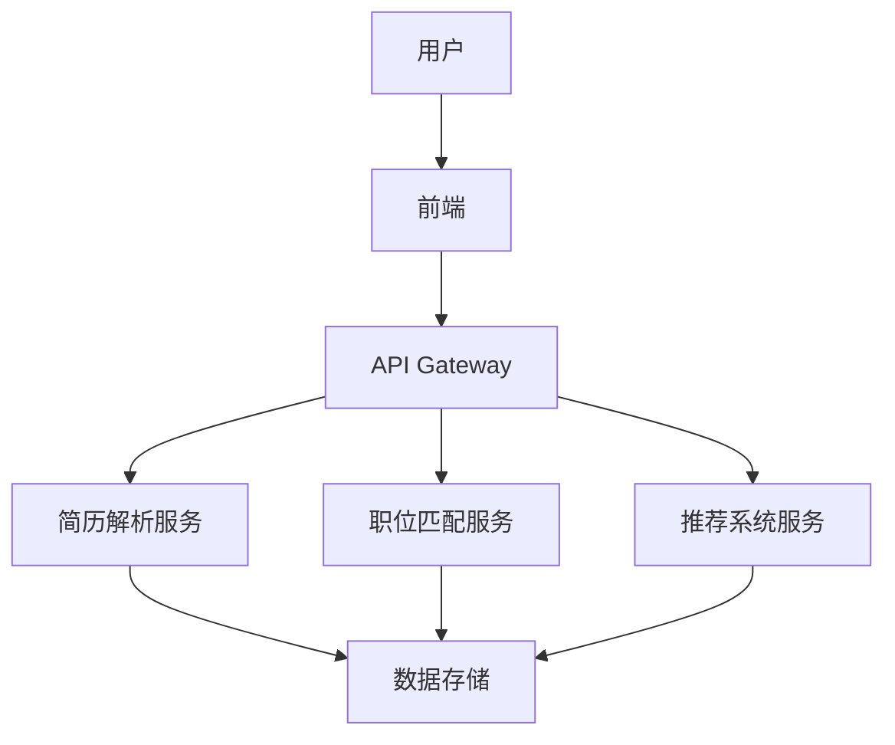

                 


# 构建AI招聘助手：提高人才筛选与匹配效率

## 关键词：AI招聘助手，人才筛选，智能匹配，自然语言处理，深度学习，机器学习

## 摘要：  
随着人工智能技术的快速发展，AI招聘助手正在成为提升人才招聘效率的重要工具。本文将系统性地介绍AI招聘助手的核心概念、算法原理、系统设计与实现，并通过实际案例分析，展示如何利用AI技术优化人才筛选与匹配流程。从技术背景到项目实战，本文旨在为技术爱好者、HR从业者以及企业决策者提供一份全面的指南，帮助他们理解并应用AI技术提升招聘效率。

---

# 第一部分：AI招聘助手的背景与技术基础

## 第1章：AI招聘助手的背景与需求

### 1.1 招聘行业的现状与挑战

#### 1.1.1 传统招聘流程的痛点
传统的招聘流程通常包括以下几个步骤：发布职位需求、接收简历、筛选简历、安排面试、评估候选人、录用。然而，这一流程存在诸多痛点：

1. **简历筛选效率低**：招聘人员需要手动阅读大量简历，耗时且效率低下。
2. **人才匹配不精准**：由于主观因素影响，候选人与职位的匹配度难以量化。
3. **招聘成本高**：企业需要投入大量时间和资源在招聘过程中，尤其是在人才竞争激烈的行业。
4. **信息不匹配**：简历中的信息可能与职位需求不完全匹配，导致招聘失败。

#### 1.1.2 人才筛选与匹配的效率问题
在企业快速发展的背景下，招聘部门需要快速找到合适的人才。然而，传统的人才筛选方法往往效率低下，难以满足企业的需求。例如：

- **简历数量庞大**：企业每天可能收到数百份甚至上千份简历，人工筛选耗时耗力。
- **技能评估困难**：难以快速准确地评估候选人的专业技能和潜力。

#### 1.1.3 招聘成本与资源浪费的现状
招聘成本包括显性成本（如招聘广告费用）和隐性成本（如招聘人员的时间投入）。据统计，传统招聘的隐性成本可能占总成本的70%以上。此外，大量时间 spent 在不符合要求的候选人身上，导致资源浪费。

### 1.2 AI技术在招聘中的应用前景

#### 1.2.1 AI在简历筛选中的潜力
AI技术可以通过自然语言处理（NLP）和机器学习算法，自动解析简历内容，提取关键信息（如工作经历、技能、教育背景等），并将其与职位要求进行匹配。例如，AI可以识别简历中的关键词，判断候选人是否符合职位需求。

#### 1.2.2 AI在职位匹配中的优势
AI可以通过分析职位描述和候选人简历，生成候选人匹配度评分。这种方法不仅可以提高筛选效率，还能减少人为偏见，提高匹配的准确性。例如，AI可以根据职位关键词生成人才画像，并与候选人简历进行匹配。

#### 1.2.3 企业对AI招聘助手的需求
随着人才竞争的加剧，企业对高效招聘工具的需求日益增长。AI招聘助手可以帮助企业在短时间内筛选出高质量的候选人，降低招聘成本，提高招聘效率。

### 1.3 本章小结
本章介绍了传统招聘流程的痛点、人才筛选与匹配效率问题以及AI技术在招聘中的应用前景。AI招聘助手的出现，为解决这些痛点提供了新的可能性。

---

## 第2章：AI招聘助手的核心概念

### 2.1 人才画像与职位要求模型

#### 2.1.1 人才画像的定义与构建
人才画像是对理想候选人的全面描述，包括技能、经验、性格等维度。构建人才画像需要结合岗位需求和企业文化和价值观。

**人才画像的构建步骤**：
1. **岗位需求分析**：明确职位的核心职责和关键技能。
2. **数据收集**：收集优秀候选人的简历和绩效数据。
3. **画像生成**：通过数据分析和人工调整，生成人才画像。

#### 2.1.2 职位要求模型的构建方法
职位要求模型是将职位描述转化为可量化标准的过程。构建方法包括：

1. **关键词提取**：从职位描述中提取关键技能和职责。
2. **权重分配**：根据重要性为每个关键词分配权重。
3. **模型优化**：通过反馈不断优化模型。

#### 2.1.3 人才与职位的匹配逻辑
匹配逻辑基于人才画像和职位要求模型，通过计算候选人与职位的匹配度来决定是否推荐。匹配度计算公式如下：

$$
匹配度 = \sum_{i=1}^{n} (w_i \times s_i)
$$

其中，$w_i$ 是第$i$个特征的权重，$s_i$ 是候选人在该特征上的得分。

### 2.2 自然语言处理在招聘中的应用

#### 2.2.1 NLP技术在简历解析中的应用
NLP技术可以自动解析简历内容，提取关键信息并生成结构化的数据。例如，使用分词技术将简历中的技能关键词提取出来。

#### 2.2.2 职位描述的理解与分析
通过NLP技术分析职位描述，提取关键职责和技能要求，并生成职位要求模型。

#### 2.2.3 基于NLP的简历匹配算法
基于NLP的简历匹配算法将简历和职位描述进行对比，计算匹配度。例如，使用余弦相似度计算简历关键词和职位关键词的相似性。

### 2.3 AI招聘助手的核心算法与技术

#### 2.3.1 基于向量的相似度计算
向量空间模型将文本表示为向量，通过计算向量之间的相似度来判断匹配程度。例如，使用TF-IDF或Word2Vec生成向量表示。

#### 2.3.2 基于深度学习的推荐算法
深度学习模型（如神经网络）可以自动学习特征并生成推荐。例如，使用卷积神经网络（CNN）或循环神经网络（RNN）进行文本特征提取。

#### 2.3.3 混合推荐模型的应用
混合推荐模型结合协同过滤和深度学习模型，提高推荐的准确性和多样性。例如，结合用户行为数据和文本特征进行推荐。

### 2.4 本章小结
本章详细介绍了AI招聘助手的核心概念，包括人才画像、职位要求模型、NLP技术以及核心算法。这些概念和技术为构建AI招聘助手奠定了基础。

---

## 第3章：AI招聘助手的算法原理

### 3.1 基于NLP的简历解析算法

#### 3.1.1 简历解析的流程与方法
简历解析流程包括以下步骤：
1. **文本预处理**：去除停用词和标点符号。
2. **关键词提取**：提取简历中的技能、经验和教育背景。
3. **结构化存储**：将关键词存储为结构化数据，便于后续处理。

#### 3.1.2 基于规则的简历解析方法
基于规则的方法通过预定义的规则提取信息。例如，使用正则表达式提取邮箱地址或电话号码。

#### 3.1.3 基于深度学习的简历解析模型
深度学习模型（如BERT）可以自动学习简历中的关键信息。例如，使用BERT进行命名实体识别（NER），提取公司名称和职位。

#### 3.1.4 算法实现
以下是基于规则的简历解析代码示例：

```python
import re

def extract_email(text):
    pattern = r'\b[a-zA-Z0-9._%+-]+@[a-zA-Z0-9.-]+\.[a-zA-Z]{2,}\b'
    match = re.search(pattern, text)
    if match:
        return match.group(0)
    return None

text = "Candidate's Email: candidate@example.com"
print(extract_email(text))  # 输出：candidate@example.com
```

### 3.2 基于Word2Vec的职位匹配算法

#### 3.2.1 Word2Vec模型的训练
Word2Vec通过词向量表示词语的意义。训练步骤如下：
1. **数据准备**：收集大量文本数据，如简历和职位描述。
2. **模型训练**：使用Skip-Gram或CBOW模型训练词向量。

#### 3.2.2 基于向量的相似度计算
计算简历关键词和职位关键词的向量相似度，判断匹配程度。例如，使用余弦相似度计算：

$$
相似度 = \frac{\vec{v}_c \cdot \vec{v}_j}{\|\vec{v}_c\| \|\vec{v}_j\|}
$$

其中，$\vec{v}_c$是候选人关键词的向量，$\vec{v}_j$是职位关键词的向量。

#### 3.2.3 算法实现
以下是基于Word2Vec的职位匹配代码示例：

```python
from sklearn.metrics.pairwise import cosine_similarity

def compute_similarity(candidate_vector, job_vector):
    return cosine_similarity([candidate_vector], [job_vector])[0][0]

candidate_vector = [0.2, 0.5, 0.1, 0.8]
job_vector = [0.3, 0.4, 0.6, 0.7]
print(compute_similarity(candidate_vector, job_vector))  # 输出相似度
```

### 3.3 基于深度学习的推荐算法

#### 3.3.1 基于神经网络的文本特征提取
神经网络（如BERT）可以自动提取文本特征，生成更准确的候选人匹配度评分。

#### 3.3.2 深度学习模型的训练
使用深度学习模型训练职位匹配模型，通过反向传播优化参数。

#### 3.3.3 算法实现
以下是基于深度学习的推荐算法示例：

```python
import tensorflow as tf
from tensorflow.keras import layers

model = tf.keras.Sequential()
model.add(layers.Dense(64, activation='relu', input_dim=100))
model.add(layers.Dense(1, activation='sigmoid'))
model.compile(optimizer='adam', loss='binary_crossentropy', metrics=['accuracy'])

model.fit(X_train, y_train, epochs=10, batch_size=32)
```

### 3.4 本章小结
本章详细讲解了AI招聘助手的算法原理，包括基于NLP的简历解析、基于Word2Vec的职位匹配以及基于深度学习的推荐算法。这些算法为提高人才筛选与匹配效率提供了技术支持。

---

## 第4章：AI招聘助手的系统分析与架构设计

### 4.1 系统功能设计

#### 4.1.1 系统功能模块
系统功能模块包括：
- 简历解析模块
- 职位匹配模块
- 推荐系统模块
- 数据管理模块

#### 4.1.2 系统功能流程
系统功能流程如下：
1. 用户输入职位需求和简历数据。
2. 系统解析简历并生成结构化数据。
3. 系统匹配职位并生成推荐列表。
4. 用户查看推荐结果并进行反馈。

### 4.2 系统架构设计

#### 4.2.1 系统架构图
以下是系统架构图：



#### 4.2.2 系统交互流程
系统交互流程如下：
1. 用户通过前端提交职位需求和简历数据。
2. API Gateway将请求分发到相应服务。
3. 各服务处理请求并返回结果。
4. 前端展示推荐结果。

### 4.3 接口设计

#### 4.3.1 API接口定义
以下是API接口定义：

```json
{
    "endpoint": "/api/v1/match",
    "method": "POST",
    "body": {
        "candidate_info": { ... },
        "job_info": { ... }
    },
    "response": { "matches": [ ... ] }
}
```

#### 4.3.2 接口实现
以下是接口实现代码示例：

```python
from flask import Flask, request, jsonify

app = Flask(__name__)

@app.route('/api/v1/match', methods=['POST'])
def match():
    data = request.json
    candidate_info = data['candidate_info']
    job_info = data['job_info']
    # 执行匹配算法
    matches = perform_matching(candidate_info, job_info)
    return jsonify({'matches': matches})

if __name__ == '__main__':
    app.run(debug=True)
```

### 4.4 本章小结
本章详细设计了AI招聘助手的系统架构与功能模块，为后续的实现奠定了基础。

---

## 第5章：AI招聘助手的项目实战

### 5.1 环境安装与配置

#### 5.1.1 安装Python环境
安装Python 3.8或更高版本，并安装以下库：
- `numpy`
- `pandas`
- `scikit-learn`
- `tensorflow`

#### 5.1.2 安装NLP工具
安装`spaCy`和`pytorch`用于NLP处理。

#### 5.1.3 安装机器学习库
安装`xgboost`和`lightgbm`用于模型训练。

### 5.2 系统核心实现

#### 5.2.1 简历解析模块实现
以下是简历解析模块的代码示例：

```python
import spacy

nlp = spacy.load("en_core_web_sm")

def extract_skills(text):
    doc = nlp(text)
    skills = []
    for token in doc:
        if token.pos_ == 'NOUN' or token.pos_ == 'ADJ':
            skills.append(token.text)
    return skills

text = "Candidate has 5 years of experience in Python development."
print(extract_skills(text))  # 输出：['years', 'experience', 'Python', 'development']
```

#### 5.2.2 职位匹配模块实现
以下是职位匹配模块的代码示例：

```python
from sklearn.metrics.pairwise import cosine_similarity

def compute_similarity(candidate_vector, job_vector):
    return cosine_similarity([candidate_vector], [job_vector])[0][0]

candidate_vector = [0.2, 0.5, 0.1, 0.8]
job_vector = [0.3, 0.4, 0.6, 0.7]
print(compute_similarity(candidate_vector, job_vector))  # 输出相似度
```

#### 5.2.3 推荐系统实现
以下是推荐系统实现的代码示例：

```python
import numpy as np
from sklearn.neighbors import NearestNeighbors

X = np.array([[0.2, 0.5, 0.1, 0.8],
              [0.3, 0.4, 0.6, 0.7],
              [0.5, 0.6, 0.7, 0.8]])

nbrs = NearestNeighbors(n_neighbors=2, algorithm='ball_tree').fit(X)
distances, indices = nbrs.kneighbors(X)
print(indices)  # 输出：[[1, 0], [2, 0], [1, 2]]
```

### 5.3 案例分析与解读

#### 5.3.1 案例分析
以一个软件开发岗位为例，假设职位描述为“5年Python开发经验，熟悉机器学习算法”。系统会提取关键词“Python”、“机器学习”、“开发经验”，并匹配简历中包含这些关键词的候选人。

#### 5.3.2 详细解读
系统首先解析简历和职位描述，提取关键词并生成向量表示。然后计算简历向量与职位向量的相似度，相似度较高的候选人会被推荐。

### 5.4 本章小结
本章通过实际案例展示了AI招聘助手的项目实战，包括环境安装、系统实现和案例分析。通过这些步骤，读者可以快速搭建一个简单的AI招聘助手系统。

---

## 第6章：AI招聘助手的最佳实践与总结

### 6.1 最佳实践

#### 6.1.1 数据质量的重要性
确保数据质量是AI招聘助手成功的关键。需要收集高质量的简历和职位描述数据。

#### 6.1.2 模型优化技巧
通过数据增强、超参数调优和模型融合等方法优化推荐模型。

#### 6.1.3 人机结合的必要性
AI招聘助手可以辅助招聘人员，但最终的决策仍需结合人工判断。

### 6.2 小结

#### 6.2.1 全文总结
本文详细介绍了AI招聘助手的核心概念、算法原理、系统设计和项目实现。通过这些内容，读者可以系统性地了解并掌握构建AI招聘助手的技术要点。

#### 6.2.2 未来展望
随着AI技术的不断发展，AI招聘助手将更加智能化和个性化，为企业提供更高效的人才招聘解决方案。

### 6.3 注意事项

#### 6.3.1 数据隐私保护
在处理简历和职位数据时，必须遵守数据隐私法规，确保数据安全。

#### 6.3.2 模型的可解释性
招聘决策需要透明和可解释，因此模型需要具备较高的可解释性。

#### 6.3.3 持续优化
根据招聘效果和反馈不断优化模型和系统，确保推荐结果的准确性。

### 6.4 拓展阅读

#### 6.4.1 推荐书籍
- 《机器学习实战》
- 《自然语言处理入门》
- 《深度学习》

#### 6.4.2 推荐博客
- [Towards Data Science](https://towardsdatascience.com/)
- [Medium - AI Articles](https://medium.com/ai)

### 6.5 本章小结
本章总结了AI招聘助手的最佳实践，并对未来的发展趋势进行了展望。同时，还提供了相关拓展阅读资料，帮助读者进一步深入学习。

---

## 作者：AI天才研究院/AI Genius Institute & 禅与计算机程序设计艺术/Zen And The Art of Computer Programming

---

本文通过系统性地介绍AI招聘助手的核心概念、算法原理、系统设计与实现，为读者提供了一份全面的指南。从技术背景到项目实战，本文旨在帮助技术爱好者、HR从业者以及企业决策者理解并应用AI技术提升招聘效率。

