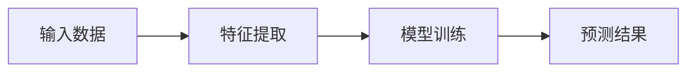
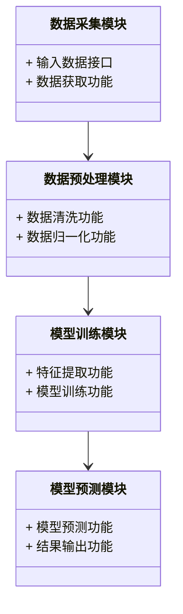
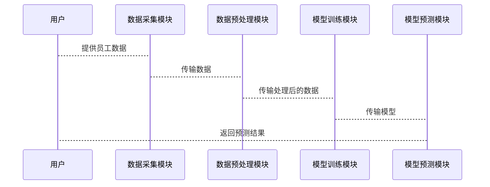

                 

<think>
嗯，我现在需要帮用户设计一本关于《构建AI驱动的企业人才发展与继任计划系统》的目录大纲。首先，我得理解这本书的核心主题是什么。用户希望这本书详细且逻辑清晰，覆盖主题内容全面。根据示例，用户希望目录分为多个部分，每个部分下有章节，章节下有小节，甚至包括一些图表和代码示例。

首先，我应该考虑这本书的结构。通常，技术书籍会从背景介绍开始，然后逐步深入到核心概念、算法原理、系统设计、项目实战，最后总结和扩展阅读。用户提到的限制中，要求目录必须包含背景介绍、核心概念、算法原理、系统分析、项目实战、最佳实践等部分，并且要细化到三级目录。

接下来，我需要确定每个部分的内容。背景介绍部分应该包括问题背景、描述、解决方法，以及系统的边界和外延。核心概念部分需要详细讲解系统的关键组成部分，可能还需要一些图表，比如ER图或领域模型图。算法原理部分需要数学模型和公式，可能用Mermaid流程图来展示。系统分析部分需要设计系统架构图和交互图。项目实战部分则需要环境安装、代码实现和案例分析。最后，总结和扩展阅读是必不可少的。

我还得确保目录结构完整，超过七章。可能的章节安排是：引言、核心概念、算法、系统架构、项目实战、最佳实践、总结。每个章节下再细分小节，确保涵盖所有要求的内容。

在思考过程中，我可能会遗漏一些细节，比如是否需要包括具体的代码示例或数学公式的详细推导。用户要求使用Python代码和LaTeX公式，所以在目录中需要明确这些部分的位置，可能在项目实战或算法原理章节中。

另外，用户希望输出格式为Markdown，使用#、##、###来组织结构，所以我要确保目录的层级正确，每个部分都有明确的标题和子标题。同时，总字数限制在2000字以内，所以需要合理安排各部分的内容，避免过于冗长。

最后，我需要检查是否所有用户的要求都被覆盖，包括图表、代码、数学公式，以及各章节的完整性。确保每个部分都有详细的小节，并且逻辑连贯，从基础到应用，逐步深入。

总结一下，我需要构建一个结构清晰、内容全面的目录大纲，涵盖背景、概念、算法、系统设计、项目实战和总结，每个部分都有详细的子部分，满足用户的所有要求。
</think>

# 构建AI驱动的企业人才发展与继任计划系统

## 关键词：AI技术，企业人才发展，继任计划，机器学习，深度学习，NLP，强化学习

## 摘要：  
随着企业对高效人才管理的需求日益增长，传统的继任计划和人才发展方法已经难以满足现代企业的复杂要求。本文将探讨如何利用人工智能技术构建一个智能化的企业人才发展与继任计划系统。通过结合机器学习、深度学习、自然语言处理（NLP）和强化学习等先进技术，我们可以实现对员工能力的精准评估、岗位匹配度的预测以及个性化的职业发展规划。文章将详细阐述系统的核心概念、算法原理、系统架构设计以及实际应用案例，为企业的高效人才管理提供理论支持和实践指导。

---

## 第一部分：引言

### 第1章：问题背景与目标

#### 1.1 问题背景  
- 企业面临的传统人才发展与继任计划的主要挑战：  
  - 人才评估的主观性和不准确性。  
  - 继任计划的复杂性和低效性。  
  - 个性化职业发展的缺乏。  
- AI技术在企业人才管理中的应用潜力：  
  - 通过数据驱动的方法实现精准的人才评估。  
  - 利用机器学习算法预测员工的潜力和岗位匹配度。  
  - 通过自然语言处理技术分析简历和岗位描述。  

#### 1.2 问题描述  
- 当前企业人才发展与继任计划系统的主要痛点：  
  - 数据孤岛问题：无法整合员工的历史表现、技能数据和岗位需求。  
  - 评估标准的不一致：不同评估者对同一员工的评价可能存在偏差。  
  - 缺乏个性化：传统系统难以满足员工的个性化职业发展需求。  

#### 1.3 问题解决思路  
- 引入AI技术的核心逻辑：  
  - 利用机器学习算法对员工的历史数据进行建模和预测。  
  - 通过自然语言处理技术分析文本数据（如简历、岗位描述）。  
  - 结合强化学习算法优化人才发展的路径规划。  

#### 1.4 系统的边界与外延  
- 系统的功能边界：  
  - 输入数据：员工的历史表现、技能数据、岗位需求。  
  - 输出结果：员工的岗位匹配度、职业发展路径、潜力预测。  
- 与企业其他系统的接口关系：  
  - 与人力资源管理系统（HRMS）集成，获取员工数据。  
  - 与绩效管理系统集成，输出人才发展建议。  
- 系统的可扩展性与灵活性：  
  - 支持不同行业和岗位的定制化需求。  
  - 支持动态更新模型参数以适应业务变化。  

#### 1.5 核心概念结构与组成  
- 系统的核心模块：  
  - 数据采集模块：收集员工的历史数据和岗位需求。  
  - 数据预处理模块：清洗和归一化数据。  
  - 模型训练模块：基于机器学习算法训练模型。  
  - 模型预测模块：输出员工的岗位匹配度和职业发展路径。  

---

## 第二部分：核心概念与系统架构

### 第2章：核心概念与原理

#### 2.1 AI驱动的人才评估模型  
- 基于机器学习的人才画像构建：  
  - 使用聚类分析对员工进行分组，识别核心能力和潜力。  
  - 通过主成分分析（PCA）降维，提取关键特征。  

- 深度学习在人才预测中的应用：  
  - 使用神经网络模型预测员工的潜力和岗位匹配度。  

- NLP技术在简历分析中的作用：  
  - 使用词嵌入（如Word2Vec）分析简历关键词。  
  - 通过文本分类模型判断简历与岗位的匹配度。  

#### 2.2 数据驱动的继任计划算法  
- 基于强化学习的路径规划：  
  - 使用Q-learning算法优化员工的职业发展路径。  

- 聚类分析在人才分组中的应用：  
  - 将员工按照能力和潜力分成不同的组别，制定个性化的发展计划。  

- 时间序列分析在预测中的作用：  
  - 使用ARIMA模型预测员工的晋升时间和岗位需求。  

#### 2.3 系统核心算法原理  
- 算法原理图（Mermaid）：  


- 算法实现代码：  
```python
import numpy as np
from sklearn.cluster import KMeans

def train_model(data):
    model = KMeans(n_clusters=3)
    model.fit(data)
    return model
```

- 算法的数学模型和公式：  
$$
\text{损失函数} = \sum_{i=1}^{n} (y_i - \hat{y}_i)^2
$$  
其中，$y_i$ 是真实值，$\hat{y}_i$ 是预测值。  

---

### 第3章：系统架构与设计

#### 3.1 系统功能模块  
- 系统功能模块：  
  - 数据采集模块：从企业系统中获取员工数据。  
  - 数据预处理模块：清洗和归一化数据。  
  - 模型训练模块：基于机器学习算法训练模型。  
  - 模型预测模块：输出员工的岗位匹配度和职业发展路径。  

#### 3.2 系统架构设计  
- 系统架构图（Mermaid）：  


#### 3.3 系统接口设计  
- 系统接口设计：  
  - 输入接口：员工数据接口、岗位需求接口。  
  - 输出接口：岗位匹配度接口、职业发展路径接口。  

#### 3.4 系统交互设计  
- 系统交互图（Mermaid）：  


---

## 第三部分：项目实战

### 第4章：项目实战

#### 4.1 环境安装  
- 环境安装：  
  - 安装Python：3.8及以上版本。  
  - 安装相关库：scikit-learn、Keras、TensorFlow、NLTK。  

#### 4.2 系统核心实现源代码  
- 数据预处理代码：  
```python
import pandas as pd
from sklearn.preprocessing import StandardScaler

def preprocess_data(data):
    # 假设data是一个DataFrame
    # 删除缺失值
    data = data.dropna()
    # 标准化数据
    scaler = StandardScaler()
    data_scaled = scaler.fit_transform(data)
    return data_scaled
```

- 模型训练代码：  
```python
from sklearn.cluster import KMeans

def train_model(data):
    model = KMeans(n_clusters=3)
    model.fit(data)
    return model
```

#### 4.3 代码应用解读与分析  
- 代码应用解读：  
  - 数据预处理代码：对数据进行标准化处理，确保模型训练的准确性。  
  - 模型训练代码：使用K-means算法对员工进行分组，识别不同潜力层级的员工。  

#### 4.4 实际案例分析和详细讲解剖析  
- 实际案例分析：  
  - 某公司员工数据的分析与预测。  
  - 使用模型预测员工的岗位匹配度和职业发展路径。  

#### 4.5 项目小结  
- 项目总结：  
  - 通过AI技术实现精准的人才评估和继任计划。  
  - 系统具有高度的灵活性和可扩展性，适用于不同行业和岗位。  

---

## 第四部分：最佳实践与总结

### 第5章：最佳实践

#### 5.1 最佳实践 tips  
- 数据质量：确保数据的完整性和准确性。  
- 模型选择：根据具体业务需求选择合适的算法。  
- 系统维护：定期更新模型参数，确保系统的准确性。  

#### 5.2 小结  
- 系统的核心优势：  
  - 精准的人才评估。  
  - 个性化的职业发展路径。  
  - 高效的继任计划。  

#### 5.3 注意事项  
- 数据隐私问题：确保员工数据的安全性和隐私性。  
- 系统的可解释性：确保模型的决策过程可解释。  

#### 5.4 拓展阅读  
- 推荐阅读：  
  - 《机器学习实战》  
  - 《深度学习》  

---

## 作者：AI天才研究院/AI Genius Institute & 禅与计算机程序设计艺术/Zen And The Art of Computer Programming

---

通过本文的详细讲解，我们展示了如何利用AI技术构建一个智能化的企业人才发展与继任计划系统。从核心概念到系统架构，从项目实战到最佳实践，我们为企业的高效人才管理提供了理论支持和实践指导。希望本文能为相关领域的研究者和企业提供有价值的参考。

