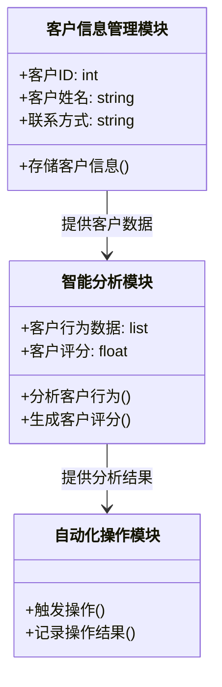
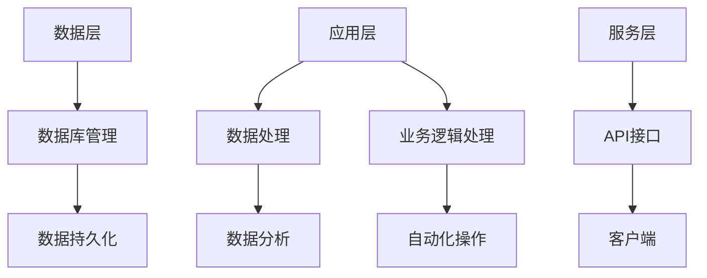
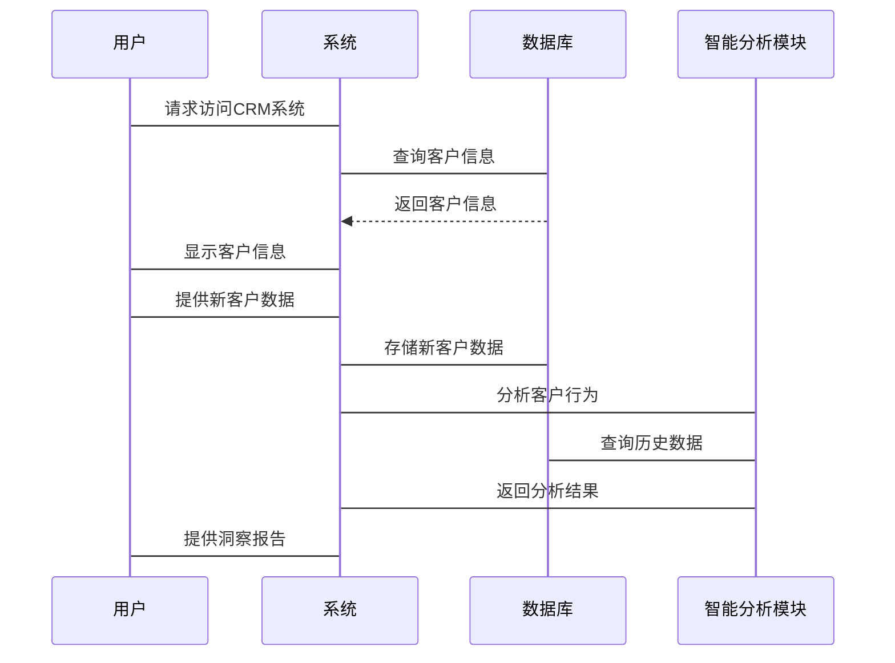

                 


# 构建AI驱动的企业客户关系管理(CRM)系统

> **关键词**: AI驱动、CRM系统、客户关系管理、人工智能、系统架构

> **摘要**: 本文详细探讨了如何构建一个基于人工智能的客户关系管理系统（CRM）。通过分析AI在CRM中的应用，系统性地介绍了AI驱动CRM的核心概念、算法原理、系统架构设计及项目实战。文章结合实际案例，深入浅出地讲解了从数据收集到模型训练、系统部署的全过程，为读者提供了一套完整的解决方案。

---

## 第四章: AI驱动CRM系统的系统分析与架构设计

### 4.2 系统功能设计

#### 4.2.1 功能模块划分
AI驱动的CRM系统通常包含以下几个核心功能模块：
1. **客户信息管理模块**：负责收集、存储和管理客户数据。
2. **智能分析模块**：利用AI技术对客户数据进行分析，提供洞察和预测。
3. **自动化操作模块**：根据分析结果，自动执行相关业务流程。

#### 4.2.2 功能模块交互流程
1. **客户信息管理模块**：用户输入客户信息，系统存储并分类。
2. **智能分析模块**：从客户信息中提取特征，利用算法进行分析和预测。
3. **自动化操作模块**：根据分析结果，触发相应的业务流程，如发送邮件、安排会议等。

#### 4.2.3 功能模块的依赖关系
通过以下类图展示功能模块的依赖关系：



### 4.3 系统架构设计

#### 4.3.1 系统架构设计概述
AI驱动的CRM系统通常采用分层架构，包括数据层、应用层和服务层。

#### 4.3.2 系统架构设计图
通过以下架构图展示系统架构：



#### 4.3.3 系统接口设计
系统主要接口包括：
1. **数据接口**：用于数据的导入和导出。
2. **API接口**：供其他系统调用CRM功能。
3. **用户界面**：供用户与系统交互。

#### 4.3.4 系统交互流程
通过以下序列图展示系统交互流程：



---

## 第五章: AI驱动CRM系统的算法实现与项目实战

### 5.1 环境安装与配置

#### 5.1.1 环境需求
- **Python 3.8+**
- **TensorFlow 2.0+**
- **Scikit-learn 0.24+**
- **Jupyter Notebook**

### 5.2 核心代码实现

#### 5.2.1 数据预处理代码
```python
import pandas as pd
import numpy as np

# 加载数据
data = pd.read_csv('customer_data.csv')

# 查看数据基本信息
print(data.info())
print(data.describe())

# 处理缺失值
data = data.dropna()
```

#### 5.2.2 模型训练代码
```python
from sklearn.model import SVC
from sklearn.metrics import accuracy_score

# 数据分割
X_train, X_test, y_train, y_test = train_test_split(data[['age', 'income']], data['label'])

# 训练模型
model = SVC()
model.fit(X_train, y_train)

# 预测与评估
y_pred = model.predict(X_test)
print("Accuracy:", accuracy_score(y_test, y_pred))
```

#### 5.2.3 系统接口代码
```python
from flask import Flask, request, jsonify

app = Flask(__name__)

@app.route('/api/predict', methods=['POST'])
def predict():
    data = request.json
    # 执行预测逻辑
    prediction = model.predict([[data['age'], data['income']]])
    return jsonify({'prediction': int(prediction[0])})

if __name__ == '__main__':
    app.run(debug=True)
```

### 5.3 项目实战分析

#### 5.3.1 案例分析
假设我们有一个电商企业，希望通过AI驱动的CRM系统来提高客户满意度和销售额。

#### 5.3.2 数据分析与特征工程
1. **数据清洗**：处理缺失值、异常值。
2. **特征提取**：提取客户的年龄、收入、购买历史等特征。
3. **特征工程**：对特征进行标准化、编码等处理。

#### 5.3.3 模型选择与优化
1. **选择模型**：如随机森林、XGBoost等。
2. **模型调优**：通过网格搜索优化模型参数。
3. **模型评估**：通过准确率、召回率、F1分数等指标评估模型性能。

### 5.4 系统部署与测试

#### 5.4.1 系统部署
将训练好的模型部署到云服务器，提供API接口供前端调用。

#### 5.4.2 系统测试
1. **功能测试**：测试各个功能模块是否正常工作。
2. **性能测试**：测试系统在高并发情况下的表现。
3. **安全性测试**：测试系统的安全性，防止数据泄露等风险。

---

## 第六章: 项目总结与未来展望

### 6.1 项目总结

#### 6.1.1 核心成果
- 成功构建了一个AI驱动的CRM系统。
- 提高了客户满意度和企业效率。

#### 6.1.2 实践经验
- 数据预处理是关键，尤其是缺失值和异常值的处理。
- 模型选择与调优直接影响系统性能。
- 系统架构设计要合理，确保高可用性和可扩展性。

### 6.2 未来展望

#### 6.2.1 技术发展
随着AI技术的不断进步，未来的CRM系统将更加智能化和自动化。

#### 6.2.2 应用场景扩展
除了电商行业，AI驱动的CRM系统还可以应用于金融、医疗、教育等多个领域。

#### 6.2.3 挑战与机遇
- 挑战：数据隐私、模型解释性等。
- 机遇：通过技术进步解决现有问题，推动CRM系统的进一步发展。

---

## 总结

构建一个AI驱动的CRM系统需要综合运用人工智能技术、系统架构设计和项目管理能力。通过本文的详细讲解，读者可以掌握从数据收集到系统部署的全过程，并能够在实际项目中应用这些知识。未来，随着AI技术的不断进步，CRM系统将变得更加智能和高效，为企业创造更大的价值。

---

**作者：AI天才研究院/AI Genius Institute & 禅与计算机程序设计艺术 /Zen And The Art of Computer Programming**

