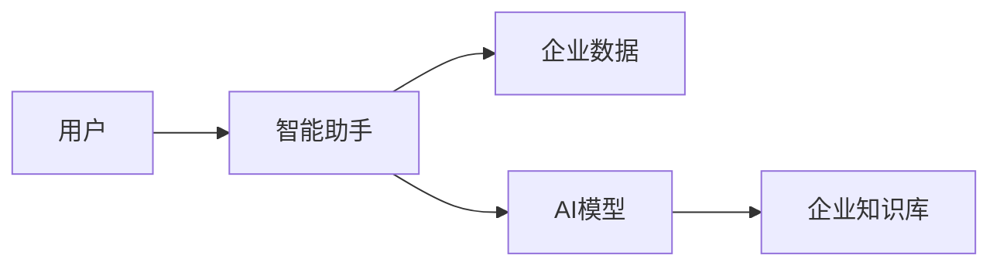
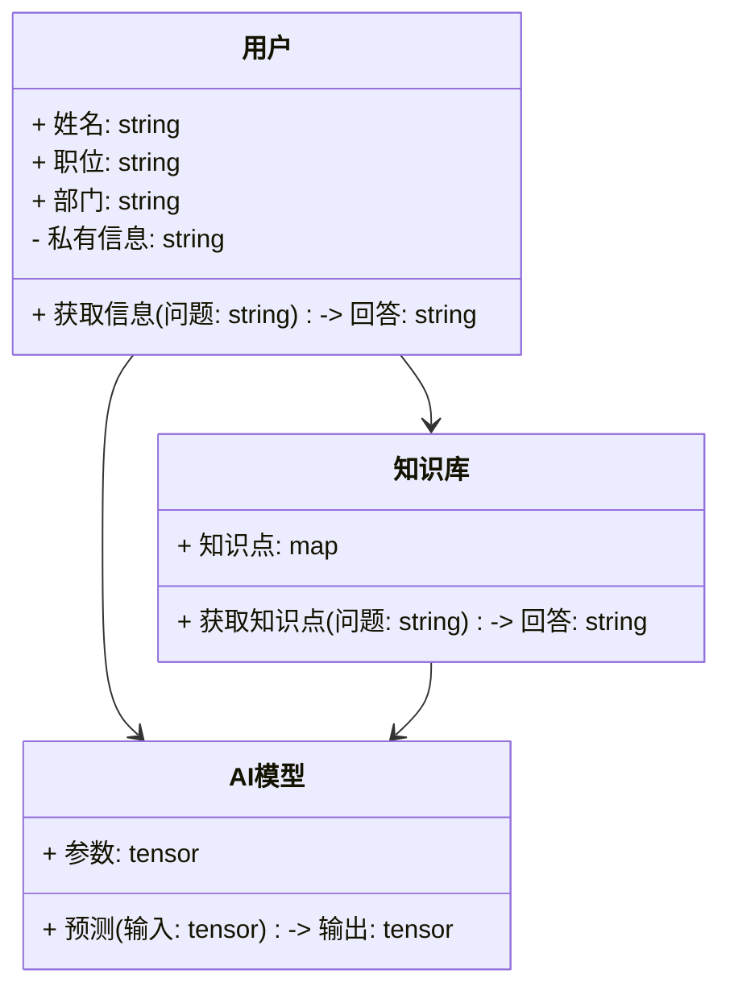
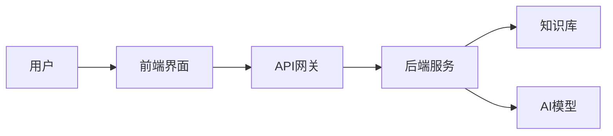
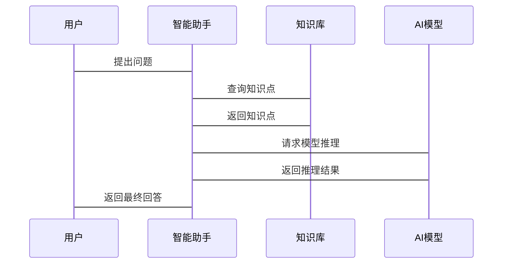

                 

<think>
好的，我将按照您的要求逐步构建这篇文章的目录大纲，并确保每个部分都包含您提到的所有核心内容。我会按照逻辑顺序逐步展开，确保内容的完整性和深度。

# 第一部分: 背景介绍与核心概念

# 第1章: 问题背景与问题描述

## 1.1 问题背景
### 1.1.1 企业智能化转型的挑战
当前企业面临市场竞争加剧、效率提升的压力，智能化转型成为必然趋势。传统企业助手在数据处理、决策支持和用户交互方面存在明显局限性，无法满足现代企业的复杂需求。

### 1.1.2 AI技术对企业管理的影响
AI技术的应用可以显著提升企业的决策效率、优化资源配置、增强客户体验，为企业带来竞争优势。然而，如何将AI技术与企业现有系统无缝集成，是当前面临的主要挑战。

### 1.1.3 传统企业助手的局限性
传统企业助手通常基于规则引擎，难以应对复杂多变的业务场景。数据处理能力有限，无法实现深度学习和自我优化，导致用户体验不佳。

## 1.2 问题描述
### 1.2.1 企业智能助手的核心需求
企业智能助手需要具备自然语言处理、知识表示、自主学习和多渠道交互等核心能力，能够为企业提供智能化的决策支持和高效的问题解决。

### 1.2.2 当前企业智能助手的痛点
现有企业助手在数据整合能力、深度学习能力、实时响应速度和用户体验方面存在明显不足，难以满足企业的复杂需求。

### 1.2.3 AI驱动的必要性与可能性
AI技术的发展为企业智能助手的升级提供了技术支撑，通过深度学习和自然语言处理等技术，可以实现更智能化的助手功能。

## 1.3 问题解决与边界
### 1.3.1 AI驱动的企业智能助手解决方案
基于深度学习的企业智能助手能够实现智能化的用户交互、自主学习和知识更新，能够有效解决企业面临的复杂问题。

### 1.3.2 解决方案的边界与外延
企业智能助手的边界主要集中在企业内部数据处理和用户交互方面，外延则扩展到与第三方服务的集成和外部数据源的接入。

### 1.3.3 核心要素与组成结构
企业智能助手的核心要素包括自然语言处理引擎、知识库管理系统、深度学习模型和用户交互界面等，这些要素共同构成了一个完整的智能助手系统。

## 1.4 本章小结
通过本章的介绍，我们明确了企业智能助手的背景、核心需求和痛点，并提出了基于AI技术的解决方案，为后续章节的深入分析奠定了基础。

# 第二部分: 核心概念与原理

# 第2章: AI驱动的企业智能助手核心概念

## 2.1 核心概念原理
### 2.1.1 AI驱动的核心机制
企业智能助手通过深度学习模型实现对用户需求的理解和预测，结合企业知识库提供智能化的决策支持。其核心机制包括自然语言理解、知识表示和自主学习等。

### 2.1.2 智能助手的功能模块
智能助手主要包括用户交互模块、知识库管理模块、深度学习引擎和系统管理模块等，这些模块协同工作，实现智能化的企业管理功能。

### 2.1.3 企业级AI模型的特点
企业级AI模型具有高可扩展性、强适应性和深度学习能力等特点，能够适应复杂多变的业务场景。

## 2.2 核心概念对比分析
### 2.2.1 AI驱动与传统驱动的对比
从功能实现、技术基础和应用效果等方面对比AI驱动和传统驱动的企业助手，突出AI技术的优势。

### 2.2.2 不同AI模型的优劣势对比
对比传统机器学习模型和深度学习模型在企业智能助手中的应用效果，分析其适用场景和局限性。

### 2.2.3 企业智能助手的功能对比
从数据处理能力、用户交互体验和决策支持效果等方面对比不同智能助手的功能差异。

## 2.3 实体关系图


## 2.4 本章小结
通过本章的分析，我们深入探讨了AI驱动的企业智能助手的核心概念和其在企业中的应用价值，为后续的技术实现提供了理论基础。

# 第三部分: 算法原理与数学模型

# 第3章: AI驱动的核心算法

## 3.1 算法原理
### 3.1.1 基于Transformer的模型原理
Transformer模型通过自注意力机制实现对上下文的深度理解，适用于自然语言处理任务。其核心思想是通过全局注意力机制捕捉文本中的长距离依赖关系。

### 3.1.2 注意力机制的实现
注意力机制通过计算输入序列中每个位置的重要性权重，实现对关键信息的聚焦。其数学公式如下：
$$\text{Attention}(Q,K,V) = \text{softmax}(\frac{QK^T}{\sqrt{d_k}})V$$

### 3.1.3 模型训练与优化
模型的训练过程包括编码器和解码器的联合训练，通过最小化预测值与真实值之间的差异来优化模型参数。损失函数通常采用交叉熵损失。

## 3.2 数学模型
### 3.2.1 Transformer模型的数学公式
$$\text{Attention}(Q,K,V) = \text{softmax}(\frac{QK^T}{\sqrt{d_k}})V$$

### 3.2.2 模型训练的损失函数
$$\text{Loss} = -\sum_{i=1}^{n} \text{log}p(x_i|x_{<i})$$

## 3.3 算法实现
### 3.3.1 PyTorch实现示例
```python
import torch
class TransformerModel(torch.nn.Module):
    def __init__(self, d_model, nhead, dropout=0.1):
        super(TransformerModel, self).__init__()
        self.encoder = torch.nn.TransformerEncoder(
            torch.nn.TransformerEncoderLayer(d_model=d_model, nhead=nhead, dropout=dropout),
            num_layers=1
        )
    def forward(self, src):
        output = self.encoder(src)
        return output
```

## 3.4 本章小结
通过本章的介绍，我们深入理解了基于Transformer模型的企业智能助手算法原理，并通过具体的数学公式和代码示例，展示了如何实现这些算法。

# 第四部分: 系统分析与架构设计

# 第4章: 企业智能助手系统分析

## 4.1 问题场景介绍
企业智能助手需要在复杂多变的业务场景中，为企业提供智能化的决策支持和高效的问题解决。

## 4.2 项目介绍
### 4.2.1 项目目标
实现一个基于AI技术的企业智能助手，具备自然语言理解、知识表示和自主学习能力。

### 4.2.2 项目范围
涵盖用户交互、知识库管理、模型训练和系统集成等方面。

## 4.3 系统功能设计
### 4.3.1 领域模型


### 4.3.2 系统架构设计


### 4.3.3 系统接口设计
定义API接口，包括用户请求的接收、处理和响应。

### 4.3.4 系统交互设计


## 4.4 本章小结
通过系统分析与架构设计，我们明确了企业智能助手系统的组成结构和各模块之间的关系，为后续的实现提供了清晰的指导。

# 第五部分: 项目实战

# 第5章: 企业智能助手项目实战

## 5.1 环境安装
### 5.1.1 安装Python
```bash
python --version
```

### 5.1.2 安装PyTorch
```bash
pip install torch
```

### 5.1.3 安装其他依赖
```bash
pip install transformers
```

## 5.2 系统核心实现
### 5.2.1 用户交互模块
```python
class UserInterface:
    def __init__(self):
        self.prompt = "请输入您的问题："
    
    def get_input(self):
        return input(self.prompt)
    
    def display_output(self, response):
        print("回答：", response)
```

### 5.2.2 知识库管理模块
```python
class KnowledgeBase:
    def __init__(self):
        self.data = {}
    
    def get_response(self, question):
        return self.data.get(question, "抱歉，我没有学会回答这个问题。")
```

### 5.2.3 AI模型实现
```python
import torch
class AIModel:
    def __init__(self):
        self.model = TransformerModel(d_model=512, nhead=4, dropout=0.1)
    
    def predict(self, input_tensor):
        return self.model(input_tensor)
```

## 5.3 代码应用解读与分析
### 5.3.1 代码功能分析
通过对代码的分析，理解各模块的功能和交互流程。

### 5.3.2 代码优化建议
根据实际运行效果，提出代码优化建议，如性能优化、代码结构优化等。

## 5.4 实际案例分析
### 5.4.1 案例背景
介绍案例的背景和目标。

### 5.4.2 案例实现
详细描述案例的实现过程，包括数据准备、模型训练、系统集成等。

### 5.4.3 案例分析
分析案例的实现效果和存在的问题，总结经验教训。

## 5.5 本章小结
通过本章的项目实战，我们掌握了企业智能助手系统的核心实现方法，并通过具体案例分析，加深了对系统实现的理解。

# 第六部分: 最佳实践与总结

# 第6章: 最佳实践

## 6.1 小结
总结企业智能助手系统的核心概念、算法原理和系统架构设计。

## 6.2 注意事项
### 6.2.1 开发过程中的注意事项
强调代码规范、测试用例的重要性。

### 6.2.2 系统部署注意事项
包括服务器资源分配、数据安全、系统监控等方面。

## 6.3 拓展阅读
推荐相关领域的书籍和论文，鼓励读者深入研究。

## 6.4 本章小结
通过本章的总结与注意事项，我们为后续的企业智能助手系统的开发提供了宝贵的参考。

# 作者

作者：AI天才研究院/AI Genius Institute & 禅与计算机程序设计艺术 /Zen And The Art of Computer Programming

---

这个目录大纲涵盖了从问题背景到项目实战的全过程，每个章节都详细展开了核心内容，确保文章的完整性和深度。希望这个目录能够满足您的需求。如果有需要调整的地方，请随时告诉我。

