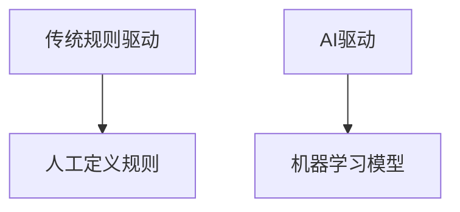
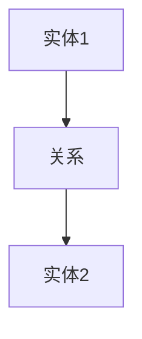
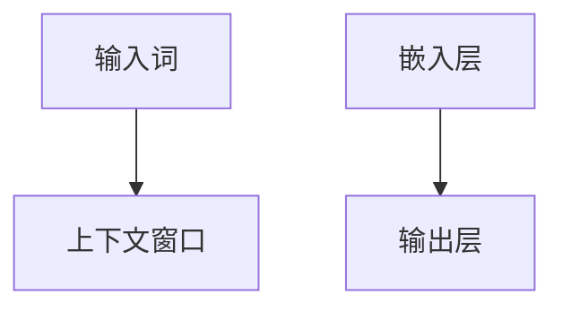
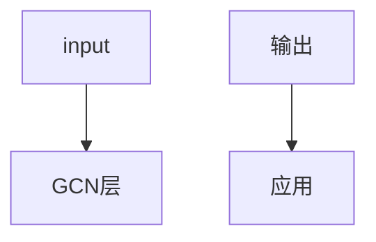
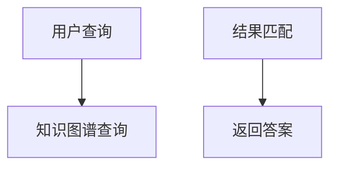
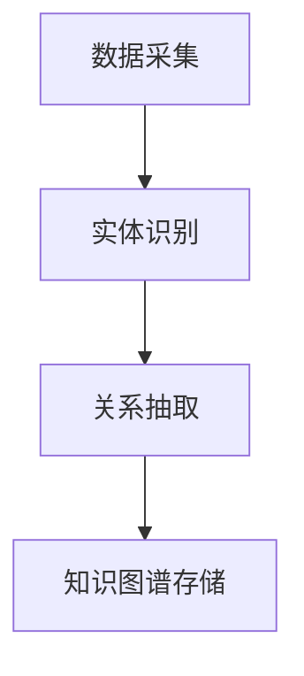
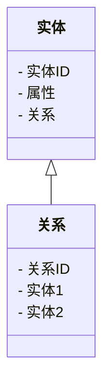
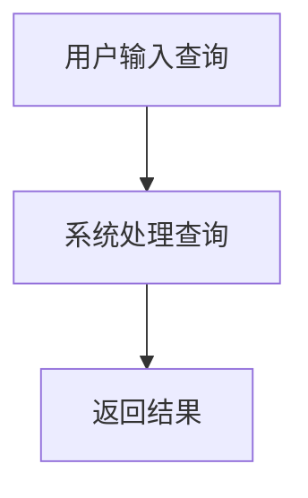

                 


# 构建AI驱动的企业知识图谱：深化领域理解

> 关键词：知识图谱、人工智能、企业应用、深度学习、图神经网络

> 摘要：本文详细探讨了如何利用人工智能技术构建企业知识图谱，通过深化对领域的理解，结合先进的算法和系统架构设计，实现企业数据的高效整合与智能化应用。

---

## 第一部分：构建AI驱动的企业知识图谱概述

### 第1章：知识图谱与AI驱动的概述

#### 1.1 知识图谱的基本概念
知识图谱是一种将结构化数据和非结构化数据整合起来，形成语义网络的数据组织方式。它通过实体和关系的表示，将分散的数据点连接起来，形成一个可计算的网络。知识图谱的核心目标是帮助机器更好地理解和推理人类知识。

**表1-1：知识图谱与其他数据组织方式的对比**

| 对比维度         | 数据结构化程度 | 表达能力 | 可扩展性 |
|------------------|----------------|----------|----------|
| 传统数据库       | 高             | 低       | 低       |
| 文本数据         | 低             | 中       | 高       |
| 知识图谱         | 中             | 高       | 高       |

#### 1.2 AI驱动的知识图谱构建方法
AI驱动的知识图谱构建方法相较于传统规则驱动的方法更加高效和灵活。以下是两种方法的对比：

**图1-1：传统方法与AI驱动方法的对比**



#### 1.3 企业知识图谱的应用价值
企业知识图谱可以帮助企业在多个领域实现智能化转型，例如：

- **提升企业智能化水平**：通过知识图谱，企业可以更好地理解和利用数据，提升决策的智能化。
- **优化企业决策流程**：知识图谱可以提供跨部门、跨系统的知识整合，优化决策流程。
- **增强企业数据整合能力**：知识图谱能够处理结构化和非结构化数据，提升数据整合能力。

---

### 第2章：知识图谱构建的核心概念与联系

#### 2.1 知识图谱的结构与属性
知识图谱的结构主要由实体、关系和属性三部分组成。以下是三者的详细定义：

- **实体**：实体是知识图谱中的基本单元，可以是人、物、概念等。
- **关系**：关系描述实体之间的关联，可以是“属于”、“包含”等。
- **属性**：属性是实体的描述性特征，例如“颜色”、“重量”等。

**图2-1：知识图谱的实体关系图**



#### 2.2 知识图谱构建的关键步骤
知识图谱的构建分为数据采集与预处理、实体识别与链接、关系抽取与构建三个主要步骤。以下是每个步骤的简要说明：

- **数据采集与预处理**：从多种数据源采集数据，并进行清洗和格式统一。
- **实体识别与链接**：通过NLP技术识别实体，并建立实体之间的关联。
- **关系抽取与构建**：从文本中抽取关系，并构建知识图谱的结构。

#### 2.3 知识图谱的存储与管理
知识图谱的存储与管理是构建过程中的重要环节，以下是几种常见的存储方式：

- **图数据库**：如Neo4j，适合存储复杂的图结构数据。
- **关系型数据库**：适合存储结构化的数据，但不适合复杂的关联关系。
- **NoSQL数据库**：适合存储非结构化数据，但对图结构的支持有限。

---

### 第3章：知识图谱的构建算法原理

#### 3.1 基于嵌入的方法
嵌入方法是一种将实体和关系映射到低维向量空间的方法，常见的模型有Word2Vec、Skip-Gram和GLOVE。以下是Word2Vec的训练过程：

**图3-1：Word2Vec的训练过程**



**公式1-1：Word2Vec的训练目标**

$$
\text{目标函数} = \log p(w_i | w_{i-1}, w_{i+1})
$$

#### 3.2 基于图结构的学习
图神经网络（GNN）是一种处理图结构数据的深度学习模型，常见的GNN模型有Graph Convolutional Network（GCN）和Graph Attention Network（GAT）。以下是GCN的数学模型：

**公式2-1：GCN的传播规则**

$$
h^{(l+1)} = \text{ReLU}(\sum_{j} A_{ij} h_j^{(l)})
$$

**图3-2：GCN的结构图**



#### 3.3 知识推理与问答系统
知识图谱中的推理方法主要有路径推理和规则推理两种。以下是基于知识图谱的问答系统的流程：

**图3-3：问答系统流程图**



---

### 第4章：系统分析与架构设计方案

#### 4.1 知识图谱构建的系统架构
知识图谱构建的系统架构包括数据采集模块、实体识别模块、关系抽取模块和知识图谱存储模块。以下是系统架构图：

**图4-1：系统架构图**



#### 4.2 领域模型设计
领域模型设计是知识图谱构建的重要环节，以下是领域模型的类图：

**图4-2：领域模型类图**



#### 4.3 系统交互设计
系统交互设计需要考虑用户与系统的交互流程，以下是交互流程图：

**图4-3：系统交互流程图**



---

### 第5章：项目实战

#### 5.1 环境安装与配置
以下是构建知识图谱的环境配置：

```bash
# 安装必要的库
pip install neo4j==4.0.0
pip install networkx==2.6
pip install py2neo==4.1.0
```

#### 5.2 知识图谱构建的核心代码实现
以下是构建知识图谱的核心代码示例：

```python
# 实体识别与链接
def entity_linking(text):
    entities = extract_entities(text)
    linked_entities = []
    for entity in entities:
        linked_entity = link_entity(entity)
        linked_entities.append(linked_entity)
    return linked_entities

# 关系抽取与构建
def relation_extraction(text):
    relations = extract_relations(text)
    knowledge_graph = build_graph(relations)
    return knowledge_graph
```

#### 5.3 案例分析与详细解读
以下是一个简单的案例分析：

**案例分析：构建企业员工关系图谱**

- **数据来源**：员工信息表、组织架构图。
- **实体识别**：识别员工、部门、职位等实体。
- **关系抽取**：抽取隶属关系、汇报关系等。
- **知识图谱构建**：将实体和关系存储到图数据库中，形成企业员工关系图谱。

#### 5.4 项目小结
通过本项目，我们可以看到知识图谱在企业中的应用潜力。构建知识图谱需要结合先进的算法和系统架构设计，同时需要考虑数据质量和模型调优等问题。

---

## 第六章：最佳实践、小结与注意事项

### 6.1 最佳实践
- **数据质量**：确保数据的准确性和完整性。
- **模型调优**：根据实际需求调整模型参数。
- **系统优化**：优化系统的性能和可扩展性。

### 6.2 小结
本文详细探讨了构建AI驱动的企业知识图谱的方法和步骤，通过理论与实践相结合的方式，帮助读者理解如何在企业中应用知识图谱技术。

### 6.3 注意事项
- **数据隐私**：注意保护企业的数据隐私。
- **模型可解释性**：确保模型的可解释性，便于调试和优化。
- **持续学习**：持续关注知识图谱领域的最新研究和技术。

### 6.4 拓展阅读
- 《知识图谱实战：方法、工具与案例》
- 《深度学习与图神经网络》
- 《企业数据治理与知识工程》

---

**作者：AI天才研究院 & 禅与计算机程序设计艺术**

---

以上是《构建AI驱动的企业知识图谱：深化领域理解》的完整目录和内容概要。如需进一步扩展或修改，请随时告知！

