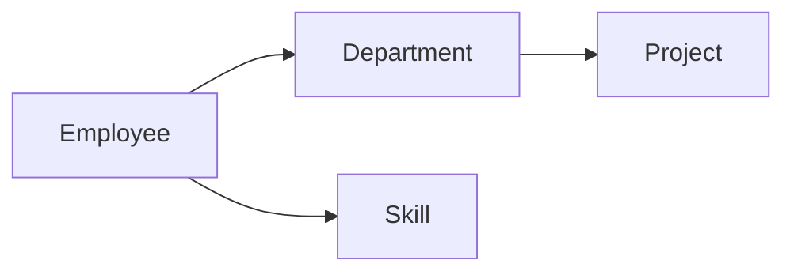
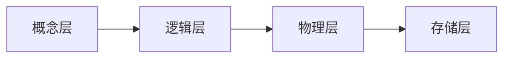
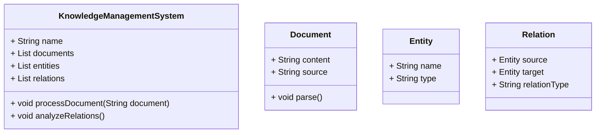
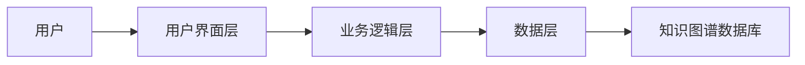
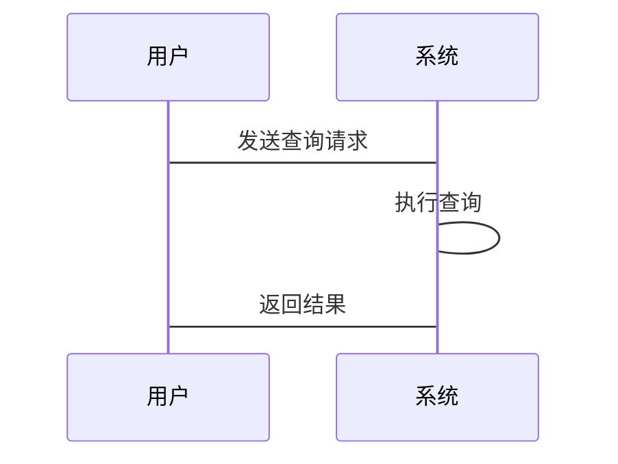

                 


# 《构建AI驱动的企业知识管理系统：智能知识图谱》

---

## 关键词：知识管理系统, AI驱动, 知识图谱, 实体识别, 关系抽取, 系统架构设计

---

## 摘要：  
随着企业数据的快速增长和复杂化，如何高效管理和利用知识成为企业面临的重要挑战。本文深入探讨了构建AI驱动的企业知识管理系统的核心技术——智能知识图谱。通过详细讲解知识图谱的构建原理、算法实现、系统架构设计以及项目实战，本文为读者提供了一套完整的解决方案。从实体识别到关系抽取，从知识融合到系统集成，结合实际案例和最佳实践，本文旨在帮助企业在数字化转型中构建高效的知识管理系统，提升数据利用效率和决策能力。

---

## 第一部分：背景与核心概念

### 第1章：知识管理系统概述

#### 1.1 知识管理系统的演变

- **1.1.1 从传统知识管理到AI驱动的转变**  
  传统知识管理依赖人工整理和存储，效率低下且难以扩展。随着AI技术的发展，知识管理系统逐渐引入自动化、智能化的处理方式，实现了从数据到知识的自动转化。

- **1.1.2 知识管理系统的核心目标**  
  知识管理系统的目标是通过自动化手段，将分散在企业各处的知识资源整合、分析，并转化为可复用的知识，为企业决策提供支持。

- **1.1.3 企业知识管理的重要性**  
  在数字化转型的背景下，企业知识管理不仅是提高效率的工具，更是企业竞争力的核心。通过知识管理系统，企业能够快速响应市场需求，优化内部流程。

#### 1.2 知识图谱的基本概念

- **1.2.1 知识图谱的定义与特点**  
  知识图谱是一种以图结构形式表示知识的工具，节点代表实体，边代表实体之间的关系。其特点包括结构化、语义化和可扩展性。

- **1.2.2 知识图谱的构建过程**  
  知识图谱的构建通常包括数据采集、实体识别、关系抽取、知识融合和存储等多个步骤。

- **1.2.3 知识图谱与企业知识管理的关系**  
  知识图谱作为知识管理的核心技术，能够将企业的零散知识结构化、系统化，为企业提供更高效的决策支持。

#### 1.3 AI驱动的知识管理

- **1.3.1 AI在知识管理中的作用**  
  AI技术（如自然语言处理和机器学习）能够自动处理和分析大量非结构化数据，提取有价值的知识。

- **1.3.2 智能知识图谱的优势**  
  通过AI技术，知识图谱能够实现动态更新和自我优化，不断提升知识的准确性和完整性。

- **1.3.3 企业知识管理的未来趋势**  
  随着AI技术的不断进步，知识管理系统将更加智能化、个性化，能够根据企业的具体需求提供定制化服务。

---

## 第2章：知识图谱的核心概念与联系

### 2.1 知识图谱的原理

#### 2.1.1 实体与关系的定义

- 实体：知识图谱中的基本单元，代表现实世界中的事物或概念。
- 关系：连接实体之间的纽带，描述实体之间的关联方式。

#### 2.1.2 知识图谱的构建方法

- 数据源选择：从企业内部文档、外部数据库等多种来源获取数据。
- 数据清洗：去除噪声数据，确保数据质量。
- 实体识别：通过自然语言处理技术从文本中提取实体。
- 关系抽取：识别实体之间的关系，并建立关联。

#### 2.1.3 知识图谱的存储与管理

- 图数据库：常用图数据库（如Neo4j）存储知识图谱，支持高效的查询和分析。
- 数据建模：设计合理的数据模型，确保知识图谱的可扩展性和灵活性。

### 2.2 实体关系与系统架构

#### 2.2.1 实体关系图（ER图）的构建



- 该图展示了员工、部门、项目和技能之间的关系。

#### 2.2.2 知识图谱的层次结构



- 概念层：定义知识图谱的抽象概念。
- 逻辑层：设计具体的实体和关系。
- 物理层：实现数据的物理存储。
- 存储层：管理数据的实际存储和索引。

#### 2.2.3 系统架构的模块划分

- 数据采集模块：负责数据的获取和预处理。
- 实体识别模块：识别文本中的实体。
- 关系抽取模块：提取实体之间的关系。
- 知识融合模块：整合多个数据源的信息，消除冲突。
- 知识图谱存储模块：将构建的知识图谱存储起来，支持后续的查询和分析。

### 2.3 知识图谱与企业信息系统的集成

#### 2.3.1 知识图谱在企业系统中的应用

- 企业资源计划（ERP）系统：通过知识图谱实现业务流程的优化。
- 客户关系管理（CRM）系统：利用知识图谱分析客户行为，提供个性化服务。
- 数据分析平台：结合知识图谱进行深度分析，挖掘潜在价值。

#### 2.3.2 系统集成的实现方式

- 数据接口：通过API实现知识图谱与企业系统的数据交互。
- 服务集成：将知识图谱服务嵌入到企业系统中，提供实时的知识支持。

#### 2.3.3 集成后的功能提升

- 提高数据利用率：通过知识图谱整合分散的数据源，提供全局视角。
- 增强决策能力：基于知识图谱的分析结果，辅助企业做出更明智的决策。

---

## 第三部分：算法原理与数学模型

### 第3章：知识图谱构建算法

#### 3.1 实体识别与抽取

- **3.1.1 实体识别的定义**  
  实体识别是通过自然语言处理技术，从文本中识别出具体实体的过程。

- **3.1.2 基于规则的实体识别**  
  使用预定义的规则和模式，从文本中提取实体。例如，识别日期格式为YYYY-MM-DD。

- **3.1.3 基于机器学习的实体识别**  
  使用深度学习模型（如BERT）进行实体识别，模型通过大量标注数据进行训练，能够自动学习实体的特征。

#### 3.2 关系抽取与建模

- **3.2.1 关系抽取的定义**  
  关系抽取是从文本中识别出实体之间的关系。

- **3.2.2 基于规则的关系抽取**  
  使用预定义的关系模式进行匹配，例如“公司-总部位于-城市”。

- **3.2.3 基于深度学习的关系抽取**  
  使用序列标注模型（如LSTM）进行关系抽取，模型能够自动学习关系的特征。

#### 3.3 知识融合与冲突处理

- **3.3.1 知识融合的定义**  
  将多个数据源中的知识进行整合，消除冲突，形成一致的知识图谱。

- **3.3.2 知识冲突的检测与解决**  
  通过对比不同数据源的信息，发现冲突，并通过协商或优先级规则进行解决。

- **3.3.3 融合后的知识图谱优化**  
  对融合后的知识图谱进行优化，去除冗余信息，提高图谱的准确性和可用性。

### 第4章：数学模型与公式

#### 4.1 知识图谱的表示模型

- **4.1.1 图论基础**  
  知识图谱可以表示为一个图，其中节点表示实体，边表示关系。

- **4.1.2 实体与关系的数学表示**  
  实体和关系可以用集合论和图论中的概念进行表示。

- **4.1.3 知识图谱的向量表示**  
  使用向量空间模型（如Word2Vec）对实体和关系进行向量表示，便于进行语义分析。

#### 4.2 知识图谱的构建算法

- **4.2.1 实体识别的分类模型**  
  使用支持向量机（SVM）或随机森林（Random Forest）进行实体分类。

- **4.2.2 关系抽取的序列标注模型**  
  使用条件随机场（CRF）或LSTM进行关系抽取。

---

## 第四部分：系统分析与架构设计

### 第4章：系统架构设计

#### 4.1 问题场景介绍

- **企业知识管理系统的应用场景**  
  例如，企业需要整合内部文档、客户数据、项目信息等，构建一个统一的知识管理系统。

#### 4.2 系统功能设计

- **领域模型设计**  
  使用Mermaid类图展示系统的功能模块。



- **系统架构设计**  
  使用分层架构，包括数据层、业务逻辑层和用户界面层。



- **系统接口设计**  
  提供RESTful API接口，供其他系统调用知识图谱服务。

- **系统交互设计**  
  使用Mermaid序列图展示用户与系统的交互流程。



---

## 第五部分：项目实战

### 第5章：项目实战

#### 5.1 环境安装

- **安装必要的软件和库**  
  例如，安装Python、Jupyter Notebook、Neo4j图数据库、NLTK自然语言处理库等。

#### 5.2 核心代码实现

- **实体识别代码示例**  
  使用NLTK库进行简单的实体识别。

```python
import nltk
text = "Apple is located in California."
tokens = nltk.word_tokenize(text)
entities = nltk.pos_tag(tokens)
print(entities)
```

- **关系抽取代码示例**  
  使用spaCy库进行关系抽取。

```python
import spacy
nlp = spacy.load("en_core_web_sm")
doc = nlp("Apple is located in California.")
for token in doc:
    print(token.text, token.pos_, token.dep_)
```

- **知识图谱存储代码示例**  
  使用Neo4j图数据库存储知识图谱。

```python
from neo4j import GraphDatabase
driver = GraphDatabase.driver("neo4j://localhost:7687", auth=("user", "password"))
session = driver.session()
session.run("CREATE (a:Entity {name: 'Apple'})")
session.run("CREATE (b:Entity {name: 'California'})")
session.run("CREATE (a)-[r:LOCATED_IN]->(b)")
```

#### 5.3 系统功能展示

- **知识图谱的可视化**  
  使用Neo4j的Web界面可视化知识图谱，展示实体和关系。

- **查询与分析功能**  
  提供基于知识图谱的查询功能，支持复杂的语义查询。

#### 5.4 案例分析

- **案例：构建企业员工知识图谱**  
  从企业员工信息中提取实体（员工、部门、职位）和关系（隶属关系、项目参与关系），构建员工知识图谱，用于人力资源管理和优化。

---

## 第六部分：最佳实践与总结

### 第6章：最佳实践

#### 6.1 最佳实践 tips

- **数据质量管理**  
  确保数据的准确性和完整性，是构建高质量知识图谱的前提。

- **模型调优**  
  根据实际需求，不断优化实体识别和关系抽取模型的性能。

- **系统可扩展性**  
  设计灵活的系统架构，方便后续的功能扩展和数据源的增加。

#### 6.2 小结

- 本文详细介绍了构建AI驱动的企业知识管理系统的核心技术，包括知识图谱的构建、系统架构设计和项目实战。

#### 6.3 注意事项

- 在实际应用中，需注意数据隐私和安全问题，确保数据的合规性。

- 系统的可维护性和可扩展性需要在设计阶段充分考虑。

#### 6.4 拓展阅读

- 《Knowledge Graph Construction: A Comprehensive Survey》
- 《Deep Learning for Relation Extraction》
- 《Enterprise Knowledge Management Systems: Current Trends and Future Directions》

---

## 作者：AI天才研究院/AI Genius Institute & 禅与计算机程序设计艺术 /Zen And The Art of Computer Programming

