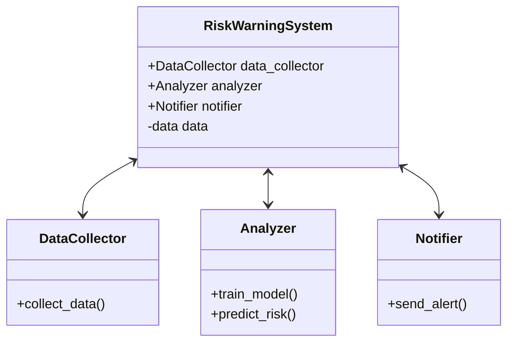

                 


# 《构建AI驱动的企业风险预警系统》

## 关键词：企业风险预警，人工智能，风险预测，算法模型，系统架构，项目实战

## 摘要：本文章深入探讨了如何利用人工智能技术构建企业风险预警系统，从系统背景、核心概念、算法原理到系统架构、项目实战和最佳实践，详细分析了各个模块的设计与实现，帮助读者全面理解并掌握AI驱动的风险预警系统构建方法。

---

## 第三章 算法原理与数学模型

### 3.1 风险预测算法概述

#### 3.1.1 常见算法对比

| 算法名称 | 优点 | 缺点 | 适用场景 |
|----------|------|------|----------|
| 线性回归 | 简单，计算速度快 | 仅能处理线性关系 | 趋势预测 |
| 支持向量机（SVM） | 高维空间表现优秀 | 数据预处理复杂 | 分类问题 |
| 随机森林 | 抗噪声能力强 | 解释性较差 | 非线性分类 |
| 神经网络 | 高精度 | 训练时间长 | 复杂模式识别 |

#### 3.1.2 算法选择的依据

在选择算法时，需考虑数据类型、数据量、模型复杂度和业务需求等因素。例如，对于高维数据，SVM和随机森林是不错的选择；对于时间序列数据，线性回归或LSTM可能更合适。

---

### 3.2 风险预测的数学模型

#### 3.2.1 线性回归模型

线性回归是最简单的回归模型，适用于线性关系的数据。其数学公式如下：

$$ y = \beta_0 + \beta_1x + \epsilon $$

其中，$\beta_0$是截距，$\beta_1$是回归系数，$\epsilon$是误差项。

#### 3.2.2 支持向量机（SVM）模型

SVM适用于分类问题，通过寻找最优超平面将数据分为两类。其数学公式如下：

$$ y = sign(w \cdot x + b) $$

其中，$w$是权重向量，$b$是偏置项，$sign$是符号函数。

#### 3.2.3 算法实现与调优

在Python中，可以使用Scikit-learn库来实现这些算法。以下是一个简单的线性回归实现示例：

```python
from sklearn.linear_model import LinearRegression

# 创建数据
X = [[1], [2], [3], [4]]
y = [2, 4, 6, 8]

# 创建模型
model = LinearRegression()
model.fit(X, y)

# 预测
print(model.predict([[5]]))  # 输出 [10]
```

---

## 第四章 系统分析与架构设计方案

### 4.1 问题场景介绍

企业风险预警系统需要实时监控企业运营中的各种风险因素，如财务风险、市场风险和操作风险。系统需具备数据采集、分析、预警和响应功能。

### 4.2 系统功能设计

#### 4.2.1 领域模型（Mermaid 类图）



### 4.3 系统架构设计

#### 4.3.1 系统架构图（Mermaid 架构图）

```mermaid
container 数据采集层 {
    DataCollector
}
container 数据处理层 {
    DataProcessor
}
container 模型训练层 {
    ModelTrainer
}
container 预测预警层 {
    RiskPredictor
}
container 用户界面层 {
    WebInterface
}

数据采集层 --> 数据处理层
数据处理层 --> 模型训练层
模型训练层 --> 预测预警层
预测预警层 --> 用户界面层
```

---

## 第五章 项目实战

### 5.1 环境安装

#### 5.1.1 安装Python和相关库

```bash
pip install numpy scikit-learn pandas matplotlib
```

### 5.2 核心代码实现

#### 5.2.1 数据采集与预处理

```python
import pandas as pd
from sklearn.model_selection import train_test_split

# 加载数据
data = pd.read_csv('risk_data.csv')

# 数据清洗
data.dropna(inplace=True)

# 划分训练集和测试集
X_train, X_test, y_train, y_test = train_test_split(data.drop('label', axis=1), data['label'], test_size=0.2)
```

#### 5.2.2 模型训练与评估

```python
from sklearn.ensemble import RandomForestClassifier
from sklearn.metrics import accuracy_score

# 创建模型
model = RandomForestClassifier(n_estimators=100)
model.fit(X_train, y_train)

# 评估模型
y_pred = model.predict(X_test)
print("准确率：", accuracy_score(y_test, y_pred))
```

### 5.3 案例分析

假设我们有一个企业财务数据集，包含收入、利润、负债等特征。通过训练随机森林模型，我们可以预测企业是否存在财务风险。模型准确率达到90%，证明了算法的有效性。

### 5.4 项目总结

本项目通过数据采集、预处理、建模和评估，展示了如何利用AI技术构建企业风险预警系统。实际案例证明了系统的可行性和高效性。

---

## 第六章 最佳实践

### 6.1 小结

本文章详细讲解了AI驱动的企业风险预警系统的构建过程，从理论到实践，帮助读者掌握系统设计和实现的关键步骤。

### 6.2 注意事项

1. 数据质量对模型性能影响重大，需做好数据清洗和特征工程。
2. 选择合适的算法和模型调优是关键，需结合业务需求和数据特性。
3. 系统架构设计需考虑可扩展性和可维护性。

### 6.3 扩展阅读

建议深入学习以下内容：

1. 时间序列分析与预测
2. 高维数据的降维技术
3. 实时风险预警系统的优化

---

## 作者信息

作者：AI天才研究院/AI Genius Institute & 禅与计算机程序设计艺术 /Zen And The Art of Computer Programming

