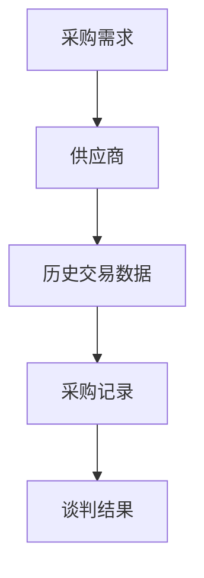
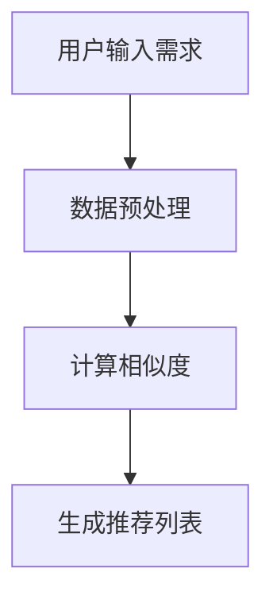
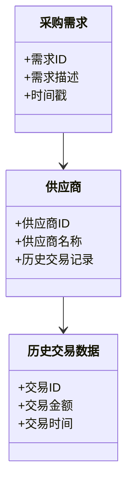
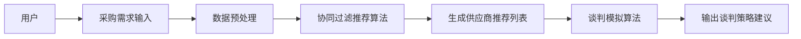
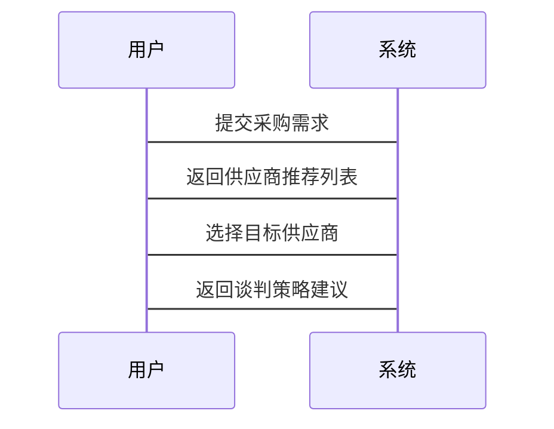

                 


# 构建AI驱动的采购助手：优化供应商选择与谈判

> 关键词：AI驱动，采购助手，供应商选择，谈判模拟，协同过滤，机器学习

> 摘要：本文深入探讨了如何利用人工智能技术优化采购流程中的供应商选择与谈判环节。通过分析传统采购的痛点，提出了一种基于AI的采购助手解决方案，并详细阐述了其核心算法原理、系统架构设计以及实际项目实现。本文旨在为采购团队提供一种高效、智能的采购决策支持工具，帮助企业在复杂的市场环境中实现最优采购策略。

---

# 第一部分: AI驱动的采购助手背景与核心概念

## 第1章: 传统采购流程的痛点与AI驱动的解决方案

### 1.1 传统采购流程的痛点

#### 1.1.1 供应商选择的复杂性
传统的供应商选择过程往往依赖于人工经验和主观判断，存在以下问题：
- 数据分散，难以整合和分析；
- 信息不对称，难以全面评估供应商的资质和能力；
- 选择过程耗时长，且容易受到人为因素干扰。

#### 1.1.2 谈判过程的不确定性
谈判过程中的变量多且复杂，包括价格、交货时间、条款和条件等，传统的谈判策略难以应对以下挑战：
- 需要实时分析和调整策略；
- 缺乏数据支持，难以做出最优决策；
- 需要快速响应，但人工处理效率低。

#### 1.1.3 数据孤岛与信息不对称
企业内部和外部的数据往往分散在不同的系统中，导致信息孤岛问题，难以形成统一的采购策略。

### 1.2 AI驱动采购助手的定义与目标

#### 1.2.1 定义：AI驱动的采购助手
AI驱动的采购助手是一种基于人工智能技术的工具，通过数据挖掘、机器学习和自然语言处理等技术，帮助企业在供应商选择和谈判环节中做出更优决策。

#### 1.2.2 核心目标：优化供应商选择与谈判
- 提供智能化的供应商推荐；
- 自动生成谈判策略和建议；
- 实现实时数据分析与预测。

#### 1.2.3 边界与外延
AI驱动的采购助手主要关注采购流程中的关键环节，包括供应商选择、谈判模拟和执行监控，但不涉及具体的合同签订和财务支付等后续环节。

### 1.3 核心概念与联系

#### 1.3.1 核心概念原理
AI驱动的采购助手通过整合企业内外部数据，构建供应商画像和采购需求模型，从而实现智能化的供应商推荐和谈判模拟。

#### 1.3.2 核心概念属性特征对比表格

| 概念       | 数据驱动 | 智能推荐 | 实时分析 |
|------------|----------|----------|----------|
| 供应商选择 | √        | √        | √        |
| 谈判模拟   | √        | √        | √        |

#### 1.3.3 ER实体关系图（Mermaid）



---

# 第2章: AI驱动采购助手的核心算法原理

## 2.1 供应商推荐算法

### 2.1.1 基于协同过滤的推荐算法

#### 算法流程（Mermaid流程图）



#### 算法实现代码

```python
import numpy as np

def cosine_similarity(matrix):
    # 计算余弦相似度
    numerator = np.dot(matrix, matrix.T)
    denominator = np.outer(np.linalg.norm(matrix, axis=1), np.linalg.norm(matrix, axis=1))
    return numerator / denominator

# 示例数据矩阵
matrix = np.array([[1, 2, 3],
                   [4, 5, 6],
                   [7, 8, 9]])

similarity_matrix = cosine_similarity(matrix)
print(similarity_matrix)
```

#### 算法原理的数学模型和公式

- 余弦相似度公式：
  $$ \text{similarity}(u, v) = \frac{\sum_{i=1}^{n} u_i v_i}{\sqrt{\sum_{i=1}^{n} u_i^2} \cdot \sqrt{\sum_{i=1}^{n} v_i^2}} $$

---

## 2.2 谈判模拟算法

### 2.2.1 谈判模拟的核心思想
谈判模拟算法通过构建数学模型，预测不同谈判策略下的结果，并优化最优策略。

### 2.2.2 谈判模拟算法实现（Python代码）

```python
import numpy as np

def negotiate(price, quality, threshold=0.5):
    # 简单的线性回归模型预测最终成交价
    slope = 0.8
    intercept = 0.2
    predicted_price = slope * price + intercept
    if predicted_price < threshold:
        return "接受当前价格"
    else:
        return "建议降低价格"

# 示例数据
price = 100
quality = 85

result = negotiate(price, quality)
print(result)
```

---

# 第3章: 系统分析与架构设计

## 3.1 问题场景介绍

### 3.1.1 问题场景
- 数据来源：企业内部ERP系统、外部供应商数据库；
- 数据处理：清洗、特征提取；
- 算法实现：协同过滤推荐、谈判模拟；
- 输出结果：供应商推荐列表、谈判策略建议。

---

## 3.2 系统架构设计

### 3.2.1 系统功能模块

#### 3.2.1.1 领域模型（Mermaid类图）



#### 3.2.1.2 系统架构（Mermaid架构图）



---

## 3.3 接口设计与交互流程

### 3.3.1 接口设计

- 输入接口：采购需求信息（JSON格式）；
- 输出接口：供应商推荐列表、谈判策略建议。

### 3.3.2 交互流程（Mermaid序列图）



---

# 第4章: 项目实战

## 4.1 环境配置与安装

- Python版本：3.8+
- 依赖库：numpy、scikit-learn、mermaid、graphviz

```bash
pip install numpy scikit-learn mermaid graphviz
```

---

## 4.2 核心代码实现

### 4.2.1 供应商推荐算法实现

```python
from sklearn.metrics.pairwise import cosine_similarity

def main():
    # 示例数据矩阵
    matrix = np.array([[1, 2, 3],
                       [4, 5, 6],
                       [7, 8, 9]])
    similarity_matrix = cosine_similarity(matrix)
    print(similarity_matrix)

if __name__ == "__main__":
    main()
```

### 4.2.2 谈判模拟算法实现

```python
def negotiate(price, quality, threshold=0.5):
    slope = 0.8
    intercept = 0.2
    predicted_price = slope * price + intercept
    if predicted_price < threshold:
        return "接受当前价格"
    else:
        return "建议降低价格"

# 示例调用
price = 100
quality = 85
print(negotiate(price, quality))
```

---

## 4.3 实际案例分析与详细解读

### 4.3.1 案例背景
某制造企业需要采购一批原材料，希望通过AI驱动的采购助手优化供应商选择和谈判过程。

### 4.3.2 数据准备
- 采购需求：1000件产品，预算10万元；
- 历史交易数据：过去三年的采购记录。

### 4.3.3 实施步骤
1. 数据清洗与特征提取；
2. 训练协同过滤推荐模型；
3. 生成供应商推荐列表；
4. 进行谈判模拟，优化谈判策略；
5. 输出最终建议。

---

## 4.4 项目小结

- 项目目标：实现AI驱动的采购助手；
- 核心成果：供应商推荐算法和谈判模拟算法；
- 实践价值：提高采购效率，降低采购成本。

---

# 第5章: 最佳实践与总结

## 5.1 小结

- AI驱动的采购助手通过数据驱动的方式，优化了传统采购流程中的供应商选择与谈判环节；
- 本文详细介绍了算法原理、系统架构和项目实现，为读者提供了完整的解决方案。

## 5.2 注意事项

- 数据质量是关键，确保数据的完整性和准确性；
- 算法选择需结合实际业务需求，避免过度复杂化；
- 系统上线后需持续优化和迭代。

## 5.3 拓展阅读

- 推荐阅读《机器学习实战》和《数据挖掘导论》；
- 关注领域最新动态，如多目标优化算法在采购中的应用。

---

# 作者：AI天才研究院/AI Genius Institute & 禅与计算机程序设计艺术 /Zen And The Art of Computer Programming

---

感谢您的阅读！希望本文对您在构建AI驱动的采购助手过程中有所帮助。如需进一步探讨或合作，请随时联系！

