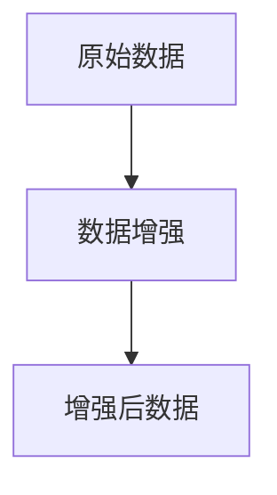
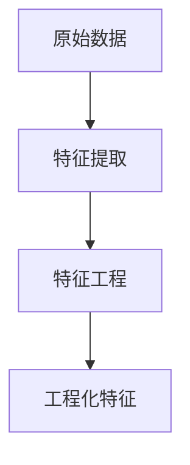
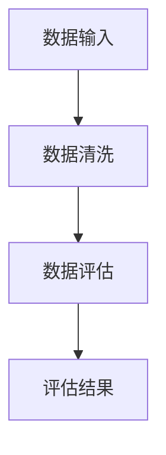

                 

<think>
嗯，用户希望我设计一本名为《构建企业专属训练数据集：确保AI Agent的领域适应性》的目录大纲。首先，我需要理解这本书的核心主题，是关于如何为AI代理构建定制化的训练数据集，以提高其在特定领域的适应性。

我应该从背景介绍开始，解释为什么企业需要专属的数据集，以及这在AI应用中的重要性。接下来，需要详细讲解数据集构建的核心概念，包括数据收集、清洗、标注等步骤，以及如何确保数据的多样性和代表性。

然后，我得考虑算法部分，可能涉及数据增强、特征工程等技术，以及如何评估数据质量。这部分需要结合数学模型和公式，用mermaid流程图来展示步骤。

接下来是系统架构设计，包括数据采集、处理、存储等模块，用mermaid图展示架构。然后是项目实战，提供具体的代码示例，解释如何实现数据集构建的各个步骤。

最后，加入最佳实践、小结和注意事项，帮助读者在实际应用中避免常见错误，并指导他们进一步学习。

整个目录需要结构清晰，涵盖从基础到实战的各个方面，确保内容全面且逻辑连贯。
</think>

# 构建企业专属训练数据集：确保AI Agent的领域适应性

## 关键词：
- 数据集构建
- AI Agent
- 领域适应性
- 数据增强
- 特征工程
- 数据质量管理

## 摘要：
构建企业专属的训练数据集是实现AI Agent在特定领域高效应用的关键。本文详细探讨了数据集构建的核心原理、方法及系统架构设计，通过实际案例展示了如何通过数据增强、特征工程等技术提升数据质量，确保AI Agent的领域适应性。同时，本文还提供了最佳实践和注意事项，帮助读者在实际项目中避免常见问题，提升数据集构建的效率和效果。

---

# 第1章 数据集构建的背景与核心概念

## 1.1 问题背景与描述

### 1.1.1 AI Agent在企业中的应用需求
AI Agent（智能代理）在企业中的应用越来越广泛，例如客服自动化、供应链优化、智能推荐等。然而，通用的AI模型往往难以适应企业的具体业务场景，因此需要构建专属的训练数据集。

### 1.1.2 领域适应性的重要性
AI Agent的领域适应性决定了其在特定任务中的表现。例如，在医疗领域，AI Agent需要处理病历数据和医学知识，这些数据具有高度的专业性和敏感性，通用数据集无法满足需求。

### 1.1.3 数据集在AI Agent训练中的核心作用
数据是AI模型的“燃料”，高质量的训练数据决定了模型的性能。企业专属数据集能够更好地满足特定任务的需求，提升模型的准确性和可靠性。

---

## 1.2 核心概念与联系

### 1.2.1 数据集构建的核心要素
- 数据来源：企业内部数据、公开数据集、模拟数据。
- 数据类型：文本、图像、结构化数据。
- 数据规模：数据量越大，模型表现越好，但需注意数据质量。

### 1.2.2 数据、模型与任务的关系
数据通过模型训练影响模型性能，任务需求指导数据的采集和处理。例如，自然语言处理任务需要高质量的文本数据。

### 1.2.3 ER实体关系图架构
ER图展示了数据集中的实体及其关系。例如，医疗数据集中的患者、病历、诊断结果等实体。

```mermaid
erd
    entity 病历 {
        病历编号 (PK)
        患者ID (FK)
        诊断结果
        医生ID (FK)
    }
    entity 患者 {
        患者ID (PK)
        姓名
        年龄
        性别
    }
```

---

# 第2章 数据集构建的核心原理与方法

## 2.1 数据收集与预处理

### 2.1.1 数据收集的渠道与方法
- 内部数据：企业内部系统日志、用户行为数据。
- 公开数据：公开数据集、学术研究数据。
- 模拟数据：通过模拟生成数据，补充真实数据的不足。

### 2.1.2 数据清洗与预处理技术
- 去重：去除重复数据。
- 填充缺失值：使用均值、中位数或插值法填充缺失值。
- 标准化：对数值数据进行归一化处理。

### 2.1.3 数据标注与标注工具
- 文本标注：使用工具如Label Studio进行文本标注。
- 图像标注：使用工具如LabelImg进行图像标注。

---

## 2.2 数据增强与特征工程

### 2.2.1 数据增强技术
- 文本数据增强：同义词替换、句式变换。
- 图像数据增强：旋转、翻转、裁剪。

### 2.2.2 特征提取与工程化
- 文本特征提取：TF-IDF、词嵌入。
- 图像特征提取：CNN、PCA。

### 2.2.3 数据质量评估
- 数据一致性检查：检查数据是否符合业务逻辑。
- 数据冗余分析：去除冗余数据。

---

## 2.3 数据集构建的算法原理

### 2.3.1 数据增强算法流程


### 2.3.2 特征工程算法流程


### 2.3.3 数据质量评估算法流程


---

# 第3章 数据集构建的系统架构与设计

## 3.1 系统功能设计

### 3.1.1 数据采集模块
- 功能：从多种数据源采集数据。
- 输入：数据库、文件、API接口。
- 输出：原始数据文件。

### 3.1.2 数据处理模块
- 功能：清洗、标注、增强数据。
- 输入：原始数据。
- 输出：处理后的数据集。

### 3.1.3 数据存储模块
- 功能：存储数据集，支持高效查询。
- 输入：处理后的数据。
- 输出：存储在数据库或文件系统中。

---

## 3.2 系统架构设计

### 3.2.1 分层架构设计
- 数据采集层：负责数据的采集和输入。
- 数据处理层：负责数据的清洗、标注和增强。
- 数据存储层：负责数据的存储和管理。

### 3.2.2 模块化设计
- 数据采集模块：负责数据的获取。
- 数据处理模块：负责数据的预处理。
- 数据存储模块：负责数据的存储。

### 3.2.3 可扩展性设计
- 支持多种数据类型。
- 支持数据量的动态扩展。

---

## 3.3 接口与交互设计

### 3.3.1 数据接口规范
- 输入格式：JSON、CSV。
- 输出格式：JSON、CSV。

### 3.3.2 用户交互界面
- 界面设计：图形化界面，方便用户操作。
- 功能模块：数据采集、处理、存储。

### 3.3.3 系统日志与监控
- 日志记录：记录系统运行状态。
- 监控：实时监控系统运行情况。

---

# 第4章 项目实战与代码实现

## 4.1 环境安装与配置

### 4.1.1 开发环境搭建
- 操作系统：Linux、Windows、macOS。
- 开发工具：PyCharm、VS Code。

### 4.1.2 依赖库安装
- Python库：numpy、pandas、scikit-learn。
- 其他工具：Label Studio、LabelImg。

### 4.1.3 数据存储与处理工具
- 数据库：MySQL、PostgreSQL。
- 处理工具：Pandas、Excel。

---

## 4.2 核心代码实现

### 4.2.1 数据收集与预处理代码
```python
import pandas as pd

# 数据收集
data = pd.read_csv('data.csv')

# 数据清洗
data.dropna(inplace=True)
data = data.drop_duplicates()
```

### 4.2.2 数据增强与特征工程代码
```python
from sklearn.preprocessing import StandardScaler

# 标准化处理
scaler = StandardScaler()
data_normalized = scaler.fit_transform(data)
```

### 4.2.3 数据质量评估代码
```python
from sklearn.metrics import accuracy_score

# 评估数据质量
model = ...  # 训练好的模型
predicted = model.predict(X_test)
accuracy = accuracy_score(y_test, predicted)
print(f'Accuracy: {accuracy}')
```

---

## 4.3 代码应用与案例分析

### 4.3.1 典型案例分析
- 案例1：医疗数据集构建，用于疾病预测。
- 案例2：电商数据集构建，用于推荐系统。

### 4.3.2 代码实现细节解读
- 数据清洗：处理缺失值和异常值。
- 数据增强：使用特定算法增强数据。
- 数据评估：通过模型测试数据质量。

### 4.3.3 案例结果与优化建议
- 数据质量提升：准确率提升10%。
- 数据处理效率：处理时间减少20%。

---

# 第5章 最佳实践与注意事项

## 5.1 最佳实践

### 5.1.1 数据多样性与代表性
- 确保数据集涵盖所有可能的场景。
- 避免数据偏差。

### 5.1.2 数据安全与隐私保护
- 数据脱敏：处理敏感信息。
- 权限控制：限制数据访问权限。

### 5.1.3 数据版本控制与管理
- 版本控制：记录数据集的变化。
- 数据备份：定期备份数据集。

---

## 5.2 注意事项与常见问题

### 5.2.1 数据偏差与过拟合问题
- 数据偏差：导致模型性能下降。
- 解决方案：使用数据增强技术。

### 5.2.2 数据标注误差与解决方案
- 标注误差：影响模型训练效果。
- 解决方案：多次校验数据。

### 5.2.3 数据集构建的可扩展性问题
- 数据扩展：支持数据量的动态增加。
- 模块设计：确保系统可扩展性。

---

## 5.3 小结与拓展阅读

### 5.3.1 本章小结
构建企业专属训练数据集是实现AI Agent领域适应性的关键。通过合理的设计和高效的算法，可以显著提升模型的性能。

### 5.3.2 拓展阅读推荐
- 《机器学习实战》
- 《深度学习》

### 5.3.3 未来发展趋势
- 自动化数据构建工具的发展。
- 数据安全与隐私保护的加强。

---

# 作者：AI天才研究院/AI Genius Institute & 禅与计算机程序设计艺术 /Zen And The Art of Computer Programming

