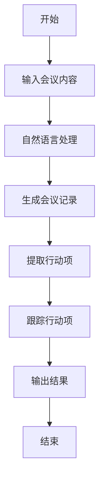
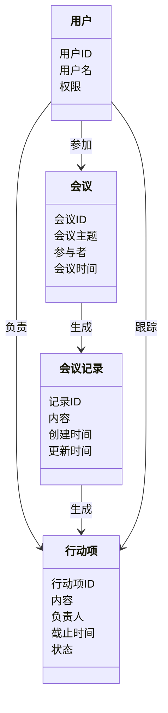

                 


# 构建企业级AI会议助手：会议记录与行动项跟踪

**关键词**：企业级AI会议助手、会议记录、行动项跟踪、自然语言处理、机器学习、系统架构设计

**摘要**：随着企业对高效会议管理和行动项跟踪需求的增加，AI会议助手逐渐成为提升企业效率的重要工具。本文将详细探讨如何构建一个企业级AI会议助手，重点分析会议记录与行动项跟踪的核心技术、算法原理、系统架构设计以及实际应用案例，为读者提供全面的解决方案。

---

## 目录大纲

### 第一章：问题背景与需求分析

1.1 问题背景  
- 传统会议记录的痛点  
- 会议记录效率低下的现状  
- 会议记录与行动项脱节的问题  

1.2 问题描述  
- 会议记录的不完整性和不准确性  
- 行动项跟踪的缺失与滞后  
- 会议记录与后续执行的割裂  

1.3 问题解决  
- 引入AI技术的必要性  
- AI会议助手的核心目标  
- AI在会议记录与行动项跟踪中的应用  

1.4 概念结构与核心要素  
- 核心概念的定义  
- 核心要素的对比  
- 系统边界与外延  

### 第二章：AI会议助手的核心概念与联系

2.1 核心概念原理  
- 自然语言处理（NLP）的基础  
- 会议记录的AI生成机制  
- 行动项跟踪的自动化流程  

2.2 核心概念属性特征对比  
- 会议记录与行动项的属性对比  
- AI生成与人工记录的特征对比  
- 不同场景下的概念特征差异  

2.3 ER实体关系图  
```mermaid
er
  actor: 用户
  meeting: 会议
  action_item: 行动项
  record: 会议记录
  relation: 关联
  actor -|记录| record
  record -|生成| action_item
  actor -|跟踪| action_item
```

2.4 本章小结  

### 第三章：AI会议助手的算法原理

3.1 算法原理概述  
- 基于大语言模型的会议记录生成  
- 基于规则的行动项提取  
- 基于机器学习的跟踪优化  

3.2 算法流程图  


3.3 数学模型与公式  
- 概率模型：$$ P(\text{会议记录} | \text{输入}) = \frac{P(\text{输入} | \text{会议记录}) \cdot P(\text{会议记录})}{P(\text{输入})} $$
- 损失函数：$$ L = -\sum_{i=1}^{n} \log P(y_i | x_i) $$  

3.4 本章小结  

### 第四章：系统分析与架构设计

4.1 问题场景介绍  
- 会议记录与跟踪的场景  
- 用户角色与需求分析  
- 系统目标与功能需求  

4.2 领域模型  


4.3 系统架构设计  
- 分层架构：数据层、业务逻辑层、表现层  
- 模块划分：会议管理模块、行动项跟踪模块、用户管理模块  
- 交互流程：会议记录生成、行动项提取与分配、跟踪与反馈  

4.4 本章小结  

### 第五章：项目实战

5.1 环境安装  
- 安装Python环境（如Anaconda）  
- 安装必要的库（如TensorFlow、PyTorch、NLTK）  

5.2 核心代码实现  
```python
# 示例代码：基于大语言模型的会议记录生成
import torch
from transformers import GPT2LMHeadModel, GPT2Tokenizer

tokenizer = GPT2Tokenizer.from_pretrained('gpt2')
model = GPT2LMHeadModel.from_pretrained('gpt2')

def generate_minutes(prompt):
    inputs = tokenizer.encode(prompt, return_tensors='pt')
    outputs = model.generate(inputs, max_length=500, temperature=0.7)
    return tokenizer.decode(outputs[0], skip_special_tokens=True)
```

5.3 代码解读与分析  
- 数据预处理：文本清洗、分词、实体识别  
- 模型训练：基于预训练模型的微调、参数优化  
- 接口设计：RESTful API接口的定义与实现  

5.4 实际案例分析  
- 案例背景：某公司会议记录与跟踪的现状  
- 系统实施：部署AI会议助手后的效果对比  
- 数据分析：会议记录准确率提升、行动项完成率提高  

5.5 本章小结  

### 第六章：总结与展望

6.1 核心内容回顾  
- AI会议助手的核心功能与技术实现  
- 会议记录与行动项跟踪的关键算法与系统架构  

6.2 未来展望  
- 更高级的自然语言处理技术（如GPT-4）的应用  
- 结合知识图谱的智能提醒与决策支持  
- 多语言支持与跨平台部署  

6.3 最佳实践 Tips  
- 数据质量对模型性能的影响  
- 系统可扩展性与维护性的重要性  
- 用户反馈在持续优化中的作用  

### 参考文献  
（此处列出相关文献和资料）

### 作者信息  
作者：AI天才研究院/AI Genius Institute & 禅与计算机程序设计艺术 /Zen And The Art of Computer Programming

