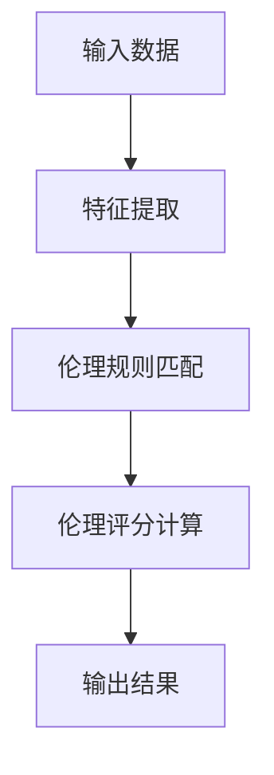
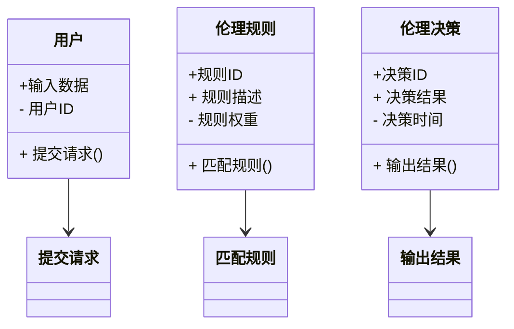

                 


# 《构建企业级AI伦理顾问：确保AI应用的道德合规》

---

## 关键词：
- AI伦理顾问
- 企业级AI应用
- 道德合规
- 伦理决策系统
- 人工智能治理

---

## 摘要：
本文旨在探讨如何构建企业级AI伦理顾问系统，确保AI应用的道德合规。通过分析AI伦理的核心概念、算法原理和系统架构，结合实际案例，提供可操作的解决方案。本文从问题背景出发，逐步深入，最终提供一套完整的伦理顾问系统设计，帮助企业在AI应用中实现伦理合规。

---

## 第1章: AI伦理顾问的背景与问题背景

### 1.1 问题背景
#### 1.1.1 当前AI技术的发展与挑战
人工智能技术的快速发展为企业带来了巨大的机遇，但也带来了诸多挑战。AI系统在决策过程中的偏见、隐私问题和责任归属等问题日益突出，企业需要确保其AI应用符合伦理标准。

#### 1.1.2 AI应用中的伦理问题
- 数据偏见：训练数据中的偏见可能导致不公平的决策。
- 隐私保护：AI系统可能收集和处理大量用户数据，引发隐私问题。
- 责任归属：当AI系统出现问题时，确定责任人存在困难。

#### 1.1.3 企业级AI应用的道德合规需求
企业需要在AI应用中遵守相关法律法规，同时维护企业声誉，避免法律风险。

### 1.2 问题描述
#### 1.2.1 AI伦理问题的具体表现
- 数据收集和处理中的不透明性。
- AI决策的不可解释性。
- 算法歧视和偏见。

#### 1.2.2 企业AI应用中的伦理风险
- 产品和服务中的伦理问题可能导致市场风险。
- 数据滥用可能导致法律处罚。
- 责任归属不明确可能导致信任危机。

#### 1.2.3 伦理合规的重要性
- 符合法律法规，避免法律风险。
- 维护企业声誉，增强用户信任。
- 促进可持续发展，提升企业社会责任形象。

### 1.3 问题解决
#### 1.3.1 伦理顾问的定义与目标
AI伦理顾问是一种辅助企业识别、评估和解决AI应用中伦理问题的系统。其目标是确保AI系统的决策和行为符合伦理标准。

#### 1.3.2 伦理顾问在企业中的作用
- 提供伦理评估和建议。
- 监测和预警伦理风险。
- 帮助制定伦理合规策略。

#### 1.3.3 伦理顾问的实现路径
- 建立伦理原则体系。
- 开发伦理决策模型。
- 实施伦理合规框架。

### 1.4 边界与外延
#### 1.4.1 伦理顾问的适用范围
- 企业内部AI系统的开发和部署。
- AI产品和服务的伦理评估。
- 数据隐私和安全保护。

#### 1.4.2 与传统伦理审查的区别
- 传统伦理审查主要针对实验和研究，而AI伦理顾问针对AI系统的开发和应用。
- 传统伦理审查通常由人工完成，而AI伦理顾问利用自动化技术进行评估。

#### 1.4.3 与其他AI治理工具的关系
AI伦理顾问与其他AI治理工具（如数据治理工具、模型监控工具）相互协作，共同确保AI系统的合规性。

### 1.5 核心要素组成
#### 1.5.1 伦理原则体系
- 公正性：确保AI决策不偏不倚。
- 透明性：让用户了解AI决策的依据。
- 尊重隐私：保护用户数据隐私。

#### 1.5.2 伦理决策机制
- 风险评估：识别AI决策中的伦理风险。
- 伦理评分：对AI决策进行伦理评分，评估其合规性。
- 伦理建议：提供改进建议，优化AI决策。

#### 1.5.3 伦理合规框架
- 合规标准：制定基于伦理原则的合规标准。
- 监测机制：实时监测AI系统的伦理合规情况。
- 改进措施：根据监测结果，调整AI系统以提高合规性。

---

## 第2章: AI伦理的核心概念与联系

### 2.1 核心概念原理
AI伦理涉及多个核心概念，包括伦理原则、伦理决策和法律框架。伦理原则是伦理决策的基础，而伦理决策则依赖于技术实现和法律框架的支持。

#### 2.1.1 伦理原则的数学模型
伦理原则可以表示为一个约束条件集合，例如：
$$ \text{公平性} \geq 0.8 $$
$$ \text{透明性} \geq 0.7 $$
$$ \text{隐私保护} \geq 0.9 $$

#### 2.1.2 伦理决策的算法基础
伦理决策可以基于规则或机器学习模型。例如，基于规则的伦理决策系统可以通过以下规则进行决策：
$$ \text{如果数据来源合法，则给予高评分} $$

#### 2.1.3 伦理合规的法律框架
法律框架为伦理合规提供了依据，例如《通用数据保护条例》（GDPR）要求企业保护用户隐私。

### 2.2 概念属性特征对比表格
以下表格对比了伦理原则和伦理决策的核心属性特征：

| 概念 | 属性 | 特征 |
|------|------|------|
| 伦理原则 | 适用范围 | 全局性 |
|        | 可操作性 | 可量化 |
| 伦理决策 | 决策依据 | 数据驱动 |
|        | 决策方式 | 模型化 |

### 2.3 ER实体关系图
以下ER图展示了AI伦理顾问系统中的核心实体及其关系：

```mermaid
er
actor: 用户
-- 关联 -->
rule: 伦理规则
-- 关联 -->
decision: 伦理决策
-- 关联 -->
compliance: 合规结果
```

---

## 第3章: AI伦理顾问的算法原理

### 3.1 算法原理讲解
AI伦理顾问的算法原理包括数据处理、特征提取、伦理评估和结果输出。以下是一个基于规则的伦理决策系统的流程图：



#### 3.1.1 伦理评分计算
伦理评分基于多个因素，例如：
$$ \text{评分} = 0.4 \times \text{公平性} + 0.3 \times \text{透明性} + 0.3 \times \text{隐私保护} $$

#### 3.1.2 伦理规则匹配
系统根据输入数据匹配相应的伦理规则，例如：
$$ \text{如果评分 < 0.6，则触发警报} $$

#### 3.1.3 结果输出
系统根据计算的评分输出伦理评估结果，例如“高风险”、“中风险”或“低风险”。

### 3.2 算法实现
以下是一个简单的Python代码示例：

```python
def calculate_ethical_score(fairness, transparency, privacy):
    return 0.4 * fairness + 0.3 * transparency + 0.3 * privacy

def ethical_advisor(input_data):
    fairness = 0.8
    transparency = 0.7
    privacy = 0.9
    score = calculate_ethical_score(fairness, transparency, privacy)
    if score < 0.6:
        return "高风险"
    else:
        return "低风险"

# 示例调用
print(ethical_advisor("input_data"))
```

---

## 第4章: 系统分析与架构设计

### 4.1 系统功能设计
系统需要实现以下功能：
- 数据输入与处理
- 伦理评估
- 合规监测
- 结果输出

### 4.2 领域模型
以下是一个领域模型的类图：



### 4.3 系统架构设计
以下是一个系统架构图：

```mermaid
archi
title 企业级AI伦理顾问系统架构
client --> API Gateway
API Gateway --> EthicalRuleEngine
EthicalRuleEngine --> ComplianceMonitor
ComplianceMonitor --> Database
Database --> EthicalScoreCalculator
EthicalScoreCalculator --> OutputDisplay
```

---

## 第5章: 项目实战

### 5.1 环境安装
- 安装Python和相关库（如numpy、pandas）。
- 安装Mermaid CLI工具。

### 5.2 核心代码实现
以下是一个核心代码示例：

```python
import numpy as np
import pandas as pd

def calculate_ethical_score(fairness, transparency, privacy):
    return 0.4 * fairness + 0.3 * transparency + 0.3 * privacy

def ethical_advisor(input_data):
    fairness = np.random.uniform(0.6, 1.0)
    transparency = np.random.uniform(0.6, 1.0)
    privacy = np.random.uniform(0.6, 1.0)
    score = calculate_ethical_score(fairness, transparency, privacy)
    if score < 0.6:
        return "高风险"
    else:
        return "低风险"

# 示例调用
input_data = "用户数据"
print(ethical_advisor(input_data))
```

### 5.3 案例分析
以一个AI推荐系统的伦理评估为例，系统可以识别数据偏见，并提供改进建议，例如调整推荐算法以减少偏见。

---

## 第6章: 最佳实践

### 6.1 小结
企业级AI伦理顾问系统是确保AI应用道德合规的重要工具。通过建立伦理原则体系、开发伦理决策模型和实施合规框架，企业可以有效降低伦理风险。

### 6.2 注意事项
- 定期更新伦理规则以适应法律法规的变化。
- 确保系统的透明性和可解释性。
- 培训相关人员，提高伦理意识。

### 6.3 拓展阅读
- 《人工智能：伦理与治理》
- 《数据隐私与保护》

---

## 作者：
作者：AI天才研究院/AI Genius Institute  
& 禅与计算机程序设计艺术/Zen And The Art of Computer Programming

