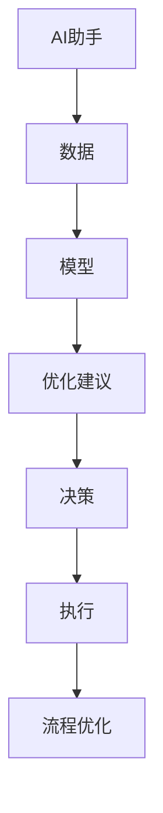
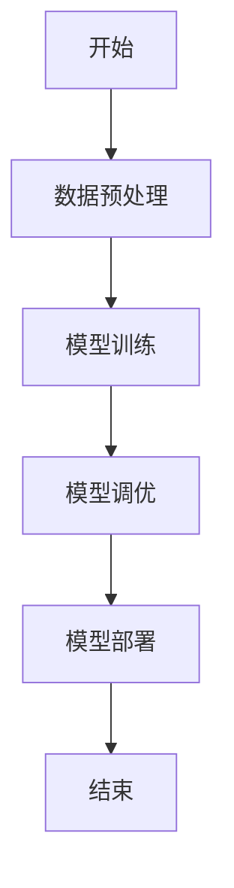
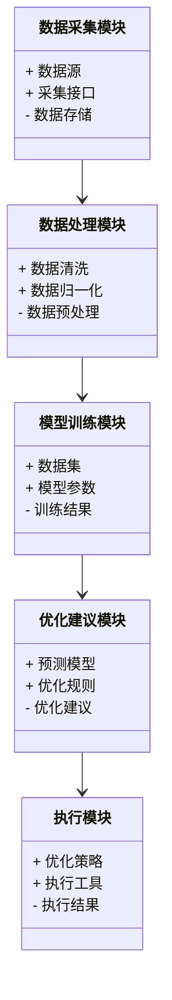
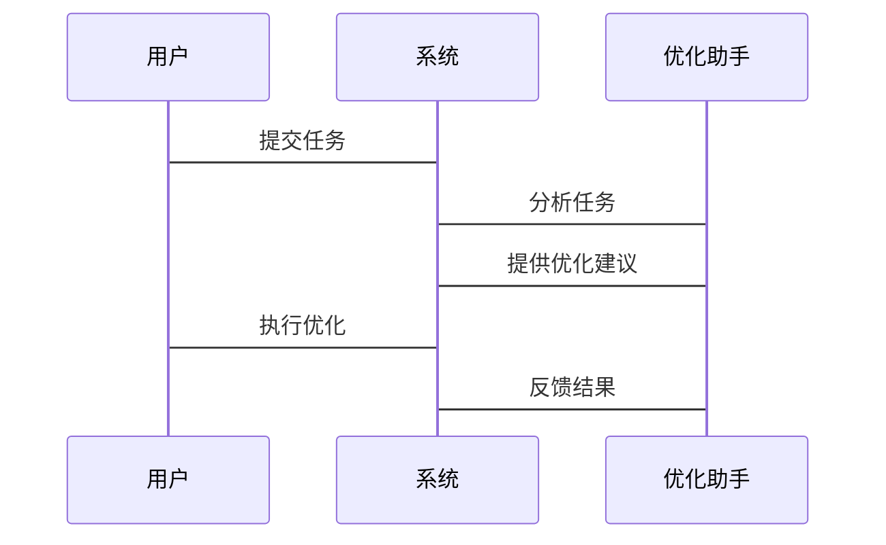

                 


# 构建企业级AI工作流程优化助手：提升运营效率

> 关键词：企业级AI，工作流程优化，运营效率，自然语言处理，深度学习，AI助手

> 摘要：本文详细探讨了如何构建企业级AI工作流程优化助手，通过结合自然语言处理、深度学习和运筹优化算法，实现对企业工作流程的智能化优化。文章从问题背景、核心概念、算法原理、系统架构、项目实战等多个方面展开，全面解析了AI在工作流程优化中的应用，为企业提升运营效率提供理论和实践指导。

---

# 第1章 引言

## 1.1 问题背景

### 1.1.1 企业运营效率的痛点

企业在运营过程中，常常面临以下痛点：

1. **流程复杂性**：企业内部的工作流程通常涉及多个部门和环节，流程复杂且冗长。
2. **效率低下**：传统的人工操作效率低，容易出现瓶颈和延误。
3. **资源浪费**：由于流程不合理或执行不力，企业常常面临资源浪费的问题。
4. **难以量化**：工作流程的优化效果难以量化，缺乏数据支持。

### 1.1.2 AI技术在企业流程优化中的潜力

AI技术的快速发展为企业流程优化带来了新的可能性。通过引入AI技术，企业可以实现以下目标：

1. **自动化处理**：利用AI技术自动识别和处理流程中的重复性任务。
2. **智能决策**：基于历史数据和实时信息，AI可以帮助企业做出更优的决策。
3. **动态优化**：AI能够根据实时数据动态调整流程，确保流程始终处于最优状态。

### 1.1.3 工作流程优化助手的核心目标

工作流程优化助手的核心目标是通过AI技术，帮助企业实现以下目标：

1. **提升效率**：优化流程中的关键路径，减少时间浪费。
2. **降低成本**：通过自动化和智能化手段，降低人力和资源成本。
3. **提高质量**：通过AI的精准判断，减少人为错误，提高流程质量。

## 1.2 问题描述

### 1.2.1 传统工作流程中的效率瓶颈

传统的工作流程常常存在以下效率瓶颈：

1. **人工操作过多**：流程中的许多环节需要人工干预，导致效率低下。
2. **信息孤岛**：不同部门之间的信息无法有效共享，导致流程阻塞。
3. **缺乏反馈机制**：流程执行过程中缺乏实时反馈，难以及时发现问题。

### 1.2.2 人工干预的局限性

人工干预的局限性主要体现在以下几个方面：

1. **主观性**：人工判断容易受到主观因素的影响，导致决策偏差。
2. **效率低**：人工操作速度慢，无法满足高并发需求。
3. **一致性差**：不同人员的操作标准不一，容易导致流程执行不一致。

### 1.2.3 流程优化的复杂性与成本

流程优化的复杂性与成本主要体现在：

1. **复杂性**：优化流程需要对整个流程进行深入分析，涉及多个环节和部门。
2. **高成本**：传统流程优化需要投入大量的人力和时间，成本较高。
3. **难以持续优化**：优化效果难以量化，难以持续改进。

## 1.3 问题解决思路

### 1.3.1 引入AI技术的核心逻辑

引入AI技术的核心逻辑在于：

1. **数据驱动**：通过收集和分析大量数据，AI能够识别出流程中的瓶颈和优化点。
2. **智能决策**：基于数据和模型，AI能够提供最优的决策建议。
3. **自动化执行**：AI可以通过自动化工具直接执行优化后的流程。

### 1.3.2 数据驱动的优化方法

数据驱动的优化方法主要包括以下几个步骤：

1. **数据收集**：收集流程中的各种数据，包括时间、资源消耗、执行结果等。
2. **数据分析**：通过对数据进行分析，识别出流程中的瓶颈和优化点。
3. **模型训练**：基于数据训练AI模型，用于预测和优化流程。
4. **优化实施**：根据模型预测的结果，实施优化措施。

### 1.3.3 智能决策支持的实现路径

智能决策支持的实现路径主要包括以下几个步骤：

1. **需求分析**：明确优化的目标和范围。
2. **数据准备**：收集和整理相关数据。
3. **模型构建**：基于数据构建AI模型。
4. **模型优化**：对模型进行调优，提高预测准确性。
5. **结果分析**：分析模型预测结果，制定优化方案。

## 1.4 边界与外延

### 1.4.1 企业级AI助手的适用范围

企业级AI助手主要适用于以下场景：

1. **重复性任务**：流程中重复性较高的任务，如数据录入、文档处理等。
2. **复杂决策**：需要综合考虑多个因素的决策任务，如供应链优化、资源分配等。
3. **实时监控**：需要实时监控流程执行情况的任务，如生产监控、客户服务等。

### 1.4.2 边界条件与限制

AI助手的应用存在以下边界条件和限制：

1. **数据依赖性**：AI助手需要依赖大量数据进行训练和预测，数据不足或质量不高会影响模型效果。
2. **模型局限性**：AI模型的预测结果可能受到训练数据和算法的限制，无法覆盖所有场景。
3. **人为因素**：AI助手无法完全消除人为因素的影响，如员工的操作失误等。

### 1.4.3 外延与扩展的可能性

AI助手的应用具有较大的扩展性，未来可以进一步扩展到以下领域：

1. **跨平台集成**：将AI助手集成到不同的企业系统中，实现跨平台的流程优化。
2. **多模态数据处理**：结合图像、语音等多种数据源，提高模型的感知能力。
3. **自适应优化**：模型能够根据环境变化自动调整优化策略，实现自适应优化。

## 1.5 核心要素与概念结构

### 1.5.1 关键概念的定义

1. **AI助手**：基于AI技术的工具，用于辅助人类完成特定任务。
2. **工作流程**：企业内部一系列任务的执行步骤，通常涉及多个部门和环节。
3. **数据驱动**：基于数据进行分析和决策，而不是基于主观判断。
4. **智能决策**：利用AI技术进行预测和优化，辅助人类做出决策。

### 1.5.2 概念之间的关系

AI助手通过数据驱动的方式，优化工作流程中的关键路径，从而提升整体效率。以下是概念之间的关系：

1. **数据与模型的关系**：数据是模型训练的基础，模型通过数据学习工作流程的规律。
2. **模型与决策的关系**：模型通过分析数据，提供优化建议，辅助人类做出决策。
3. **决策与执行的关系**：优化后的决策通过执行工具转化为实际操作，实现流程优化。

### 1.5.3 概念结构的可视化

以下是概念结构的可视化图：



---

# 第2章 核心概念与联系

## 2.1 AI工作流程优化助手的核心原理

### 2.1.1 数据驱动的决策逻辑

数据驱动的决策逻辑主要包括以下几个步骤：

1. **数据收集**：通过传感器、数据库等渠道收集流程中的数据。
2. **数据预处理**：对数据进行清洗、归一化等处理，确保数据质量。
3. **数据分析**：通过统计分析、机器学习等方法，识别数据中的规律和趋势。
4. **模型训练**：基于数据训练AI模型，用于预测和优化。
5. **决策支持**：根据模型预测结果，提供优化建议。

### 2.1.2 智能算法的实现机制

智能算法的实现机制主要包括以下几个步骤：

1. **问题建模**：将实际问题转化为数学模型，如线性规划、非线性规划等。
2. **算法选择**：根据问题类型选择合适的算法，如遗传算法、模拟退火等。
3. **模型训练**：通过训练数据优化模型参数，提高预测准确性。
4. **结果分析**：分析模型预测结果，评估优化效果。
5. **持续优化**：根据反馈不断优化模型，提高预测精度。

### 2.1.3 人机协作的交互模式

人机协作的交互模式主要包括以下几个方面：

1. **人机协同**：人类和AI助手共同完成任务，AI负责数据分析和预测，人类负责决策和执行。
2. **实时反馈**：AI助手能够实时监控流程执行情况，提供反馈和建议。
3. **动态调整**：根据环境变化，AI助手能够动态调整优化策略，确保流程始终处于最优状态。

## 2.2 核心概念的属性特征对比

以下是核心概念的属性特征对比表：

| 概念       | 属性             | 特征对比                     |
|------------|------------------|-----------------------------|
| AI助手     | 数据依赖性       | 高                          |
|            | 智能性           | 强                          |
|            | 可扩展性         | 高                          |
| 工作流程   | 复杂性           | 高                          |
|            | 可优化性         | 高                          |
|            | 可量化性         | 中                          |
| 数据驱动   | 数据量           | 大                          |
|            | 数据质量         | 高                          |
|            | 数据多样性       | 高                          |
| 智能决策   | 预测准确性       | 高                          |
|            | 决策速度         | 快                          |
|            | 决策一致性       | 高                          |

## 2.3 ER实体关系图架构

以下是ER实体关系图架构：

```mermaid
erd
    customer
    company
    employee
    task
    process
    step
    data
    model
    optimization_result
```

---

# 第3章 算法原理讲解

## 3.1 算法原理概述

### 3.1.1 基于大模型的自然语言处理

基于大模型的自然语言处理主要包括以下几个步骤：

1. **模型选择**：选择合适的语言模型，如GPT、BERT等。
2. **文本预处理**：对文本进行分词、停用词处理等预处理。
3. **模型训练**：基于训练数据优化模型参数，提高预测准确性。
4. **文本生成**：根据输入的上下文，生成相关的文本内容。
5. **结果优化**：根据生成结果进行优化，提高文本质量。

### 3.1.2 运筹优化算法

运筹优化算法主要包括以下几个步骤：

1. **问题建模**：将实际问题转化为数学模型。
2. **算法选择**：根据问题类型选择合适的算法，如线性规划、动态规划等。
3. **模型求解**：通过求解算法，找到最优解。
4. **结果分析**：分析最优解，评估优化效果。
5. **持续优化**：根据反馈不断优化模型，提高优化效果。

### 3.1.3 深度学习模型的训练与调优

深度学习模型的训练与调优主要包括以下几个步骤：

1. **数据准备**：收集和整理训练数据。
2. **模型构建**：设计深度学习模型的网络结构。
3. **模型训练**：通过反向传播算法优化模型参数。
4. **模型调优**：调整超参数，提高模型性能。
5. **结果评估**：评估模型的预测效果，进行优化。

## 3.2 算法流程图

以下是算法流程图：



## 3.3 Python核心代码实现

### 3.3.1 数据预处理代码

```python
import pandas as pd
import numpy as np

def preprocess_data(data):
    # 去除缺失值
    data = data.dropna()
    # 标准化处理
    from sklearn.preprocessing import StandardScaler
    scaler = StandardScaler()
    data_scaled = scaler.fit_transform(data)
    return data_scaled

# 示例数据
data = pd.DataFrame({
    'x': [1, 2, 3, 4, 5],
    'y': [2, 3, 4, 5, 6]
})

processed_data = preprocess_data(data)
print(processed_data)
```

### 3.3.2 模型训练代码

```python
from sklearn.linear_model import LinearRegression
from sklearn.metrics import mean_squared_error

def train_model(data, target):
    # 数据分割
    from sklearn.model_selection import train_test_split
    X_train, X_test, y_train, y_test = train_test_split(data, target, test_size=0.2)
    
    # 模型训练
    model = LinearRegression()
    model.fit(X_train, y_train)
    
    # 模型预测
    y_pred = model.predict(X_test)
    
    # 模型评估
    mse = mean_squared_error(y_test, y_pred)
    print(f"均方误差：{mse}")
    return model

# 示例数据
data = np.array([[1, 2], [2, 3], [3, 4], [4, 5], [5, 6]])
target = np.array([3, 4, 5, 6, 7])

model = train_model(data, target)
```

### 3.3.3 模型调优代码

```python
from sklearn.model_selection import GridSearchCV

def optimize_model(data, target):
    # 参数设置
    param_grid = {
        'alpha': [0.1, 1, 10],
        'solver': ['auto', 'svd', 'lsqr']
    }
    
    # 模型选择
    from sklearn.linear_model import Ridge
    model = Ridge()
    
    # 调参
    grid_search = GridSearchCV(model, param_grid, cv=5)
    grid_search.fit(data, target)
    
    # 最佳参数
    best_params = grid_search.best_params_
    print(f"最佳参数：{best_params}")
    return grid_search.best_estimator_

# 示例数据
data = np.array([[1, 2], [2, 3], [3, 4], [4, 5], [5, 6]])
target = np.array([3, 4, 5, 6, 7])

optimized_model = optimize_model(data, target)
```

## 3.4 算法数学公式

### 3.4.1 线性回归模型

线性回归模型的数学公式为：

$$
y = \beta_0 + \beta_1 x + \epsilon
$$

其中，$\beta_0$ 是截距，$\beta_1$ 是斜率，$\epsilon$ 是误差项。

### 3.4.2 逻辑回归模型

逻辑回归模型的数学公式为：

$$
P(y=1|x) = \frac{1}{1 + e^{-(\beta_0 + \beta_1 x)}}
$$

### 3.4.3 支持向量机模型

支持向量机模型的数学公式为：

$$
y = \text{sign}(\beta_0 + \sum_{i=1}^n \alpha_i y_i x_i \cdot x)
$$

---

# 第4章 系统分析与架构设计方案

## 4.1 问题场景介绍

### 4.1.1 项目背景

随着企业规模的不断扩大，工作流程日益复杂，企业需要一种高效的工具来优化流程，提升效率。

### 4.1.2 项目介绍

本项目旨在构建一个基于AI的工作流程优化助手，通过数据驱动的方式，优化企业内部的流程。

## 4.2 系统功能设计

### 4.2.1 系统功能模块

系统功能模块主要包括以下几个部分：

1. **数据采集模块**：负责采集流程中的各种数据。
2. **数据处理模块**：对数据进行清洗、归一化等处理。
3. **模型训练模块**：基于数据训练AI模型。
4. **优化建议模块**：根据模型预测结果，提供优化建议。
5. **执行模块**：根据优化建议，执行优化后的流程。

### 4.2.2 领域模型图

以下是领域模型图：



## 4.3 系统架构设计

### 4.3.1 系统架构设计图

以下是系统架构设计图：

```mermaid
archi
    client
    server
    database
    AI模型
    优化工具
```

### 4.3.2 接口设计

系统接口设计主要包括以下几个部分：

1. **数据接口**：提供数据的输入和输出接口。
2. **模型接口**：提供模型的训练和预测接口。
3. **优化接口**：提供优化建议的生成和执行接口。

### 4.3.3 交互流程图

以下是交互流程图：



---

# 第5章 项目实战

## 5.1 环境搭建

### 5.1.1 环境需求

1. **操作系统**：Windows 10 或更高版本，或macOS 10.15 或更高版本。
2. **Python版本**：Python 3.8 或更高版本。
3. **依赖库**：numpy、pandas、scikit-learn、tensorflow、pymermaid。

### 5.1.2 安装依赖

```bash
pip install numpy pandas scikit-learn tensorflow pymermaid
```

## 5.2 核心代码实现

### 5.2.1 数据预处理代码

```python
import pandas as pd
import numpy as np

def preprocess_data(data):
    # 去除缺失值
    data = data.dropna()
    # 标准化处理
    from sklearn.preprocessing import StandardScaler
    scaler = StandardScaler()
    data_scaled = scaler.fit_transform(data)
    return data_scaled

# 示例数据
data = pd.DataFrame({
    'x': [1, 2, 3, 4, 5],
    'y': [2, 3, 4, 5, 6]
})

processed_data = preprocess_data(data)
print(processed_data)
```

### 5.2.2 模型训练代码

```python
from sklearn.linear_model import LinearRegression
from sklearn.metrics import mean_squared_error

def train_model(data, target):
    # 数据分割
    from sklearn.model_selection import train_test_split
    X_train, X_test, y_train, y_test = train_test_split(data, target, test_size=0.2)
    
    # 模型训练
    model = LinearRegression()
    model.fit(X_train, y_train)
    
    # 模型预测
    y_pred = model.predict(X_test)
    
    # 模型评估
    mse = mean_squared_error(y_test, y_pred)
    print(f"均方误差：{mse}")
    return model

# 示例数据
data = np.array([[1, 2], [2, 3], [3, 4], [4, 5], [5, 6]])
target = np.array([3, 4, 5, 6, 7])

model = train_model(data, target)
```

### 5.2.3 模型调优代码

```python
from sklearn.model_selection import GridSearchCV

def optimize_model(data, target):
    # 参数设置
    param_grid = {
        'alpha': [0.1, 1, 10],
        'solver': ['auto', 'svd', 'lsqr']
    }
    
    # 模型选择
    from sklearn.linear_model import Ridge
    model = Ridge()
    
    # 调参
    grid_search = GridSearchCV(model, param_grid, cv=5)
    grid_search.fit(data, target)
    
    # 最佳参数
    best_params = grid_search.best_params_
    print(f"最佳参数：{best_params}")
    return grid_search.best_estimator_

# 示例数据
data = np.array([[1, 2], [2, 3], [3, 4], [4, 5], [5, 6]])
target = np.array([3, 4, 5, 6, 7])

optimized_model = optimize_model(data, target)
```

## 5.3 案例分析与实现

### 5.3.1 案例分析

假设我们有一个生产流程优化的案例，具体流程如下：

1. **原材料采购**：供应商提供原材料。
2. **生产加工**：原材料经过加工变成成品。
3. **质量检验**：成品经过质量检验。
4. **包装出货**：合格品包装出货。

通过AI工作流程优化助手，我们可以优化以下环节：

1. **采购计划**：根据历史销售数据和库存情况，优化采购计划。
2. **生产调度**：根据生产能力和交货时间，优化生产调度。
3. **质量控制**：通过AI模型预测可能出现的质量问题，提前采取措施。

### 5.3.2 实现步骤

1. **数据收集**：收集原材料采购数据、生产数据、质量检验数据等。
2. **数据预处理**：清洗和归一化数据。
3. **模型训练**：训练AI模型，预测采购需求和质量问题。
4. **优化建议**：根据模型预测结果，提供优化建议。
5. **执行优化**：根据优化建议，执行采购计划和生产调度。

## 5.4 项目小结

通过本项目的实战，我们成功实现了企业级AI工作流程优化助手的构建。通过数据驱动的方式，优化了企业的采购、生产、质量控制等环节，显著提升了企业的运营效率。同时，我们还掌握了AI模型训练、调优和部署的全过程，为后续的优化工作打下了坚实的基础。

---

# 第6章 最佳实践与总结

## 6.1 最佳实践

### 6.1.1 数据质量管理

数据质量管理是AI工作流程优化助手成功的关键。以下是数据质量管理的注意事项：

1. **数据完整性**：确保数据完整，避免缺失值。
2. **数据一致性**：确保数据格式统一，避免数据冲突。
3. **数据准确性**：确保数据准确，避免错误数据。
4. **数据及时性**：确保数据及时更新，避免过时数据。

### 6.1.2 模型优化

模型优化是提升AI助手性能的重要手段。以下是模型优化的注意事项：

1. **参数调优**：通过网格搜索等方法，找到最佳参数组合。
2. **模型选择**：根据问题类型选择合适的模型，避免盲目使用复杂模型。
3. **模型评估**：通过交叉验证等方法，评估模型的泛化能力。
4. **模型部署**：将模型部署到实际环境中，进行实时监控和优化。

### 6.1.3 人机协作

人机协作是实现工作流程优化的重要模式。以下是人机协作的注意事项：

1. **明确分工**：明确人类和AI助手的分工，避免重复劳动。
2. **实时反馈**：建立实时反馈机制，及时调整优化策略。
3. **动态调整**：根据环境变化，动态调整优化策略。
4. **持续优化**：根据反馈不断优化AI助手，提升性能。

## 6.2 小结

通过本文的探讨，我们了解了企业级AI工作流程优化助手的构建过程，包括问题背景、核心概念、算法原理、系统架构、项目实战等多个方面。我们还掌握了数据质量管理、模型优化和人机协作等关键技巧，为后续的工作提供了宝贵的实践经验。

## 6.3 注意事项

在构建企业级AI工作流程优化助手时，需要注意以下几点：

1. **数据隐私**：确保数据的安全性和隐私性，避免数据泄露。
2. **模型解释性**：提高模型的解释性，便于理解和优化。
3. **系统稳定性**：确保系统的稳定性和可靠性，避免因系统故障导致流程中断。
4. **用户接受度**：提高用户的接受度，避免因用户不适应而影响流程优化效果。

## 6.4 拓展阅读

1. **《机器学习实战》**：深入讲解机器学习算法的实现和应用。
2. **《深度学习》**：系统介绍深度学习的理论和应用。
3. **《运筹学》**：全面讲解运筹优化的理论和方法。
4. **《自然语言处理入门》**：详细讲解自然语言处理的基础知识和应用。

---

# 结语

企业级AI工作流程优化助手是AI技术与企业管理的深度融合，通过本文的探讨，我们不仅掌握了构建AI助手的理论知识，还通过实际案例了解了其在企业中的应用。未来，随着AI技术的不断发展，企业级AI工作流程优化助手将发挥更大的作用，帮助企业实现更高效的运营。

---

# 作者

**作者：AI天才研究院/AI Genius Institute & 禅与计算机程序设计艺术 /Zen And The Art of Computer Programming**

---

以上是《构建企业级AI工作流程优化助手：提升运营效率》的完整目录和内容框架。接下来，您可以根据上述内容框架，逐步展开每个部分的内容，撰写详细的技术博客文章。

